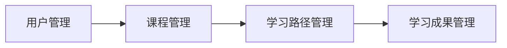

## 1.背景介绍

随着互联网的发展和普及，人们的学习方式也在发生着深刻的变化。在线课程管理系统作为一种新兴的教育技术，其便利性和灵活性使得越来越多的人选择在线学习。本文将详细介绍如何使用Spring，SpringMVC和MyBatis（简称SSM）构建一个在线课程管理系统。

SSM是一种流行的Java企业级应用开发框架，它将Spring的轻量级、可插拔和控制反转（IoC）特性与MyBatis的SQL映射和事务管理功能结合起来，形成了一个强大的、易于扩展的开发平台。

## 2.核心概念与联系

在线课程管理系统的核心概念包括用户管理、课程管理、学习路径管理和学习成果管理等。这些概念之间的联系可以通过以下Mermaid流程图进行展示：



在这个流程中，用户管理模块负责用户的注册、登录和权限管理；课程管理模块负责课程的创建、更新和删除；学习路径管理模块负责为用户推荐合适的学习路径；学习成果管理模块负责记录和展示用户的学习成果。

## 3.核心算法原理具体操作步骤

在SSM框架中，我们主要通过以下步骤实现在线课程管理系统：

1. **创建数据库模型**：根据业务需求，设计并创建相应的数据库表。
2. **创建Java对象模型**：根据数据库模型，创建相应的Java对象模型。
3. **创建Dao接口和映射文件**：为每个Java对象模型创建一个Dao接口和一个映射文件，用于定义和实现与数据库的交互操作。
4. **创建Service接口和实现类**：为每个Java对象模型创建一个Service接口和一个实现类，用于定义和实现业务逻辑。
5. **创建Controller类**：为每个Service接口创建一个Controller类，用于处理用户请求和返回响应。

## 4.数学模型和公式详细讲解举例说明

在在线课程管理系统中，我们可能需要使用一些数学模型和公式来实现特定的功能。例如，我们可以使用余弦相似度公式来计算两个用户的学习兴趣相似度，并据此为用户推荐合适的课程。

余弦相似度公式如下：

$$ cos(\theta) = \frac{A \cdot B}{||A|| ||B||} $$

其中，A和B分别代表两个用户的学习兴趣向量，$||A||$和$||B||$分别代表A和B的模长，$A \cdot B$代表A和B的点积。

## 5.项目实践：代码实例和详细解释说明

以下是一个简单的用户管理模块的代码示例：

```java
@Controller
public class UserController {

    @Autowired
    private UserService userService;

    @RequestMapping(value = "/login", method = RequestMethod.POST)
    public String login(User user, HttpSession session) {
        User existUser = userService.login(user);
        if (existUser == null) {
            return "login";
        } else {
            session.setAttribute("user", existUser);
            return "redirect:/index";
        }
    }
}
```

在这个示例中，我们首先使用@Autowired注解将UserService注入到UserController中，然后定义了一个处理POST请求的/login方法。在/login方法中，我们调用UserService的login方法进行用户登录，如果登录成功，则将用户信息保存到session中，并重定向到/index页面；如果登录失败，则返回登录页面。

## 6.实际应用场景

在线课程管理系统可以应用于各种在线教育平台，如MOOC、网易云课堂、Coursera等。它可以帮助教育机构提供更好的教学服务，同时也可以帮助学习者更有效地学习和提升自己的技能。

## 7.工具和资源推荐

在开发在线课程管理系统时，我们推荐使用以下工具和资源：

- **开发工具**：推荐使用IntelliJ IDEA，它是一款强大的Java开发工具，提供了诸多便捷的功能，如代码自动补全、代码重构、代码质量分析等。
- **数据库**：推荐使用MySQL，它是一款开源的关系型数据库，广泛应用于各种网站和应用中。
- **版本控制**：推荐使用Git，它是一款分布式版本控制系统，可以帮助你更好地管理和协作代码。

## 8.总结：未来发展趋势与挑战

随着在线教育的发展，在线课程管理系统将会面临更大的挑战和机遇。一方面，我们需要不断优化和完善系统的功能，以满足用户日益增长的需求；另一方面，我们也需要关注新的教育技术和方法，如人工智能、大数据、虚拟现实等，以便将它们融入到系统中，提供更好的教学服务。

## 9.附录：常见问题与解答

**问题1：为什么选择SSM框架？**

答：SSM框架集成了Spring、SpringMVC和MyBatis三个强大的框架，可以帮助我们快速开发高质量的Java企业级应用。Spring提供了便捷的依赖注入和AOP编程支持；SpringMVC是一个轻量级的MVC框架，可以帮助我们快速开发Web应用；MyBatis是一个优秀的ORM框架，可以帮助我们方便地操作数据库。

**问题2：如何扩展在线课程管理系统的功能？**

答：在线课程管理系统的功能可以通过添加新的模块来扩展。例如，我们可以添加一个讨论区模块，让用户可以在课程中进行讨论和交流；我们也可以添加一个作业模块，让用户可以提交和评价作业。

"作者：禅与计算机程序设计艺术 / Zen and the Art of Computer Programming"