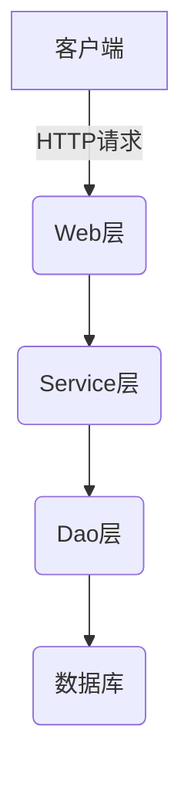

# 基于SSM的汽车租赁管理系统

## 1.背景介绍

随着经济的快速发展和人们生活水平的不断提高,汽车租赁行业正在蓬勃发展。汽车租赁不仅为旅行者提供了便利,也为企业和个人提供了灵活的出行选择。然而,传统的汽车租赁系统存在诸多问题,如信息管理混乱、流程效率低下等。因此,开发一个高效、智能的汽车租赁管理系统势在必行。

本文将介绍一种基于SSM(Spring、SpringMVC、MyBatis)框架的汽车租赁管理系统。该系统旨在提高租赁流程的自动化程度,优化信息管理,提升用户体验。

## 2.核心概念与联系

### 2.1 SSM框架

SSM框架是指Spring+SpringMVC+MyBatis框架的整合,是目前JavaEE领域使用最广泛的框架之一。

- Spring: 轻量级的Java开发框架,提供了面向切面编程(AOP)和控制反转(IOC)等核心功能。
- SpringMVC: 基于Spring框架的Web层框架,用于构建高效的Web应用程序。
- MyBatis: 一款优秀的持久层框架,支持定制化SQL、存储过程以及高级映射等功能。

SSM框架的整合使得开发人员可以专注于业务逻辑,提高了开发效率和代码的可维护性。

### 2.2 汽车租赁管理系统

汽车租赁管理系统包含以下核心概念:

- 车辆管理: 管理汽车的基本信息、状态等。
- 订单管理: 处理租车订单,包括预订、支付、取车和还车等流程。
- 客户管理: 维护客户信息,了解客户偏好和历史记录。
- 财务管理: 记录收支情况,生成报表。
- 权限管理: 控制不同角色的操作权限。

这些概念相互关联,共同构建了一个完整的汽车租赁管理体系。

## 3.核心算法原理具体操作步骤

### 3.1 最短租赁时间算法

为了提高车辆利用率,系统需要合理安排租车时间。最短租赁时间算法可以帮助系统找到最佳的租车时间段。

算法步骤:

1. 获取所有已预订的时间段列表
2. 对时间段按开始时间排序
3. 遍历排序后的时间段列表
4. 记录每个时间段之间的空闲时间段
5. 返回最长的空闲时间段作为最短租赁时间

例如,已预订时间段为[(1,3), (6,8), (8,10)]。经过算法计算,最短租赁时间为(3,6)。

```python
def shortest_rental_time(booked_slots):
    booked_slots.sort(key=lambda x: x[0])  # 按开始时间排序
    free_slots = []
    start = 0
    for slot in booked_slots:
        if slot[0] > start:
            free_slots.append((start, slot[0]))
        start = max(start, slot[1])
    return max(free_slots, key=lambda x: x[1] - x[0]) if free_slots else None
```

该算法的时间复杂度为O(nlogn),空间复杂度为O(n),其中n为预订时间段的数量。

### 3.2 车辆调度算法

为了满足客户的租车需求,系统需要合理调度车辆。车辆调度算法可以帮助系统找到最优的车辆分配方案。

算法步骤:

1. 获取所有待处理的租车订单
2. 对订单按租车时间排序
3. 遍历排序后的订单列表
4. 对每个订单,寻找一辆符合条件的空闲车辆
5. 如果找到,则分配该车辆;否则,将订单加入等待队列
6. 返回分配结果和等待队列

该算法的时间复杂度为O(nlogn+nm),空间复杂度为O(n+m),其中n为订单数量,m为车辆数量。

```python
def vehicle_scheduling(orders, vehicles):
    orders.sort(key=lambda x: x.start_time)  # 按租车时间排序
    available_vehicles = vehicles.copy()
    scheduled = []
    waiting_list = []
    for order in orders:
        vehicle = find_available_vehicle(available_vehicles, order)
        if vehicle:
            scheduled.append((order, vehicle))
            available_vehicles.remove(vehicle)
        else:
            waiting_list.append(order)
    return scheduled, waiting_list
```

## 4.数学模型和公式详细讲解举例说明

### 4.1 车辆利用率模型

车辆利用率是衡量汽车租赁系统运营效率的重要指标。它反映了车辆被实际使用的时间占总时间的比例。

车辆利用率可以用下式表示:

$$
利用率 = \frac{\sum_{i=1}^{n}租赁时长_i}{\sum_{i=1}^{n}(租赁时长_i + 空闲时长_i)}
$$

其中,n为车辆数量,租赁时长为车辆被租用的时间,空闲时长为车辆空闲的时间。

例如,某辆车一天内被租用6小时,空闲18小时,则该车辆当天的利用率为:

$$
利用率 = \frac{6}{6+18} = 0.25
$$

通过优化调度算法和提高预订率,可以显著提高车辆利用率,从而降低运营成本。

### 4.2 客户价值分析模型

客户价值分析有助于汽车租赁公司制定精准的营销策略,保留高价值客户。可以使用RFM模型对客户价值进行评估。

RFM模型包含三个变量:

- R(Recency): 客户最近一次租车的时间间隔
- F(Frequency): 客户租车的频率
- M(Monetary): 客户的总消费金额

可以为每个变量赋予不同的权重,并将它们相加得到客户价值分数:

$$
客户价值分数 = \alpha R + \beta F + \gamma M
$$

其中,α、β、γ分别为R、F、M的权重系数,且α+β+γ=1。

根据客户价值分数,可以将客户划分为不同的细分群体,制定个性化的营销策略。

## 5.项目实践:代码实例和详细解释说明

### 5.1 系统架构



该系统采用经典的三层架构:

1. **Web层(SpringMVC)**: 接收HTTP请求,进行数据校验和视图渲染。
2. **Service层(Spring)**: 处理业务逻辑,调用Dao层完成数据操作。
3. **Dao层(MyBatis)**: 执行数据库操作,如增删改查等。

### 5.2 核心代码示例

#### 5.2.1 订单管理模块

```java
// OrderService.java
@Service
public class OrderService {
    @Autowired
    private OrderMapper orderMapper;

    public List<Order> getAllOrders() {
        return orderMapper.selectAll();
    }

    public void createOrder(Order order) {
        orderMapper.insert(order);
    }

    // ...其他方法
}

// OrderMapper.java
@Mapper
public interface OrderMapper {
    @Select("SELECT * FROM orders")
    List<Order> selectAll();

    @Insert("INSERT INTO orders (customer_id, vehicle_id, start_time, end_time) VALUES (#{customerId}, #{vehicleId}, #{startTime}, #{endTime})")
    void insert(Order order);

    // ...其他方法
}
```

在OrderService中,我们注入了OrderMapper接口,用于执行数据库操作。selectAll()方法用于获取所有订单,insert()方法用于创建新订单。

#### 5.2.2 车辆管理模块

```java
// VehicleService.java
@Service
public class VehicleService {
    @Autowired
    private VehicleMapper vehicleMapper;

    public List<Vehicle> getAllVehicles() {
        return vehicleMapper.selectAll();
    }

    public Vehicle getVehicleById(int id) {
        return vehicleMapper.selectById(id);
    }

    // ...其他方法
}

// VehicleMapper.java
@Mapper
public interface VehicleMapper {
    @Select("SELECT * FROM vehicles")
    List<Vehicle> selectAll();

    @Select("SELECT * FROM vehicles WHERE id = #{id}")
    Vehicle selectById(int id);

    // ...其他方法
}
```

在VehicleService中,我们注入了VehicleMapper接口,用于执行车辆相关的数据库操作。selectAll()方法用于获取所有车辆,selectById()方法用于根据ID获取特定车辆。

### 5.3 单元测试示例

```java
// OrderServiceTest.java
@RunWith(SpringRunner.class)
@SpringBootTest
public class OrderServiceTest {
    @Autowired
    private OrderService orderService;

    @Test
    public void testCreateOrder() {
        Order order = new Order();
        order.setCustomerId(1);
        order.setVehicleId(2);
        order.setStartTime(LocalDateTime.now());
        order.setEndTime(LocalDateTime.now().plusDays(3));

        orderService.createOrder(order);

        List<Order> orders = orderService.getAllOrders();
        assertThat(orders).contains(order);
    }
}
```

在OrderServiceTest中,我们编写了一个单元测试用例,用于测试createOrder()方法。首先,我们构造一个Order对象,然后调用createOrder()方法将其插入数据库。最后,我们断言getAllOrders()返回的结果包含了刚插入的订单。

通过编写单元测试,我们可以确保代码的正确性,提高系统的可靠性。

## 6.实际应用场景

汽车租赁管理系统在以下场景中具有广泛的应用:

1. **旅游租车**: 游客可以通过系统预订租车服务,方便出行。
2. **商务用车**: 企业可以使用系统管理车队,满足员工的商务出行需求。
3. **个人代步**: 个人用户可以根据需求灵活租赁车辆,节省购车成本。
4. **汽车分时租赁**: 系统可以支持按小时计费的分时租赁模式。
5. **汽车共享**: 通过系统,用户可以共享私家车,提高车辆利用率。

除了传统的租车场景,该系统还可以拓展至新兴的出行领域,如网约车、无人驾驶等,为用户提供更加智能化、个性化的出行体验。

## 7.工具和资源推荐

在开发汽车租赁管理系统时,可以使用以下工具和资源:

1. **开发工具**:
   - IDE: IntelliJ IDEA、Eclipse等
   - 构建工具: Maven、Gradle
   - 版本控制: Git

2. **框架和库**:
   - Spring Boot: 快速构建Spring应用程序
   - MyBatis: 持久层框架
   - Jackson: JSON解析库
   - Lombok: 简化Java代码

3. **数据库**:
   - MySQL: 关系型数据库
   - Redis: 缓存数据库

4. **前端技术**:
   - Vue.js: 构建用户界面
   - Element UI: 基于Vue的UI框架
   - Axios: 发送HTTP请求

5. **在线资源**:
   - Spring官方文档
   - MyBatis官方文档
   - StackOverflow: 技术问答社区
   - GitHub: 开源代码仓库

利用这些工具和资源,可以显著提高开发效率,并确保系统的稳定性和可扩展性。

## 8.总结:未来发展趋势与挑战

汽车租赁行业正在经历数字化转型,未来将会有以下发展趋势和挑战:

1. **智能化**: 利用人工智能技术优化车辆调度、个性化推荐等,提升运营效率和用户体验。
2. **移动化**: 随着移动互联网的普及,移动APP将成为租车的主要渠道。
3. **共享经济**: 汽车共享模式将进一步发展,提高车辆利用率,降低出行成本。
4. **无人驾驶**: 无人驾驶技术的应用将彻底改变传统的租车模式。
5. **数据安全**: 如何保护用户隐私和系统数据,将是一个重大挑战。
6. **可持续发展**: 推广新能源车辆,实现绿色出行,是未来的发展方向。

要跟上行业发展步伐,汽车租赁管理系统需要不断创新和优化,以适应新的技术和商业模式。

## 9.附录:常见问题与解答

1. **如何提高系统的并发性能?**

可以采用以下策略:

- 使用缓存技术(如Redis)缓存热点数据
- 进行数据库优化,如添加索引、垂直拆分等
- 使用消息队列异步处理耗时操作
- 进行负载均衡和集群