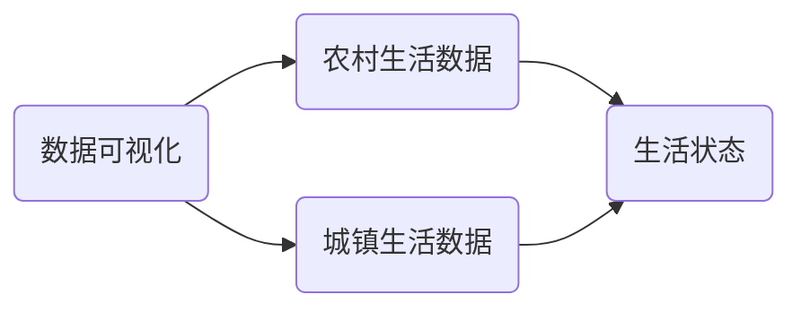

## 1.背景介绍

在我们的生活中，数据已经成为了一个不可或缺的部分。它不仅仅是一种信息的载体，更是帮助我们理解世界、决策的重要工具。在这个数据泛滥的时代，如何从海量的数据中提取出有价值的信息，是一个非常重要的问题。本文将针对农村和城镇的人民生活数据，进行深入的可视化分析，帮助我们更好地理解这两个区域的生活状态。

## 2.核心概念与联系

在进行数据可视化分析之前，我们首先需要理解一些核心的概念和联系。数据可视化是一种将抽象的数据通过图形的方式展现出来的技术，它可以帮助我们更直观、更快速地理解数据。而在农村和城镇的人民生活数据分析中，我们关注的主要是人们的生活状态，包括但不限于收入、教育、健康等方面。



## 3.核心算法原理具体操作步骤

在数据可视化的过程中，我们通常会采用一些核心的算法和操作步骤。以下是一个简单的示例：

1. 数据收集：首先，我们需要收集到相关的数据。这可能需要通过调查、抓取等方式完成。
2. 数据清洗：在收集到数据之后，我们需要对数据进行清洗，剔除无效的、错误的数据。
3. 数据处理：接着，我们需要对数据进行处理，提取出我们关注的信息。
4. 数据可视化：最后，我们将处理后的数据通过图形的方式展现出来。

## 4.数学模型和公式详细讲解举例说明

在数据处理的过程中，我们通常会使用一些数学模型和公式。例如，我们可能会使用统计学中的均值、中位数等指标来描述数据的集中趋势。我们可能会使用标准差、四分位数等指标来描述数据的离散程度。我们可能会使用相关系数、卡方检验等方法来描述数据之间的关联性。

例如，均值的计算公式为：

$$ \bar{x} = \frac{1}{n}\sum_{i=1}^{n}x_i $$

其中，$x_i$ 是每一个数据，$n$ 是数据的总数量。

## 5.项目实践：代码实例和详细解释说明

在实际的项目实践中，我们可能会使用Python的pandas和matplotlib库来进行数据处理和可视化。以下是一个简单的示例：

```python
import pandas as pd
import matplotlib.pyplot as plt

# 读取数据
data = pd.read_csv('data.csv')

# 数据清洗
data = data.dropna()

# 数据处理
mean = data['income'].mean()

# 数据可视化
plt.hist(data['income'])
plt.show()
```

在这个示例中，我们首先读取了数据，然后对数据进行了清洗，剔除了缺失的数据。接着，我们计算了收入的均值。最后，我们将收入的分布通过直方图的方式展现出来。

## 6.实际应用场景

数据可视化在很多实际的场景中都有应用。例如，政府可以通过数据可视化来了解农村和城镇的生活状态，进而制定出更合理的政策。企业可以通过数据可视化来了解市场的需求，进而制定出更合适的产品。个人可以通过数据可视化来了解自己的生活状态，进而做出更好的决策。

## 7.工具和资源推荐

在进行数据可视化的过程中，我们可能会使用到以下的一些工具和资源：

- Python：一种广泛用于数据分析的编程语言。
- pandas：一个用于数据处理的Python库。
- matplotlib：一个用于数据可视化的Python库。
- 数据集：我们可以从Kaggle、UCI等平台获取到各种各样的数据集。

## 8.总结：未来发展趋势与挑战

随着数据的增多，数据可视化的重要性也在日益增长。未来，我们可能会看到更多的数据可视化工具，更多的数据可视化技术。但同时，我们也面临着一些挑战，例如如何处理海量的数据，如何保护数据的隐私等。

## 9.附录：常见问题与解答

在进行数据可视化的过程中，你可能会遇到以下的一些问题：

1. 数据清洗是什么？
数据清洗是指对数据进行处理，剔除无效的、错误的数据的过程。

2. 数据可视化有哪些类型？
数据可视化有很多种类型，包括但不限于柱状图、折线图、饼图、地图等。

3. 数据可视化有什么用？
数据可视化可以帮助我们更直观、更快速地理解数据。

作者：禅与计算机程序设计艺术 / Zen and the Art of Computer Programming