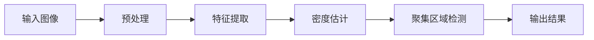
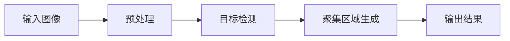
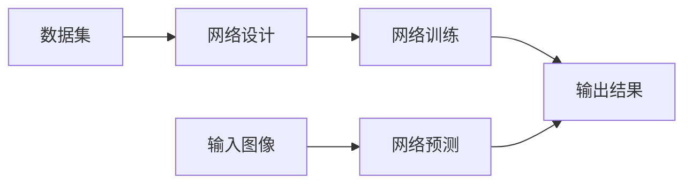

# 基于图像的人群聚集检测算法研究与实现

## 1.背景介绍

### 1.1 人群聚集检测的重要性

在当今社会,人群聚集现象随处可见,如体育赛事、音乐会、示威游行等。及时发现和监控人群聚集对于确保公共安全、疏导人流、预防违法犯罪行为等具有重要意义。传统的人工监控方式不仅效率低下,而且容易受到主观因素的影响。因此,基于图像的自动人群聚集检测技术应运而生,它能够实时、客观、高效地检测出图像或视频中的人群聚集情况,为相关决策提供数据支持。

### 1.2 研究现状与挑战

近年来,计算机视觉和模式识别技术的飞速发展为人群聚集检测提供了有力支撑。研究人员提出了诸多基于图像的人群聚集检测算法,但仍面临一些挑战:

- 密集场景下的遮挡问题
- 光照变化和视角变换的影响
- 检测精度和实时性的权衡
- 缺乏统一的评估标准

## 2.核心概念与联系

### 2.1 人群聚集的定义

人群聚集是指在一定区域内聚集了大量人群的现象。根据人群密度的不同,可将人群聚集分为稀疏聚集和密集聚集两种情况。

### 2.2 人群聚集检测的任务目标

人群聚集检测的主要目标是从输入的图像或视频中自动检测出人群聚集的区域,并给出聚集区域的位置和大小信息。在某些应用场景下,还需要估计聚集区域内的人数。

### 2.3 人群聚集检测与相关任务的关系

人群聚集检测与以下任务密切相关:

- 人体检测与跟踪
- 目标检测与分割
- 场景理解与行为分析

## 3.核心算法原理具体操作步骤

### 3.1 基于密度估计的算法

基于密度估计的算法通常包括以下步骤:

1. 预处理:对输入图像进行预处理,如去噪、图像增强等。
2. 特征提取:提取图像的低级特征,如梯度、纹理等。
3. 密度估计:基于提取的特征,对图像中每个像素点的密度进行估计,得到密度图。
4. 聚集区域检测:对密度图进行阈值分割或聚类,得到聚集区域的位置和大小。

其中,密度估计是关键步骤。常用的密度估计方法有高斯核密度估计、线性密度估计等。



### 3.2 基于目标检测的算法

基于目标检测的算法通常包括以下步骤:

1. 预处理:对输入图像进行预处理,如去噪、图像增强等。
2. 目标检测:使用目标检测算法(如Faster R-CNN、YOLO等)检测图像中的人体目标。
3. 聚集区域生成:根据检测到的人体目标的位置和数量,生成聚集区域的位置和大小。



### 3.3 基于深度学习的算法

近年来,基于深度学习的算法在人群聚集检测任务上表现出色,主要包括以下步骤:

1. 数据准备:构建人群聚集数据集,包括图像和对应的标注信息(聚集区域的位置和大小)。
2. 网络设计:设计适合于人群聚集检测任务的卷积神经网络结构。
3. 网络训练:使用准备好的数据集对网络进行训练,优化网络参数。
4. 网络预测:对新的输入图像,使用训练好的网络进行预测,得到聚集区域的位置和大小。



## 4.数学模型和公式详细讲解举例说明

### 4.1 高斯核密度估计

高斯核密度估计是一种常用的非参数密度估计方法,它将图像中的每个像素点视为一个样本,通过高斯核函数对样本进行加权求和,得到该像素点的密度估计值。

设图像中有 $N$ 个前景像素点 $\{x_i\}_{i=1}^N$,对于图像中任意一点 $x$,其密度估计值 $\hat{f}(x)$ 可表示为:

$$\hat{f}(x) = \sum_{i=1}^N K(x-x_i)$$

其中, $K(\cdot)$ 为高斯核函数,定义为:

$$K(x) = \frac{1}{\sqrt{2\pi}\sigma}e^{-\frac{x^2}{2\sigma^2}}$$

$\sigma$ 为核函数的带宽参数,控制着核函数的平滑程度。带宽 $\sigma$ 的选择对密度估计的精度有重要影响。

以下是使用高斯核密度估计的示例:

```python
import numpy as np
import matplotlib.pyplot as plt

# 生成样本数据
np.random.seed(0)
x = np.random.randn(100)

# 高斯核函数
def gaussian_kernel(x, sigma=1.0):
    return np.exp(-x**2 / (2 * sigma**2)) / (np.sqrt(2 * np.pi) * sigma)

# 密度估计
bins = np.linspace(-5, 5, 100)
density = np.zeros_like(bins)
for x_i in x:
    density += gaussian_kernel(bins - x_i)

# 绘制结果
plt.hist(x, bins=30, density=True, alpha=0.5, label='Sample Data')
plt.plot(bins, density, 'r-', label='Gaussian Kernel Density Estimation')
plt.legend()
plt.show()
```

### 4.2 线性密度估计

线性密度估计是另一种常用的密度估计方法,它将图像中的每个前景像素点视为一个delta脉冲,通过对这些脉冲进行卷积得到密度估计值。

设图像中有 $N$ 个前景像素点 $\{x_i\}_{i=1}^N$,对于图像中任意一点 $x$,其密度估计值 $\hat{f}(x)$ 可表示为:

$$\hat{f}(x) = \sum_{i=1}^N K(x-x_i)$$

其中, $K(\cdot)$ 为线性核函数,定义为:

$$K(x) = \begin{cases}
\frac{3}{4}(1-|x|), & |x| \leq 1\\
0, & |x| > 1
\end{cases}$$

线性密度估计的优点是计算简单,缺点是密度估计值不够平滑。

以下是使用线性密度估计的示例:

```python
import numpy as np
import matplotlib.pyplot as plt

# 生成样本数据
np.random.seed(0)
x = np.random.randn(100)

# 线性核函数
def linear_kernel(x):
    return np.maximum(0, 1 - np.abs(x))

# 密度估计
bins = np.linspace(-5, 5, 100)
density = np.zeros_like(bins)
for x_i in x:
    density += linear_kernel(bins - x_i)

# 绘制结果
plt.hist(x, bins=30, density=True, alpha=0.5, label='Sample Data')
plt.plot(bins, density, 'r-', label='Linear Kernel Density Estimation')
plt.legend()
plt.show()
```

## 5.项目实践：代码实例和详细解释说明

本节将介绍一个基于深度学习的人群聚集检测项目实践,使用PyTorch框架实现。

### 5.1 数据准备

我们使用公开的人群聚集数据集ShanghaiTech,该数据集包含1198张图像,分为训练集(768张)和测试集(430张)。每张图像都标注了人群聚集区域的位置和人数。

```python
import os
from PIL import Image
import numpy as np
import torch
from torch.utils.data import Dataset

class ShanghaiTechDataset(Dataset):
    def __init__(self, data_dir, mode='train', transform=None):
        self.data_dir = data_dir
        self.mode = mode
        self.transform = transform
        
        # 读取图像和标注文件路径
        image_paths = []
        label_paths = []
        for root, _, files in os.walk(os.path.join(data_dir, mode)):
            for file in files:
                if file.endswith('.jpg'):
                    image_path = os.path.join(root, file)
                    label_path = os.path.join(root, file.replace('.jpg', '.npy'))
                    image_paths.append(image_path)
                    label_paths.append(label_path)
        
        self.image_paths = image_paths
        self.label_paths = label_paths
    
    def __len__(self):
        return len(self.image_paths)
    
    def __getitem__(self, idx):
        image_path = self.image_paths[idx]
        label_path = self.label_paths[idx]
        
        # 读取图像和标注
        image = Image.open(image_path).convert('RGB')
        label = np.load(label_path)
        
        if self.transform:
            image = self.transform(image)
        
        return image, label
```

### 5.2 网络设计

我们设计了一个基于U-Net的卷积神经网络,用于人群聚集密度图的预测。网络包括编码器和解码器两部分,编码器逐层提取图像特征,解码器逐层恢复密度图。

```python
import torch.nn as nn

class CrowdNet(nn.Module):
    def __init__(self):
        super(CrowdNet, self).__init__()
        
        # 编码器
        self.encoder = nn.Sequential(
            nn.Conv2d(3, 64, 3, padding=1),
            nn.ReLU(inplace=True),
            nn.MaxPool2d(2, 2),
            
            nn.Conv2d(64, 128, 3, padding=1),
            nn.ReLU(inplace=True),
            nn.MaxPool2d(2, 2),
            
            nn.Conv2d(128, 256, 3, padding=1),
            nn.ReLU(inplace=True),
            nn.MaxPool2d(2, 2),
            
            nn.Conv2d(256, 512, 3, padding=1),
            nn.ReLU(inplace=True),
            nn.MaxPool2d(2, 2)
        )
        
        # 解码器
        self.decoder = nn.Sequential(
            nn.ConvTranspose2d(512, 256, 3, stride=2, padding=1, output_padding=1),
            nn.ReLU(inplace=True),
            
            nn.ConvTranspose2d(256, 128, 3, stride=2, padding=1, output_padding=1),
            nn.ReLU(inplace=True),
            
            nn.ConvTranspose2d(128, 64, 3, stride=2, padding=1, output_padding=1),
            nn.ReLU(inplace=True),
            
            nn.ConvTranspose2d(64, 1, 3, stride=2, padding=1, output_padding=1)
        )
    
    def forward(self, x):
        encoded = self.encoder(x)
        decoded = self.decoder(encoded)
        return decoded
```

### 5.3 网络训练

我们定义损失函数为均方误差损失,使用Adam优化器进行训练。

```python
import torch.optim as optim

# 初始化网络和优化器
net = CrowdNet()
optimizer = optim.Adam(net.parameters(), lr=0.001)
criterion = nn.MSELoss()

# 训练循环
for epoch in range(num_epochs):
    for images, labels in train_loader:
        images = images.to(device)
        labels = labels.to(device)
        
        # 前向传播
        outputs = net(images)
        loss = criterion(outputs, labels)
        
        # 反向传播和优化
        optimizer.zero_grad()
        loss.backward()
        optimizer.step()
        
    # 打印训练进度
    print(f'Epoch [{epoch+1}/{num_epochs}], Loss: {loss.item():.4f}')
```

### 5.4 网络预测

对于新的输入图像,我们可以使用训练好的网络进行预测,得到人群聚集密度图。

```python
# 预测
with torch.no_grad():
    image = test_image.to(device)
    output = net(image.unsqueeze(0))
    density_map = output.squeeze(0).cpu().numpy()

# 可视化结果
plt.imshow(density_map, cmap='jet')
plt.colorbar()
plt.show()
```

## 6.实际应用场景

人群聚集检测技术在以下场景中具有广泛的应用前景:

1. **公共安全监控**: 在体育