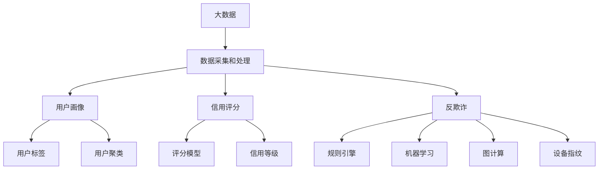

# 基于大数据下用户征信问题分析与研究

## 1.背景介绍
### 1.1 大数据时代的到来
随着互联网、物联网、云计算等新一代信息技术的快速发展,人类社会已经进入了大数据时代。海量的数据每时每刻都在被生成和采集,这为我们认识世界、改造世界提供了前所未有的机遇。大数据具有Volume(大量)、Velocity(高速)、Variety(多样)、Value(低价值密度)等4V特征。如何从海量的数据中挖掘出有价值的信息和知识,是摆在我们面前的一个重大课题。

### 1.2 征信行业面临的机遇与挑战
征信是对企业、个人等市场主体的信用状况进行评估和预测的活动。传统的征信业务主要依赖央行征信系统,存在数据来源单一、数据维度不足等局限性。随着互联网金融的兴起,大量的用户行为数据被采集和积累,为征信业务带来了新的发展机遇。利用互联网大数据进行用户画像和信用评估,可以极大地丰富征信维度,提升风控能力。但同时,大数据征信也面临着数据质量参差不齐、隐私保护困难、缺乏行业标准等诸多挑战。

### 1.3 本文的研究意义
本文拟从技术和应用两个层面,对基于大数据的用户征信问题进行分析和研究。一方面,探讨大数据征信的关键技术,包括用户画像、信用评分、反欺诈等;另一方面,分析大数据征信在互联网信贷、消费金融等领域的应用实践。通过系统性的梳理和研究,希望为大数据征信的发展提供参考和借鉴。

## 2.核心概念与联系
### 2.1 大数据的概念与特征
大数据是指无法在一定时间范围内用常规软件工具进行捕捉、管理和处理的数据集合,需要新处理模式才能具有更强的决策力、洞察发现力和流程优化能力的海量、高增长率和多样化的信息资产。大数据的4V特征如下:

- Volume(大量):数据规模巨大,从TB级别到PB、EB、ZB、YB级别 
- Velocity(高速):数据生成和处理的速度很快,如实时流处理
- Variety(多样):数据类型多样化,包括结构化、半结构化和非结构化数据
- Value(低价值密度):单位数据的价值密度相对较低,但潜在价值巨大

### 2.2 用户画像的概念与作用
用户画像是基于用户在网站或App上的历史行为数据,对用户的属性特征、行为偏好、价值潜力等进行全面刻画和定义。通过用户画像,可以对用户进行精准定位和个性化服务,在精准营销、个性化推荐、风险控制等方面发挥重要作用。用户画像一般包含以下几类信息:

- 人口统计属性:如性别、年龄、地域、职业、收入等
- 行为特征:如浏览、点击、购买、评论等
- 偏好特征:如品类偏好、品牌偏好、价格偏好等 
- 价值特征:如生命周期价值、信用等级、欺诈风险等

### 2.3 信用评分的概念与方法
信用评分是对借款人违约风险高低进行量化评估,用一个分值来表示借款人的信用等级。信用评分是金融机构控制信贷风险的重要手段。传统的信用评分主要基于借款人的人口统计属性和信贷历史,采用Logistic回归、决策树、支持向量机、神经网络等机器学习算法构建评分模型。典型的信用评分产品有FICO分数。

随着大数据的发展,借款人在互联网上积累了大量的行为数据,可以从多维度对其风险特征进行刻画。一些金融科技公司开始利用机器学习算法,融合央行征信、互联网金融、电商消费、运营商等多源异构数据,构建大数据信用评分模型。这极大地提升了信用评分的准确性和可解释性。

### 2.4 反欺诈的概念与方法
欺诈是一些不法分子利用虚假信息骗取贷款或逃避债务的行为,给金融机构造成了巨大的损失。反欺诈就是运用各种技术手段,对贷前申请、贷中放款、贷后催收等环节进行实时监控,及时发现和阻断欺诈行为。反欺诈的主要方法包括:

- 规则引擎:基于专家经验,设置一系列规则条件,对可疑事件进行筛查和预警
- 机器学习:训练分类、聚类等模型,自动识别欺诈模式,对新样本进行预测
- 图计算:构建关系网络,挖掘群体欺诈行为,如金融诈骗、洗钱等
- 设备指纹:提取设备硬件和软件的多维特征,生成唯一的设备ID,用于反多头、反中间人攻击等

### 2.5 概念之间的关系
大数据为用户画像、信用评分、反欺诈等应用提供了数据基础。通过对多源异构数据的汇聚和挖掘,可以从不同维度对用户的信用状况进行刻画,极大地提升风控水平。用户画像可以作为信用评分和反欺诈的重要输入。信用评分可以作为用户画像的一个重要标签,刻画用户的信用等级。反欺诈需要融合用户画像、信用评分等多个维度的特征,进行综合判断。它们相互交织,构成了大数据征信的核心内容。

## 3.核心算法原理具体操作步骤
### 3.1 用户画像算法
用户画像的核心是对用户的属性标签进行刻画和提取。主要分为以下几个步骤:

#### 3.1.1 数据采集与预处理
从各个渠道采集用户的原始数据,包括结构化数据和非结构化数据。对数据进行清洗、去重、脱敏等预处理,将其转换为结构化的、可分析的形式。

#### 3.1.2 特征工程
从原始数据中提取有价值的特征。可以分为以下几类:

- 统计特征:对原始数据进行聚合统计,如次数、金额、频率等
- 文本特征:对文本数据进行分词、向量化、主题模型等处理,提取关键词、主题等语义特征  
- 时间序列特征:对用户行为的时间序列进行建模,提取新颖度、周期性、异常点等特征
- 图特征:构建用户关系网络,采用图嵌入等方法提取网络结构特征

#### 3.1.3 自动化标签提取 
利用规则匹配、机器学习等方法,根据用户特征自动生成画像标签。常用的方法有:

- 规则匹配:设定一系列if-else规则,对满足条件的用户打上对应标签
- 有监督学习:人工定义部分种子用户的标签,训练分类模型,预测其他用户的标签
- 无监督学习:采用聚类算法将相似用户自动归类,生成聚类簇标签
- 词嵌入:将标签映射到低维向量空间,通过词向量的语义相似度匹配用户

#### 3.1.4 人工调校优化
对自动生成的标签体系进行人工检查和调整,剔除错误标签,补充遗漏标签,优化标签的层级结构,使其更加准确、全面、有序。

### 3.2 信用评分算法
信用评分是对用户的违约风险进行量化评估和预测。通常采用机器学习算法构建评分模型,主要分为以下几个步骤:

#### 3.2.1 样本标注
选取一批有代表性的用户样本,根据其是否违约对样本进行正负标注。样本要同时覆盖违约用户和正常用户,以保证正负样本的平衡。

#### 3.2.2 特征选择
从用户的各类数据中选取与违约风险相关的特征。可以采用IV值(信息价值)、GINI系数等指标度量特征的预测能力,挑选出区分度高的特征子集。

#### 3.2.3 模型训练
将特征和标签输入机器学习算法,训练用于预测违约概率的评分模型。常用的算法包括Logistic回归、决策树、随机森林、GBDT、XGBoost、LightGBM等。通过交叉验证等方法优化模型超参数。

#### 3.2.4 模型评估
采用AUC(ROC曲线下面积)、KS(Kolmogorov-Smirnov)等指标评估模型的预测性能。对重要的样本分群进行分层评估,并与业务规则进行对比,以验证模型的有效性和可解释性。

#### 3.2.5 评分映射
将模型输出的违约概率映射为信用分值,如300~850分。分值越高,信用等级越高,违约风险越低。制定评分的刻度规则,如300以下为较差,300~500为中等,500~600为良好,600以上为优秀等。

#### 3.2.6 模型监控
对评分模型的性能进行持续监控,统计模型分数与实际违约率的吻合度。当实际违约率与预期违背较大时,需要重新训练模型。

### 3.3 反欺诈算法
反欺诈算法是通过机器学习等技术手段自动识别欺诈行为。主要有以下几个步骤:

#### 3.3.1 数据采集
从业务系统中采集与欺诈相关的各类数据,包括用户信息、行为日志、交易记录、设备信息等。

#### 3.3.2 数据标注
由风控专家对已知的欺诈用户和正常用户进行人工标注。对于未知用户,可以根据其行为是否符合已知欺诈模式,利用规则或算法自动标注。

#### 3.3.3 特征工程  
提取反映欺诈特征的变量,构建用于异常检测的特征向量。常见的欺诈特征有:

- 身份特征:年龄、性别、地址等身份信息频繁变更
- 行为特征:短时间内多次申请、修改敏感信息、垃圾注册等异常行为
- 设备特征:使用代理IP、群控设备、伪造设备指纹等作弊方式
- 关系特征:与已知欺诈团伙存在关联、呈现群体作弊特征

#### 3.3.4 算法选择
根据欺诈的业务场景和数据特点,选择合适的机器学习算法:

- 有监督学习:适用于已知欺诈和正常用户的情形,如逻辑回归、决策树、神经网络等
- 无监督学习:适用于欺诈用户未知的情形,通过异常检测方法自动识别欺诈,如聚类、孤立森林等
- 图学习:适用于群体作弊的情形,通过关系网络挖掘欺诈团伙,如图神经网络、异构图表示学习等

#### 3.3.5 模型训练
利用标注的样本数据对选定的算法进行训练。对模型进行参数调优,并采用早停、正则化等方法防止过拟合。

#### 3.3.6 模型评估
采用准确率、召回率、F1分数、AUC等指标评估模型的性能。通过设置不同的阈值,在实际业务中权衡拒绝率和通过率。

#### 3.3.7 模型部署
将训练好的反欺诈模型部署到生产环境中。采用规则引擎、实时计算等技术,对实时的业务数据进行预测和拦截。

#### 3.3.8 效果监控
持续监控模型的预测效果,统计预警的准确率和漏警率。收集误判的案例并进行分析,优化特征和算法,并定