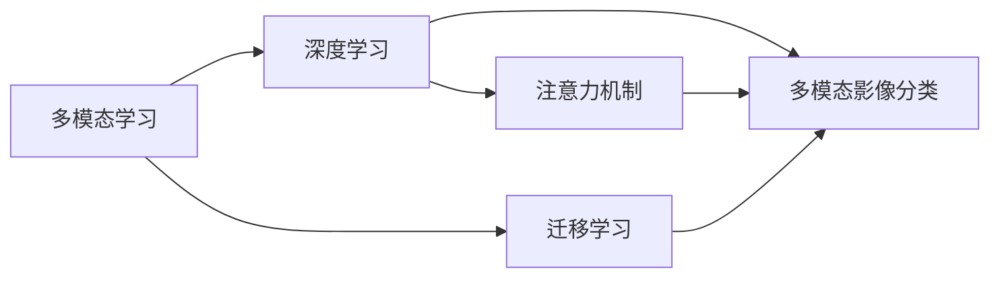
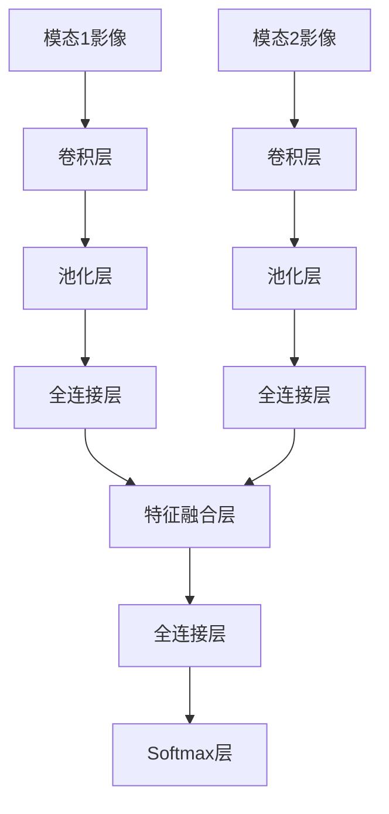

# 基于机器学习的多模态影像分类研究

## 1. 背景介绍

多模态影像分类是计算机视觉和人工智能领域的一个重要研究方向。随着多模态数据的爆炸式增长,如何有效地利用这些异构数据进行分类和预测,已经成为一个亟待解决的问题。传统的单模态影像分类方法已经无法满足日益增长的应用需求,因此,研究多模态影像分类算法具有重要的理论意义和实际应用价值。

### 1.1 多模态影像分类的概念
多模态影像分类是指利用多种不同模态的影像数据(如可见光图像、红外图像、SAR图像等)进行目标识别和分类的技术。与单模态影像分类相比,多模态影像分类融合了不同传感器获取的互补信息,能够提供更全面、更准确的分类结果。

### 1.2 多模态影像分类的应用场景
多模态影像分类技术在许多领域都有广泛应用,例如:

- 遥感影像分析:利用可见光、红外、SAR等多源遥感影像进行地物分类、变化检测等。
- 医学影像分析:融合CT、MRI、PET等医学影像模态,实现疾病诊断、病变区域分割等。  
- 自动驾驶:融合可见光、激光雷达、毫米波雷达等传感器数据,进行障碍物检测和场景理解。
- 工业视觉检测:利用可见光、X射线等影像数据进行工件缺陷检测和质量评估。

### 1.3 多模态影像分类面临的挑战
尽管多模态影像分类有诸多优势,但在实际应用中仍然面临一些挑战:

1. 数据异构性:不同模态的影像在分辨率、对比度、噪声等方面存在较大差异,如何有效地处理这些异构数据是一大难题。
2. 特征表示:如何从多模态影像中提取有判别力的特征,并将它们有机地融合起来,是算法设计的关键。 
3. 标注成本:获取大规模的多模态影像数据并进行人工标注非常耗时耗力,缺乏足够的训练样本限制了算法性能的提升。
4. 推理速度:在实时性要求较高的应用场景下,如何在满足精度要求的同时提高算法的推理速度,是一个值得研究的问题。

## 2. 核心概念与联系

为了更好地理解多模态影像分类算法,本节将介绍一些核心概念并阐述它们之间的联系。

### 2.1 多模态学习
多模态学习是指利用多种模态的数据(如图像、文本、音频等)进行机器学习的一类方法。它的目标是学习到一个统一的表示空间,使得不同模态的数据在该空间中是一致的、可比较的。多模态影像分类正是多模态学习的一个具体应用。

### 2.2 深度学习
深度学习是机器学习的一个分支,它模仿人脑的结构和功能,使用多层神经网络从数据中学习层次化的特征表示。深度学习模型(如卷积神经网络CNN、循环神经网络RNN等)在图像分类、语音识别、自然语言处理等领域取得了巨大成功,是当前多模态影像分类算法的主流技术手段。

### 2.3 迁移学习
迁移学习是一种利用已有知识来解决新问题的机器学习范式。它的核心思想是,将一个领域学习到的知识迁移到另一个相关领域,从而减少所需的训练样本,加速学习进程。在多模态影像分类中,可以利用ImageNet等大规模数据集预训练的模型来初始化网络权重,然后在小样本的多模态数据上进行微调,这种做法往往能取得不错的效果。

### 2.4 注意力机制
注意力机制源于人类视觉系统的启发,它能够自动地关注输入信息中的关键部分,忽略次要的、无关的信息。将注意力机制引入多模态影像分类,可以让模型更好地融合不同模态的互补信息,提升分类性能。常见的注意力机制有空间注意力、通道注意力、自注意力等。

### 2.5 核心概念之间的联系
下面是以上核心概念之间联系的 Mermaid 流程图:

从图中可以看出,多模态学习是多模态影像分类的理论基础,深度学习和迁移学习是其主要的技术手段,注意力机制是一种有效的性能提升策略。这些概念相互交织,共同推动了多模态影像分类技术的发展。

## 3. 核心算法原理与操作步骤

本节将详细介绍一种典型的基于深度学习的多模态影像分类算法,并给出其具体操作步骤。

### 3.1 算法原理

该算法采用双流卷积神经网络(Two-Stream CNN)作为基本框架,分别处理不同模态的影像数据,然后在特征层面进行融合,最后接全连接层和 softmax 层输出分类结果。网络结构如下图所示:

算法的关键在于特征融合层的设计。这里采用了一种基于注意力机制的融合策略,具体如下:

1. 将两个模态的特征向量记为 $f_1$ 和 $f_2$,它们的维度都为 $d$。 
2. 计算两个模态的注意力权重:
   $a_1 = \frac{\exp(w_1^Tf_1)}{\exp(w_1^Tf_1)+\exp(w_2^Tf_2)}$
   $a_2 = \frac{\exp(w_2^Tf_2)}{\exp(w_1^Tf_1)+\exp(w_2^Tf_2)}$
   其中 $w_1$ 和 $w_2$ 是可学习的参数向量,维度也为 $d$。
3. 融合后的特征向量为:
   $f = a_1f_1 + a_2f_2$

这种融合策略能够自适应地调整不同模态的重要性,使得互补性更强的模态获得更大的权重,从而提升特征表示的判别力。

### 3.2 算法步骤

基于上述原理,该多模态影像分类算法的具体操作步骤如下:

1. 数据准备
   - 收集多模态影像数据,并进行必要的预处理(如对齐、配准等)
   - 划分训练集、验证集和测试集
   - 数据增强(如随机裁剪、翻转等)
2. 网络构建 
   - 搭建双流 CNN 网络,可以使用预训练的模型(如 ResNet)作为骨干网络
   - 在特征融合层加入注意力机制
   - 根据分类任务的类别数设置 softmax 层的输出维度
3. 模型训练
   - 定义损失函数(如交叉熵损失)和评价指标(如准确率)
   - 选择优化算法(如 Adam)和合适的超参数(学习率、批大小等)  
   - 在训练集上进行训练,并在验证集上评估模型性能
   - 根据验证结果调整超参数,直到模型收敛
4. 模型测试
   - 在测试集上评估模型的泛化性能
   - 对测试结果进行分析,识别算法的优势和不足
5. 模型部署
   - 将训练好的模型集成到实际系统中
   - 编写必要的接口和文档,方便其他模块调用
   - 持续监控模型的在线表现,必要时进行更新和维护

## 4. 数学模型和公式详解

本节将详细推导多模态影像分类算法中用到的一些关键数学模型和公式。

### 4.1 softmax 函数

Softmax 函数常用于多分类任务的输出层。它将一个 $n$ 维的实值向量 $z=(z_1,\cdots,z_n)$ 映射为一个 $n$ 维的概率分布 $p=(p_1,\cdots,p_n)$,其中 $p_i$ 表示样本属于第 $i$ 类的概率,且满足 $0 \leq p_i \leq 1$, $\sum_{i=1}^n p_i=1$。Softmax 函数的数学定义为:

$$p_i = \frac{\exp(z_i)}{\sum_{j=1}^n \exp(z_j)}, i=1,\cdots,n$$

其中 $\exp(\cdot)$ 表示以自然常数 $e$ 为底的指数函数。下面举一个具体的例子来说明 softmax 函数的计算过程:

假设一个三分类任务的模型输出向量为 $z=(1,2,0)$,则经过 softmax 函数映射后的概率分布为:

$$\begin{aligned}
p_1 &= \frac{\exp(1)}{\exp(1)+\exp(2)+\exp(0)} \approx 0.245 \\
p_2 &= \frac{\exp(2)}{\exp(1)+\exp(2)+\exp(0)} \approx 0.665 \\  
p_3 &= \frac{\exp(0)}{\exp(1)+\exp(2)+\exp(0)} \approx 0.090
\end{aligned}$$

可以看出,softmax 函数将原始的输出值转化为一个合法的概率分布,便于后续的分类决策。

### 4.2 交叉熵损失

交叉熵损失是多分类任务中常用的损失函数,它衡量了模型预测的概率分布与真实标签的差异。对于一个样本,设其真实标签的 one-hot 编码为 $y=(y_1,\cdots,y_n)$,模型预测的概率分布为 $p=(p_1,\cdots,p_n)$,则交叉熵损失定义为:

$$L = -\sum_{i=1}^n y_i \log p_i$$

直观地看,交叉熵损失就是真实标签类别对应的预测概率的负对数。下面用一个例子来说明其计算过程:

假设一个样本的真实标签为 $y=(0,1,0)$(即属于第二类),模型预测的概率分布为 $p=(0.1,0.7,0.2)$,则该样本的交叉熵损失为:

$$L = -[0\log 0.1 + 1\log 0.7 + 0\log 0.2] \approx 0.357$$

可以看出,预测概率越接近真实标签,损失值就越小。在实际训练中,我们通常使用一个 batch 内所有样本的平均交叉熵损失作为优化目标。

### 4.3 注意力权重的计算

在多模态影像分类算法中,我们使用了基于注意力机制的特征融合策略。这里对注意力权重的计算公式进行详细推导。

设两个模态的特征向量分别为 $f_1,f_2 \in \mathbb{R}^d$,对应的注意力参数向量为 $w_1,w_2 \in \mathbb{R}^d$。首先,计算两个模态的注意力得分:

$$\begin{aligned}
s_1 &= w_1^T f_1 \\
s_2 &= w_2^T f_2
\end{aligned}$$

然后,使用 softmax 函数将注意力得分转化为归一化的权重:

$$\begin{aligned}
a_1 &= \frac{\exp(s_1)}{\exp(s_1)+\exp(s_2)} = \frac{\exp(w_1^Tf_1)}{\exp(w_1^Tf_1)+\exp(w_2^Tf_2)} \\
a_2 &= \frac{\exp(s_2)}{\exp(s_1)+\exp(s_2)} = \frac{\exp(w_2^Tf_2)}{\exp(w_1^Tf_1)+\exp(w_2^Tf_2)} 
\end{aligned}$$

这里的 softmax 函数将两个注意力得分映射为 $(0,1)$ 区间内的权重,且满足 $a_1+a_2=1$。直观地看,注意力得分越大,对应的权重也就越大,表明该模