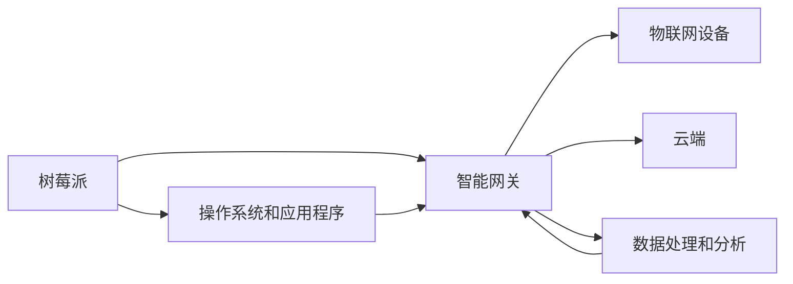

## 1.背景介绍

在当今的物联网时代，智能网关作为连接各种智能设备的桥梁，起着至关重要的作用。智能网关不仅需要处理各种设备的数据，还需要具备一定的计算能力，以便对数据进行实时处理和分析。树莓派，作为一款功能强大、价格低廉的微型计算机，正逐渐成为智能网关设计的理想选择。本文将详细介绍如何基于树莓派设计和实现一个智能网关。

## 2.核心概念与联系

智能网关是物联网系统中的关键组件，它负责连接各种物联网设备，并将设备数据上传到云端。智能网关还需要具备数据处理和分析的能力，以便实现设备状态的实时监控和预测。

树莓派是一款微型计算机，具有丰富的接口和强大的计算能力，非常适合作为智能网关的硬件平台。我们可以在树莓派上运行各种操作系统和应用程序，以实现智能网关的各种功能。

智能网关和树莓派之间的关系可以用下面的 Mermaid 流程图来表示：



## 3.核心算法原理具体操作步骤

设计和实现一个基于树莓派的智能网关，我们需要完成以下步骤：

1. 选择合适的树莓派型号和配件，包括电源、存储卡、网线等。
2. 在树莓派上安装操作系统，如Raspbian、Ubuntu等。
3. 在操作系统上安装和配置网关软件，如openHAB、Home Assistant等。
4. 连接和配置物联网设备，如智能灯泡、温湿度传感器等。
5. 设计和实现数据处理和分析的算法，如设备状态的实时监控和预测。

## 4.数学模型和公式详细讲解举例说明

在智能网关的设计中，我们需要用到一些数学模型和公式。例如，我们可以使用概率模型来描述设备的状态变化，使用时间序列分析方法来预测设备的未来状态。

设备的状态可以用随机变量 $X$ 来表示，设备在时间 $t$ 的状态为 $X_t$。设备的状态变化可以用条件概率 $P(X_{t+1}=x|X_t=x')$ 来描述。

设备的未来状态可以用时间序列分析方法来预测。如果设备的状态是平稳的，我们可以使用自回归模型来进行预测：

$$
X_{t+1} = \phi_1 X_t + \phi_2 X_{t-1} + \cdots + \phi_p X_{t-p+1} + \varepsilon_{t+1}
$$

其中，$\phi_i$ 是自回归系数，$\varepsilon_{t+1}$ 是误差项。

## 5.项目实践：代码实例和详细解释说明

我们可以使用Python语言来实现智能网关的功能。以下是一个简单的示例，展示如何使用Python读取温湿度传感器的数据，并将数据上传到云端。

```python
import Adafruit_DHT
import requests

# 读取温湿度传感器的数据
humidity, temperature = Adafruit_DHT.read_retry(Adafruit_DHT.DHT22, 4)

# 将数据上传到云端
data = {'temperature': temperature, 'humidity': humidity}
response = requests.post('http://example.com/api/data', data=data)
```

## 6.实际应用场景

基于树莓派的智能网关可以应用于各种场景，如智能家居、智能农业、智能工厂等。在智能家居中，智能网关可以连接各种智能设备，如智能灯泡、智能插座、智能音箱等。在智能农业中，智能网关可以连接各种农业传感器，如温湿度传感器、光照传感器、土壤湿度传感器等。在智能工厂中，智能网关可以连接各种工业设备，如机器人、传送带、数控机床等。

## 7.工具和资源推荐

以下是一些可以帮助你设计和实现基于树莓派的智能网关的工具和资源：

- 树莓派官方网站：https://www.raspberrypi.org/
- Raspbian操作系统下载：https://www.raspberrypi.org/downloads/raspbian/
- openHAB网关软件：https://www.openhab.org/
- Home Assistant网关软件：https://www.home-assistant.io/
- Adafruit DHT库：https://github.com/adafruit/Adafruit_Python_DHT
- requests库：https://requests.readthedocs.io/

## 8.总结：未来发展趋势与挑战

随着物联网设备的普及和树莓派的发展，基于树莓派的智能网关将有更广泛的应用。然而，智能网关的设计和实现也面临着一些挑战，如如何处理大量的设备数据，如何保证数据的安全性，如何提高网关的稳定性和可靠性等。这些都是我们在未来需要进一步研究和解决的问题。

## 9.附录：常见问题与解答

Q: 树莓派的性能是否足够作为智能网关使用？

A: 树莓派的性能完全足够作为智能网关使用。树莓派4B型号配备了1.5GHz四核处理器和最高4GB的内存，性能强大。

Q: 如何选择合适的网关软件？

A: 选择网关软件时，需要考虑你的需求和设备的兼容性。openHAB和Home Assistant都是优秀的网关软件，支持大量的物联网设备。

Q: 如何保证智能网关的安全性？

A: 保证智能网关的安全性需要从硬件和软件两方面来考虑。从硬件方面，我们需要选择信誉良好的设备和配件。从软件方面，我们需要定期更新操作系统和应用程序，保证其没有安全漏洞。

作者：禅与计算机程序设计艺术 / Zen and the Art of Computer Programming