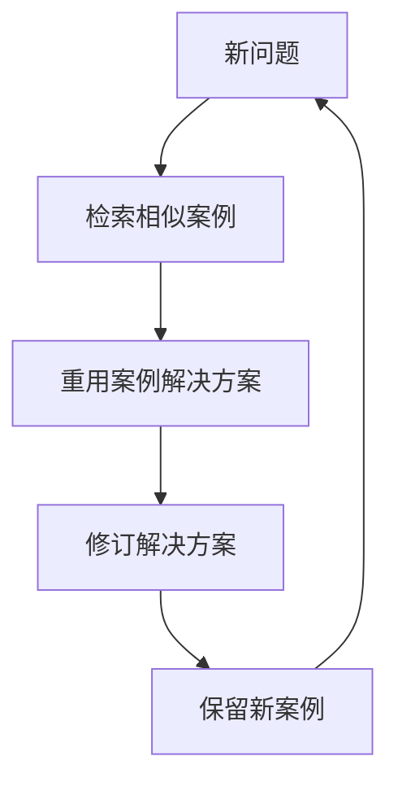
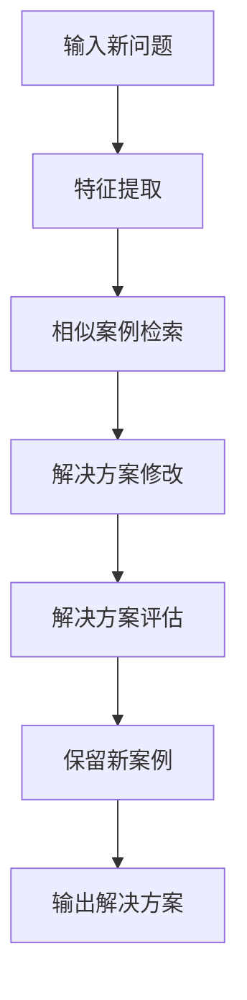

# 基于案例的推理：从经验中学习

## 1.背景介绍

在人工智能领域中,基于案例的推理(Case-Based Reasoning,CBR)是一种重要的智能系统范式。它模仿人类从过去的经验中学习并解决新问题的能力。与其他传统的基于规则或模型的方法不同,CBR系统利用已解决的先前案例来解决新的问题,从而实现了一种"从经验中学习"的机制。

CBR的核心思想是基于相似性原理。当出现新问题时,系统会在案例库中搜索与之最相似的案例,并根据该案例的解决方案生成新问题的解决方案。通过不断地积累新案例并修正现有案例,CBR系统可以持续学习和改进。

### 1.1 CBR的应用场景

CBR已被广泛应用于各个领域,包括:

- 辅助诊断系统:利用过去的病例数据为新病例提供诊断建议
- 法律判决辅助:通过分析相似的历史案例为新案件提供裁决参考
- 电子商务推荐系统:根据用户的历史购买记录推荐相似的商品
- 故障诊断与维修:利用以往的故障案例快速定位新故障的原因并提供解决方案
- 旅游路线规划:根据用户的旅行偏好和过往行程,为新的旅行提供个性化路线建议

## 2.核心概念与联系

### 2.1 案例(Case)表示

案例是CBR系统的基本知识单元,通常包含以下几个部分:

- 问题描述(Problem Description):描述待解决问题的状态和特征
- 解决方案(Solution):对应问题的解决方式或行动
- 结果(Outcome):执行解决方案后的结果评估

案例的表示形式因领域而异,可以是结构化的特征向量、非结构化的文本等。

### 2.2 案例库(Case Base)

案例库是存储所有案例的知识库,是CBR系统的核心部分。一个高质量的案例库对系统的性能至关重要。案例库的组织和索引方式将影响案例检索的效率。

### 2.3 CBR循环

CBR遵循一个循环过程,包括以下四个主要步骤:



1. **检索(Retrieve)**: 根据新问题的特征,在案例库中检索与之最相似的案例
2. **重用(Reuse)**: 对检索出的相似案例的解决方案进行适当修改,生成新问题的解决方案
3. **修订(Revise)**: 执行新解决方案,并根据实际结果对其进行评估和修正
4. **保留(Retain)**: 将新问题及其修订后的解决方案作为一个新案例保存到案例库中,以供将来使用

### 2.4 相似性度量

相似性度量(Similarity Measure)是CBR系统的关键,用于计算新问题与案例库中案例之间的相似程度。常用的相似性度量方法包括:

- 特征向量相似度:基于问题描述的特征向量计算相似度,如欧几里得距离、余弦相似度等
- 结构相似度:考虑问题描述的结构信息,如图形、树等
- 文本相似度:针对非结构化文本数据,利用信息检索技术计算相似度
- 域知识相似度:引入领域知识对相似度进行调整

合理的相似性度量对CBR系统的性能至关重要。

## 3.核心算法原理具体操作步骤

CBR系统的核心算法可以概括为以下步骤:



1. **输入新问题**:用户输入待解决的新问题,可以是结构化数据或非结构化数据(如文本)。

2. **特征提取**:从新问题中提取出描述问题状态的特征向量或其他表示形式。

3. **相似案例检索**:在案例库中搜索与新问题最相似的案例,通常利用相似性度量函数计算相似度。可以使用不同的索引和搜索算法加速检索过程,如K-D树、K近邻等。

4. **解决方案修改**:对检索出的最相似案例的解决方案进行适当修改,生成新问题的初步解决方案。修改过程可能需要领域知识或规则。

5. **解决方案评估**:执行新解决方案,并根据实际结果对其进行评估。如果结果不理想,需要对解决方案进行修订。

6. **保留新案例**:将新问题及其最终解决方案作为一个新案例保存到案例库中,以供将来使用和学习。

7. **输出解决方案**:将最终的解决方案输出,提供给用户。

需要注意的是,上述算法流程是一个循环过程。新保留的案例将为未来的案例检索和解决方案生成提供更多知识,从而不断改进系统的性能。

## 4.数学模型和公式详细讲解举例说明

### 4.1 相似性度量

相似性度量在CBR系统中扮演着至关重要的角色。合理的相似性度量可以确保系统检索到最相关的案例,从而提高解决方案的质量。常用的相似性度量方法包括:

#### 4.1.1 欧几里得距离

对于基于特征向量的案例表示,欧几里得距离是一种常用的相似性度量方法。设有两个案例$C_1$和$C_2$,它们的特征向量分别为$\vec{x}=(x_1,x_2,...,x_n)$和$\vec{y}=(y_1,y_2,...,y_n)$,则它们之间的欧几里得距离定义为:

$$
d(\vec{x},\vec{y})=\sqrt{\sum_{i=1}^{n}(x_i-y_i)^2}
$$

距离越小,两个案例越相似。

#### 4.1.2 余弦相似度

余弦相似度常用于计算文本数据的相似度,它测量两个向量之间的夹角余弦值。设$\vec{x}$和$\vec{y}$为两个文本的特征向量,则它们的余弦相似度定义为:

$$
\text{sim}(\vec{x},\vec{y})=\frac{\vec{x}\cdot\vec{y}}{||\vec{x}||\times||\vec{y}||}=\frac{\sum_{i=1}^{n}x_iy_i}{\sqrt{\sum_{i=1}^{n}x_i^2}\sqrt{\sum_{i=1}^{n}y_i^2}}
$$

余弦相似度的值域为$[0,1]$,值越大,两个向量越相似。

#### 4.1.3 加权特征相似度

在某些情况下,不同的特征对相似度的贡献是不同的,因此需要给不同特征赋予不同的权重。设案例$C_1$和$C_2$的特征向量分别为$\vec{x}=(x_1,x_2,...,x_n)$和$\vec{y}=(y_1,y_2,...,y_n)$,对应的特征权重向量为$\vec{w}=(w_1,w_2,...,w_n)$,则加权特征相似度可以定义为:

$$
\text{sim}(\vec{x},\vec{y})=\frac{\sum_{i=1}^{n}w_i\times s(x_i,y_i)}{\sum_{i=1}^{n}w_i}
$$

其中,$s(x_i,y_i)$表示第$i$个特征的相似度函数,可以是上述的欧几里得距离、余弦相似度或其他相似度度量方式。

通过调整特征权重向量$\vec{w}$,可以根据领域知识为不同特征赋予不同的重要性,从而提高相似度计算的准确性。

### 4.2 案例库组织和索引

高效的案例检索对CBR系统的性能至关重要。合理的案例库组织和索引方式可以加快检索速度。常用的方法包括:

#### 4.2.1 平面划分

平面划分(Flat Partitioning)是最简单的案例库组织方式,将所有案例存储在一个集合中。在检索时,需要线性扫描整个案例库,计算新问题与每个案例的相似度。这种方式的时间复杂度为$O(n)$,其中$n$为案例库大小。

#### 4.2.2 层次划分

层次划分(Hierarchical Partitioning)将案例库组织成一个树状层次结构。每个节点代表一个案例集合,根节点包含所有案例。在检索时,从根节点开始,递归地访问最相似的子节点,直到达到叶节点。这种方式可以减少需要计算相似度的案例数量,提高检索效率。

#### 4.2.3 K-D树索引

K-D树(K-Dimensional Tree)是一种空间划分数据结构,常用于索引基于特征向量的案例库。K-D树通过递归地在不同维度上划分数据空间,将案例分布在不同的节点上。在检索时,可以利用K-D树的结构快速定位相似案例所在的区域,避免对整个案例库进行线性扫描。

#### 4.2.4 倒排索引

倒排索引(Inverted Index)常用于索引文本数据。它将每个特征词(如单词)映射到包含该词的案例集合。在检索时,首先根据新问题的特征词查找相关案例集合,然后计算这些案例与新问题的相似度。倒排索引可以有效减少需要计算相似度的案例数量。

合理的案例库组织和索引方式不仅可以提高检索效率,还能减少内存占用,提高系统的可扩展性。

## 5.项目实践:代码实例和详细解释说明

为了更好地理解CBR系统的实现,我们将提供一个基于Python的简单示例。该示例实现了一个基于文本的CBR系统,用于对新输入的文本进行分类。

### 5.1 案例表示

在本示例中,我们将案例表示为一个包含文本内容和类别标签的元组。

```python
from typing import Tuple

Case = Tuple[str, str]
```

### 5.2 相似度计算

我们使用TF-IDF向量空间模型计算文本之间的相似度。首先需要构建案例库的词袋(Bag-of-Words)模型和TF-IDF向量。

```python
from sklearn.feature_extraction.text import TfidfVectorizer

def build_tfidf(cases: List[Case]) -> TfidfVectorizer:
    texts, _ = zip(*cases)
    tfidf = TfidfVectorizer()
    tfidf.fit(texts)
    return tfidf

def case_vector(case: Case, tfidf: TfidfVectorizer) -> np.ndarray:
    text, _ = case
    return tfidf.transform([text]).toarray()[0]
```

然后,我们可以使用余弦相似度计算两个案例之间的相似度。

```python
import numpy as np

def cosine_sim(vec1: np.ndarray, vec2: np.ndarray) -> float:
    return np.dot(vec1, vec2) / (np.linalg.norm(vec1) * np.linalg.norm(vec2))
```

### 5.3 案例检索

我们实现了一个简单的线性扫描算法,在案例库中检索与新问题最相似的案例。

```python
from typing import List

def retrieve(query: str, cases: List[Case], tfidf: TfidfVectorizer) -> Case:
    query_vec = case_vector((query, ""), tfidf)
    best_case = max(cases, key=lambda case: cosine_sim(query_vec, case_vector(case, tfidf)))
    return best_case
```

### 5.4 系统运行

最后,我们构建一个简单的案例库,并测试系统对新输入文本的分类能力。

```python
cases = [
    ("This is a book about machine learning.", "Technology"),
    ("I love reading fiction novels in my spare time.", "Entertainment"),
    ("The stock market crashed due to the financial crisis.", "Business"),
    # ... add more cases
]

tfidf = build_tfidf(cases)

new_text = "Introduction to artificial intelligence and deep learning techniques."
classified_case = retrieve(new_text, cases, tfidf)
print(f"Input text: '{new_text}'")
print(f"Classified as: {classified_case[1]}")
```

在这个示例中,我们使用了scikit-learn库中的TF-IDF向量化器来构建文本的特征向量。在实际应用中,您可能需要使