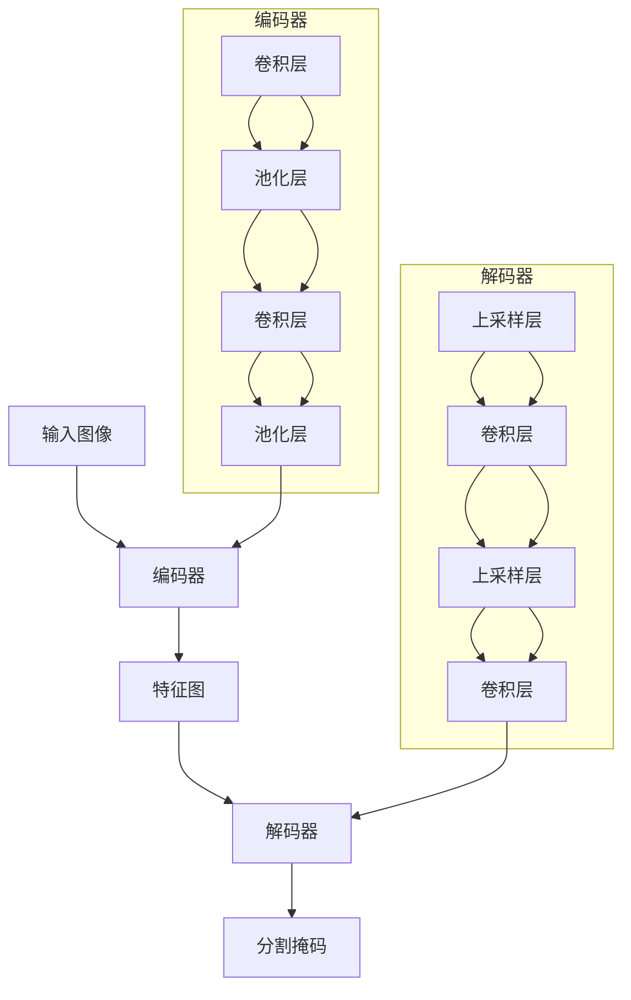

# 基于深度学习的道路图像语义分割

## 1. 背景介绍

### 1.1 语义分割的重要性

在计算机视觉领域,语义分割是一项关键任务,旨在将图像中的每个像素分配给一个预定义的类别标签。与传统的图像分类和目标检测任务不同,语义分割需要对图像中的每个像素进行精确分类,从而获得更加细粒度的理解。

语义分割在许多领域具有广泛的应用,例如:

- **自动驾驶**:准确分割道路、车辆、行人等对象,是实现自动驾驶的关键步骤之一。
- **医疗影像分析**:将CT、MRI等医学影像中的器官、肿瘤等结构进行精确分割,有助于疾病诊断和治疗规划。
- **增强现实/虚拟现实**:通过对真实场景进行语义分割,可以更好地将虚拟元素融入真实环境。

### 1.2 道路图像语义分割的挑战

尽管语义分割在多个领域都有广泛应用,但对于道路场景的语义分割任务仍然存在一些独特的挑战:

- **复杂的场景**:道路场景通常包含多种不同的物体,如车辆、行人、道路标志、建筑物等,这增加了分割的难度。
- **遮挡和视角变化**:由于视角和遮挡的变化,同一物体在不同图像中的外观可能发生显著变化。
- **类内变化**:同一类别的物体(如不同型号的车辆)在外观上可能存在较大差异。
- **实时性要求**:对于自动驾驶等应用,语义分割需要在实时或接近实时的条件下进行。

## 2. 核心概念与联系

### 2.1 深度学习

深度学习是一种基于人工神经网络的机器学习方法,它通过构建由多层非线性变换单元组成的模型,从数据中自动学习特征表示。与传统的机器学习算法相比,深度学习模型具有更强的特征提取和模式识别能力,在计算机视觉、自然语言处理等领域取得了卓越的成就。

### 2.2 卷积神经网络

卷积神经网络(Convolutional Neural Network, CNN)是深度学习在计算机视觉领域的核心模型之一。CNN通过交替使用卷积层和池化层,能够有效地从图像中提取局部特征和全局特征,并且具有一定的平移不变性。

在语义分割任务中,CNN通常被用作编码器(Encoder),从输入图像中提取特征表示。然后,通过解码器(Decoder)模块将编码器的特征图上采样,最终生成与输入图像分辨率相同的分割掩码。

### 2.3 编码器-解码器架构

编码器-解码器架构是语义分割领域中常用的网络结构,它将CNN分为两个部分:编码器和解码器。

- **编码器**:编码器是一个典型的CNN,用于从输入图像中提取特征表示。编码器通常由多个卷积层和池化层组成,每一层都会提取更高级别的特征。
- **解码器**:解码器的作用是将编码器提取的特征图上采样,恢复到与输入图像相同的分辨率,并生成每个像素的类别预测。解码器通常由上采样层和卷积层组成。

该架构的关键是在编码器和解码器之间建立有效的特征融合机制,以保留足够的空间信息用于精确的像素级分割。

### 2.4 Mermaid 流程图

以下是基于深度学习的道路图像语义分割的核心概念和架构的 Mermaid 流程图:



在这个流程图中,输入图像首先通过编码器(由多个卷积层和池化层组成)提取特征表示。然后,编码器的特征图被输入到解码器(由上采样层和卷积层组成),经过一系列上采样和卷积操作,最终生成与输入图像分辨率相同的分割掩码。

## 3. 核心算法原理具体操作步骤

### 3.1 编码器

编码器的作用是从输入图像中提取特征表示。典型的编码器由多个卷积层和池化层组成,每一层都会提取更高级别的特征。以下是编码器的具体操作步骤:

1. **卷积层**:卷积层通过在输入特征图上滑动卷积核,提取局部特征。卷积操作可以用公式表示为:

$$
y_{ij} = \sum_{m}\sum_{n}x_{m,n}w_{ij,m,n} + b_{ij}
$$

其中 $x$ 是输入特征图, $w$ 是卷积核权重, $b$ 是偏置项, $y$ 是输出特征图。

2. **激活函数**:为了增加网络的非线性表达能力,卷积层的输出通常会经过一个非线性激活函数,如 ReLU、Sigmoid 等。
3. **池化层**:池化层通过下采样操作,减小特征图的分辨率,从而增加感受野并提高计算效率。常用的池化操作包括最大池化和平均池化。
4. **重复上述步骤**:编码器通常由多个卷积层和池化层堆叠而成,每一层都会提取更高级别的特征表示。

### 3.2 解码器

解码器的作用是将编码器提取的特征图上采样,恢复到与输入图像相同的分辨率,并生成每个像素的类别预测。以下是解码器的具体操作步骤:

1. **上采样层**:上采样层通过插值等方法,将特征图的分辨率放大到所需的尺寸。常用的上采样方法包括最近邻插值、双线性插值等。
2. **卷积层**:上采样后的特征图通过一系列卷积层进行处理,以恢复空间信息和细节。
3. **跳跃连接**:为了保留编码器中的空间信息,解码器通常会与编码器的特征图建立跳跃连接,将它们concatenate在一起。
4. **分类层**:最后一层通常是一个卷积层,用于为每个像素生成类别预测。该层的输出通道数等于预定义的类别数。

### 3.3 损失函数和优化

在训练过程中,我们需要定义一个损失函数来衡量模型预测和ground truth之间的差异。对于语义分割任务,常用的损失函数包括交叉熵损失、Dice损失等。

优化算法的作用是根据损失函数的梯度,更新网络的权重参数,使得模型在训练数据上的性能不断提高。常用的优化算法包括随机梯度下降(SGD)、Adam等。

## 4. 数学模型和公式详细讲解举例说明

### 4.1 卷积操作

卷积操作是卷积神经网络的核心,它通过在输入特征图上滑动卷积核,提取局部特征。卷积操作可以用公式表示为:

$$
y_{ij} = \sum_{m}\sum_{n}x_{m,n}w_{ij,m,n} + b_{ij}
$$

其中:

- $x$ 是输入特征图,大小为 $M \times N$
- $w$ 是卷积核权重,大小为 $K \times K$
- $b$ 是偏置项
- $y$ 是输出特征图,大小为 $(M-K+1) \times (N-K+1)$

卷积操作的示意图如下:

```
    ┌─────────┐
    │ w_11 w_12│
w = │ w_21 w_22│
    └─────────┘
       卷积核

    ┌─────────┬─────┬─────┐
    │ x_11 x_12 x_13 │ x_14│
    ├─────────┼─────┼─────┤
x = │ x_21 x_22 x_23 │ x_24│
    ├─────────┼─────┼─────┤
    │ x_31 x_32 x_33 │ x_34│
    └─────────┴─────┴─────┘
           输入特征图
```

在上图中,卷积核 $w$ 在输入特征图 $x$ 上滑动,计算局部区域的加权和,得到输出特征图 $y$ 中的一个元素。通过在整个输入特征图上滑动卷积核,我们可以得到完整的输出特征图。

卷积操作具有一些重要的性质,如平移不变性、稀疏连接等,这使得它在提取图像特征方面表现出色。

### 4.2 池化操作

池化操作通过下采样,减小特征图的分辨率,从而增加感受野并提高计算效率。常用的池化操作包括最大池化和平均池化。

**最大池化**

最大池化操作选取池化窗口内的最大值作为输出。假设池化窗口大小为 $2 \times 2$,输入特征图为 $x$,则最大池化操作可以表示为:

$$
y_{ij} = \max\limits_{(m,n) \in R_{ij}}x_{m,n}
$$

其中 $R_{ij}$ 表示以 $(i,j)$ 为中心的 $2 \times 2$ 池化窗口。

**平均池化**

平均池化操作计算池化窗口内所有值的平均值作为输出。假设池化窗口大小为 $2 \times 2$,输入特征图为 $x$,则平均池化操作可以表示为:

$$
y_{ij} = \frac{1}{4}\sum\limits_{(m,n) \in R_{ij}}x_{m,n}
$$

其中 $R_{ij}$ 表示以 $(i,j)$ 为中心的 $2 \times 2$ 池化窗口。

池化操作可以有效地减小特征图的分辨率,同时保留了主要的特征信息。它还具有一定的平移不变性,能够提高模型对于小的位移和扭曲的鲁棒性。

### 4.3 上采样操作

上采样操作是解码器中的关键步骤,它将低分辨率的特征图恢复到与输入图像相同的分辨率。常用的上采样方法包括最近邻插值、双线性插值等。

**最近邻插值**

最近邻插值是一种简单的上采样方法。假设我们要将一个 $2 \times 2$ 的特征图上采样为 $4 \times 4$,则最近邻插值的过程如下:

$$
\begin{pmatrix}
a & b\\
c & d
\end{pmatrix}
\rightarrow
\begin{pmatrix}
a & a & b & b\\
a & a & b & b\\
c & c & d & d\\
c & c & d & d
\end{pmatrix}
$$

每个元素被复制到相邻的四个位置,从而实现上采样。

**双线性插值**

双线性插值是一种更加精确的上采样方法。它通过对相邻像素进行加权平均,计算出新像素的值。假设我们要将一个 $2 \times 2$ 的特征图上采样为 $4 \times 4$,则双线性插值的过程如下:

$$
\begin{pmatrix}
a & b\\
c & d
\end{pmatrix}
\rightarrow
\begin{pmatrix}
a & \alpha a + (1-\alpha)b & \beta b + (1-\beta)c & c\\
\gamma a + (1-\gamma)c & \alpha\gamma a + (1-\alpha)(1-\gamma)b + \alpha(1-\gamma)c + (1-\alpha)\gamma d & \beta\gamma b + (1-\beta)(1-\gamma)d + \beta(1-\gamma)c + (1-\beta)\gamma a & \gamma b + (1-\gamma)d\\
a & \alpha a + (1-\alpha)b & \beta b + (1-\beta)c & c\\
c & \gamma c + (1-\gamma)d & \beta\gamma d + (1-\beta)(1-\gamma)a + \beta(1-\gamma)b + (1-\beta)\gamma c & \gamma d + (1-\gamma)b
\end{pmatrix}
$$

其中 $\alpha$、$\beta$、$\gamma$ 是插值系数,用于计