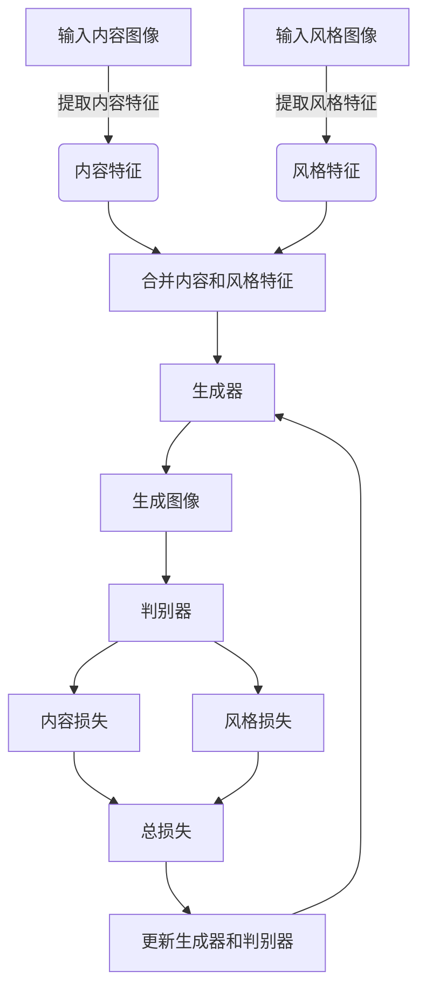

# 基于生成对抗网络的图像风格迁移在虚拟现实中的应用

## 1.背景介绍

### 1.1 虚拟现实技术概述

虚拟现实(Virtual Reality, VR)是一种通过计算机模拟产生的、可以被人工交互体验和操控的虚拟环境。它利用计算机生成一个三维的虚拟世界,并通过各种传感设备和人机交互接口,使用户能够沉浸在其中,获得一种临场感和身临其境的体验。

虚拟现实技术的发展极大地推动了各行各业的创新和进步,尤其是在游戏、影视、教育、医疗、工业设计等领域。它为用户提供了一种全新的体验方式,打破了传统的界限,开辟了无限的可能性。

### 1.2 图像风格迁移技术概述

图像风格迁移(Image Style Transfer)是一种将一种图像的风格迁移到另一种图像上的技术。它可以将一幅具有特定风格的艺术作品(如油画、素描等)的风格,应用到另一幅内容图像上,从而生成一幅新的具有该风格特征的图像。

这项技术的出现,为图像处理和计算机视觉领域带来了革命性的变化。它不仅可以用于艺术创作,还可以应用于图像增强、图像编辑、视频处理等多个领域,为用户提供了更加丰富和个性化的图像体验。

### 1.3 生成对抗网络(GAN)概述

生成对抗网络(Generative Adversarial Networks, GAN)是一种由两个神经网络组成的模型架构,包括一个生成器(Generator)和一个判别器(Discriminator)。生成器的目标是生成逼真的数据样本,而判别器的目标是区分生成的数据和真实数据。通过生成器和判别器之间的对抗训练,最终可以使生成器生成出逼真的数据。

GAN的出现为图像生成、图像风格迁移等任务提供了新的解决方案,极大地推动了深度学习在计算机视觉领域的发展。基于GAN的图像风格迁移技术,可以实现更加自然、逼真的风格迁移效果,为虚拟现实带来了新的应用前景。

## 2.核心概念与联系

### 2.1 生成对抗网络(GAN)

生成对抗网络(GAN)是一种由生成器(Generator)和判别器(Discriminator)组成的深度学习模型架构。生成器的目标是生成逼真的数据样本,而判别器的目标是区分生成的数据和真实数据。两个网络通过对抗训练,相互竞争,最终使生成器能够生成出逼真的数据。

在图像风格迁移任务中,生成器的输入是内容图像和风格图像,输出是具有目标风格的生成图像。判别器则需要判断生成图像是否真实自然。通过不断训练,生成器可以学习到如何将风格特征迁移到内容图像上,从而生成出具有目标风格的新图像。

### 2.2 卷积神经网络(CNN)

卷积神经网络(Convolutional Neural Network, CNN)是一种常用的深度学习模型,在计算机视觉和图像处理任务中表现出色。CNN由卷积层、池化层和全连接层组成,能够自动学习图像的特征表示,并对其进行分类或其他任务。

在图像风格迁移中,CNN通常被用于提取图像的内容特征和风格特征。内容特征描述了图像的内容信息,如物体的形状、位置等,而风格特征描述了图像的纹理、颜色、笔触等风格信息。通过将内容特征和风格特征合并,可以生成出具有目标风格的新图像。

### 2.3 损失函数

损失函数(Loss Function)是用于评估模型输出与期望输出之间差异的函数。在图像风格迁移任务中,通常使用内容损失(Content Loss)和风格损失(Style Loss)两个损失函数。

内容损失用于保持生成图像的内容信息与输入内容图像相似,通常使用均方误差(Mean Squared Error, MSE)来计算。风格损失则用于保持生成图像的风格特征与输入风格图像相似,通常使用格拉姆矩阵(Gram Matrix)来计算。

通过最小化内容损失和风格损失的加权和,可以使生成的图像在保持原始内容的同时,具有目标风格的特征。

### 2.4 Mermaid流程图

上图展示了基于生成对抗网络的图像风格迁移流程。首先,输入的内容图像和风格图像分别通过CNN提取内容特征和风格特征。然后,将这两种特征合并,作为生成器的输入,生成具有目标风格的图像。生成图像与原始内容图像和风格图像进行对比,计算内容损失和风格损失。通过最小化总损失,不断更新生成器和判别器的参数,最终可以生成出具有目标风格且保持原始内容的图像。

## 3.核心算法原理具体操作步骤

基于生成对抗网络的图像风格迁移算法主要包括以下几个步骤:

### 3.1 数据准备

1. 准备内容图像和风格图像作为输入。内容图像是需要进行风格迁移的图像,而风格图像是期望迁移到内容图像上的目标风格。
2. 对输入图像进行预处理,如裁剪、调整大小、归一化等,以满足模型的输入要求。

### 3.2 特征提取

1. 使用预训练的卷积神经网络(如VGG19)作为特征提取器。
2. 将内容图像输入到CNN中,提取其内容特征。内容特征通常来自CNN较深层的特征图,能够捕捉图像的高级语义信息。
3. 将风格图像输入到CNN中,提取其风格特征。风格特征通常来自CNN较浅层的特征图,能够捕捉图像的纹理、颜色、笔触等低级特征。

### 3.3 生成对抗网络训练

1. 构建生成器网络和判别器网络。生成器网络的输入是内容特征和风格特征,输出是生成的图像。判别器网络的输入是真实图像或生成图像,输出是真实或伪造的概率。
2. 定义内容损失函数和风格损失函数。内容损失函数用于保持生成图像的内容信息与输入内容图像相似,通常使用均方误差(MSE)。风格损失函数用于保持生成图像的风格特征与输入风格图像相似,通常使用格拉姆矩阵(Gram Matrix)。
3. 训练生成对抗网络:
   a. 固定判别器,更新生成器,使生成器生成的图像尽可能欺骗判别器,并最小化内容损失和风格损失。
   b. 固定生成器,更新判别器,使判别器能够正确区分真实图像和生成图像。
4. 反复进行步骤3,直到生成器和判别器达到平衡,生成器能够生成具有目标风格且保持原始内容的图像。

### 3.4 结果输出

1. 使用训练好的生成器网络,将内容图像和风格图像的特征作为输入,生成具有目标风格的图像。
2. 对生成的图像进行后处理,如裁剪、调整大小、保存等,得到最终的风格迁移结果。

## 4.数学模型和公式详细讲解举例说明

在基于生成对抗网络的图像风格迁移算法中,内容损失和风格损失是两个关键的损失函数,用于指导生成器生成具有目标风格且保持原始内容的图像。下面将详细介绍这两个损失函数的数学模型和公式。

### 4.1 内容损失

内容损失用于保持生成图像的内容信息与输入内容图像相似。它通过计算生成图像和内容图像在特定CNN层的特征图之间的均方误差(Mean Squared Error, MSE)来实现。

设$F^l(x)$表示图像$x$在CNN的第$l$层的特征图,则内容损失可以定义为:

$$J_\text{content}(G) = \frac{1}{2}\sum_{i,j}(F^l_{i,j}(G) - F^l_{i,j}(C))^2$$

其中,$G$是生成图像,$C$是内容图像,$i,j$是特征图的空间位置索引。

通过最小化内容损失,可以使生成图像的内容特征与内容图像的内容特征尽可能相似,从而保持生成图像的内容信息。

### 4.2 风格损失

风格损失用于保持生成图像的风格特征与输入风格图像相似。它通过计算生成图像和风格图像在特定CNN层的格拉姆矩阵(Gram Matrix)之间的均方误差来实现。

格拉姆矩阵是一种用于捕捉特征图之间线性统计关系的矩阵,定义如下:

$$G^l_{i,j}(x) = \sum_k F^l_{i,k}(x)F^l_{j,k}(x)$$

其中,$F^l_{i,k}(x)$表示图像$x$在CNN的第$l$层的第$i$个特征图上的第$k$个激活值。

风格损失可以定义为:

$$J_\text{style}(G,S) = \frac{1}{4N^2M^2}\sum_{i,j}(G^l_{i,j}(G) - G^l_{i,j}(S))^2$$

其中,$G$是生成图像,$S$是风格图像,$N$是特征图的数量,$M$是特征图的大小。

通过最小化风格损失,可以使生成图像的风格特征与风格图像的风格特征尽可能相似,从而获得目标风格。

### 4.3 总损失函数

为了同时考虑内容信息和风格信息,总损失函数可以定义为内容损失和风格损失的加权和:

$$J_\text{total}(G,C,S) = \alpha J_\text{content}(G,C) + \beta J_\text{style}(G,S)$$

其中,$\alpha$和$\beta$是用于平衡内容损失和风格损失的权重系数。

通过最小化总损失函数,可以使生成的图像在保持原始内容的同时,具有目标风格的特征。

### 4.4 实例说明

假设我们有一张内容图像$C$,表示一个风景场景,以及一张风格图像$S$,是一幅梵高的油画作品。我们希望将风格图像的风格迁移到内容图像上,生成一幅具有梵高油画风格的风景画。

首先,我们将内容图像$C$和风格图像$S$分别输入到预训练的VGG19网络中,提取它们在第$l$层的特征图$F^l(C)$和$F^l(S)$。

然后,计算内容损失:

$$J_\text{content}(G) = \frac{1}{2}\sum_{i,j}(F^l_{i,j}(G) - F^l_{i,j}(C))^2$$

这个损失函数会使生成图像$G$的内容特征与内容图像$C$的内容特征尽可能相似,从而保持生成图像的内容信息。

接下来,计算风格损失:

$$J_\text{style}(G,S) = \frac{1}{4N^2M^2}\sum_{i,j}(G^l_{i,j}(G) - G^l_{i,j}(S))^2$$

这个损失函数会使生成图像$G$的风格特征与风格图像$S$的风格特征尽可能相似,从而获得梵高油画的风格。

最后,我们将内容损失和风格损失加权求和,得到总损失函数:

$$J_\text{total}(G,C,S) = \alpha J_\text{content}(G,C) + \beta J_\text{style}(G,S)$$

通过最小化总损失函数,我们可以训练生成对抗网络,使生成器能够生成出具有梵高油画风格且保持原始