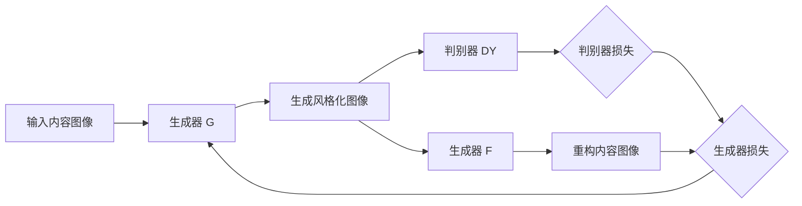

# 基于生成对抗网络的图像风格迁移竞赛平台建设

## 1. 背景介绍
### 1.1 图像风格迁移的兴起与发展
近年来,随着深度学习技术的飞速发展,图像风格迁移作为一项将内容图像的语义信息与风格图像的纹理特征相结合的任务,受到了学术界和工业界的广泛关注。图像风格迁移可以让普通照片呈现出梵高、莫奈等大师级绘画的艺术效果,为图像处理和计算机视觉领域带来了全新的研究方向和应用前景。

### 1.2 生成对抗网络在图像风格迁移中的应用
生成对抗网络(Generative Adversarial Networks, GANs)自2014年被提出以来,凭借其强大的生成能力在图像生成、超分辨率、图像翻译等领域取得了突破性进展。将GAN引入图像风格迁移任务,可以克服传统方法在保持内容图像语义信息的同时难以生成细节丰富、艺术感强烈的风格化图像的局限性。基于GAN的图像风格迁移方法能够生成视觉效果更加逼真、艺术性更强的风格化图像。

### 1.3 图像风格迁移竞赛平台的意义
为了进一步推动图像风格迁移技术的发展,构建一个基于GAN的图像风格迁移竞赛平台具有重要意义。这样一个平台不仅能够为研究者提供一个开放、公平的竞技环境,促进GAN在图像风格迁移中的创新应用,还能够让更多的开发者和爱好者参与其中,加速该领域的技术普及和产业化进程。同时,竞赛平台积累的优秀模型和数据也将为相关研究和应用提供宝贵的资源。

## 2. 核心概念与联系
### 2.1 图像风格迁移
图像风格迁移指的是在保持内容图像语义信息不变的前提下,将参考风格图像的纹理、色彩等特征迁移到内容图像中,使其呈现出类似风格图像的视觉效果。其核心在于如何恰当地提取并融合内容图像的语义特征和风格图像的纹理特征。

### 2.2 生成对抗网络(GANs) 
生成对抗网络由生成器(Generator)和判别器(Discriminator)两部分组成。生成器负责生成尽可能逼真的假样本,判别器则试图判断输入样本是真实样本还是生成器产生的假样本。两者在对抗学习中不断博弈,最终使生成器能够生成以假乱真的样本。

### 2.3 基于GAN的图像风格迁移
将GAN应用于图像风格迁移任务,通常是将生成器设计为一个风格迁移网络,判别器则判断生成的风格化图像在内容和风格上是否与目标一致。生成器和判别器通过对抗训练不断提升风格迁移的效果。常见的基于GAN的图像风格迁移方法有CycleGAN、AdaIN、CartoonGAN等。

### 2.4 技术关键点
- 内容特征和风格特征的提取
- 内容损失和风格损失的平衡
- GAN的网络结构设计与训练技巧  
- 风格化图像质量的评估指标

## 3. 核心算法原理与具体步骤
本节以CycleGAN为例,介绍基于GAN的图像风格迁移算法的核心原理和具体步骤。

### 3.1 CycleGAN原理简介
CycleGAN通过构建两个生成器 G: X→Y 和 F: Y→X,以及两个对应的判别器 DX 和 DY,在两个域 X 和 Y 之间实现图像风格的转换。其核心思想是引入循环一致性损失,即 F(G(X)) ≈ X 且 G(F(Y)) ≈ Y,从而实现无需配对数据的图像风格迁移。

### 3.2 CycleGAN的具体步骤
1. 定义生成器 G 和 F 的网络结构,通常采用U-Net或ResNet架构; 
2. 定义判别器 DX 和 DY 的网络结构,通常采用PatchGAN;
3. 定义生成器损失函数,包括对抗损失、循环一致性损失和恒等损失;
4. 定义判别器损失函数,通常为二进制交叉熵损失;
5. 准备训练数据,包括两个域的图像数据;
6. 训练模型,交替优化生成器和判别器,直至模型收敛;
7. 测试模型,使用训练好的生成器进行图像风格迁移。

### 3.3 算法流程图


## 4. 数学模型与公式详解
### 4.1 对抗损失
CycleGAN的对抗损失包括生成器的对抗损失和判别器的对抗损失。以 G: X→Y 为例,其对抗损失为:

$$
\mathcal{L}_{GAN}(G, D_Y, X, Y) = \mathbb{E}_{y \sim p_{data}(y)}[\log D_Y(y)] + \mathbb{E}_{x \sim p_{data}(x)}[\log (1 - D_Y(G(x)))]
$$

其中,$\mathbb{E}$表示期望,$p_{data}$表示真实数据分布。生成器 G 试图最小化此损失,而判别器 D_Y 试图最大化此损失。

### 4.2 循环一致性损失
循环一致性损失定义为:

$$  
\mathcal{L}_{cyc}(G, F) = \mathbb{E}_{x \sim p_{data}(x)}[||F(G(x)) - x||_1] + \mathbb{E}_{y \sim p_{data}(y)}[||G(F(y)) - y||_1]
$$

其中,$||\cdot||_1$表示L1范数。该损失确保了 F(G(X)) ≈ X 且 G(F(Y)) ≈ Y,从而在没有配对数据的情况下实现图像风格迁移。

### 4.3 恒等损失
恒等损失定义为:

$$
\mathcal{L}_{identity}(G, F) = \mathbb{E}_{y \sim p_{data}(y)}[||G(y) - y||_1] + \mathbb{E}_{x \sim p_{data}(x)}[||F(x) - x||_1] 
$$

该损失鼓励生成器在输入已经属于目标域时,生成一个与输入相同的图像。这有助于保持图像的色彩合成。

### 4.4 完整的目标函数
CycleGAN的完整目标函数为:

$$
\mathcal{L}(G, F, D_X, D_Y) = \mathcal{L}_{GAN}(G, D_Y, X, Y) + \mathcal{L}_{GAN}(F, D_X, Y, X) + \lambda \mathcal{L}_{cyc}(G, F) + \gamma \mathcal{L}_{identity}(G, F)
$$

其中,$\lambda$和$\gamma$为平衡不同损失项的超参数。模型训练过程就是求解以下的最小最大化问题:

$$
G^*, F^* = \arg \min_{G,F} \max_{D_X, D_Y} \mathcal{L}(G, F, D_X, D_Y)
$$

## 5. 项目实践:代码实例与详解
下面给出了使用PyTorch实现CycleGAN进行图像风格迁移的关键代码,并进行简要解释。

### 5.1 生成器和判别器的定义
```python
class Generator(nn.Module):
    def __init__(self):
        super(Generator, self).__init__()
        # 定义生成器的网络结构,此处省略
        
    def forward(self, x):
        # 前向传播过程,此处省略
        return out

class Discriminator(nn.Module): 
    def __init__(self):
        super(Discriminator, self).__init__()
        # 定义判别器的网络结构,此处省略
        
    def forward(self, x):
        # 前向传播过程,此处省略 
        return out
```

### 5.2 损失函数的定义
```python
# 对抗损失
criterion_GAN = torch.nn.MSELoss()

# 循环一致性损失  
criterion_cycle = torch.nn.L1Loss()

# 恒等损失
criterion_identity = torch.nn.L1Loss()
```

### 5.3 训练过程
```python
for epoch in range(num_epochs):
    for i, batch in enumerate(dataloader):
        real_A, real_B = batch
        
        # 训练生成器
        G_AB.train()
        G_BA.train()
        
        fake_B = G_AB(real_A)
        loss_identity_A = criterion_identity(G_BA(real_A), real_A)
        
        fake_A = G_BA(real_B) 
        loss_identity_B = criterion_identity(G_AB(real_B), real_B)
        
        loss_identity = (loss_identity_A + loss_identity_B) / 2
        
        loss_GAN_AB = criterion_GAN(D_B(fake_B), valid)
        loss_GAN_BA = criterion_GAN(D_A(fake_A), valid)
        
        loss_cycle_A = criterion_cycle(G_BA(fake_B), real_A)
        loss_cycle_B = criterion_cycle(G_AB(fake_A), real_B)
        loss_cycle = (loss_cycle_A + loss_cycle_B) / 2
        
        # 总的生成器损失
        loss_G = loss_GAN_AB + loss_GAN_BA + loss_cycle + loss_identity
         
        loss_G.backward()
        optimizer_G.step()
        
        # 训练判别器 
        D_A.train()
        D_B.train()
        
        loss_real_A = criterion_GAN(D_A(real_A), valid)
        loss_fake_A = criterion_GAN(D_A(fake_A.detach()), fake)
        loss_D_A = (loss_real_A + loss_fake_A) / 2
        
        loss_real_B = criterion_GAN(D_B(real_B), valid) 
        loss_fake_B = criterion_GAN(D_B(fake_B.detach()), fake)
        loss_D_B = (loss_real_B + loss_fake_B) / 2
        
        loss_D_A.backward()
        loss_D_B.backward()
        optimizer_D_A.step()
        optimizer_D_B.step()
```

### 5.4 测试过程
```python
G_AB.eval()
G_BA.eval()

with torch.no_grad(): 
    fake_B = G_AB(real_A)
    fake_A = G_BA(real_B)
    
    # 保存生成的图像
    save_image(fake_A, 'fake_A.png')  
    save_image(fake_B, 'fake_B.png')
```

## 6. 实际应用场景
基于GAN的图像风格迁移技术有广泛的应用前景,主要包括:

- 艺术创作:可以将普通照片转换为梵高、莫奈等大师级绘画风格,辅助艺术家进行创作灵感的探索和发掘。
- 游戏设计:可以为游戏中的场景、人物、贴图等素材快速生成多种艺术风格,丰富游戏的视觉表现力。 
- 虚拟现实:可以根据用户的喜好,实时生成个性化的虚拟场景和角色形象,提升沉浸感。
- 电影特效:可以为电影后期制作提供更多创意选择,例如将真实场景转换为卡通或油画风格等。
- 设计辅助:可以为平面、工业、UI等设计师提供多样化的风格参考,提高设计效率。

除了上述领域,图像风格迁移技术还可应用于教育培训、医学影像、遥感图像处理等诸多方面。随着技术的不断发展和成熟,其应用范围必将进一步扩大。

## 7. 工具与资源推荐
- PyTorch:基于Python的开源深度学习框架,提供了强大的GPU加速和自动求导功能。官网:https://pytorch.org/

- TensorFlow:由Google开发的端到端开源机器学习平台。官网:https://www.tensorflow.org/

- MMSegmentation:基于PyTorch的语义分割开源工具箱,集成了多种SOTA分割模型。Github:https://github.com/open-mmlab/mmsegmentation

- Jupyter Notebook:基于网页的用于交互计算的应用程序,可在浏览器中直接编写和运行代码。官网:https://jupyter.org/  

- CVPR/ICCV/ECCV:计算机视觉三大顶会,图像风格迁移相关