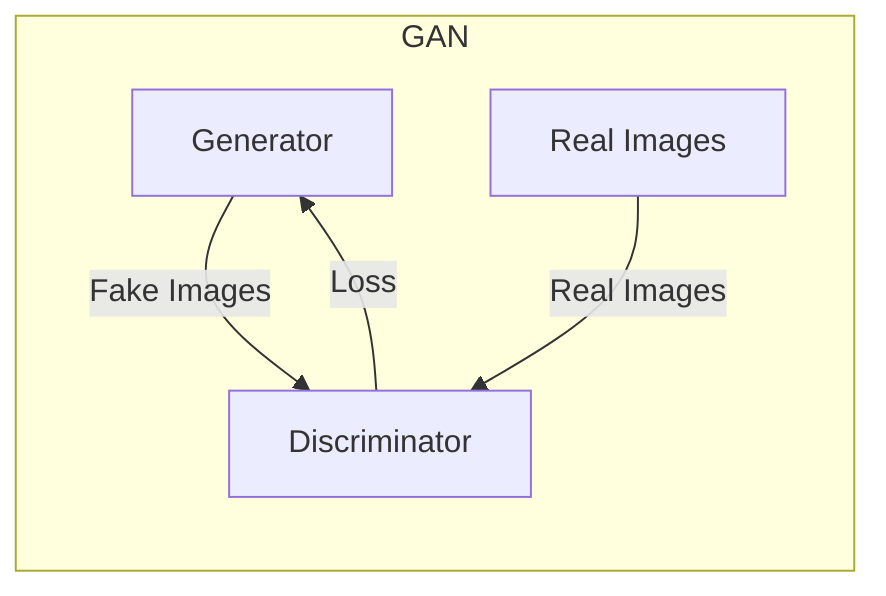
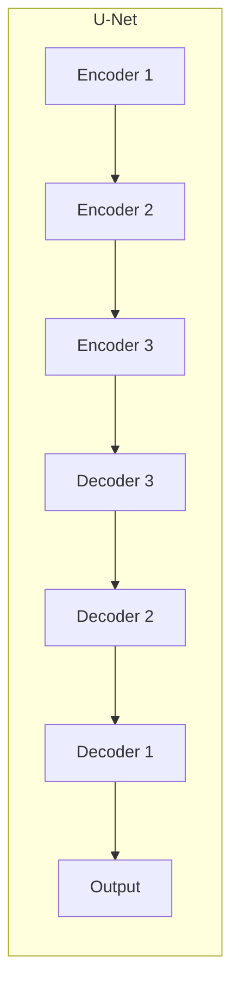
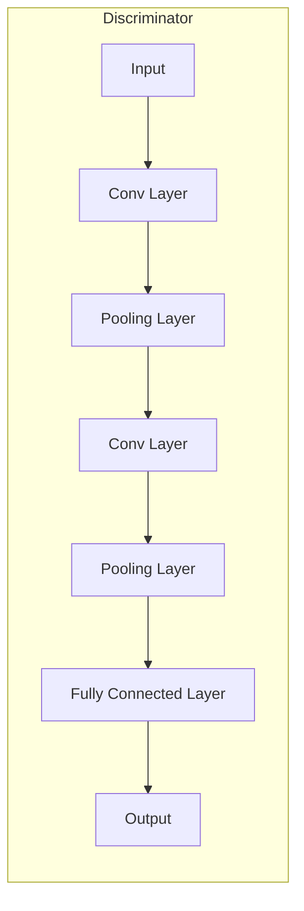

# 基于生成对抗网络的老照片修复及风格迁移

## 1. 背景介绍

### 1.1 老照片修复的重要性

随着时间的推移,老照片会逐渐出现各种各样的损坏,如褪色、划痕、污渍等。这些损坏不仅影响了照片的美观性,也可能导致珍贵的记忆无法完整保存。因此,老照片修复具有重要的意义,可以帮助我们保护珍贵的回忆,延长照片的寿命。

### 1.2 传统修复方法的局限性

传统的老照片修复方法通常依赖人工操作,需要专业人员耗费大量时间和精力进行修复。此外,这些方法通常只能修复局部区域,对于大面积损坏的照片效果并不理想。

### 1.3 生成对抗网络在老照片修复中的应用

近年来,生成对抗网络(Generative Adversarial Networks, GANs)在图像处理领域取得了突破性进展。GANs能够学习图像的潜在分布,并生成逼真的图像。利用这一特性,GANs可以用于老照片的修复和风格迁移,实现自动化、高质量的修复效果。

## 2. 核心概念与联系

### 2.1 生成对抗网络(GANs)

生成对抗网络由两个神经网络组成:生成器(Generator)和判别器(Discriminator)。生成器的目标是生成逼真的图像,而判别器则需要区分生成的图像和真实图像。两个网络相互对抗,最终达到一种动态平衡,生成器能够生成高质量的图像。



### 2.2 老照片修复的挑战

老照片修复面临以下几个主要挑战:

1. 损坏类型多样化:老照片可能存在褪色、划痕、污渍等多种损坏类型。
2. 局部和全局一致性:修复后的图像需要在局部和全局上保持一致性,避免出现明显的缝合痕迹。
3. 内容保真性:修复过程中需要尽可能保留原始照片的内容和细节。

### 2.3 风格迁移

除了修复损坏,GANs还可以实现风格迁移,将老照片转换为不同的艺术风格,如油画风格、素描风格等。这为老照片赋予了新的艺术价值和视觉体验。

## 3. 核心算法原理具体操作步骤

### 3.1 数据预处理

在训练GANs之前,需要对老照片进行预处理,包括:

1. 数据收集:收集包含各种损坏类型的老照片作为训练数据。
2. 数据标注:为每张老照片标注对应的无损版本作为Ground Truth。
3. 数据增强:通过旋转、翻转、裁剪等方式增强训练数据,提高模型的泛化能力。

### 3.2 生成器和判别器结构

生成器和判别器的结构设计对模型性能有重大影响。常见的生成器结构包括U-Net、ResNet等,而判别器通常采用卷积神经网络结构。

#### 3.2.1 生成器结构

U-Net是一种广泛应用于图像分割和修复任务的生成器结构。它由编码器(Encoder)和解码器(Decoder)组成,可以有效捕获图像的全局和局部特征。



#### 3.2.2 判别器结构

判别器通常采用卷积神经网络结构,用于区分真实图像和生成图像。常见的结构包括VGG、ResNet等。



### 3.3 损失函数设计

损失函数的设计对模型性能有重要影响。常见的损失函数包括:

1. 对抗损失(Adversarial Loss):用于生成器和判别器的对抗训练。
2. 像素损失(Pixel Loss):衡量生成图像与Ground Truth之间的像素差异。
3. 感知损失(Perceptual Loss):衡量生成图像与Ground Truth在高级特征层面的差异。
4. 风格损失(Style Loss):用于风格迁移任务,衡量生成图像与目标风格之间的差异。

### 3.4 模型训练

模型训练过程包括以下步骤:

1. 初始化生成器和判别器的权重。
2. 从训练数据中采样一批老照片和对应的Ground Truth。
3. 将老照片输入生成器,生成修复后的图像。
4. 将真实图像和生成图像输入判别器,计算对抗损失。
5. 计算像素损失、感知损失和风格损失(如果进行风格迁移)。
6. 反向传播,更新生成器和判别器的权重。
7. 重复步骤2-6,直到模型收敛。

## 4. 数学模型和公式详细讲解举例说明

### 4.1 对抗损失

对抗损失是GAN中最核心的损失函数,用于生成器和判别器的对抗训练。它可以表示为:

$$
\mathcal{L}_{adv}(G, D) = \mathbb{E}_{x \sim p_{data}(x)}[\log D(x)] + \mathbb{E}_{z \sim p_{z}(z)}[\log (1 - D(G(z)))]
$$

其中,第一项是真实样本的对数似然,第二项是生成样本的对数似然的相反数。生成器 $G$ 的目标是最小化这个损失函数,而判别器 $D$ 的目标是最大化这个损失函数。

在老照片修复任务中,我们可以将真实样本 $x$ 替换为Ground Truth图像,将生成样本 $G(z)$ 替换为生成器输出的修复图像。

### 4.2 像素损失

像素损失衡量生成图像与Ground Truth之间的像素差异,通常使用 $\ell_1$ 或 $\ell_2$ 范数来计算:

$$
\mathcal{L}_{pixel} = \|G(x) - y\|_p
$$

其中 $x$ 是输入的老照片, $y$ 是对应的Ground Truth, $G(x)$ 是生成器输出的修复图像, $p$ 是范数的阶数(通常取 1 或 2)。

像素损失可以确保生成图像在像素层面尽可能接近Ground Truth,但它无法捕获高级语义信息。

### 4.3 感知损失

感知损失衡量生成图像与Ground Truth在高级特征层面的差异,通常使用预训练的卷积神经网络(如VGG)来提取特征:

$$
\mathcal{L}_{percep} = \sum_{i=1}^{N} \frac{1}{C_i H_i W_i} \|F^i(G(x)) - F^i(y)\|_1
$$

其中 $F^i$ 表示第 $i$ 层特征图, $C_i$、$H_i$ 和 $W_i$ 分别表示该层特征图的通道数、高度和宽度。通过最小化感知损失,可以使生成图像在语义层面更接近Ground Truth。

### 4.4 风格损失

风格损失用于风格迁移任务,衡量生成图像与目标风格之间的差异。它基于格拉姆矩阵(Gram Matrix)来捕获图像的风格信息:

$$
\mathcal{L}_{style} = \sum_{i=1}^{N} \frac{1}{C_i^2} \|G(F^i(G(x))) - G(F^i(y_s))\|_1
$$

其中 $y_s$ 是目标风格图像, $G(\cdot)$ 表示计算格拉姆矩阵的操作。通过最小化风格损失,可以使生成图像具有目标风格的特征。

在实际应用中,通常会将上述损失函数进行线性组合,形成总体损失函数:

$$
\mathcal{L}_{total} = \lambda_1 \mathcal{L}_{adv} + \lambda_2 \mathcal{L}_{pixel} + \lambda_3 \mathcal{L}_{percep} + \lambda_4 \mathcal{L}_{style}
$$

其中 $\lambda_1$、$\lambda_2$、$\lambda_3$ 和 $\lambda_4$ 是超参数,用于平衡不同损失函数的权重。

## 5. 项目实践: 代码实例和详细解释说明

在这一部分,我们将提供一个基于PyTorch实现的老照片修复和风格迁移项目的代码示例,并对关键部分进行详细解释。

### 5.1 数据加载

```python
import os
from PIL import Image
from torch.utils.data import Dataset

class OldPhotoDataset(Dataset):
    def __init__(self, data_dir, transform=None):
        self.data_dir = data_dir
        self.transform = transform
        self.image_paths = [os.path.join(data_dir, x) for x in os.listdir(data_dir)]

    def __len__(self):
        return len(self.image_paths)

    def __getitem__(self, idx):
        image_path = self.image_paths[idx]
        image = Image.open(image_path)
        if self.transform:
            image = self.transform(image)
        return image
```

在上面的代码中,我们定义了一个自定义的数据集类 `OldPhotoDataset`。它接受一个包含老照片和对应Ground Truth的数据目录作为输入。在 `__getitem__` 方法中,我们加载图像并应用指定的数据增强转换(如果提供了 `transform` 参数)。

### 5.2 生成器和判别器

```python
import torch.nn as nn

class Generator(nn.Module):
    def __init__(self):
        super(Generator, self).__init__()
        # 定义生成器网络结构

    def forward(self, x):
        # 前向传播过程

class Discriminator(nn.Module):
    def __init__(self):
        super(Discriminator, self).__init__()
        # 定义判别器网络结构

    def forward(self, x):
        # 前向传播过程
```

上面的代码定义了生成器 `Generator` 和判别器 `Discriminator` 的基本结构。你需要根据实际需求填充网络层的细节,例如使用 U-Net 作为生成器,使用卷积神经网络作为判别器。

### 5.3 损失函数

```python
import torch.nn.functional as F

def adversarial_loss(discriminator, real, fake):
    real_loss = F.binary_cross_entropy_with_logits(discriminator(real), torch.ones_like(discriminator(real)))
    fake_loss = F.binary_cross_entropy_with_logits(discriminator(fake.detach()), torch.zeros_like(discriminator(fake.detach())))
    return (real_loss + fake_loss) / 2

def pixel_loss(input, target):
    return F.l1_loss(input, target)

def perceptual_loss(input, target, vgg):
    # 使用预训练的 VGG 网络计算感知损失
    pass

def style_loss(input, style_target, vgg):
    # 使用预训练的 VGG 网络计算风格损失
    pass
```

上面的代码实现了对抗损失、像素损失、感知损失和风格损失的计算。对于感知损失和风格损失,我们需要使用预训练的 VGG 网络来提取特征。你可以根据需要实现这两个损失函数的具体细节。

### 5.4 模型训练

```python
import torch.optim as optim

# 初始化生成器和判别器
generator = Generator()
discriminator = Discriminator()

# 定义优化器和损失函数权重
g_optimizer = optim.Adam(generator.parameters(), lr=0.0002)
d_optimizer = optim.Adam(discriminator.parameters(), lr=0.0002)
lambda_adv = 1.0
lambda_pixel = 10.0
lambda_percep = 0.1
lambda_style = 100.0

# 训练循环
for epoch in range(num_epochs):
    for real_images, target_images in dataloader:
        # 生成器前向传播
        fake_images = generator(real_images)

        # 计算损失函数
        adv_loss = adversarial_loss(discriminator, real_images, fake_images)
        pixel_loss = pixel_loss(fake_images, target_images)
        percep_loss = perceptual_loss(fake_images, target_images, vgg)