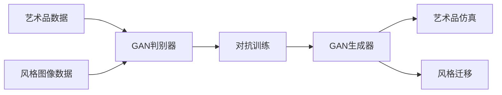

# 基于生成对抗网络的艺术品仿真与风格迁移技术

## 1.背景介绍
### 1.1 艺术品仿真与风格迁移的意义
#### 1.1.1 艺术创作的新途径
#### 1.1.2 文化遗产保护与传承
#### 1.1.3 商业应用价值

### 1.2 生成对抗网络(GAN)的兴起
#### 1.2.1 GAN的提出与发展历程
#### 1.2.2 GAN在计算机视觉领域的应用
#### 1.2.3 GAN在艺术领域的探索

## 2.核心概念与联系
### 2.1 生成对抗网络(GAN) 
#### 2.1.1 生成器与判别器
#### 2.1.2 对抗训练过程
#### 2.1.3 GAN的数学原理

### 2.2 艺术品仿真
#### 2.2.1 艺术品数字化
#### 2.2.2 基于GAN的艺术品生成
#### 2.2.3 仿真效果评估

### 2.3 风格迁移  
#### 2.3.1 风格表示学习
#### 2.3.2 基于GAN的风格迁移
#### 2.3.3 多风格融合

### 2.4 GAN、艺术仿真与风格迁移的关系

## 3.核心算法原理具体操作步骤
### 3.1 基于GAN的艺术品仿真算法
#### 3.1.1 数据预处理
#### 3.1.2 生成器网络结构设计
#### 3.1.3 判别器网络结构设计  
#### 3.1.4 损失函数定义
#### 3.1.5 训练过程优化

### 3.2 基于GAN的风格迁移算法
#### 3.2.1 内容图像与风格图像的表示
#### 3.2.2 内容损失与风格损失定义
#### 3.2.3 生成器网络结构设计
#### 3.2.4 判别器网络结构设计
#### 3.2.5 训练过程优化

## 4.数学模型和公式详细讲解举例说明
### 4.1 GAN的数学模型
#### 4.1.1 生成器与判别器的博弈过程
$$ \min_{G} \max_{D} V(D,G) = \mathbb{E}_{x \sim p_{data}(x)}[\log D(x)] + \mathbb{E}_{z \sim p_{z}(z)}[\log (1 - D(G(z)))] $$
#### 4.1.2 纳什均衡与最优解

### 4.2 艺术品仿真的数学模型  
#### 4.2.1 生成器目标函数
$$ \mathcal{L}_{G} = \mathbb{E}_{z \sim p_{z}(z)}[\log (1 - D(G(z)))] + \lambda \mathcal{L}_{rec}(G) $$
#### 4.2.2 判别器目标函数 
$$ \mathcal{L}_{D} = -\mathbb{E}_{x \sim p_{data}(x)}[\log D(x)] - \mathbb{E}_{z \sim p_{z}(z)}[\log (1 - D(G(z)))] $$

### 4.3 风格迁移的数学模型
#### 4.3.1 内容损失
$$ \mathcal{L}_{content}(G) = \frac{1}{C_{j}H_{j}W_{j}} \sum_{c=1}^{C_{j}} \sum_{h=1}^{H_{j}} \sum_{w=1}^{W_{j}} (F_{j}(x) - F_{j}(G(x)))^2 $$
#### 4.3.2 风格损失
$$ \mathcal{L}_{style}(G) = \sum_{j=1}^{J} \frac{1}{C_{j}^2} \sum_{c=1}^{C_{j}} \sum_{c'=1}^{C_{j}} (G_{j}^{\phi}(s) - G_{j}^{\phi}(G(x)))^2 $$
#### 4.3.3 总损失函数
$$ \mathcal{L}(G,D) = \mathcal{L}_{content}(G) + \lambda_{style} \mathcal{L}_{style}(G) + \lambda_{adv} \mathcal{L}_{adv}(G,D) $$

## 5.项目实践：代码实例和详细解释说明
### 5.1 环境配置
#### 5.1.1 硬件需求
#### 5.1.2 软件依赖
#### 5.1.3 数据集准备

### 5.2 艺术品仿真的代码实现
#### 5.2.1 数据预处理模块
#### 5.2.2 生成器网络实现
#### 5.2.3 判别器网络实现
#### 5.2.4 训练过程代码
#### 5.2.5 仿真效果展示与分析

### 5.3 风格迁移的代码实现 
#### 5.3.1 数据预处理模块
#### 5.3.2 内容损失与风格损失实现
#### 5.3.3 生成器网络实现
#### 5.3.4 判别器网络实现
#### 5.3.5 训练过程代码
#### 5.3.6 风格迁移效果展示与分析

## 6.实际应用场景
### 6.1 数字博物馆
#### 6.1.1 艺术品数字化展示
#### 6.1.2 艺术品风格迁移互动体验

### 6.2 电影与游戏 
#### 6.2.1 场景与人物的艺术化渲染
#### 6.2.2 实时风格迁移特效

### 6.3 设计领域
#### 6.3.1 辅助设计师进行创意生成
#### 6.3.2 快速实现多风格设计方案

## 7.工具和资源推荐
### 7.1 开源框架
#### 7.1.1 TensorFlow
#### 7.1.2 PyTorch
#### 7.1.3 Keras

### 7.2 预训练模型
#### 7.2.1 StyleGAN
#### 7.2.2 CycleGAN
#### 7.2.3 Pix2PixHD

### 7.3 数据集资源
#### 7.3.1 WikiArt数据集
#### 7.3.2 MetFaces数据集
#### 7.3.3 Painter by Numbers数据集

## 8.总结：未来发展趋势与挑战
### 8.1 艺术品仿真与风格迁移的研究进展
#### 8.1.1 更加逼真的艺术品仿真
#### 8.1.2 多风格无缝融合
#### 8.1.3 三维艺术品的仿真与风格迁移

### 8.2 面临的挑战
#### 8.2.1 艺术创作中的版权问题
#### 8.2.2 恶意deepfake的防范
#### 8.2.3 艺术创作中人工智能的定位

### 8.3 未来的发展方向
#### 8.3.1 与虚拟现实/增强现实技术的结合
#### 8.3.2 实现艺术家与AI的协同创作
#### 8.3.3 发展更加interpretable和controllable的生成模型

## 9.附录：常见问题与解答
### 9.1 GAN存在的问题，如mode collapse和训练不稳定性的解决方法？
### 9.2 如何权衡仿真效果与创作性的平衡？ 
### 9.3 风格迁移过程中内容失真问题如何解决？
### 9.4 艺术品仿真与风格迁移的商业化应用前景如何？
### 9.5 AI生成艺术对人类艺术创作的影响？

作者：禅与计算机程序设计艺术 / Zen and the Art of Computer Programming