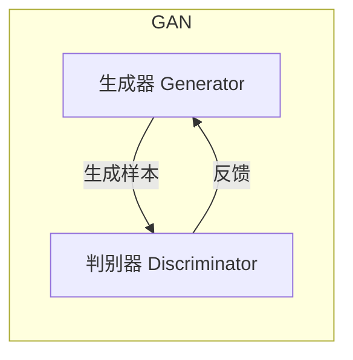
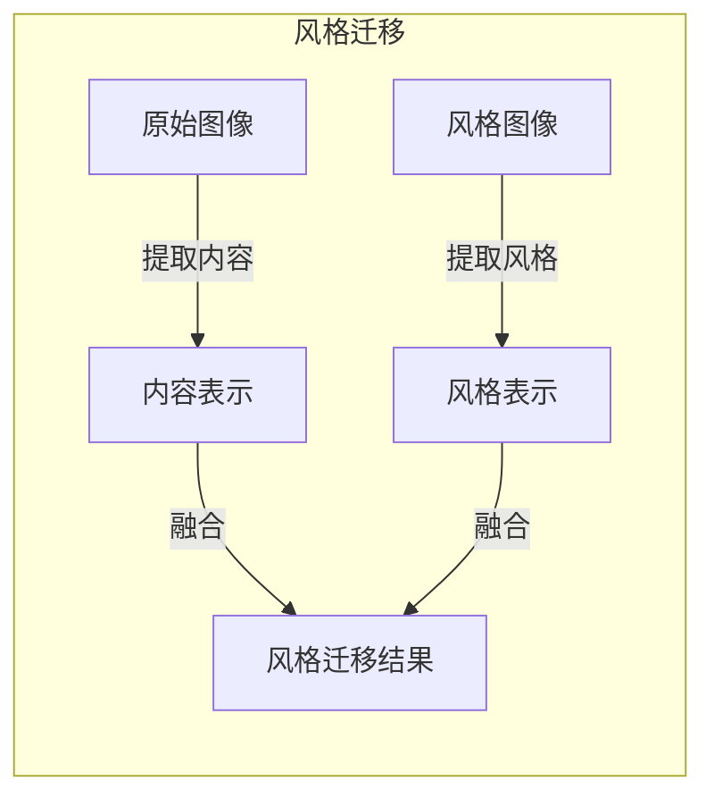
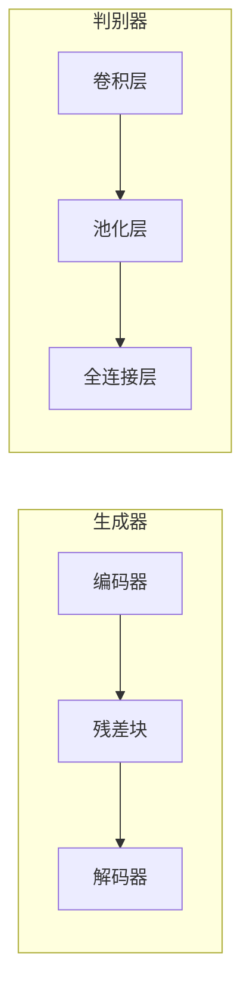

# 基于生成对抗网络的跨域图像风格迁移网络架构设计

## 1. 背景介绍

### 1.1 图像风格迁移的重要性

在当今视觉计算和多媒体领域,图像处理和计算机视觉技术扮演着越来越重要的角色。其中,图像风格迁移是一种将某种艺术风格迁移到另一幅图像上的技术,广泛应用于图像编辑、增强现实、视频制作等多个领域。通过风格迁移,我们可以赋予普通图像独特的艺术风格,增强视觉体验,同时也可以用于图像修复、老照片修复等任务。

### 1.2 传统方法的局限性

早期的图像风格迁移方法主要依赖于手工特征提取和参数调优,存在效率低下、泛化能力差、需要大量人工干预等缺陷。随着深度学习技术的兴起,基于卷积神经网络(CNN)的风格迁移算法应运而生,能够自动提取内容和风格特征,大大提高了迁移质量和效率。

### 1.3 生成对抗网络(GAN)的优势

生成对抗网络是近年来深度学习领域的一个重大突破,它通过生成器和判别器之间的对抗训练,能够学习到数据的真实分布,并生成逼真的样本。GAN在图像生成、超分辨率重建等任务中表现出色,因此将其应用于图像风格迁移是一个自然而然的选择。

## 2. 核心概念与联系

### 2.1 生成对抗网络(GAN)

生成对抗网络由两个子网络组成:生成器(Generator)和判别器(Discriminator)。生成器的目标是从噪声分布中生成逼真的样本,而判别器则需要区分生成的样本和真实样本。两个网络相互对抗,生成器不断努力生成更逼真的样本来迷惑判别器,而判别器也在不断提高对生成样本的判别能力。最终,生成器和判别器达到一种动态平衡,生成器能够生成高质量的样本。



### 2.2 图像风格迁移

图像风格迁移的目标是将一种艺术风格(如油画、素描等)迁移到另一幅图像上,同时保留原始图像的内容。这个过程可以分为两个步骤:

1. 内容表示提取:从原始图像中提取内容特征,即对象、边缘等内容信息。
2. 风格迁移:将目标风格融合到内容表示中,生成新的图像。



### 2.3 生成对抗网络与图像风格迁移的结合

传统的基于CNN的风格迁移方法虽然有效,但存在优化过程复杂、结果欠佳等问题。生成对抗网络由于其强大的生成能力,可以更好地捕捉图像的内容和风格特征,从而实现高质量的风格迁移。

在基于GAN的图像风格迁移框架中,生成器的目标是生成具有目标风格的图像,而判别器则需要区分生成的图像和真实的风格参考图像。通过对抗训练,生成器逐渐学会如何将风格迁移到内容图像上,最终实现高质量的风格迁移效果。

## 3. 核心算法原理具体操作步骤

基于生成对抗网络的图像风格迁移算法通常包括以下几个关键步骤:

### 3.1 数据预处理

1. 收集内容图像和风格参考图像数据集。
2. 对图像进行归一化、缩放等预处理操作。

### 3.2 网络架构设计

1. 设计生成器网络架构,通常采用编码器-残差块-解码器的结构。
2. 设计判别器网络架构,通常采用卷积神经网络分类器。



### 3.3 损失函数设计

1. 内容损失:用于保留原始图像的内容信息,通常使用预训练的VGG网络提取特征,计算内容图像和生成图像特征之间的均方差。
2. 风格损失:用于迁移目标风格,通常使用Gram矩阵来捕捉风格特征,计算风格参考图像和生成图像特征之间的均方差。
3. 对抗损失:用于生成逼真的图像,通过最小化生成器和判别器之间的对抗损失来实现。

$$
\mathcal{L}_{total} = \alpha \mathcal{L}_{content} + \beta \mathcal{L}_{style} + \gamma \mathcal{L}_{adv}
$$

其中$\alpha$、$\beta$、$\gamma$是权重系数,用于平衡不同损失项的贡献。

### 3.4 模型训练

1. 初始化生成器和判别器网络的权重。
2. 构建对抗训练循环:
   - 生成器生成样本图像。
   - 计算内容损失、风格损失和对抗损失。
   - 更新生成器权重,使总损失最小化。
   - 更新判别器权重,提高对真实和生成样本的判别能力。
3. 重复训练循环,直到模型收敛。

### 3.5 风格迁移推理

1. 使用训练好的生成器模型。
2. 输入内容图像和风格参考图像。
3. 生成器生成风格迁移后的图像。

## 4. 数学模型和公式详细讲解举例说明

### 4.1 内容损失

内容损失用于保留原始图像的内容信息,通常使用预训练的VGG网络提取特征,计算内容图像和生成图像特征之间的均方差。

设$\phi(x)$表示VGG网络对图像$x$的特征提取,其中$\phi_j(x)$表示第$j$层的特征图。内容损失定义为:

$$
\mathcal{L}_{content}(x, y) = \frac{1}{2} \sum_{j} \left\lVert \phi_j(x) - \phi_j(y) \right\rVert_2^2
$$

其中$x$是原始内容图像,$y$是生成的图像。通过最小化内容损失,可以使生成图像的内容特征接近原始图像。

### 4.2 风格损失

风格损失用于迁移目标风格,通常使用Gram矩阵来捕捉风格特征,计算风格参考图像和生成图像特征之间的均方差。

对于特征图$\phi_j(x) \in \mathbb{R}^{C_j \times H_j \times W_j}$,其Gram矩阵定义为:

$$
G_j^{\phi}(x) = \frac{1}{C_jH_jW_j} \sum_{h=1}^{H_j} \sum_{w=1}^{W_j} \phi_j(x)_{:,h,w} \phi_j(x)_{:,h,w}^T
$$

风格损失定义为:

$$
\mathcal{L}_{style}(x, y) = \sum_{j} \left\lVert G_j^{\phi}(x) - G_j^{\phi}(y) \right\rVert_F^2
$$

其中$x$是风格参考图像,$y$是生成的图像,$ \left\lVert \cdot \right\rVert_F$表示Frobenius范数。通过最小化风格损失,可以使生成图像的风格特征接近风格参考图像。

### 4.3 对抗损失

对抗损失用于生成逼真的图像,通过最小化生成器和判别器之间的对抗损失来实现。

设$G$为生成器网络,$D$为判别器网络,对抗损失定义为:

$$
\begin{aligned}
\mathcal{L}_{adv}(G, D) &= \mathbb{E}_{x \sim p_{data}(x)}[\log D(x)] \\
&+ \mathbb{E}_{z \sim p_z(z)}[\log(1 - D(G(z)))]
\end{aligned}
$$

其中$p_{data}(x)$是真实数据分布,$p_z(z)$是噪声分布。生成器$G$的目标是最小化$\log(1 - D(G(z)))$,即生成能够欺骗判别器的图像;而判别器$D$的目标是最大化$\log D(x)$和$\log(1 - D(G(z)))$,即正确识别真实和生成样本。

通过交替优化生成器和判别器,可以达到一种动态平衡,生成器能够生成逼真的图像。

### 4.4 实例:基于CycleGAN的风格迁移

CycleGAN是一种无监督的图像到图像翻译框架,可以用于图像风格迁移。它包含两个生成器$G_{X \rightarrow Y}$和$G_{Y \rightarrow X}$,以及两个判别器$D_X$和$D_Y$。

对于风格迁移任务,我们有内容图像$x$和风格参考图像$y$,目标是生成具有$y$风格的图像$\hat{y}$。CycleGAN的损失函数包括以下几个部分:

1. 对抗损失:
   $$
   \begin{aligned}
   \mathcal{L}_{adv}(G_{X \rightarrow Y}, D_Y) &= \mathbb{E}_{y \sim p_{data}(y)}[\log D_Y(y)] \\
   &+ \mathbb{E}_{x \sim p_{data}(x)}[\log(1 - D_Y(G_{X \rightarrow Y}(x)))]
   \end{aligned}
   $$

2. 循环一致性损失:
   $$
   \mathcal{L}_{cyc}(G_{X \rightarrow Y}, G_{Y \rightarrow X}) = \mathbb{E}_{x \sim p_{data}(x)}\left\lVert G_{Y \rightarrow X}(G_{X \rightarrow Y}(x)) - x \right\rVert_1 + \mathbb{E}_{y \sim p_{data}(y)}\left\lVert G_{X \rightarrow Y}(G_{Y \rightarrow X}(y)) - y \right\rVert_1
   $$

3. 身份映射损失:
   $$
   \begin{aligned}
   \mathcal{L}_{id}(G_{X \rightarrow Y}, G_{Y \rightarrow X}) &= \mathbb{E}_{x \sim p_{data}(x)}\left\lVert G_{X \rightarrow Y}(x) - x \right\rVert_1 \\
   &+ \mathbb{E}_{y \sim p_{data}(y)}\left\lVert G_{Y \rightarrow X}(y) - y \right\rVert_1
   \end{aligned}
   $$

总的损失函数为:

$$
\mathcal{L} = \mathcal{L}_{adv}(G_{X \rightarrow Y}, D_Y) + \lambda_1 \mathcal{L}_{cyc}(G_{X \rightarrow Y}, G_{Y \rightarrow X}) + \lambda_2 \mathcal{L}_{id}(G_{X \rightarrow Y}, G_{Y \rightarrow X})
$$

通过优化这个损失函数,CycleGAN可以学习到从$x$到$y$的风格迁移映射$G_{X \rightarrow Y}$,实现高质量的图像风格迁移。

## 5. 项目实践:代码实例和详细解释说明

在这一节,我们将提供一个基于PyTorch实现的图像风格迁移项目示例,并详细解释关键代码部分。

### 5.1 环境配置

```python
import torch
import torch.nn as nn
import torchvision.models as models
import torchvision.transforms as transforms
from PIL import Image
import matplotlib.pyplot as plt
```

### 5.2 定义网络架构

```python
class VGGEncoder(nn.Module):
    def __init__(self):
        super(VGGEncoder, self).__init__()
        vgg = models.vgg19(pretrained=True).features
        self.slice1 = nn.Sequential()
        self.slice2 = nn.Sequential()
        self.slice3 = nn.Sequential()
        self.slice4 = nn.Sequential()
        for x in range(4):
            self.slice1.add_module(str(x), vgg[x])
        for x in range(4, 9):
            self.slice2.add_module(str(x), vgg[x])
        for x in range(9, 16):
            self.