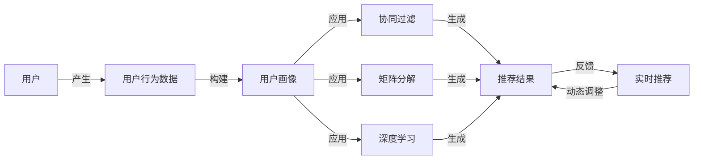

# 基于用户购物行为的商品推荐算法研究与实现

## 1. 背景介绍

### 1.1 电商推荐系统的重要性

在当今电子商务蓬勃发展的时代,商品推荐系统已成为各大电商平台不可或缺的关键组成部分。面对海量的商品数据和复杂多变的用户需求,如何从茫茫商品海洋中精准地为用户推荐感兴趣的商品,已成为电商平台的一大技术挑战和竞争焦点。

### 1.2 用户行为分析的价值

用户的购物行为数据蕴含着丰富的用户偏好信息。通过分析用户的浏览、收藏、加购、购买等行为,我们可以洞察用户的兴趣所在,从而实现个性化的商品推荐。基于用户行为的推荐能够提升用户的购物体验,增强用户粘性,最终带动平台的销售转化。

### 1.3 本文的研究意义

本文旨在探索如何基于用户购物行为数据,构建一个高效、精准的商品推荐算法模型。我们将深入分析用户行为特征,提取隐含的用户偏好,并运用机器学习算法和大数据处理技术,实现个性化的商品推荐。本研究对于改进电商推荐系统,提升推荐质量和用户满意度具有重要的理论和实践意义。

## 2. 核心概念与联系

### 2.1 用户画像

用户画像是指通过收集和分析用户的各种信息和行为数据,构建用户的多维度特征表示。它包括用户的人口统计学特征(如年龄、性别、地域等)、行为特征(如浏览、购买历史等)、偏好特征(如品类偏好、价格偏好等)。用户画像是实现个性化推荐的基础。

### 2.2 协同过滤

协同过滤是一种经典的推荐算法,其基本思想是利用用户或商品之间的相似性来进行推荐。它分为两类:基于用户的协同过滤和基于物品的协同过滤。前者通过发现与目标用户口味相似的其他用户,推荐这些相似用户喜欢的商品;后者通过发现用户喜欢的商品,推荐与这些商品相似的其他商品。

### 2.3 矩阵分解

矩阵分解是一种常用的隐语义模型,它将用户-商品评分矩阵分解为低维的用户隐因子矩阵和商品隐因子矩阵。通过这种分解,我们可以发现用户和商品的隐含特征,并基于这些特征计算用户对商品的评分预测。矩阵分解能够挖掘用户和商品的潜在联系,扩展推荐的覆盖度。

### 2.4 深度学习

深度学习是机器学习的一个分支,它使用多层神经网络对数据进行建模和学习。在推荐系统领域,深度学习可以用于学习用户和商品的复杂非线性特征表示,捕捉它们之间的高阶交互。常见的深度学习模型包括多层感知机、卷积神经网络、循环神经网络等。

### 2.5 实时推荐

实时推荐是指根据用户的即时行为,动态调整推荐结果。它需要系统能够快速响应用户的反馈,并及时更新推荐模型。实时推荐对于提升用户体验和引导用户决策至关重要。

以下是这些核心概念之间的联系:



## 3. 核心算法原理具体操作步骤

### 3.1 用户行为数据收集与预处理

- 收集用户的浏览、收藏、加购、购买等行为数据
- 对数据进行清洗,去除噪声和异常值
- 对数据进行归一化处理,消除数据量纲影响

### 3.2 构建用户-商品交互矩阵

- 根据用户行为数据,构建用户-商品交互矩阵
- 矩阵中的元素表示用户对商品的喜好程度(如评分、购买次数等)
- 对稀疏矩阵进行填充,处理缺失值

### 3.3 计算用户相似度

- 选择合适的相似度度量方法(如余弦相似度、皮尔逊相关系数等) 
- 计算用户之间的相似度矩阵
- 选择TopN相似用户作为邻域

### 3.4 生成推荐列表

- 对每个用户,找到其邻域中的相似用户
- 聚合这些相似用户对商品的偏好,生成推荐列表
- 对推荐列表进行排序和过滤,提高推荐的准确性和多样性

### 3.5 矩阵分解模型训练

- 将用户-商品交互矩阵分解为用户隐因子矩阵和商品隐因子矩阵
- 使用随机梯度下降等优化算法,最小化重构误差,学习隐因子矩阵
- 利用学习到的隐因子,预测用户对未评分商品的评分

### 3.6 深度学习模型训练

- 构建深度神经网络模型,如多层感知机、卷积神经网络等
- 将用户特征和商品特征作为输入,用户-商品交互作为监督信号
- 通过反向传播算法,优化模型参数,学习用户和商品的深层表示

### 3.7 模型融合与优化

- 将不同的推荐模型(如协同过滤、矩阵分解、深度学习)进行组合融合
- 利用集成学习方法(如加权平均、stacking等)提升推荐性能
- 引入正则化项,控制模型复杂度,防止过拟合

### 3.8 实时推荐策略

- 实时跟踪用户的行为反馈数据,如点击、购买等
- 根据用户反馈,动态调整推荐模型的参数和权重
- 利用在线学习算法,快速更新模型,适应用户偏好的变化

## 4. 数学模型和公式详细讲解举例说明

### 4.1 协同过滤

#### 4.1.1 基于用户的协同过滤

用户u对商品i的预测评分:

$$
\hat{r}_{ui} = \bar{r}_u + \frac{\sum_{v \in N(u)} sim(u,v) \cdot (r_{vi} - \bar{r}_v)}{\sum_{v \in N(u)} sim(u,v)}
$$

其中,$\bar{r}_u$和$\bar{r}_v$分别表示用户u和v的平均评分,$N(u)$表示用户u的邻域用户集合,$sim(u,v)$表示用户u和v的相似度。

举例:假设用户A对商品X的预测评分为:

$$
\hat{r}_{AX} = 4 + \frac{0.8 \cdot (5-4.5) + 0.6 \cdot (4-3.8)}{0.8 + 0.6} = 4.36
$$

#### 4.1.2 基于物品的协同过滤

用户u对商品i的预测评分:

$$
\hat{r}_{ui} = \frac{\sum_{j \in N(i)} sim(i,j) \cdot r_{uj}}{\sum_{j \in N(i)} sim(i,j)}
$$

其中,$N(i)$表示与商品i相似的商品集合,$sim(i,j)$表示商品i和j的相似度。

举例:假设用户B对商品Y的预测评分为:

$$
\hat{r}_{BY} = \frac{0.9 \cdot 5 + 0.7 \cdot 4}{0.9 + 0.7} = 4.56
$$

### 4.2 矩阵分解

用户-商品评分矩阵R可以分解为用户隐因子矩阵P和商品隐因子矩阵Q:

$$
R \approx P \cdot Q^T
$$

其中,P的维度为$m \times k$,Q的维度为$n \times k$,k为隐因子的维度。

优化目标是最小化重构误差:

$$
\min_{P,Q} \sum_{(u,i) \in K} (r_{ui} - p_u^T q_i)^2 + \lambda (||P||^2 + ||Q||^2)
$$

其中,K为已知评分的用户-商品对集合,$p_u$和$q_i$分别为用户u和商品i的隐因子向量,$\lambda$为正则化参数。

举例:假设用户-商品评分矩阵为:

$$
R = \begin{bmatrix}
4 & ? & 3 \\
5 & 4 & ? \\
? & 2 & 5
\end{bmatrix}
$$

我们可以将其分解为:

$$
P = \begin{bmatrix}
0.8 & 1.2 \\
1.5 & 0.9 \\
1.1 & 1.4
\end{bmatrix}, 
Q = \begin{bmatrix}
1.6 & 0.7 \\
0.5 & 1.3 \\
1.2 & 1.0
\end{bmatrix}
$$

则用户1对商品2的预测评分为:

$$
\hat{r}_{12} = p_1^T q_2 = [0.8, 1.2] \cdot [0.5, 1.3]^T = 1.96
$$

### 4.3 深度学习

#### 4.3.1 多层感知机(MLP)

MLP可以用于学习用户和商品的非线性特征交互。输入为用户特征向量$x_u$和商品特征向量$x_i$,输出为预测评分$\hat{r}_{ui}$:

$$
\hat{r}_{ui} = f(W_3^T(f(W_2^T(f(W_1^T[x_u, x_i] + b_1)) + b_2)) + b_3)
$$

其中,W和b为MLP的权重矩阵和偏置向量,f为激活函数(如ReLU、sigmoid等)。

举例:假设用户特征向量为$x_u=[0.5, 0.8]$,商品特征向量为$x_i=[0.6, 0.3]$,MLP的参数为:

$$
W_1 = \begin{bmatrix}
0.1 & 0.4 \\
0.2 & 0.5 \\
0.3 & 0.6 \\
0.7 & 0.9
\end{bmatrix},
b_1 = \begin{bmatrix}
0.2 \\
0.1
\end{bmatrix},
W_2 = \begin{bmatrix}
0.3 & 0.8 \\
0.4 & 0.7
\end{bmatrix},
b_2 = 0.5,
W_3 = \begin{bmatrix}
0.6 \\
0.2
\end{bmatrix},
b_3 = 0.1
$$

则预测评分为:

$$
\begin{aligned}
\hat{r}_{ui} &= f(W_3^T(f(W_2^T(f(W_1^T[0.5, 0.8, 0.6, 0.3] + b_1)) + b_2)) + b_3) \\
&= f(0.6 \cdot f(0.3 \cdot f(0.38) + 0.8 \cdot f(0.41) + 0.5) + 0.2 \cdot f(0.4 \cdot f(0.38) + 0.7 \cdot f(0.41) + 0.5) + 0.1) \\
&= 0.72
\end{aligned}
$$

## 5. 项目实践:代码实例和详细解释说明

下面以Python为例,给出基于用户的协同过滤算法的简单实现:

```python
import numpy as np

class UserCF:
    def __init__(self, data, k=3, sim_method='cosine'):
        self.data = data
        self.k = k
        self.sim_method = sim_method
        self.user_mean = {}
        self.similarity = None
        
    def fit(self):
        # 计算每个用户的平均评分
        for user in self.data:
            ratings = [r for (_, r) in self.data[user]]
            self.user_mean[user] = np.mean(ratings)
        
        # 计算用户相似度矩阵
        self.similarity = self.user_similarity()
        
    def user_similarity(self):
        # 构建用户-物品倒排表
        item_users = {}
        for user, items in self.data.items():
            for item, _ in items:
                if item not in item_users:
                    item_