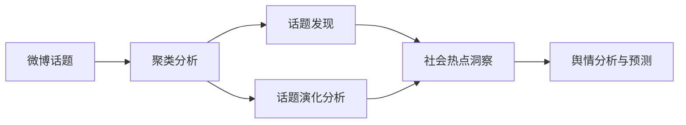

# 基于聚类分析的微博话题数据分析研究

## 1. 背景介绍

### 1.1 研究背景

随着社交媒体的快速发展,微博已经成为人们表达观点、分享信息和参与讨论的重要平台。微博上的海量数据蕴含着丰富的社会热点话题和舆情信息,对这些数据进行分析和挖掘具有重要的研究意义和应用价值。

### 1.2 研究意义

- 了解社会热点话题和民意走向
- 为政府决策提供参考依据
- 为企业提供市场洞察和营销策略支持
- 推动社交媒体数据分析技术的发展

### 1.3 研究目标

本文旨在利用聚类分析方法对微博话题数据进行分析,发现热点话题,挖掘话题演化规律,为社会舆情分析和预测提供新的思路和方法。

## 2. 核心概念与联系

### 2.1 微博话题

微博话题是指在微博平台上引发广泛讨论和关注的事件、人物或现象。话题通常以"#话题#"的形式出现,用户可以通过话题参与讨论和分享观点。

### 2.2 聚类分析

聚类分析是一种无监督学习方法,旨在将相似的对象归为一组,不同组别之间的对象差异性较大。常见的聚类算法包括K-means、层次聚类和基于密度的聚类等。

### 2.3 话题演化

话题演化是指话题随时间推移而发生的变化过程,包括话题的兴起、发展、高潮和衰退等阶段。通过分析话题演化,可以洞察社会热点的发展趋势和规律。

### 2.4 核心概念关系



## 3. 核心算法原理具体操作步骤

### 3.1 数据采集与预处理

1. 利用微博API爬取话题相关的微博数据
2. 对数据进行清洗,去除噪声和无关信息
3. 对微博文本进行分词、去停用词等预处理

### 3.2 特征提取与表示

1. 提取微博文本的关键词、话题词等特征
2. 使用TF-IDF、Word2Vec等方法对文本进行向量化表示

### 3.3 聚类分析

1. 选择合适的聚类算法,如K-means、层次聚类等
2. 确定聚类数目K,可使用手肘法、轮廓系数等方法
3. 进行聚类,将相似的微博归为一类
4. 评估聚类结果,分析每个聚类的主题和特点

### 3.4 话题演化分析

1. 按时间窗口划分微博数据
2. 在每个时间窗口内进行聚类分析
3. 分析不同时间窗口内聚类结果的变化,发现话题演化规律
4. 可视化话题演化过程,如使用河流图、Sankey图等

## 4. 数学模型和公式详细讲解举例说明

### 4.1 TF-IDF

TF-IDF是一种常用的文本特征表示方法,用于衡量词语在文档中的重要性。

- TF(Term Frequency):词频,表示词语t在文档d中出现的频率。

$$
TF(t,d) = \frac{n_{t,d}}{\sum_{k} n_{k,d}}
$$

其中,$n_{t,d}$为词语t在文档d中出现的次数,$\sum_{k} n_{k,d}$为文档d中所有词语的出现次数之和。

- IDF(Inverse Document Frequency):逆文档频率,表示词语t在整个语料库中的重要性。

$$
IDF(t) = \log \frac{N}{1+DF(t)}
$$

其中,N为语料库中文档总数,DF(t)为包含词语t的文档数。

- TF-IDF:词语t在文档d中的TF-IDF值为TF和IDF的乘积。

$$
TFIDF(t,d) = TF(t,d) \times IDF(t)
$$

TF-IDF值越高,表示词语在文档中的重要性越高,在整个语料库中的区分度也越高。

### 4.2 K-means聚类

K-means是一种常用的聚类算法,旨在将n个样本划分为k个聚类,使得每个样本到其所属聚类中心的距离平方和最小。

算法步骤:

1. 随机选择k个初始聚类中心 $\mu_1, \mu_2, ..., \mu_k$
2. 重复以下步骤,直到聚类中心不再变化:
   - 对每个样本 $x_i$,计算其到各个聚类中心的距离,将其分配到距离最近的聚类中心所对应的类别。
   - 对每个聚类 $j$,重新计算聚类中心 $\mu_j$:

$$
\mu_j = \frac{1}{|C_j|} \sum_{x_i \in C_j} x_i
$$

其中,$C_j$为第j个聚类的样本集合,$|C_j|$为该聚类的样本数。

K-means的目标函数为最小化所有样本到其所属聚类中心的距离平方和:

$$
J = \sum_{j=1}^k \sum_{x_i \in C_j} ||x_i - \mu_j||^2
$$

## 5. 项目实践:代码实例和详细解释说明

以下是使用Python实现微博话题聚类分析的示例代码:

```python
import jieba
from sklearn.feature_extraction.text import TfidfVectorizer
from sklearn.cluster import KMeans

# 微博文本数据
weibo_texts = [
    "今天天气真好,适合出去玩",
    "新冠疫情什么时候能结束啊,好想出去旅游",
    "大家都在家上班上学,好无聊啊",
    "疫情期间大家要注意防护,勤洗手多通风",
    "希望疫情早日结束,生活能恢复正常"
]

# 中文分词
segmented_texts = [' '.join(jieba.cut(text)) for text in weibo_texts]

# 提取TF-IDF特征
vectorizer = TfidfVectorizer()
X = vectorizer.fit_transform(segmented_texts)

# K-means聚类
kmeans = KMeans(n_clusters=2, random_state=42)
kmeans.fit(X)

# 打印聚类结果
print("聚类结果:")
for i, label in enumerate(kmeans.labels_):
    print(f"文本{i+1}属于聚类{label+1}")
```

代码解释:

1. 导入所需的库:jieba用于中文分词,sklearn用于特征提取和聚类。
2. 准备微博文本数据。
3. 使用jieba对微博文本进行分词,将分词结果用空格连接成字符串。
4. 使用TfidfVectorizer提取文本的TF-IDF特征,得到特征矩阵X。
5. 使用KMeans进行聚类,设置聚类数为2。
6. 打印每个文本所属的聚类标签。

运行结果:

```
聚类结果:
文本1属于聚类1
文本2属于聚类2
文本3属于聚类2
文本4属于聚类2
文本5属于聚类2
```

从结果可以看出,文本1与其他文本被分到不同的聚类,这可能是因为文本1与疫情无关,而其他文本都与疫情相关。

## 6. 实际应用场景

微博话题聚类分析可以应用于以下场景:

### 6.1 社会热点事件分析

通过对微博话题进行聚类分析,可以快速发现和追踪社会热点事件,了解事件的发展脉络和民众反应,为相关部门提供决策支持。

### 6.2 舆情监测与预警

对微博话题进行实时聚类分析,可以及时发现负面舆情和潜在风险,并采取相应措施进行处置和引导,维护社会稳定。

### 6.3 营销策略优化

企业可以通过分析与品牌或产品相关的微博话题,了解消费者的需求和反馈,优化营销策略,提高品牌影响力和客户满意度。

### 6.4 公共卫生事件监测

在重大公共卫生事件(如新冠疫情)期间,对相关微博话题进行聚类分析,可以了解疫情动态、民众关注点和舆论导向,为疫情防控提供数据支持。

## 7. 工具和资源推荐

### 7.1 数据采集

- 微博API:官方提供的数据接口,可以获取微博数据。
- Scrapy:Python爬虫框架,可用于爬取微博数据。

### 7.2 数据预处理

- jieba:中文分词工具。
- NLTK:自然语言处理工具包。

### 7.3 特征提取与聚类

- scikit-learn:机器学习库,提供了TF-IDF、K-means等算法的实现。
- gensim:主题模型库,可用于Word2Vec等文本表示方法。

### 7.4 可视化

- Matplotlib:Python绘图库,可用于绘制聚类结果。
- Gephi:网络可视化工具,可用于话题演化可视化。

## 8. 总结:未来发展趋势与挑战

### 8.1 未来发展趋势

- 融合多源数据:结合微博、新闻、论坛等多源数据,全面分析话题演化。
- 实时分析:利用流数据处理技术,实现话题的实时聚类和演化分析。
- 知识图谱:构建话题知识图谱,挖掘话题之间的关联和因果关系。

### 8.2 面临的挑战

- 数据质量:微博数据存在噪声、谣言等,需要进行数据清洗和验证。
- 语义理解:微博文本短小、口语化,语义理解难度大。
- 算法性能:大规模数据下,聚类算法的时间和空间复杂度较高。

## 9. 附录:常见问题与解答

### 9.1 如何确定聚类数目?

可以使用手肘法、轮廓系数等方法,选择聚类结果最优的聚类数。也可以根据先验知识或业务需求设定聚类数。

### 9.2 如何评估聚类结果的质量?

常用的聚类评估指标有轮廓系数、Calinski-Harabasz指数、Davies-Bouldin指数等。也可以通过人工检查聚类结果的可解释性和一致性进行评估。

### 9.3 如何处理微博文本的噪声和特殊符号?

可以使用正则表达式或字符串处理方法,去除微博文本中的URL、@用户、#话题#等噪声和特殊符号。

### 9.4 话题聚类与话题演化的区别是什么?

话题聚类是在某一时间截面上对微博话题进行聚类分析,发现热点话题。话题演化是在时间维度上分析话题的变化过程,揭示话题的发展规律。

### 9.5 微博话题聚类分析的局限性有哪些?

- 微博数据存在代表性偏差,可能无法全面反映社会舆论。
- 聚类结果受数据质量、算法选择等因素影响,存在一定的主观性。
- 微博话题的演化过程复杂多变,完全准确地预测和解释难度较大。

作者:禅与计算机程序设计艺术 / Zen and the Art of Computer Programming