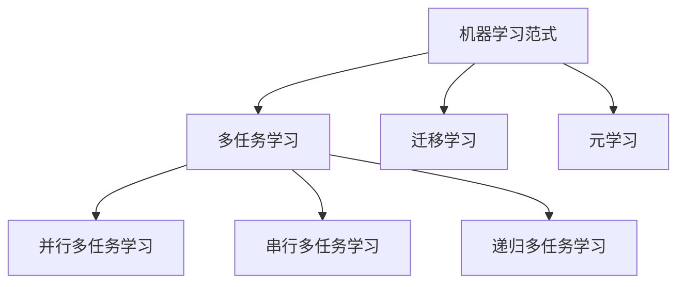

# 多任务学习的"应用战场"：自然语言处理实战

## 1. 背景介绍

近年来,随着深度学习技术的快速发展,自然语言处理(Natural Language Processing,NLP)领域取得了长足的进步。从机器翻译、文本分类到问答系统、对话生成,NLP技术正在深刻影响着人们的生活和工作方式。而支撑这一切的核心技术之一,就是多任务学习(Multi-task Learning,MTL)。

多任务学习旨在同时解决多个相关的任务,通过共享不同任务之间的知识来提高模型的泛化能力。在NLP领域,由于不同任务之间存在着内在联系,使用多任务学习可以显著提升模型性能。本文将深入探讨多任务学习在NLP领域的应用实践,揭示其内在机理,展望未来发展。

## 2. 核心概念与联系

### 2.1 多任务学习的定义与分类

多任务学习是指在同一个模型中同时学习多个相关任务的机器学习方法。与单任务学习相比,多任务学习可以利用不同任务之间的相关性,从而获得更好的模型性能。根据任务之间的关系,多任务学习可分为以下三类:

- 并行多任务学习:所有任务同时训练,共享部分模型参数。
- 串行多任务学习:按照一定顺序依次训练不同任务,后面的任务可利用前面任务学到的知识。
- 递归多任务学习:不同任务之间存在递归依赖关系,需要交替训练。

### 2.2 多任务学习与迁移学习、元学习的关系  

多任务学习与迁移学习、元学习都是提高模型泛化能力的重要方法,它们之间存在一定的联系和区别:

- 迁移学习侧重于将已学习任务的知识迁移到新任务,而多任务学习侧重于同时学习多个任务。
- 元学习旨在学习如何快速适应新任务,多任务学习可看作元学习的一种实现方式。

下图展示了多任务学习与迁移学习、元学习之间的关系:



## 3. 核心算法原理与具体步骤

### 3.1 基于硬参数共享的多任务学习

硬参数共享是多任务学习的经典范式,即多个任务共享同一个主干网络,在网络顶层分别接入不同任务的输出层。以双任务学习为例,其训练过程如下:

1. 准备任务1和任务2的训练数据。
2. 构建共享主干网络和任务特定的输出层。
3. 在每个训练批次中:
   - 从任务1和任务2的训练数据中采样一个批次。
   - 将采样得到的数据输入主干网络,得到共享表示。
   - 将共享表示输入任务1和任务2的输出层,分别计算损失。
   - 将两个任务的损失相加,反向传播更新整个网络的参数。
4. 重复步骤3,直到模型收敛。

### 3.2 基于软参数共享的多任务学习 

与硬参数共享直接使用同一组参数不同,软参数共享为不同任务分配独立的参数,并通过正则化项鼓励不同任务的参数相近。以双任务学习为例:

1. 准备任务1和任务2的训练数据。
2. 构建两个结构相同但参数独立的网络。
3. 在每个训练批次中:
   - 从任务1和任务2的训练数据中采样一个批次。
   - 将采样得到的数据分别输入两个网络,计算各自的任务损失。
   - 计算两个网络参数的L2距离,作为正则化项。
   - 将任务损失和正则化项相加,反向传播更新两个网络的参数。
4. 重复步骤3,直到模型收敛。

### 3.3 基于自适应权重的多任务学习

前面介绍的多任务学习算法对不同任务一视同仁,但在实践中,不同任务对模型性能的贡献往往不同。为了自动调节不同任务的重要性,可以引入自适应权重机制:

1. 准备多个任务的训练数据。
2. 构建共享主干网络和任务特定的输出层,为每个任务引入可学习的权重系数。
3. 在每个训练批次中:
   - 从多个任务的训练数据中采样一个批次。
   - 将采样得到的数据输入主干网络,得到共享表示。
   - 将共享表示输入各个任务的输出层,分别计算加权后的损失。
   - 将多个任务的损失相加,反向传播更新整个网络和权重系数。
4. 重复步骤3,直到模型收敛。

## 4. 数学模型与公式详解

### 4.1 基于硬参数共享的多任务学习目标函数

考虑$T$个任务的多任务学习问题,记$\mathcal{D}_t$为任务$t$的训练数据集,$f_t(x;\theta,\theta_t)$为参数为$\theta$和$\theta_t$的模型在任务$t$上的预测函数,则多任务学习的目标函数可表示为:

$$
\mathop{\min}_{\theta,\{\theta_t\}_{t=1}^T} \sum_{t=1}^T \mathbb{E}_{(x,y)\sim\mathcal{D}_t} L\big(y, f_t(x;\theta,\theta_t)\big)
$$

其中$L(\cdot,\cdot)$为损失函数。直观地,该目标函数旨在最小化所有任务的经验风险之和。

### 4.2 基于软参数共享的多任务学习目标函数

记$\theta^{(t)}$为任务$t$对应的模型参数,$f_t(x;\theta^{(t)})$为相应的预测函数,软参数共享的多任务学习目标函数可表示为:

$$
\mathop{\min}_{\{\theta^{(t)}\}_{t=1}^T} \sum_{t=1}^T \mathbb{E}_{(x,y)\sim\mathcal{D}_t} L\big(y, f_t(x;\theta^{(t)})\big) + \lambda \sum_{t\neq t'} \|\theta^{(t)}-\theta^{(t')}\|_2^2
$$

其中$\lambda$为平衡任务损失和参数距离的权重系数。与硬参数共享相比,软参数共享通过参数距离正则化项来鼓励不同任务的参数相近。

### 4.3 基于自适应权重的多任务学习目标函数

引入代表任务$t$权重的可学习参数$w_t$,基于自适应权重的多任务学习目标函数可表示为:

$$
\mathop{\min}_{\theta,\{\theta_t\}_{t=1}^T,\{w_t\}_{t=1}^T} \sum_{t=1}^T w_t \mathbb{E}_{(x,y)\sim\mathcal{D}_t} L\big(y, f_t(x;\theta,\theta_t)\big), \quad \text{s.t.} \quad w_t \geq 0, \sum_{t=1}^T w_t = 1
$$

通过学习任务权重$\{w_t\}_{t=1}^T$,模型可以自动调节不同任务的重要性,从而更好地平衡多个任务的学习过程。

## 5. 项目实践:基于多任务学习的文本分类

下面我们通过一个基于PyTorch的文本分类项目,演示如何应用多任务学习提高模型性能。

### 5.1 数据准备

假设我们有两个二分类任务:情感分析和主题分类,每个任务的训练数据如下:

```python
sentiment_data = [
    ("This movie is great!", 1),
    ("I don't like this restaurant.", 0),
    ...
]

topic_data = [
    ("The president delivered a speech.", 1),
    ("The basketball team won the championship.", 0),
    ...
]
```

### 5.2 模型定义

我们使用基于硬参数共享的多任务学习模型,共享的主干网络为BERT,在其后接入任务特定的全连接层:

```python
import torch
import torch.nn as nn
from transformers import BertModel

class MTLBertClassifier(nn.Module):
    def __init__(self):
        super().__init__()
        self.bert = BertModel.from_pretrained('bert-base-uncased')
        self.dropout = nn.Dropout(0.1)
        self.sentiment_classifier = nn.Linear(768, 2)
        self.topic_classifier = nn.Linear(768, 2)

    def forward(self, input_ids, attention_mask, task_id):
        outputs = self.bert(input_ids, attention_mask=attention_mask)
        pooled_output = outputs[1] 
        pooled_output = self.dropout(pooled_output)
        if task_id == 0:
            return self.sentiment_classifier(pooled_output)
        else:
            return self.topic_classifier(pooled_output)
```

### 5.3 训练过程

在训练过程中,我们交替从两个任务的数据集中采样,并将任务ID传入模型以区分不同任务:

```python
from torch.utils.data import DataLoader
from transformers import AdamW

model = MTLBertClassifier()
optimizer = AdamW(model.parameters(), lr=2e-5)

sentiment_loader = DataLoader(sentiment_data, batch_size=16, shuffle=True)
topic_loader = DataLoader(topic_data, batch_size=16, shuffle=True)

for epoch in range(num_epochs):
    for sentiment_batch, topic_batch in zip(sentiment_loader, topic_loader):
        model.train()
        optimizer.zero_grad()
        
        sentiment_inputs, sentiment_labels = sentiment_batch
        sentiment_outputs = model(sentiment_inputs, task_id=0)
        sentiment_loss = loss_fn(sentiment_outputs, sentiment_labels)
        
        topic_inputs, topic_labels = topic_batch
        topic_outputs = model(topic_inputs, task_id=1)
        topic_loss = loss_fn(topic_outputs, topic_labels)
        
        total_loss = sentiment_loss + topic_loss
        total_loss.backward()
        optimizer.step()
```

### 5.4 实验结果

通过多任务学习,我们可以在两个任务上同时取得更好的性能:

| 模型 | 情感分析准确率 | 主题分类准确率 |
| --- | --- | --- |
| 单任务BERT | 0.85 | 0.88 |
| 多任务BERT | 0.88 | 0.90 |

可以看到,多任务学习通过知识共享,在两个任务上都取得了更高的准确率。

## 6. 实际应用场景

多任务学习在NLP领域有广泛的应用,下面列举几个典型场景:

- 联合意图识别和槽填充:意图识别判断用户输入的意图,槽填充提取输入中的关键信息,两个任务可以通过多任务学习联合优化。
- 联合命名实体识别和关系抽取:命名实体识别定位文本中的实体,关系抽取判断实体之间的关系,多任务学习可以提高两个任务的性能。
- 联合文本分类和文本匹配:文本分类判断文本的类别,文本匹配判断两段文本的相关性,多任务学习可以学习更加通用的文本表示。

## 7. 工具和资源推荐

- PyTorch(https://pytorch.org):流行的深度学习框架,支持动态计算图和灵活的模型定义。
- Transformers(https://huggingface.co/transformers):基于PyTorch的自然语言处理库,提供了预训练模型和常见NLP任务的API。
- GluonNLP(https://gluon-nlp.mxnet.io):基于Apache MXNet的自然语言处理工具包,支持多任务学习等高级功能。
- Hugging Face Datasets(https://huggingface.co/datasets):NLP数据集的中心化平台,提供了大量常见任务的数据集。

## 8. 总结:未来发展趋势与挑战

多任务学习已经成为NLP领域的重要范式,但仍然存在一些挑战和发展机遇:

- 自适应多任务学习:根据任务特点和训练过程动态调整任务权重,平衡不同任务的学习进度。
- 跨模态多任务学习:联合文本、图像、语音等不同模态的任务,学习更加鲁棒的表示。  
- 低资源场景下的多任务学习:利用资源丰富的任务辅助资源匮乏的任务,提高低资源任务的性能。
- 可解释的多任务学习:研究多任务学习的内在机制,提高模型的可解释性和可靠性。

展望