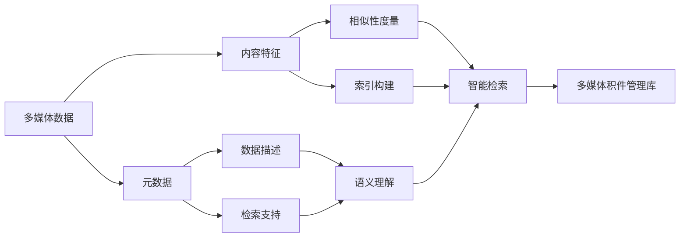

# 多媒体积件管理库的开发与应用

## 1. 背景介绍

在当今信息化时代,海量的多媒体数据如何高效管理和利用是一个巨大的挑战。传统的文件系统已经无法满足日益增长的多媒体数据管理需求。因此,开发一个高性能、易扩展的多媒体积件管理库就显得尤为重要和迫切。本文将深入探讨多媒体积件管理库的开发与应用。

### 1.1 多媒体数据爆炸式增长带来的挑战
### 1.2 传统文件系统的局限性
### 1.3 多媒体积件管理库的必要性

## 2. 核心概念与联系

要开发一个优秀的多媒体积件管理库,首先需要理解一些核心概念,如多媒体数据、元数据、内容检索等。同时,还要掌握这些概念之间的内在联系。

### 2.1 多媒体数据的特点
#### 2.1.1 数据量大
#### 2.1.2 数据类型多样
#### 2.1.3 数据格式复杂

### 2.2 元数据的作用
#### 2.2.1 描述多媒体内容
#### 2.2.2 支持检索和管理
#### 2.2.3 实现互操作

### 2.3 内容检索的重要性  
#### 2.3.1 快速定位所需数据
#### 2.3.2 实现智能化管理
#### 2.3.3 提供个性化服务

## 3. 核心算法原理具体操作步骤

多媒体积件管理库的核心是高效的索引和检索算法。本节将重点介绍几种常用算法的原理和实现步骤。

### 3.1 倒排索引
#### 3.1.1 文档解析
#### 3.1.2 词项抽取
#### 3.1.3 倒排文件构建
#### 3.1.4 倒排文件压缩

### 3.2 KD树
#### 3.2.1 空间划分
#### 3.2.2 KD树的构建
#### 3.2.3 最近邻搜索
#### 3.2.4 范围搜索

### 3.3 局部敏感哈希(LSH)
#### 3.3.1 哈希函数族构造
#### 3.3.2 签名矩阵生成 
#### 3.3.3 桶划分
#### 3.3.4 相似度查询

## 4. 数学模型和公式详细讲解举例说明

为了更好地理解算法原理,需要用数学语言对其进行抽象和建模。下面以倒排索引为例,详细讲解其数学模型。

令 $D=\{d_1,d_2,...,d_N\}$ 表示文档集合, $T=\{t_1,t_2,...,t_M\}$ 表示词项集合。倒排索引可定义为一个二元组 $(T,L)$:

$$
\begin{aligned}
L &= \{L(t_i)|t_i \in T\} \\  
L(t_i) &= \{(d,f_{t_i,d})| t_i \in d, d \in D\}
\end{aligned}
$$

其中 $L(t_i)$ 称为词项 $t_i$ 的倒排列表, $f_{t_i,d}$ 表示词项 $t_i$ 在文档 $d$ 中的词频。

假设词项集合 $T=\{A,B,C,D\}$,文档集合 $D=\{d_1,d_2,d_3\}$,各文档内容如下:

$d_1: A,B,C$  
$d_2: B,C,D$   
$d_3: A,C$

则倒排索引结构为:

$$
\begin{aligned}
L(A) &= \{(d_1,1),(d_3,1)\} \\
L(B) &= \{(d_1,1),(d_2,1)\} \\  
L(C) &= \{(d_1,1),(d_2,1),(d_3,1)\} \\
L(D) &= \{(d_2,1)\}
\end{aligned}
$$

## 5. 项目实践：代码实例和详细解释说明

本节将以C++为例,展示多媒体积件管理库的部分核心代码,并进行详细解释说明。

### 5.1 倒排索引构建

```cpp
struct InvertedIndex {
    unordered_map<string, vector<pair<int,int>>> index;
    
    void build(vector<string>& docs) {
        for(int i=0; i<docs.size(); i++) {
            istringstream iss(docs[i]);
            string term;
            while(iss >> term) {
                index[term].emplace_back(i,1); 
            }
        }
        
        for(auto& entry : index) {
            sort(entry.second.begin(), entry.second.end());
        }
    }
};
```

以上代码定义了倒排索引的数据结构,通过`unordered_map`实现倒排列表,`vector<pair<int,int>>`存储文档ID和词频信息。`build`函数完成索引构建,主要步骤为:

1. 遍历每个文档,提取其中的词项
2. 将文档ID和词频信息插入到对应词项的倒排列表中
3. 对每个倒排列表按文档ID进行排序,方便后续检索

### 5.2 倒排索引压缩

为了节省存储空间,可以对倒排索引进行压缩:

```cpp
void compress(vector<pair<int,int>>& posting_list) {    
    int n = posting_list.size();
    vector<int> doc_ids(n), freqs(n);
    
    for(int i=0; i<n; i++) {
        doc_ids[i] = posting_list[i].first;
        freqs[i] = posting_list[i].second;
    }
    
    posting_list.clear();
    
    int prev_id = 0;
    for(int i=0; i<n; i++) {
        posting_list.emplace_back(doc_ids[i]-prev_id, freqs[i]);
        prev_id = doc_ids[i];
    }
}
```

压缩的思路是对文档ID进行差分编码,即存储相邻ID之间的差值,可以减小数值范围,从而提高压缩率。以上代码的主要步骤为:

1. 将文档ID和词频分别存储到两个数组中
2. 清空原倒排列表
3. 遍历文档ID数组,计算相邻ID的差值
4. 将差值和对应的词频重新存入倒排列表

## 6. 实际应用场景

多媒体积件管理库可以应用于多个领域,极大地提升多媒体数据的管理和利用效率。

### 6.1 音视频网站
- 支持按标题、标签、描述等多种方式检索音视频
- 快速定位并调取所需片段,提升用户体验

### 6.2 医疗影像系统
- 对海量医学图像进行分类组织和管理
- 实现相似病例检索,辅助诊断

### 6.3 安防监控平台
- 高效存储和检索监控视频
- 支持人脸、车辆等特定目标的快速搜索定位

## 7. 工具和资源推荐

为方便读者学习和实践,推荐以下相关工具和资源:

- Lucene: 成熟的全文检索引擎库,支持Java和.NET语言
- OpenCV: 功能强大的计算机视觉库,支持多媒体数据处理
- FFmpeg: 优秀的音视频处理工具集,支持主流多媒体格式
- Multimedia Data Mining: 经典的多媒体数据挖掘教材,系统介绍相关概念和技术

## 8. 总结：未来发展趋势与挑战

多媒体积件管理库的研究与应用前景广阔,但仍面临诸多挑战,需要学术界和工业界的共同努力。

### 8.1 融合多模态信息
- 综合利用文本、视觉、音频等多种模态信息
- 提升多媒体数据的语义理解和检索性能

### 8.2 分布式与并行计算
- 针对海量多媒体数据,引入分布式存储和计算
- 研究并行索引构建和检索算法,提升系统扩展性

### 8.3 深度学习的应用
- 利用深度学习技术,提取多媒体数据的高层语义特征
- 改进多媒体相似性度量,实现更加智能的检索

## 9. 附录：常见问题与解答

### Q1: 多媒体积件管理库与传统文件系统有何区别?

A1: 传统文件系统以目录树的形式组织文件,缺乏对多媒体内容的理解和索引能力。而多媒体积件管理库通过提取多媒体特征,构建高效索引,实现了基于内容的智能化管理和检索。

### Q2: 多媒体积件管理库如何平衡存储和计算效率?

A2: 主要有两方面考虑:1)采用合适的数据压缩和索引技术,在节省存储空间的同时,尽量减少检索时的解压缩和计算开销;2)权衡索引粒度和数据规模,避免过细的索引造成存储冗余和维护困难。

### Q3: 对多媒体积件管理库的扩展性有何要求?

A3: 多媒体积件管理库要能够灵活应对数据规模和业务需求的增长。需要考虑:1)模块化设计,实现功能解耦和可插拔;2)采用分布式架构,支持动态扩容;3)提供丰富的API接口,方便与外部系统集成。

## 核心概念与联系 Mermaid 流程图



作者：禅与计算机程序设计艺术 / Zen and the Art of Computer Programming