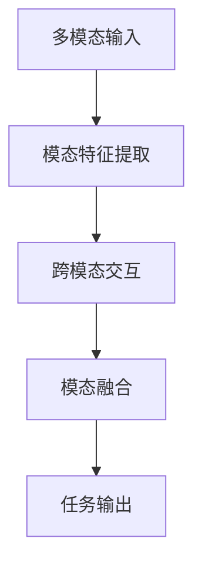

# 多模态大模型：技术原理与实战 多模态大模型的性能评估

## 1. 背景介绍
### 1.1 多模态大模型的兴起
近年来,随着人工智能技术的飞速发展,多模态大模型成为了学术界和工业界的研究热点。多模态大模型能够同时处理文本、图像、音频等不同模态的数据,实现跨模态的信息理解和生成,在智能问答、视觉问答、图像描述等任务上取得了显著的性能提升。

### 1.2 多模态大模型的应用前景
多模态大模型具有广阔的应用前景,可以应用于智能客服、医疗诊断、教育培训等多个领域。例如,在智能客服场景下,多模态大模型可以理解用户的文本和语音输入,并根据用户的意图生成准确的文本或语音回复。在医疗诊断中,多模态大模型可以分析患者的病历、影像等多模态数据,辅助医生进行疾病诊断和治疗方案制定。

### 1.3 多模态大模型面临的挑战
尽管多模态大模型取得了显著的进展,但仍然面临着诸多挑战。首先,如何有效融合不同模态的信息并进行联合建模是一个关键问题。其次,多模态大模型通常需要海量的训练数据和计算资源,如何高效地训练和部署模型也是一大挑战。此外,如何评估多模态大模型的性能,构建合理的评测体系也是亟待解决的问题。

## 2. 核心概念与联系
### 2.1 多模态学习
多模态学习(Multimodal Learning)是指利用多种不同模态的数据(如文本、图像、音频等)进行机器学习的方法。与单模态学习相比,多模态学习可以更全面地理解和表示真实世界的信息。多模态学习的核心是如何将不同模态的数据映射到一个共同的语义空间,并捕捉不同模态之间的关联和互补信息。

### 2.2 大模型
大模型(Large-scale Model)是指参数量巨大(通常在亿级别以上)的深度学习模型。得益于海量训练数据和强大的计算能力,大模型在 NLP、CV 等领域取得了显著的性能提升。大模型通常采用 Transformer 等注意力机制的网络结构,具有强大的特征提取和信息融合能力。代表性的大模型包括 BERT、GPT、CLIP 等。

### 2.3 多模态大模型 
多模态大模型是多模态学习和大模型的结合,旨在构建能够处理多模态数据的大规模深度学习模型。多模态大模型不仅能够提取和融合不同模态的特征,还具有海量参数带来的强大表示能力。目前主流的多模态大模型包括 ViLBERT、LXMERT、UNITER 等。

### 2.4 多模态大模型的架构



如上图所示,多模态大模型的基本架构包括:

1. 模态特征提取:使用针对不同模态设计的特征提取器(如 CNN、Transformer 等)提取图像、文本等模态的特征表示。

2. 跨模态交互:通过注意力机制等方式,实现不同模态特征之间的交互和信息传递。

3. 模态融合:将不同模态的特征映射到一个共同的语义空间,并进行特征融合,得到多模态的联合表示。 

4. 任务输出:根据任务的需求(如分类、生成等),设计相应的输出层,并利用多模态联合表示进行预测或生成。

## 3. 核心算法原理具体操作步骤
下面以 ViLBERT 模型为例,详细介绍多模态大模型的核心算法原理和操作步骤。

### 3.1 模态特征提取
- 对于图像模态,ViLBERT 使用预训练的 CNN 模型(如 ResNet)提取图像特征。将图像划分为固定数量的区域,并将每个区域的特征展平并映射到 Transformer 的输入维度。
- 对于文本模态,ViLBERT 使用 BPE(byte-pair encoding)算法进行分词,并将每个单词映射为词嵌入向量。

### 3.2 跨模态交互
- ViLBERT 使用多层 Transformer 编码器分别对图像特征和文本特征进行编码。
- 在每一层 Transformer 中,通过 Co-Attention 机制实现图像和文本特征之间的跨模态交互。Co-Attention 包括两个部分:
  - 计算图像到文本的注意力:将图像特征作为 query,文本特征作为 key 和 value,计算图像到文本的注意力分布,并根据注意力权重对文本特征进行加权求和,得到融合了图像信息的文本表示。
  - 计算文本到图像的注意力:类似地,将文本特征作为 query,图像特征作为 key 和 value,计算文本到图像的注意力分布,并对图像特征进行加权求和,得到融合了文本信息的图像表示。

### 3.3 模态融合
- 经过多层 Transformer 的跨模态交互后,得到了融合了彼此信息的图像表示和文本表示。
- 将图像表示和文本表示拼接起来,并通过线性变换层映射到共同的语义空间,得到多模态联合表示。

### 3.4 任务输出
- 根据下游任务的需求,在多模态联合表示上添加特定的输出层。
- 对于分类任务,可以使用简单的全连接层+Softmax 进行多分类。
- 对于生成任务,可以使用 Transformer 解码器进行自回归生成。

## 4. 数学模型和公式详细讲解举例说明
下面以 ViLBERT 中的 Co-Attention 机制为例,详细讲解其数学模型和公式。

### 4.1 符号定义
- 令 $I \in \mathbb{R}^{N_i \times D_i}$ 表示图像特征,其中 $N_i$ 为图像区域数,$D_i$ 为图像特征维度。
- 令 $T \in \mathbb{R}^{N_t \times D_t}$ 表示文本特征,其中 $N_t$ 为文本单词数,$D_t$ 为文本特征维度。
- 令 $W_q,W_k,W_v$ 分别表示计算 query、key、value 的线性变换矩阵。

### 4.2 图像到文本的注意力
1. 计算图像特征 $I$ 到文本特征 $T$ 的注意力分布:

$$
\alpha_{i \rightarrow t} = \mathrm{softmax}(\frac{(IW_q)(TW_k)^T}{\sqrt{D}})
$$

其中 $\alpha_{i \rightarrow t} \in \mathbb{R}^{N_i \times N_t}$ 表示图像到文本的注意力分布,$D$ 为 query 和 key 的维度,用于缩放点积结果。

2. 根据注意力分布对文本特征进行加权求和,得到融合了图像信息的文本表示:

$$
\tilde{T} = \alpha_{i \rightarrow t}(TW_v)
$$

其中 $\tilde{T} \in \mathbb{R}^{N_i \times D_v}$ 表示融合了图像信息的文本表示。

### 4.3 文本到图像的注意力
1. 计算文本特征 $T$ 到图像特征 $I$ 的注意力分布:

$$
\alpha_{t \rightarrow i} = \mathrm{softmax}(\frac{(TW_q)(IW_k)^T}{\sqrt{D}})
$$

其中 $\alpha_{t \rightarrow i} \in \mathbb{R}^{N_t \times N_i}$ 表示文本到图像的注意力分布。

2. 根据注意力分布对图像特征进行加权求和,得到融合了文本信息的图像表示:

$$
\tilde{I} = \alpha_{t \rightarrow i}(IW_v)
$$

其中 $\tilde{I} \in \mathbb{R}^{N_t \times D_v}$ 表示融合了文本信息的图像表示。

通过以上步骤,ViLBERT 实现了图像和文本特征之间的跨模态交互和信息融合。这种 Co-Attention 机制能够有效地捕捉图像和文本之间的对齐关系,提升多模态理解的性能。

## 5. 项目实践：代码实例和详细解释说明
下面以 PyTorch 为例,给出 ViLBERT 中 Co-Attention 机制的简化实现代码。

```python
import torch
import torch.nn as nn

class CoAttention(nn.Module):
    def __init__(self, dim_q, dim_k, dim_v):
        super().__init__()
        self.q_linear = nn.Linear(dim_q, dim_k)
        self.k_linear = nn.Linear(dim_k, dim_k)
        self.v_linear = nn.Linear(dim_k, dim_v)
        self.sqrt_dim = dim_k ** 0.5
        
    def forward(self, img_feat, txt_feat):
        # 图像到文本的注意力
        q_img = self.q_linear(img_feat)  # [N_i, D_k]
        k_txt = self.k_linear(txt_feat)  # [N_t, D_k] 
        attn_i2t = torch.softmax(torch.matmul(q_img, k_txt.transpose(-1, -2)) / self.sqrt_dim, dim=-1)  # [N_i, N_t]
        v_txt = self.v_linear(txt_feat)  # [N_t, D_v]
        txt_fused = torch.matmul(attn_i2t, v_txt)  # [N_i, D_v]
        
        # 文本到图像的注意力
        q_txt = self.q_linear(txt_feat)  # [N_t, D_k]
        k_img = self.k_linear(img_feat)  # [N_i, D_k]
        attn_t2i = torch.softmax(torch.matmul(q_txt, k_img.transpose(-1, -2)) / self.sqrt_dim, dim=-1)  # [N_t, N_i] 
        v_img = self.v_linear(img_feat)  # [N_i, D_v]
        img_fused = torch.matmul(attn_t2i, v_img)  # [N_t, D_v]
        
        return txt_fused, img_fused
```

代码解释:
- `__init__` 方法定义了计算 query、key、value 的线性变换层,以及缩放因子 `sqrt_dim`。
- `forward` 方法接收图像特征 `img_feat` 和文本特征 `txt_feat`,分别计算图像到文本和文本到图像的注意力。
- 对于图像到文本的注意力:
  - 将图像特征 `img_feat` 通过 `q_linear` 层映射为 query。
  - 将文本特征 `txt_feat` 通过 `k_linear` 层映射为 key。
  - 计算 query 和 key 的点积并除以 `sqrt_dim`,然后通过 Softmax 归一化得到注意力分布 `attn_i2t`。
  - 将文本特征 `txt_feat` 通过 `v_linear` 层映射为 value,并与注意力分布 `attn_i2t` 相乘得到融合了图像信息的文本表示 `txt_fused`。
- 对于文本到图像的注意力,步骤类似,最终得到融合了文本信息的图像表示 `img_fused`。

以上代码实现了 ViLBERT 中的核心 Co-Attention 机制,可以插入到完整的 ViLBERT 模型中,实现图像和文本特征的跨模态交互和融合。

## 6. 实际应用场景
多模态大模型可以应用于多种实际场景,下面列举几个典型的应用:

### 6.1 智能问答
多模态大模型可以用于构建智能问答系统。给定用户的问题(文本)和相关的图像,模型能够理解问题和图像的内容,并生成准确的答案。例如,用户上传一张汽车的故障图片,并询问故障原因,模型可以分析图片中的故障部位,结合汽车领域知识,给出可能的故障原因和修复建议。

### 6.2 视觉问答
视觉问答(Visual Question Answering, VQA)是指根据给定的图像和问题,生成相应的答案。多模态大模型可以用于构建高性能的 VQA 系统。例如,给定一张图像和问