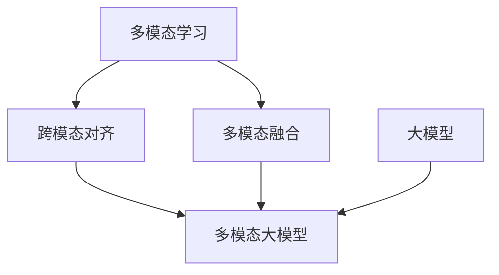

# 多模态大模型：技术原理与实战 大模型+多模态的3种实现方法

## 1. 背景介绍
### 1.1 多模态大模型的兴起
近年来,随着人工智能技术的快速发展,特别是深度学习和大数据技术的突破,多模态大模型(Multimodal Large Models)成为了学术界和工业界的研究热点。多模态大模型能够同时处理文本、图像、语音等多种模态的数据,实现跨模态的信息理解和生成,在智能问答、视觉对话、多模态检索等应用中展现出了巨大的潜力。

### 1.2 多模态大模型的优势
与传统的单模态模型相比,多模态大模型具有以下优势:

1. 信息融合:多模态大模型可以利用不同模态数据之间的互补性,实现跨模态的信息融合,从而获得更全面、准确的语义理解。

2. 鲁棒性:通过学习多种模态的表示,多模态大模型对噪声和缺失数据更加鲁棒,能够在复杂环境下保持稳定的性能。

3. 泛化能力:多模态大模型可以学习到更加通用的特征表示,具有更强的泛化能力,能够适应不同领域和任务的需求。

### 1.3 多模态大模型的挑战
尽管多模态大模型展现出了巨大的潜力,但其研究和应用仍然面临着诸多挑战:

1. 数据问题:构建高质量的多模态数据集需要大量的人力和资源投入,数据的标注和对齐也是一个复杂的过程。

2. 模型设计:如何设计高效、可扩展的多模态大模型架构,实现不同模态信息的有效融合,是一个关键的研究问题。

3. 训练优化:多模态大模型通常包含大量的参数,训练过程复杂耗时,需要探索高效的训练方法和优化策略。

4. 应用落地:将多模态大模型应用于实际场景中,需要考虑模型的推理效率、可解释性、隐私安全等因素。

## 2. 核心概念与联系
### 2.1 多模态学习
多模态学习(Multimodal Learning)是指利用来自多个模态的信息,如文本、图像、音频等,来完成特定的学习任务。多模态学习的目标是通过不同模态数据的融合,获得更全面、准确的语义理解。

### 2.2 大模型
大模型(Large Models)是指参数量达到亿级甚至千亿级的超大规模深度学习模型。这些模型通过在海量数据上进行预训练,能够学习到丰富的语义表示,在各种下游任务上展现出了优异的性能。代表性的大模型包括GPT-3、BERT、CLIP等。

### 2.3 多模态大模型
多模态大模型是多模态学习和大模型的结合,旨在构建能够处理多种模态数据的超大规模模型。通过在大规模多模态数据上进行预训练,多模态大模型可以学习到跨模态的语义表示,实现文本、图像、音频等不同模态信息的融合与理解。

### 2.4 跨模态对齐
跨模态对齐(Cross-modal Alignment)是多模态学习中的一个关键问题,指的是如何将不同模态的数据映射到一个共同的语义空间,使它们能够相互对应和融合。常见的跨模态对齐方法包括对抗学习、度量学习、注意力机制等。

### 2.5 多模态融合
多模态融合(Multimodal Fusion)是指将不同模态的信息进行整合,生成一个统一的多模态表示。常见的多模态融合方法包括早期融合、晚期融合和混合融合。早期融合在特征层面上对不同模态进行拼接,晚期融合在决策层面上对不同模态的预测结果进行组合,混合融合则在中间层面上进行信息交互和融合。

### 2.6 概念之间的联系
下图展示了多模态学习、大模型、跨模态对齐和多模态融合之间的关系:



多模态学习是多模态大模型的基础,其中跨模态对齐和多模态融合是实现多模态大模型的关键技术。大模型的思想和方法也为构建多模态大模型提供了重要的参考。

## 3. 核心算法原理具体操作步骤
多模态大模型的核心算法主要包括多模态预训练和跨模态对齐两个方面。下面我们将详细介绍这两个算法的原理和具体操作步骤。

### 3.1 多模态预训练
多模态预训练的目标是在大规模多模态数据上学习通用的跨模态表示。具体步骤如下:

1. 数据准备:收集和标注大规模的多模态数据,如图文对、视频-文本对等。

2. 模型构建:设计多模态大模型的架构,通常采用Transformer等注意力机制的模型。

3. 预训练任务设计:定义适合多模态学习的预训练任务,如掩码语言建模、图像-文本匹配等。

4. 损失函数设计:根据预训练任务定义相应的损失函数,如交叉熵损失、对比损失等。

5. 模型训练:在多模态数据上对模型进行预训练,优化模型参数,学习跨模态表示。

6. 模型评估:在下游任务上评估预训练模型的性能,验证其泛化能力。

### 3.2 跨模态对齐
跨模态对齐旨在将不同模态的数据映射到一个共同的语义空间,实现模态间的信息交互和融合。常见的跨模态对齐方法包括:

1. 对抗学习:通过生成器和判别器的博弈,将不同模态的数据映射到相同的分布,实现跨模态对齐。

2. 度量学习:通过定义跨模态的相似度度量,如余弦相似度、欧氏距离等,学习模态间的语义对应关系。

3. 注意力机制:通过注意力机制建立不同模态之间的关联,实现跨模态信息的交互和融合。

4. 知识蒸馏:通过教师-学生模型的知识蒸馏,将一个模态的知识迁移到另一个模态,实现跨模态对齐。

具体操作步骤如下:

1. 模态特征提取:使用预训练的单模态模型,如CNN、BERT等,提取每个模态的特征表示。

2. 跨模态对齐模块设计:根据选择的跨模态对齐方法,设计相应的对齐模块,如对抗网络、度量学习网络等。

3. 损失函数设计:定义跨模态对齐的损失函数,如对抗损失、对比损失、蒸馏损失等。

4. 模型训练:在多模态数据上对跨模态对齐模块进行训练,优化模型参数,实现模态间的语义对齐。

5. 模型评估:在下游任务上评估跨模态对齐模型的性能,验证其对齐效果和泛化能力。

## 4. 数学模型和公式详细讲解举例说明
在多模态大模型中,常用的数学模型包括Transformer、对比学习和对抗学习等。下面我们以Transformer和对比学习为例,详细讲解其数学模型和公式。

### 4.1 Transformer
Transformer是一种基于自注意力机制的序列建模模型,广泛应用于自然语言处理和计算机视觉领域。其核心思想是通过注意力机制建立序列内和序列间的依赖关系。

Transformer的数学模型可以表示为:

$$
\begin{aligned}
\mathbf{Q} &= \mathbf{X} \mathbf{W}^Q \\
\mathbf{K} &= \mathbf{X} \mathbf{W}^K \\
\mathbf{V} &= \mathbf{X} \mathbf{W}^V \\
\mathbf{Attention}(\mathbf{Q}, \mathbf{K}, \mathbf{V}) &= \text{softmax}(\frac{\mathbf{Q}\mathbf{K}^T}{\sqrt{d_k}})\mathbf{V} \\
\mathbf{MultiHead}(\mathbf{Q}, \mathbf{K}, \mathbf{V}) &= \text{Concat}(\text{head}_1, ..., \text{head}_h)\mathbf{W}^O \\
\text{where}~\text{head}_i &= \mathbf{Attention}(\mathbf{Q}\mathbf{W}_i^Q, \mathbf{K}\mathbf{W}_i^K, \mathbf{V}\mathbf{W}_i^V)
\end{aligned}
$$

其中,$\mathbf{X}$为输入序列,$\mathbf{W}^Q$、$\mathbf{W}^K$、$\mathbf{W}^V$为线性变换矩阵,$d_k$为注意力头的维度,$h$为注意力头的数量。

Transformer通过多头注意力机制捕捉序列内和序列间的不同尺度的依赖关系,并通过残差连接和层归一化等技术提高模型的训练稳定性。

### 4.2 对比学习
对比学习是一种无监督学习方法,通过最大化正样本对的相似度,最小化负样本对的相似度,学习到有意义的特征表示。在多模态学习中,对比学习可以用于跨模态对齐,学习模态间的语义对应关系。

对比学习的数学模型可以表示为:

$$
\mathcal{L} = -\log \frac{\exp(\text{sim}(\mathbf{v}_i, \mathbf{v}_j)/\tau)}{\sum_{k=1}^N \exp(\text{sim}(\mathbf{v}_i, \mathbf{v}_k)/\tau)}
$$

其中,$\mathbf{v}_i$和$\mathbf{v}_j$为正样本对的特征表示,$\mathbf{v}_k$为负样本的特征表示,$\tau$为温度超参数,$\text{sim}(\cdot)$为相似度度量函数,通常选择余弦相似度:

$$
\text{sim}(\mathbf{v}_i, \mathbf{v}_j) = \frac{\mathbf{v}_i^T \mathbf{v}_j}{\|\mathbf{v}_i\| \|\mathbf{v}_j\|}
$$

对比学习通过最小化正负样本对的交叉熵损失,使得正样本对的特征表示尽可能相似,负样本对的特征表示尽可能不同,从而学习到有判别性的特征表示。

在多模态学习中,可以将不同模态的数据作为正样本对,随机采样其他数据作为负样本,通过对比学习实现跨模态对齐。例如,对于图像-文本对$(I, T)$,其损失函数可以定义为:

$$
\mathcal{L} = -\log \frac{\exp(\text{sim}(f(I), g(T))/\tau)}{\sum_{T'} \exp(\text{sim}(f(I), g(T'))/\tau)}
$$

其中,$f(\cdot)$和$g(\cdot)$分别为图像和文本的特征提取器。通过最小化该损失函数,可以学习到图像和文本之间的语义对应关系,实现跨模态对齐。

## 5. 项目实践：代码实例和详细解释说明
下面我们以PyTorch为例,给出多模态大模型的代码实现。我们将实现一个简单的图文匹配模型,通过对比学习实现图像和文本的跨模态对齐。

### 5.1 数据准备
首先,我们需要准备图文对数据集,每个样本包含一个图像和一段对应的文本描述。我们可以使用现有的数据集如COCO、Flickr30k等,或者自己收集和标注数据。

```python
from torch.utils.data import Dataset

class ImageTextDataset(Dataset):
    def __init__(self, image_paths, texts):
        self.image_paths = image_paths
        self.texts = texts
        
    def __len__(self):
        return len(self.image_paths)
    
    def __getitem__(self, idx):
        image_path = self.image_paths[idx]
        text = self.texts[idx]
        image = load_image(image_path)
        return image, text
```

### 5.2 模型构建
我们使用预训练的CNN和BERT分别作为图像和文本的特征