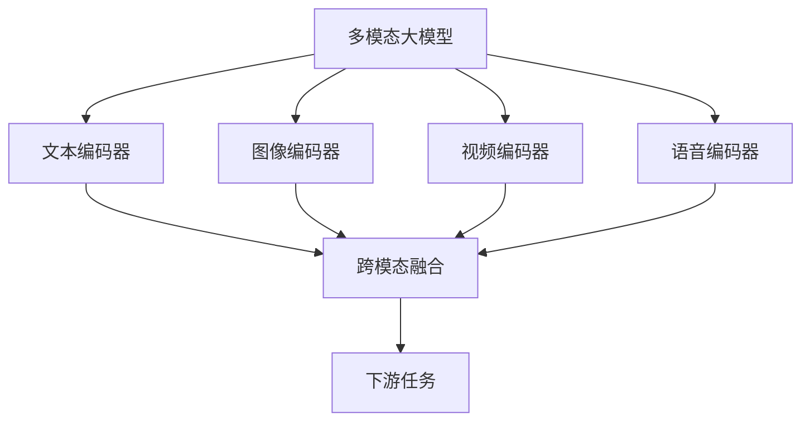

# 多模态大模型：技术原理与实战 工具和算法框架介绍

## 1. 背景介绍

### 1.1 人工智能的新时代

人工智能(AI)技术在过去几年中取得了长足的进步,尤其是自然语言处理(NLP)和计算机视觉(CV)等领域的突破。传统的人工智能系统通常专注于单一模态,即只处理文本、图像或语音等单一类型的数据。然而,现实世界中的信息通常以多种形式呈现,包括文本、图像、视频、语音等多种模态。为了更好地理解和处理这种多模态信息,研究人员提出了多模态人工智能的概念。

### 1.2 多模态人工智能的兴起

多模态人工智能系统旨在同时处理和融合来自不同模态的信息,如文本、图像、语音等。这种跨模态的融合可以提高人工智能系统的理解能力,使其更接近人类的认知方式。多模态人工智能已经在多个领域展现出巨大的潜力,如视觉问答、多模态对话系统、多媒体内容分析等。

### 1.3 大模型时代的到来

近年来,随着计算能力的提高和大规模数据集的出现,大型神经网络模型(通常称为"大模型")在自然语言处理和计算机视觉等领域取得了卓越的成就。这些大模型通过在海量数据上进行预训练,学习到了丰富的知识表示,从而在下游任务上表现出色。然而,大多数现有的大模型仍然局限于单一模态,无法充分利用多模态信息。

## 2. 核心概念与联系

### 2.1 多模态大模型的定义

多模态大模型是一种能够同时处理和融合多种模态数据(如文本、图像、视频、语音等)的大型神经网络模型。它们通过在大规模多模态数据集上进行预训练,学习到了跨模态的知识表示,从而在下游的多模态任务上表现出卓越的性能。

### 2.2 多模态融合

多模态大模型的核心挑战在于如何有效地融合来自不同模态的信息。常见的融合方法包括:

1. **早期融合**:将不同模态的数据在底层特征级别进行拼接或融合,然后输入到单一的神经网络中进行处理。
2. **晚期融合**:分别对每种模态的数据进行编码,然后在高层次将不同模态的特征进行融合。
3. **交互式融合**:不同模态之间的特征在整个网络中进行交互和融合,形成动态的跨模态表示。

### 2.3 预训练与微调

与单模态大模型类似,多模态大模型也需要在大规模多模态数据集上进行预训练,以学习到有效的跨模态表示。预训练通常采用自监督学习的方式,如遮蔽语言建模(Masked Language Modeling)、遮蔽图像建模(Masked Image Modeling)等任务。

预训练后的多模态大模型可以在下游的多模态任务上进行微调(Fine-tuning),以获得针对特定任务的优化表示。这种预训练和微调的范式已经在单模态领域取得了巨大成功,如BERT、GPT-3等,现在也被应用于多模态大模型中。

## 3. 核心算法原理具体操作步骤

### 3.1 多模态编码器

多模态大模型通常由多个模态特定的编码器组成,用于对不同模态的输入数据进行编码。常见的编码器包括:

1. **文本编码器**:通常采用Transformer或BERT等模型,对文本序列进行编码,获得文本的上下文表示。
2. **图像编码器**:常用的是卷积神经网络(CNN)或视觉Transformer(ViT),对图像进行编码,获得图像的特征表示。
3. **视频编码器**:通常由3D卷积神经网络或时空Transformer组成,对视频序列进行编码,获得视频的时空特征表示。
4. **语音编码器**:使用卷积神经网络或Transformer等模型,对语音信号进行编码,获得语音的特征表示。

这些编码器的输出表示将被送入后续的多模态融合模块进行跨模态融合。

### 3.2 多模态融合模块

多模态融合模块的目标是将来自不同模态的特征表示进行有效融合,获得统一的跨模态表示。常见的融合方法包括:

1. **拼接融合(Concatenation Fusion)**:将不同模态的特征向量直接拼接在一起,然后输入到后续的神经网络中进行处理。
2. **门控融合(Gated Fusion)**:使用门控机制动态调节不同模态特征的重要性,并将它们加权融合。
3. **注意力融合(Attention Fusion)**:利用自注意力机制捕捉不同模态之间的相关性,并根据注意力权重进行加权融合。
4. **交互式融合(Interactive Fusion)**:不同模态的特征在整个网络中进行交互和融合,形成动态的跨模态表示。

融合后的跨模态表示将被用于下游的多模态任务,如视觉问答、多模态对话、多媒体内容分析等。

### 3.3 预训练策略

多模态大模型通常需要在大规模多模态数据集上进行预训练,以学习到有效的跨模态表示。常见的预训练策略包括:

1. **遮蔽语言建模(Masked Language Modeling, MLM)**:在文本输入中随机遮蔽部分词元,模型需要根据上下文预测被遮蔽的词元。
2. **遮蔽图像建模(Masked Image Modeling, MIM)**:在图像输入中随机遮蔽部分图像块,模型需要根据上下文预测被遮蔽的图像块。
3. **视频遮蔽建模(Masked Video Modeling)**:在视频输入中随机遮蔽部分视频帧或图像块,模型需要预测被遮蔽的视频帧或图像块。
4. **多模态对比学习(Multimodal Contrastive Learning)**:通过最大化不同模态之间的相似性,最小化同一模态内的相似性,学习跨模态的统一表示。

这些预训练策略可以单独使用,也可以相互组合,以充分利用多模态数据中的信息。

### 3.4 微调和迁移学习

预训练后的多模态大模型可以在下游的多模态任务上进行微调(Fine-tuning),以获得针对特定任务的优化表示。微调过程通常包括:

1. **加载预训练模型权重**:将预训练好的多模态大模型作为初始化权重。
2. **构建任务特定的输入和输出**:根据下游任务的需求,设计输入和输出的表示形式。
3. **添加任务特定的头部(Head)**:在多模态大模型的输出上添加任务特定的头部,如分类头、回归头等。
4. **微调模型参数**:在下游任务的数据集上对模型进行微调,更新模型参数以适应特定任务。

除了微调,多模态大模型还可以通过迁移学习的方式应用于新的领域或任务。这种方式通常包括:

1. **特征提取**:使用预训练模型提取多模态输入的特征表示,然后将这些特征输入到新的任务特定模型中进行训练。
2. **模型微调**:类似于上述微调过程,但可能需要进行更大程度的参数调整,以适应新的领域或任务。

迁移学习可以有效利用预训练模型中学习到的知识,加速新任务的训练过程,提高模型的性能和泛化能力。

## 4. 数学模型和公式详细讲解举例说明

### 4.1 自注意力机制

自注意力机制是多模态大模型中常用的关键组件,它能够捕捉输入序列中元素之间的长程依赖关系。对于长度为 $n$ 的输入序列 $X = (x_1, x_2, \dots, x_n)$,自注意力机制计算每个元素 $x_i$ 与所有其他元素的相关性分数,并根据这些分数对元素进行加权求和,得到新的表示 $z_i$:

$$z_i = \sum_{j=1}^n \alpha_{ij}(x_j W^V)$$

其中 $W^V$ 是一个可学习的值矩阵(Value Matrix),用于线性投影输入;$\alpha_{ij}$ 是注意力权重,表示 $x_i$ 对 $x_j$ 的注意力程度,通过以下公式计算:

$$\alpha_{ij} = \frac{\exp(e_{ij})}{\sum_{k=1}^n \exp(e_{ik})}$$
$$e_{ij} = (x_i W^Q)(x_j W^K)^T$$

这里 $W^Q$ 和 $W^K$ 分别是查询矩阵(Query Matrix)和键矩阵(Key Matrix),用于线性投影输入。通过这种自注意力机制,每个元素的表示都融合了其他元素的信息,从而捕捉到了长程依赖关系。

### 4.2 多头自注意力

为了进一步提高模型的表示能力,多头自注意力机制将输入分成多个子空间,在每个子空间中计算自注意力,然后将所有子空间的结果拼接起来。具体来说,对于一个查询矩阵 $Q$、键矩阵 $K$ 和值矩阵 $V$,多头自注意力的计算过程如下:

$$\text{MultiHead}(Q, K, V) = \text{Concat}(head_1, \dots, head_h)W^O$$
$$\text{where } head_i = \text{Attention}(QW_i^Q, KW_i^K, VW_i^V)$$

这里 $W_i^Q$、$W_i^K$ 和 $W_i^V$ 分别是第 $i$ 个头的查询矩阵、键矩阵和值矩阵的线性投影;$W^O$ 是一个可学习的输出矩阵,用于将多个头的结果拼接起来。通过多头自