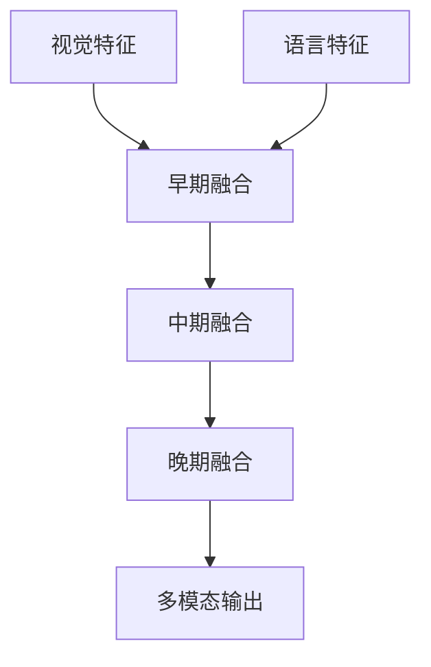
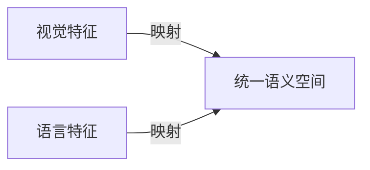
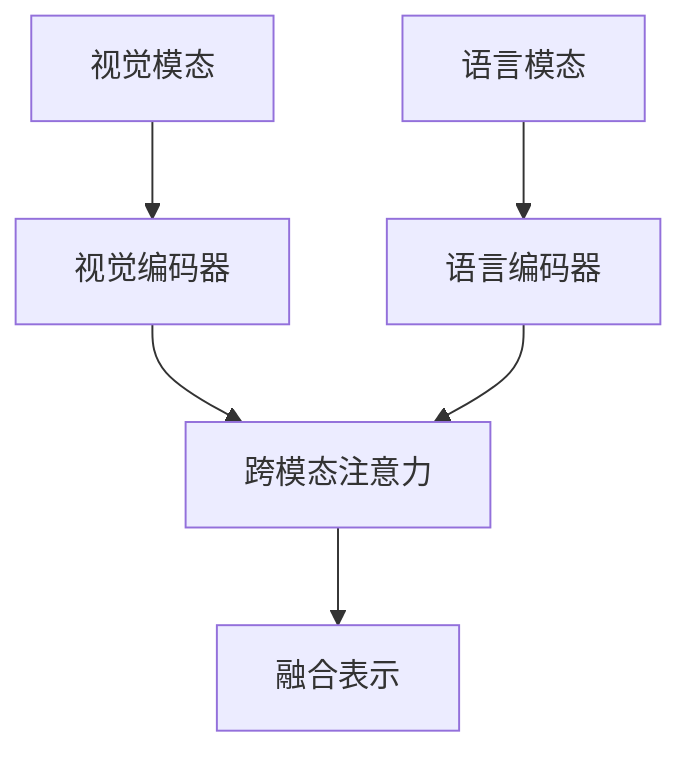

# 多模态大模型：技术原理与实战 提示学习与指令微调

## 1. 背景介绍

### 1.1 人工智能发展历程

人工智能(Artificial Intelligence, AI)是当代科技发展的重要领域,其目标是创造出能够模拟人类智能的机器系统。自20世纪50年代诞生以来,人工智能经历了几个重要阶段:

- 早期符号主义时期(1950s-1980s):专家系统、知识库等
- 机器学习兴起时期(1980s-2010s):监督学习、非监督学习等
- 深度学习浪潮(2010s-今):卷积神经网络、递归神经网络等

### 1.2 大模型兴起

近年来,benefiting from:

- 算力提升: GPU/TPU等加速硬件
- 数据量激增: 互联网大数据时代
- 算法创新: Transformer等

大规模的深度学习模型蓬勃发展,在自然语言处理、计算机视觉等领域取得突破性进展,被称为"大模型"时代。

### 1.3 多模态大模型的兴起

传统的大模型主要集中在单一模态,如:

- 自然语言处理: GPT、BERT等
- 计算机视觉: ViT、DALL-E等

多模态大模型(Multimodal Large Model)则旨在融合多种模态数据(文本、图像、视频等),实现跨模态的泛化学习能力,成为人工智能发展的新前沿。

## 2. 核心概念与联系

### 2.1 多模态学习

多模态学习(Multimodal Learning)是指从多种模态的数据中学习知识表示和任务技能的过程,包括:

- 视觉模态: 图像、视频等
- 语言模态: 文本、语音等
- 其他模态: 传感器数据等

多模态学习能够利用多源异构数据,提升模型的泛化能力和鲁棒性。

### 2.2 跨模态关联

不同模态数据之间存在内在的语义关联,如图像与文本描述之间的对应关系。跨模态关联(Cross-Modal Association)旨在挖掘和建模这种关联,实现模态间的相互映射和知识迁移。


### 2.3 多模态融合

多模态融合(Multimodal Fusion)是将不同模态的特征表示融合的过程,包括:

- 早期融合: 在输入层级别拼接特征
- 中期融合: 在中间隐层级别融合特征
- 晚期融合: 在决策层级别融合预测结果



### 2.4 多模态表示学习

多模态表示学习(Multimodal Representation Learning)旨在学习一种统一的表示空间,将不同模态的数据映射到同一语义空间中,捕捉模态间的关联,实现跨模态的泛化能力。



### 2.5 多模态大模型

多模态大模型(Multimodal Large Model)是一种能够同时处理多种模态数据的大规模深度学习模型,通过多模态融合和表示学习,实现跨模态的泛化学习能力。

典型的多模态大模型包括:

- CLIP: 跨视觉-语言预训练模型
- ALIGN: 多模态对齐预训练模型
- Flamingo: 视觉-语言-音频多模态模型

## 3. 核心算法原理具体操作步骤

### 3.1 Transformer 模型

Transformer 是多模态大模型的核心架构,其主要组成部分包括:

- 编码器(Encoder): 将输入序列映射为高维特征表示
- 解码器(Decoder): 根据编码器输出生成目标序列
- 注意力机制(Attention): 捕捉输入序列元素间的长程依赖关系


### 3.2 多模态输入表示

为了处理多模态数据,需要将不同模态的输入数据转换为统一的序列表示,如:

- 文本: 词嵌入序列
- 图像: 图像patch序列或视觉tokens
- 视频: 视频帧序列或视觉tokens序列

然后将这些序列拼接作为Transformer的输入。

### 3.3 跨模态注意力机制

传统的自注意力机制只能捕捉单一模态内的依赖关系。跨模态注意力机制则能够捕捉不同模态之间的关联,实现模态间的交互和融合。

例如,视觉-语言模型中的跨模态注意力机制可以建模图像区域与文本词元之间的相关性。

$$
\begin{aligned}
\text{Attention}(Q, K, V) &= \text{softmax}(\frac{QK^T}{\sqrt{d_k}})V \\
\text{MultiHead}(Q, K, V) &= \text{Concat}({\text{head}_1, \dots, \text{head}_h})W_O\\
\text{where: } \text{head}_i &= \text{Attention}(QW_i^Q, KW_i^K, VW_i^V)
\end{aligned}
$$

### 3.4 多模态融合策略

不同的多模态融合策略可以用于整合多个模态的特征表示:

- 单流模型: 将所有模态拼接为单一输入序列
- 双流模型: 分别编码每个模态,再融合编码器输出
- 交叉注意力: 使用跨模态注意力机制融合不同模态



### 3.5 预训练策略

大规模无监督预训练是多模态大模型的关键,主要有两种预训练策略:

1. 对比学习(Contrastive Learning)
   - 最大化相关样本的相似度,最小化非相关样本的相似度
   - 例如: CLIP使用对比损失函数预训练视觉-语言模型

2. 自监督学习(Self-Supervised Learning)
   - 基于数据本身设计预训练任务,如遮挡词预测、图像重建等
   - 例如: BEiT使用遮挡patch预测预训练视觉编码器

### 3.6 指令微调(Instruction Tuning)

指令微调是一种有监督的微调方法,通过使用带指令的数据集对预训练模型进行微调,使其能够理解和执行各种指令。

步骤如下:

1. 构建带指令的数据集,如"将图像描述翻译成中文"
2. 使用该数据集对预训练的多模态模型进行监督微调
3. 在推理时,输入指令和相关模态数据,模型生成相应的输出

指令微调使多模态大模型能够灵活地完成各种跨模态任务。

### 3.7 提示学习(Prompt Learning)

提示学习是一种无监督的微调方法,通过设计合适的提示词(Prompt),引导预训练模型生成所需的输出。

步骤如下:

1. 设计合适的提示词模板,如"这是一张{}的图片"
2. 将提示词与输入模态数据拼接作为模型输入
3. 模型基于提示词和输入数据生成相应的输出

提示学习避免了大规模有监督数据的需求,是一种高效的模型微调方法。

## 4. 数学模型和公式详细讲解举例说明

### 4.1 Transformer 注意力机制

Transformer 模型中的缩放点积注意力机制是一种计算高效的自注意力机制,公式如下:

$$
\begin{aligned}
\text{Attention}(Q, K, V) &= \text{softmax}(\frac{QK^T}{\sqrt{d_k}})V \\
\text{MultiHead}(Q, K, V) &= \text{Concat}({\text{head}_1, \dots, \text{head}_h})W_O\\
\text{where: } \text{head}_i &= \text{Attention}(QW_i^Q, KW_i^K, VW_i^V)
\end{aligned}
$$

其中:

- $Q$、$K$、$V$ 分别表示查询(Query)、键(Key)和值(Value)
- $d_k$ 是缩放因子,用于防止点积过大导致梯度饱和
- 多头注意力机制将注意力计算分成多个头,每个头关注输入的不同子空间,最后拼接得到最终表示

例如,在视觉-语言模型中,查询 $Q$ 可以是图像区域特征,键 $K$ 和值 $V$ 可以是文本词嵌入,通过注意力机制捕捉它们之间的相关性。

### 4.2 对比学习损失函数

对比学习旨在最大化相关样本的相似度,最小化非相关样本的相似度。常用的对比损失函数是 InfoNCE 损失:

$$
\mathcal{L}_i = -\log \frac{\exp(\text{sim}(z_i, z_i^+) / \tau)}{\sum_{j=1}^{2N} \mathbb{1}_{[j \neq i]} \exp(\text{sim}(z_i, z_j) / \tau)}
$$

其中:

- $z_i$ 和 $z_i^+$ 是相关的样本对
- $\text{sim}(\cdot, \cdot)$ 是相似度函数,如点积相似度
- $\tau$ 是温度超参数,控制相似度分布的平滑程度
- 分母项对所有非相关样本对进行求和

例如,在 CLIP 中,正样本对是相关的图像-文本对,负样本对是其他无关的图像-文本对。通过最小化该损失函数,模型学习将相关的图像和文本映射到相似的表示空间。

### 4.3 视觉-语言对齐目标

视觉-语言对齐模型的目标是学习一个统一的语义空间,使得视觉和语言模态的表示在该空间中对齐。常用的对齐目标是最大化视觉-语言表示的相似度:

$$
\mathcal{L}_\text{align} = -\frac{1}{N} \sum_{i=1}^N \log \frac{\exp(\text{sim}(v_i, t_i) / \tau)}{\sum_{j=1}^N \exp(\text{sim}(v_i, t_j) / \tau)}
$$

其中:

- $v_i$ 和 $t_i$ 分别是第 $i$ 个样本的视觉和文本表示
- $\text{sim}(\cdot, \cdot)$ 是相似度函数,如点积相似度
- $\tau$ 是温度超参数,控制相似度分布的平滑程度
- 分母项对所有文本表示进行求和

通过最小化该损失函数,模型将相关的视觉-语言表示拉近,不相关的表示推远,实现跨模态对齐。

## 5. 项目实践: 代码实例和详细解释说明

以下是一个使用 PyTorch 实现的简单视觉-语言对齐模型示例:

### 5.1 数据预处理

```python
import torch
from torchvision import transforms

# 图像预处理
image_transform = transforms.Compose([
    transforms.Resize(256),
    transforms.CenterCrop(224),
    transforms.ToTensor(),
    transforms.Normalize(mean=[0.485, 0.456, 0.406], std=[0.229, 0.224, 0.225])
])

# 文本预处理
tokenizer = BertTokenizer.from_pretrained('bert-base-uncased')

def preprocess_data(images, texts):
    processed_images = [image_transform(image) for image in images]
    encoded_texts = [tokenizer.encode_plus(text, padding='max_length', max_length=32, return_tensors='pt') for text in texts]
    
    image_inputs = torch.stack(processed_images)
    text_inputs = torch.cat([encoded['input_ids'] for encoded in encoded_texts], dim=0)
    
    return image_inputs, text_inputs
```

### 5.2 视觉-语言对齐模型

```python
import torch.nn as nn

class VisualEncoder(nn.Module):
    def __init__(self):
        super(VisualEncoder, self).__init__()
        # 初始化视觉编码器(如ResNet)
        ...

    def forward(self, images):