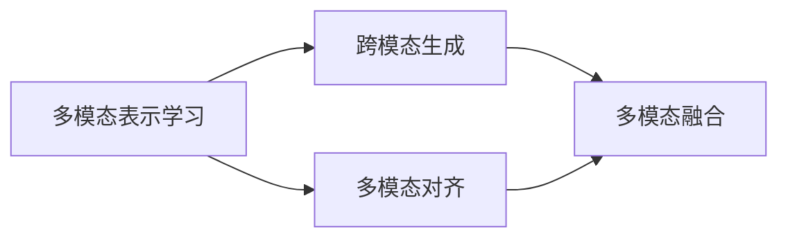

# 多模态生成(Multimodal Generation) - 原理与代码实例讲解

## 1. 背景介绍
### 1.1 多模态生成的定义
多模态生成(Multimodal Generation)是指利用人工智能技术,综合处理和生成包含文本、图像、音频、视频等不同模态的数据的技术。它旨在让计算机能够像人一样理解、交互和创作包含多种形式信息的内容。
### 1.2 多模态生成的发展历程
多模态生成技术的发展可以追溯到上世纪90年代初期,那时就已经开始了多模态人机交互的研究。近年来,随着深度学习的兴起,特别是transformer等模型的广泛应用,多模态生成取得了突破性进展。从最初的图像描述、视频字幕生成,到如今的图像/视频生成、跨模态检索、跨模态对话等,多模态生成正在不断拓展人工智能的边界。
### 1.3 多模态生成的意义
多模态生成有着广泛的应用前景。它可以让人工智能系统更加智能地理解和创作多模态内容,增强人机交互的自然性和丰富性。例如,多模态对话系统可以通过理解用户的文本、语音、表情等,提供更加个性化和情境化的服务;多模态内容生成可以让计算机根据文本描述自动生成逼真的图像和视频,在艺术创作、游戏设计、虚拟现实等领域有着广阔的应用空间。

## 2. 核心概念与联系
### 2.1 多模态表示学习
要实现多模态生成,首先需要学习不同模态数据的统一表示。多模态表示学习旨在将文本、图像、音频等不同模态的数据映射到一个共同的语义空间,从而实现不同模态之间的信息交互和融合。常见的方法包括多模态自编码器、多模态注意力机制等。
### 2.2 跨模态生成
跨模态生成是指根据某一模态的输入,生成另一模态的对应输出,如根据文本生成图像(text-to-image)、根据图像生成文本(image captioning)等。它需要建立不同模态之间的映射关系,通常采用encoder-decoder架构,以及GAN、VAE等生成式模型。
### 2.3 多模态对齐
多模态对齐是指在不同模态表示之间建立语义上的对应关系,使它们在共同的语义空间中尽可能接近。常见的对齐方法包括对抗学习、度量学习等。多模态对齐是实现跨模态检索、跨模态迁移学习等任务的基础。
### 2.4 多模态融合 
多模态融合是指将不同模态的信息进行整合,形成一个联合表示用于下游任务。常见的融合方式有早期融合(特征拼接)、晚期融合(决策层融合)和中间融合(特征交互)。目前主流的融合方法是使用多模态transformer,通过自注意力机制实现不同模态之间的交互。

以下是这些概念之间关系的 Mermaid 流程图:

## 3. 核心算法原理具体操作步骤
### 3.1 多模态表示学习
#### 3.1.1 多模态自编码器
多模态自编码器通过重构不同模态数据来学习它们的共同表示。以文本-图像数据为例,具体步骤如下:

1. 将文本和图像分别输入其对应的编码器(通常是 CNN 或 transformer),得到它们的特征表示。
2. 将文本和图像的特征表示拼接或相加,得到多模态联合表示。 
3. 将多模态联合表示输入到两个解码器中,分别重构出文本和图像。
4. 优化编码器和解码器的参数,最小化重构误差,使多模态联合表示能够很好地表征原始的文本和图像数据。

#### 3.1.2 多模态注意力机制
多模态注意力机制通过计算不同模态之间的注意力分数来实现信息交互和融合。以视觉问答(VQA)任务为例:

1. 将图像输入 CNN 提取特征,得到一组图像区域向量。
2. 将问题输入 RNN 或 transformer 编码,得到问题向量。
3. 计算每个图像区域向量和问题向量之间的注意力分数(如点积、 MLP 等),得到图像-问题注意力矩阵。
4. 根据注意力矩阵对图像区域向量进行加权求和,得到问题相关的图像表示。
5. 将问题表示和图像表示拼接,输入到分类器或解码器中预测答案。

### 3.2 跨模态生成
#### 3.2.1 文本到图像生成
文本到图像生成(text-to-image)旨在根据文本描述生成与之对应的图像。主要采用条件生成对抗网络(CGAN)的架构:

1. 将文本描述输入到文本编码器(如 RNN、transformer)中,得到文本特征向量。
2. 随机采样一个噪声向量 z,将其与文本特征拼接,输入到生成器(generator)中。
3. 生成器输出一张图像,输入到判别器(discriminator)中。 
4. 判别器同时接收真实图像和生成图像,以及它们对应的文本描述,输出真假概率。
5. 优化生成器和判别器,使生成器能生成逼真的、与文本描述匹配的图像,判别器能准确区分真假图像。

#### 3.2.2 图像到文本生成
图像到文本生成(image captioning)是给定一张图像,输出与之匹配的文本描述。通常采用 CNN+RNN 的编码器-解码器架构:

1. 将图像输入到 CNN 中提取特征,得到图像特征向量。
2. 将图像特征作为 RNN 解码器的初始隐状态或每一步的输入。
3. RNN 解码器在每一时间步输出一个单词的概率分布,根据概率采样或贪婪搜索生成单词序列。
4. 重复步骤 3,直到生成结束符 <EOS>,得到完整的文本描述。 
5. 优化 CNN 编码器和 RNN 解码器,最小化生成描述与真实描述之间的交叉熵损失。

### 3.3 多模态对齐
#### 3.3.1 对抗学习
对抗学习通过训练一个模态判别器来实现不同模态表示之间的对齐。以文本-图像对齐为例:

1. 将文本和图像分别输入其编码器,得到它们的特征表示。
2. 训练一个模态判别器,输入为文本特征和图像特征,输出为它们是否匹配的概率。
3. 优化编码器和判别器:编码器要最大化判别器的匹配概率,判别器要最小化匹配文本-图像对的概率,最大化不匹配对的概率。
4. 通过对抗训练,使得匹配的文本-图像对在特征空间中距离尽可能近,不匹配的对距离尽可能远。

#### 3.3.2 度量学习
度量学习通过学习一个距离度量函数来对齐不同模态表示。常见的方法有:

1. 对比损失:最小化匹配文本-图像对之间的距离,最大化不匹配对之间的距离。
2. 三元组损失:对于一个文本,其匹配图像与不匹配图像之间的距离应该大于一个间隔阈值。
3. 中心损失:最小化同一类别的文本-图像特征到其中心的距离,最大化不同类别中心之间的距离。

通过优化这些损失函数,可以学习到一个跨模态的语义空间,其中语义相似的文本和图像在空间中距离更近。

### 3.4 多模态融合
#### 3.4.1 多模态 Transformer
多模态 transformer 通过自注意力机制来实现不同模态之间的信息交互和融合。以视觉-语言任务为例:

1. 将图像划分为多个区域,提取其 CNN 特征,加上位置编码后得到图像区域序列。
2. 将文本进行 token 化,加上位置编码后得到文本 token 序列。
3. 将图像区域序列和文本 token 序列拼接,输入到多层 transformer 的编码器中。
4. Transformer 编码器通过自注意力计算区域-区域、token-token、区域-token 之间的注意力权重,实现不同模态之间的信息交互。
5. 将 transformer 编码器的输出送入特定的任务层(如分类、生成等)中,进行端到端的训练。

多模态 transformer 能够灵活地处理不同模态的数据,通过注意力机制自适应地对不同模态进行融合,是目前多模态学习的主流模型。

## 4. 数学模型和公式详细讲解举例说明
### 4.1 多模态自编码器
给定一个文本-图像对 $(t,i)$,多模态自编码器的目标是最小化其重构误差:

$$\mathcal{L}_{recon} = \lVert t - \hat{t} \rVert_2^2 + \lVert i - \hat{i} \rVert_2^2$$

其中 $\hat{t}$ 和 $\hat{i}$ 分别是重构出的文本和图像。设编码后的文本特征为 $f_t$,图像特征为 $f_i$,则多模态联合表示为:

$$m = g(f_t, f_i)$$

其中 $g$ 可以是拼接、相加等融合函数。重构出的文本和图像为:

$$\hat{t} = d_t(m), \hat{i} = d_i(m)$$

其中 $d_t$ 和 $d_i$ 分别是文本解码器和图像解码器。优化目标是:

$$\min_{\theta_e,\theta_d} \mathcal{L}_{recon}$$

其中 $\theta_e$ 是编码器参数,$\theta_d$ 是解码器参数。通过最小化重构误差,多模态自编码器可以学习到一个好的多模态联合表示 $m$。

### 4.2 条件生成对抗网络(CGAN)
CGAN 在原始 GAN 的基础上引入了条件变量 $c$,用于指导生成过程。其目标函数为:

$$\min_G \max_D \mathbb{E}_{x,c}[\log D(x,c)] + \mathbb{E}_{z,c}[\log (1-D(G(z,c),c))]$$

其中 $G$ 是生成器,$D$ 是判别器,$x$ 是真实数据,$z$ 是随机噪声,$c$ 是条件(如文本描述)。生成器 $G(z,c)$ 根据噪声 $z$ 和条件 $c$ 生成数据,判别器 $D(x,c)$ 判断数据 $x$ 在给定条件 $c$ 下的真假概率。

以文本到图像生成为例,条件 $c$ 就是文本描述,生成器 $G$ 根据文本描述生成图像,判别器 $D$ 判断生成图像与文本描述是否匹配。通过优化上述的最小最大博弈问题,可以训练出一个能够根据文本描述生成逼真图像的 CGAN 模型。

### 4.3 注意力机制
注意力机制可以看作是一个查询(query)与一组键-值对(key-value pairs)之间的映射。对于查询 $q$ 和所有的键 $k_i$,注意力分数 $a_i$ 计算如下:

$$a_i = \frac{\exp(s(q,k_i))}{\sum_j \exp(s(q,k_j))}$$

其中 $s(q,k_i)$ 是查询 $q$ 和键 $k_i$ 之间的相似度计算函数,常见的有点积、拼接后输入 MLP 等。根据注意力分数 $a_i$ 对值 $v_i$ 进行加权求和,得到注意力输出:

$$\text{Attention}(q,K,V) = \sum_i a_i v_i$$

其中 $K$ 是所有键的集合,$V$ 是所有值的集合。

在多模态任务中,可以将一个模态的特征作为查询,另一个模态的特征作为键-值对,通过注意力机制实现不同模态之间的信息交互。例如在视觉问答中,将问题特征作为查询,图像