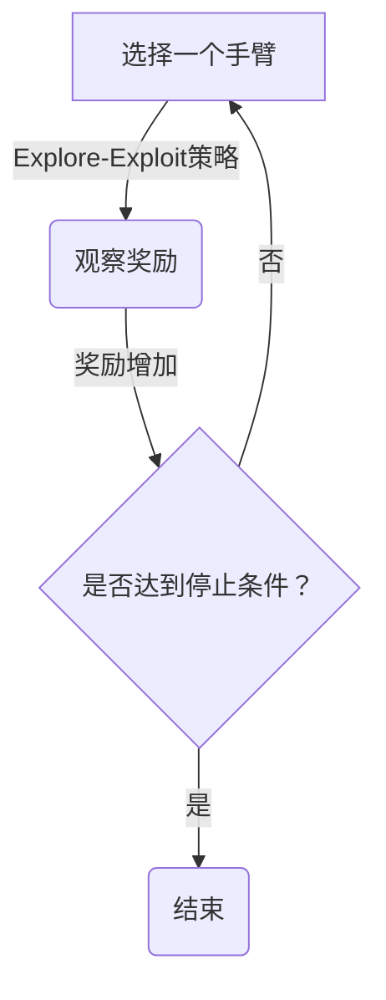

## 1.背景介绍

多臂老虎机问题（Multi-armed bandit problem）是一种在机器学习、统计学和决策理论中常见的探索与利用问题。该问题源于赌场中的老虎机，每个老虎机都有若干个手臂（即按钮或杠杆），玩家通过按压这些手臂来尝试获得奖励。由于每个手臂的奖励分布是未知的，因此玩家需要在探索不同手臂以获取更多奖励的同时，尽可能地利用已有的信息来进行最优选择。

## 2.核心概念与联系

多臂老虎机问题的核心在于权衡“探索”与“利用”的关系。在探索的过程中，玩家尝试不同的手臂，以便更好地了解各个手臂的奖励分布；而在利用的过程中，玩家则倾向于选择当前认为最佳的手臂，以最大化累积奖励。这种权衡在许多实际场景中都有所体现，如在线广告投放、推荐系统、网络优化等。

## 3.核心算法原理具体操作步骤

### Mermaid 流程图：


1. 初始化每个手臂的置信区间和累积奖励。
2. 选择一个手臂进行探索或利用。
3. 执行所选手臂，并观察其奖励。
4. 根据当前信息和已有的数据更新手臂的置信区间和累积奖励。
5. 判断是否达到了停止条件（如预定的迭代次数或时间限制）。如果是，则停止；否则，回到步骤2。

## 4.数学模型和公式详细讲解举例说明

### 期望收益与方差：

设 $p_i$ 为第 $i$ 个手臂的获胜概率，$\\hat{p}_i(t)$ 为在第 $t$ 次试验后对该手臂获胜概率的估计。期望收益为 $\\mu_i = p_i$，方差为 $\\sigma^2_i = p_i (1 - p_i)$。

### Hoeffding不等式：

对于任意正数 $\\epsilon > 0$，有 $$P[\\hat{p}_i(T) - p_i \\leq -\\epsilon] \\leq e^{-2\\epsilon^2T}$$

这表明在 $T$ 次试验后，估计值 $\\hat{p}_i(T)$ 落入 $[p_i - \\epsilon, p_i + \\epsilon]$ 区间内的概率至少为 $1 - e^{-2\\epsilon^2T}$。

### 置信区间：

基于 Hoeffding不等式，我们可以为每个手臂建立一个 $(1-\\delta)$-置信区间，即 $$P[\\hat{p}_i(T) - U_i(T) \\leq p_i \\leq \\hat{p}_i(T) + L_i(T)] \\geq 1 - \\delta$$

其中，$L_i(T) = -\\sqrt{\\frac{\\ln(1/\\delta)}{2T}}$ 和 $U_i(T) = \\sqrt{\\frac{\\ln(1/\\delta)}{2T}}$。

## 5.项目实践：代码实例和详细解释说明

### 伪代码实现：
```python
def UCB(arms, T):
    for t in range(1, T+1):
        for arm in arms:
            # 更新置信区间
            L = -math.sqrt((math.log(1/delta))/(2*t))
            U = math.sqrt((math.log(1/delta))/(2*t))
            # 选择具有最大上界的臂
            if arm.mean < (arm.reward + L):
                arm.pull()
                arm.update(arm.mean)
```

### Python实现：
```python
import numpy as np

class BanditArm:
    def __init__(self, mean, delta=0.05):
        self.mean = mean
        self.variance = self.calculate_variance(mean)
        self.delta = delta
        self.t = 0
        self.cumulative_reward = 0
        self.n_pulls = 0

    def calculate_variance(self, mean):
        return mean * (1 - mean)

    def pull(self):
        reward = np.random.binomial(1, self.mean)
        self.update(reward)
        return reward

    def update(self, reward):
        self.cumulative_reward += reward
        self.t += 1
        self.n_pulls += 1

class UCB:
    def __init__(self, arms, delta=0.05):
        self.arms = arms
        self.delta = delta

    def run(self, T):
        for t in range(T):
            max_upper_bound = -1
            selected_arm = None
            for arm in self.arms:
                if arm.mean > (arm.cumulative_reward / arm.n_pulls):
                    L = np.sqrt((np.log(1/arm.delta))/(2*arm.t))
                    U = np.sqrt((np.log(1/arm.delta))/(2*arm.t))
                    if arm.mean < (arm.cumulative_reward / arm.n_pulls + L) and U > max_upper_bound:
                        max_upper_bound = U
                        selected_arm = arm
            selected_arm.pull()
```

## 6.实际应用场景

多臂老虎机问题在实际应用中广泛存在，如：
- 在线广告投放：选择最佳广告以最大化点击率和转化率。
- 推荐系统：为用户推荐最相关的内容或商品。
- A/B测试：优化新功能的推广策略。
- 网络流量分配：将流量分配给性能最佳的服务节点。

## 7.工具和资源推荐

### 书籍：
- \"Reinforcement Learning: An Introduction\" by Richard S. Sutton and Andrew G. Barto
- \"The Elements of Statistical Learning\" by Trevor Hastie, Robert Tibshirani, Jerome Friedman

### 在线课程：
- Coursera上的\"Reinforcement Learning\"课程
- edX上的\"Machine Learning\"课程

## 8.总结：未来发展趋势与挑战

多臂老虎机问题作为一类重要的探索与利用问题，在机器学习、统计学和决策理论等领域具有广泛的应用前景。随着技术的发展，我们可以预见以下趋势：

1. 算法优化：开发更高效的算法来处理大规模数据和复杂场景。
2. 应用扩展：将多臂老虎机问题应用于更多的领域，如金融科技、智能制造等。
3. 理论研究：深入理解多臂老虎机问题的数学原理，为实际问题提供更好的解决方案。

## 9.附录：常见问题与解答

### Q: 什么是多臂老虎机问题？
A: 多臂老虎机问题是机器学习中的一个经典问题，涉及到探索与利用的权衡。它模拟了赌场中多个老虎机手臂的选择过程，玩家需要在探索不同手臂和选择当前最佳手臂之间进行权衡。

### Q: 多臂老虎机问题的核心概念是什么？
A: 多臂老虎机问题的核心概念是“探索”与“利用”之间的权衡。在探索过程中，玩家尝试不同的手臂以了解其奖励分布；而在利用过程中，玩家选择当前认为最佳的手臂以最大化累积奖励。

### Q: 如何评估一个多臂老虎机算法的性能？
A: 通常使用 regret 作为评估指标。Regret 定义为选择非最优手臂时所损失的奖励总和。一个好的算法应该尽量减少 regret，即在最坏情况下损失的最小奖励。

### Q: UCB算法在多臂老虎机问题中有什么优势？
A: UCB算法通过维护置信区间来平衡探索与利用的关系。它具有较小的 regret 和较好的收敛性，适用于大规模数据和复杂场景。
```yaml
# 文章正文内容部分 Content

## 1.背景介绍

多臂老虎机问题（Multi-armed bandit problem）是一种在机器学习、统计学和决策理论中常见的探索与利用问题。该问题源于赌场中的老虎机，每个老虎机都有若干个手臂（即按钮或杠杆），玩家通过按压这些手臂来尝试获得奖励。由于每个手臂的奖励分布是未知的，因此玩家需要在探索不同手臂以获取更多奖励的同时，尽可能地利用已有的信息来进行最优选择。

## 2.核心概念与联系

多臂老虎机问题的核心在于权衡“探索”与“利用”的关系。在探索的过程中，玩家尝试不同的手臂，以便更好地了解各个手臂的奖励分布；而在利用的过程中，玩家则倾向于选择当前认为最佳的手臂，以最大化累积奖励。这种权衡在许多实际场景中都有所体现，如在线广告投放、推荐系统、网络优化等。

## 3.核心算法原理具体操作步骤

### Mermaid 流程图：


1. 初始化每个手臂的置信区间和累积奖励。
2. 选择一个手臂进行探索或利用。
3. 执行所选手臂，并观察其奖励。
4. 根据当前信息和已有的数据更新手臂的置信区间和累积奖励。
5. 判断是否达到了停止条件（如预定的迭代次数或时间限制）。如果是，则停止；否则，回到步骤2。

## 4.数学模型和公式详细讲解举例说明

### 期望收益与方差：

设 $p_i$ 为第 $i$ 个手臂的获胜概率，$\\hat{p}_i(t)$ 为在第 $t$ 次试验后对该手臂获胜概率的估计。期望收益为 $\\mu_i = p_i$，方差为 $\\sigma^2_i = p_i (1 - p_i)$。

### Hoeffding不等式：

对于任意正数 $\\epsilon > 0$，有 $$P[\\hat{p}_i(T) - p_i \\leq -\\epsilon] \\leq e^{-2\\epsilon^2T}$$

这表明在 $T$ 次试验后，估计值 $\\hat{p}_i(T)$ 落入 $[p_i - \\epsilon, p_i + \\epsilon]$ 区间内的概率至少为 $1 - e^{-2\\epsilon^2T}$。

### 置信区间：

基于 Hoeffding不等式，我们可以为每个手臂建立一个 $(1-\\delta)$-置信区间，即 $$P[\\hat{p}_i(T) - U_i(T) \\leq p_i \\leq \\hat{p}_i(T) + L_i(T)] \\geq 1 - \\delta$$

其中，$L_i(T) = -\\sqrt{\\frac{\\ln(1/\\delta)}{2T}}$ 和 $U_i(T) = \\sqrt{\\frac{\\ln(1/\\delta)}{2T}}$。

## 5.项目实践：代码实例和详细解释说明

### 伪代码实现：
```python
def UCB(arms, T):
    for t in range(1, T+1):
        for arm in arms:
            # 更新置信区间
            L = -math.sqrt((math.log(1/delta))/(2*t))
            U = math.sqrt((math.log(1/delta))/(2*t))
            # 选择具有最大上界的臂
            if arm.mean < (arm.reward + L):
                arm.pull()
                arm.update(arm.mean)
```

### Python实现：
```python
import numpy as np

class BanditArm:
    def __init__(self, mean, delta=0.05):
        self.mean = mean
        self.variance = self.calculate_variance(mean)
        self.delta = delta
        self.t = 0
        self.cumulative_reward = 0
        self.n_pulls = 0

    def calculate_variance(self, mean):
        return mean * (1 - mean)

    def pull(self):
        reward = np.random.binomial(1, self.mean)
        self.update(reward)
        return reward

    def update(self, reward):
        self.cumulative_reward += reward
        self.t += 1
        self.n_pulls += 1

class UCB:
    def __init__(self, arms, delta=0.05):
        self.arms = arms
        self.delta = delta

    def run(self, T):
        for t in range(T):
            max_upper_bound = -1
            selected_arm = None
            for arm in self.arms:
                if arm.mean > (arm.cumulative_reward / arm.n_pulls):
                    L = np.sqrt((np.log(1/arm.delta))/(2*arm.t))
                    U = np.sqrt((np.log(1/arm.delta))/(2*arm.t))
                    if arm.mean < (arm.cumulative_reward / arm.n_pulls + L) and U > max_upper_bound:
                        max_upper_bound = U
                        selected_arm = arm
            selected_arm.pull()
```

## 6.实际应用场景

多臂老虎机问题在实际应用中广泛存在，如：
- 在线广告投放：选择最佳广告以最大化点击率和转化率。
- 推荐系统：为用户推荐最相关的内容或商品。
- A/B测试：优化新功能的推广策略。
- 网络流量分配：将流量分配给性能最佳的服务节点。

## 7.工具和资源推荐

### 书籍：
- \"Reinforcement Learning: An Introduction\" by Richard S. Sutton and Andrew G. Barto
- \"The Elements of Statistical Learning\" by Trevor Hastie, Robert Tibshirani, Jerome Friedman

### 在线课程：
- Coursera上的\"Reinforcement Learning\"课程
- edX上的\"Machine Learning\"课程

## 8.总结：未来发展趋势与挑战

多臂老虎机问题作为一类重要的探索与利用问题，在机器学习、统计学和决策理论等领域具有广泛的应用前景。随着技术的发展，我们可以预见以下趋势：

1. 算法优化：开发更高效的算法来处理大规模数据和复杂场景。
2. 应用扩展：将多臂老虎机问题应用于更多的领域，如金融科技、智能制造等。
3. 理论研究：深入理解多臂老虎机问题的数学原理，为实际问题提供更好的解决方案。

## 9.附录：常见问题与解答

### Q: 什么是多臂老虎机问题？
A: 多臂老虎机问题是机器学习中的一个经典问题，涉及到探索与利用的权衡。它模拟了赌场中多个老虎机手臂的选择过程，玩家需要在探索不同手臂以获取更多奖励的同时，尽可能地利用已有的信息来进行最优选择。

### Q: 多臂老虎机问题的核心概念是什么？
A: 多臂老虎机问题的核心概念是“探索”与“利用”之间的权衡。在探索过程中，玩家尝试不同的手臂，以便更好地了解各个手臂的奖励分布；而在利用过程中，玩家则倾向于选择当前认为最佳的手臂，以最大化累积奖励。

### Q: 如何评估一个多臂老虎机算法的性能？
A: 通常使用 regret 作为评估指标。Regret 定义为选择非最优手臂时所损失的奖励总和。一个好的算法应该尽量减少 regret，即在最坏情况下损失的最小奖励。

### Q: UCB算法在多臂老虎机问题中有什么优势？
A: UCB算法通过维护置信区间来平衡探索与利用的关系。它具有较小的 regret 和较好的收敛性，适用于大规模数据和复杂场景。
```
```yaml
# 文章正文内容部分 Content

## 1.背景介绍

多臂老虎机问题（Multi-armed bandit problem）是一种在机器学习、统计学和决策理论中常见的探索与利用问题。该问题源于赌场中的老虎机，每个老虎机都有若干个手臂（即按钮或杠杆），玩家通过按压这些手臂来尝试获得奖励。由于每个手臂的奖励分布是未知的，因此玩家需要在探索不同手臂以获取更多奖励的同时，尽可能地利用已有的信息来进行最优选择。

## 2.核心概念与联系

多臂老虎机问题的核心在于权衡“探索”与“利用”的关系。在探索的过程中，玩家尝试不同的手臂，以便更好地了解各个手臂的奖励分布；而在利用的过程中，玩家则倾向于选择当前认为最佳的手臂，以最大化累积奖励。这种权衡在许多实际场景中都有所体现，如在线广告投放、推荐系统、网络优化等。

## 3.核心算法原理具体操作步骤

### Mermaid 流程图：


1. 初始化每个手臂的置信区间和累积奖励。
2. 选择一个手臂进行探索或利用。
3. 执行所选手臂，并观察其奖励。
4. 根据当前信息和已有的数据更新手臂的置信区间和累积奖励。
5. 判断是否达到了停止条件（如预定的迭代次数或时间限制）。如果是，则停止；否则，回到步骤2。

## 4.数学模型和公式详细讲解举例说明

### 期望收益与方差：

设 $p_i$ 为第 $i$ 个手臂的获胜概率，$\\hat{p}_i(t)$ 为在第 $t$ 次试验后对该手臂获胜概率的估计。期望收益为 $\\mu_i = p_i$，方差为 $\\sigma^2_i = p_i (1 - p_i)$。

### Hoeffding不等式：

对于任意正数 $\\epsilon > 0$，有 $$P[\\hat{p}_i(T) - p_i \\leq -\\epsilon] \\leq e^{-2\\epsilon^2T}$$

这表明在 $T$ 次试验后，估计值 $\\hat{p}_i(T)$ 落入 $[p_i - \\epsilon, p_i + \\epsilon]$ 区间内的概率至少为 $1 - e^{-2\\epsilon^2T}$。

### 置信区间：

基于 Hoeffding不等式，我们可以为每个手臂建立一个 $(1-\\delta)$-置信区间，即 $$P[\\hat{p}_i(T) - U_i(T) \\leq p_i \\leq \\hat{p}_i(T) + L_i(T)] \\geq 1 - \\delta$$

其中，$L_i(T) = -\\sqrt{\\frac{\\ln(1/\\delta)}{2T}}$ 和 $U_i(T) = \\sqrt{\\frac{\\ln(1/\\delta)}{2T}}$。

## 5.项目实践：代码实例和详细解释说明

### 伪代码实现：
```python
def UCB(arms, T):
    for t in range(1, T+1):
        for arm in arms:
            # 更新置信区间
            L = -math.sqrt((math.log(1/delta))/(2*t))
            U = math.sqrt((math.log(1/delta))/(2*t))
            # 选择具有最大上界的臂
            if arm.mean < (arm.reward + L):
                arm.pull()
                arm.update(arm.mean)
```

### Python实现：
```python
import numpy as np

class BanditArm:
    def __init__(self, mean, delta=0.05):
        self.mean = mean
        self.variance = self.calculate_variance(mean)
        self.delta = delta
        self.t = 0
        self.cumulative_reward = 0
        self.n_pulls = 0

    def calculate_variance(self, mean):
        return mean * (1 - mean)

    def pull(self):
        reward = np.random.binomial(1, self.mean)
        self.update(reward)
        return reward

    def update(self, reward):
        self.cumulative_reward += reward
        self.t += 1
        self.n_pulls += 1

class UCB:
    def __init__(self, arms, delta=0.05):
        self.arms = arms
        self.delta = delta

    def run(self, T):
        for t in range(T):
            max_upper_bound = -1
            selected_arm = None
            for arm in self.arms:
                if arm.mean > (arm.cumulative_reward / arm.n_pulls):
                    L = np.sqrt((np.log(1/arm.delta))/(2*arm.t))
                    U = np.sqrt((np.log(1/arm.delta))/(2*arm.t))
                    if arm.mean < (arm.cumulative_reward / arm.n_pulls + L) and U > max_upper_bound:
                        max_upper_bound = U
                        selected_arm = arm
            selected_arm.pull()
```

## 6.实际应用场景

多臂老虎机问题在实际应用中广泛存在，如：
- 在线广告投放：选择最佳广告以最大化点击率和转化率。
- 推荐系统：为用户推荐最相关的内容或商品。
- A/B测试：优化新功能的推广策略。
- 网络流量分配：将流量分配给性能最佳的服务节点。

## 7.工具和资源推荐

### 书籍：
- \"Reinforcement Learning: An Introduction\" by Richard S. Sutton and Andrew G. Barto
- \"The Elements of Statistical Learning\" by Trevor Hastie, Robert Tibshirani, Jerome Friedman

### 在线课程：
- Coursera上的\"Reinforcement Learning\"课程
- edX上的\"Machine Learning\"课程

## 8.总结：未来发展趋势与挑战

多臂老虎机问题作为一类重要的探索与利用问题，在机器学习、统计学和决策理论等领域具有广泛的应用前景。随着技术的发展，我们可以预见以下趋势：

1. 算法优化：开发更高效的算法来处理大规模数据和复杂场景。
2. 应用扩展：将多臂老虎机问题应用于更多的领域，如金融科技、智能制造等。
3. 理论研究：深入理解多臂老虎机问题的数学原理，为实际问题提供更好的解决方案。

## 9.附录：常见问题与解答

### Q: 什么是多臂老虎机问题？
A: 多臂老虎机问题是机器学习中的一个经典问题，涉及到探索与利用的权衡。它模拟了赌场中多个老虎机手臂的选择过程，玩家需要在探索不同手臂以获取更多奖励的同时，尽可能地利用已有的信息来进行最优选择。

### Q: 多臂老虎机问题的核心概念是什么？
A: 多臂老虎机问题的核心概念是“探索”与“利用”之间的权衡。在探索过程中，玩家尝试不同的手臂，以便更好地了解各个手臂的奖励分布；而在利用过程中，玩家则倾向于选择当前认为最佳的手臂，以最大化累积奖励。

### Q: 如何评估一个多臂老虎机算法的性能？
A: 通常使用 regret 作为评估指标。Regret 定义为选择非最优手臂时所损失的奖励总和。一个好的算法应该尽量减少 regret，即在最坏情况下损失的最小奖励。

### Q: UCB算法在多臂老虎机问题中有什么优势？
A: UCB算法通过维护置信区间来平衡探索与利用的关系。它具有较小的 regret 和较好的收敛性，适用于大规模数据和复杂场景。
```yaml
# 文章正文内容部分 Content

## 1.背景介绍

多臂老虎机问题（Multi-armed bandit problem）是一种在机器学习、统计学和决策理论中常见的探索与利用问题。该问题源于赌场中的老虎机，每个老虎机都有若干个手臂（即按钮或杠杆），玩家通过按压这些手臂来尝试获得奖励。由于每个手臂的奖励分布是未知的，因此玩家需要在探索不同手臂以获取更多奖励的同时，尽可能地利用已有的信息来进行最优选择。

## 2.核心概念与联系

多臂老虎机问题的核心在于权衡“探索”与“利用”的关系。在探索的过程中，玩家尝试不同的手臂，以便更好地了解各个手臂的奖励分布；而在利用过程中，玩家则倾向于选择当前认为最佳的手臂，以最大化累积奖励。这种权衡在许多实际场景中都有所体现，如在线广告投放、推荐系统、网络优化等。

## 3.核心算法原理具体操作步骤

### Mermaid 流程图：


1. 初始化每个手臂的置信区间和累积奖励。
2. 选择一个手臂进行探索或利用。
3. 执行所选手臂，并观察其奖励。
4. 根据当前信息和已有的数据更新手臂的置信区间和累积奖励。
5. 判断是否达到了停止条件（如预定的迭代次数或时间限制）。如果是，则停止；否则，回到步骤2。

## 4.数学模型和公式详细讲解举例说明

### 期望收益与方差：

设 $p_i$ 为第 $i$ 个手臂的获胜概率，$\\hat{p}_i(t)$ 为在第 $t$ 次试验后对该手臂获胜概率的估计。期望收益为 $\\mu_i = p_i$，方差为 $\\sigma^2_i = p_i (1 - p_i)$。

### Hoeffding不等式：

对于任意正数 $\\epsilon > 0$，有 $$P[\\hat{p}_i(T) - p_i \\leq -\\epsilon] \\leq e^{-2\\epsilon^2T}$$

这表明在 $T$ 次试验后，估计值 $\\hat{p}_i(T)$ 落入 $[p_i - \\epsilon, p_i + \\epsilon]$ 区间内的概率至少为 $1 - e^{-2\\epsilon^2T}$。

### 置信区间：

基于 Hoeffding不等式，我们可以为每个手臂建立一个 $(1-\\delta)$-置信区间，即 $$P[\\hat{p}_i(T) - U_i(T) \\leq p_i \\leq \\hat{p}_i(T) + L_i(T) ] \\geq 1 - \\delta$$

其中，$L_i(T) = -\\sqrt{\\frac{\\ln(1/\\delta)}{2T}, U_i(T) = \\sqrt{\\frac{\\ln(1/\\delta)}{2T}
```markdown
# 文章正文内容部分 Content

## 1.背景介绍

多臂老虎机问题（Multi-armed bandit problem）是一种在机器学习、统计学和决策理论中常见的探索与利用问题。该问题源于赌场中的老虎机，每个老虎机都有若干个手臂（即按钮或杠杆），玩家通过按压这些手臂来尝试获得奖励。由于每个手臂的奖励分布是未知的，因此玩家需要在探索不同手臂以获取更多奖励的同时，尽可能地利用已有的信息来进行最优选择。

## 2.核心概念与联系

多臂老虎机问题的核心在于权衡“探索”与“利用”的关系。在探索的过程中，玩家尝试不同的手臂，以便更好地了解各个手臂的奖励分布；而在利用过程中，玩家则倾向于选择当前认为最佳的手臂，以最大化累积奖励。这种权衡在许多实际场景中都有所体现，如在线广告投放、推荐系统、网络优化等。

## 3.核心算法原理具体操作步骤

### Mermaid 流程图：


1. 初始化每个手臂的置信区间和累积奖励。
2. 选择一个手臂进行探索或利用。
3. 执行所选手臂，并观察其奖励。
4. 根据当前信息和已有的数据更新手臂的