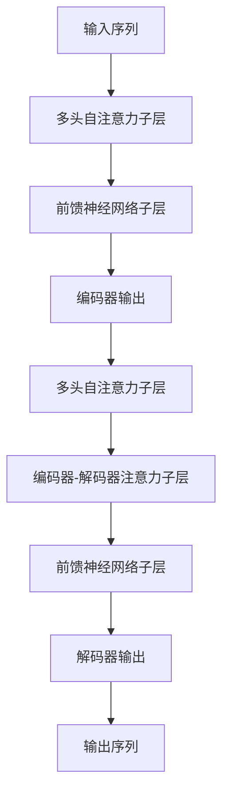
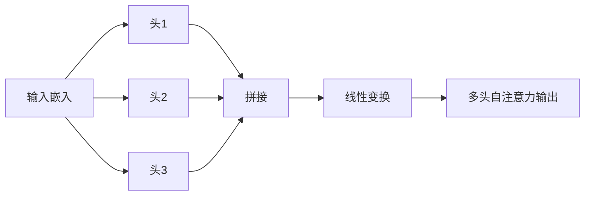

# 大模型体系结构探索：解构AI LLM的内部工作机制

## 1. 背景介绍

### 1.1 人工智能的新时代

人工智能(AI)已经成为当前科技领域最炙手可热的话题。近年来,AI取得了长足的进步,尤其是在自然语言处理(NLP)和计算机视觉等领域,AI系统展现出了令人惊叹的能力。其中,大型语言模型(Large Language Model,LLM)的出现,标志着AI进入了一个新的里程碑。

### 1.2 大型语言模型的崛起

大型语言模型是一种基于深度学习的自然语言处理模型,能够从海量文本数据中学习语言知识和模式。这些模型通过消化大量的文本数据,掌握了丰富的语言表达能力,可以生成看似人类水平的自然语言输出。

代表性的大型语言模型包括GPT-3、BERT、XLNet等,它们在各种自然语言处理任务中表现出色,如文本生成、机器翻译、问答系统等。这些模型的出现,不仅推动了AI在自然语言处理领域的发展,也引发了广泛的关注和讨论。

### 1.3 探索大模型内部机制的重要性

尽管大型语言模型取得了令人瞩目的成就,但它们内部的工作机制却仍然是一个黑箱。理解这些模型的内部架构和运作原理,对于进一步提高模型的性能、可解释性和可靠性至关重要。

本文将深入探讨大型语言模型的体系结构,剖析其内部的核心概念、算法原理和数学模型,并通过实例和应用场景,帮助读者全面了解这一前沿技术的工作机制。

## 2. 核心概念与联系

### 2.1 自注意力机制(Self-Attention)

自注意力机制是大型语言模型中的核心概念之一。它允许模型在处理序列数据(如文本)时,捕捉远距离的依赖关系,从而更好地理解上下文信息。

自注意力机制的工作原理是,对于每个输入token,模型会计算它与其他所有token之间的相关性分数(注意力分数)。然后,根据这些分数,对所有token的表示进行加权求和,得到该token的新表示。这种机制使得模型能够同时关注序列中的所有位置,而不是像传统的循环神经网络那样,只能关注局部上下文。

自注意力机制可以用以下公式表示:

$$\text{Attention}(Q, K, V) = \text{softmax}(\frac{QK^T}{\sqrt{d_k}})V$$

其中,Q(Query)、K(Key)和V(Value)分别代表查询向量、键向量和值向量,它们都是通过线性变换得到的。$d_k$是缩放因子,用于防止点积过大导致的梯度消失问题。

### 2.2 transformer 架构

Transformer是一种全新的序列到序列(Sequence-to-Sequence)模型架构,它完全基于自注意力机制,不使用任何形式的循环或卷积操作。Transformer架构被广泛应用于大型语言模型中,如GPT、BERT等。

Transformer的核心组件包括编码器(Encoder)和解码器(Decoder)。编码器将输入序列映射到一系列连续的表示,而解码器则根据这些表示生成输出序列。两者都由多个相同的层组成,每一层都包含多头自注意力子层和前馈神经网络子层。



上图展示了Transformer架构的基本结构。值得注意的是,解码器中还包含一个编码器-解码器注意力子层,用于将解码器的表示与编码器的输出进行关联。

### 2.3 预训练与微调(Pre-training & Fine-tuning)

大型语言模型通常采用两阶段的训练策略:预训练(Pre-training)和微调(Fine-tuning)。

在预训练阶段,模型会在大规模的无监督文本数据(如网页、书籍等)上进行训练,目标是学习通用的语言表示。常见的预训练目标包括掩码语言模型(Masked Language Modeling)和下一句预测(Next Sentence Prediction)等。

在微调阶段,预训练好的模型会在特定的下游任务数据集(如文本分类、机器翻译等)上进行进一步的训练,以适应具体的任务需求。在这个阶段,模型的大部分参数会被冻结,只有少量参数(如输出层)会被微调。

这种预训练与微调的策略,可以有效地将通用的语言知识迁移到特定的任务中,从而显著提高模型的性能。

## 3. 核心算法原理具体操作步骤

### 3.1 自注意力计算过程

自注意力机制是大型语言模型中最关键的算法之一,它的计算过程包括以下几个步骤:

1. **查询(Query)、键(Key)和值(Value)的计算**

   对于每个输入token,模型会通过线性变换将其嵌入向量映射到查询(Q)、键(K)和值(V)向量。

   $$Q = XW_Q, K = XW_K, V = XW_V$$

   其中,X是输入的嵌入矩阵,而$W_Q$、$W_K$和$W_V$是可学习的权重矩阵。

2. **注意力分数的计算**

   计算查询向量Q与所有键向量K的点积,并对结果进行缩放和softmax操作,得到注意力分数矩阵。

   $$\text{Attention}(Q, K, V) = \text{softmax}(\frac{QK^T}{\sqrt{d_k}})V$$

   其中,$d_k$是缩放因子,用于防止点积过大导致的梯度消失问题。

3. **注意力加权求和**

   使用注意力分数矩阵对值向量V进行加权求和,得到每个输入token的新表示。

   $$\text{Attention Output} = \text{Attention}(Q, K, V)$$

4. **残差连接与层归一化**

   将注意力输出与输入进行残差连接,并应用层归一化操作,以保持数据分布的稳定性。

### 3.2 多头自注意力机制

单一的自注意力机制可能会捕捉不到所有的依赖关系。为了解决这个问题,Transformer引入了多头自注意力(Multi-Head Attention)机制。

多头自注意力将查询(Q)、键(K)和值(V)进行线性变换,得到多组Q、K和V,然后并行地计算多个自注意力头。最后,将所有头的输出进行拼接,并经过另一个线性变换,得到最终的多头自注意力输出。



多头自注意力机制可以让模型同时关注不同的子空间表示,从而提高模型的表达能力和性能。

### 3.3 位置编码(Positional Encoding)

由于自注意力机制没有显式地捕捉序列的位置信息,因此需要引入位置编码(Positional Encoding)来为每个token提供位置信息。

常见的位置编码方法是使用正弦和余弦函数,为每个位置生成一个固定的向量表示。具体公式如下:

$$
\begin{aligned}
\text{PE}_{(pos, 2i)} &= \sin\left(pos / 10000^{2i / d_\text{model}}\right) \\
\text{PE}_{(pos, 2i+1)} &= \cos\left(pos / 10000^{2i / d_\text{model}}\right)
\end{aligned}
$$

其中,pos是token的位置,$i$是维度的索引,$d_\text{model}$是模型的维度大小。

位置编码向量会直接添加到输入的嵌入向量中,从而为模型提供位置信息。

## 4. 数学模型和公式详细讲解举例说明

在上一节中,我们介绍了大型语言模型中的核心算法原理,包括自注意力机制、多头自注意力和位置编码。现在,让我们通过具体的数学模型和公式,深入探讨这些概念的细节。

### 4.1 自注意力机制的数学模型

回顾一下自注意力机制的计算公式:

$$\text{Attention}(Q, K, V) = \text{softmax}(\frac{QK^T}{\sqrt{d_k}})V$$

其中,Q(Query)、K(Key)和V(Value)分别代表查询向量、键向量和值向量。$d_k$是缩放因子,用于防止点积过大导致的梯度消失问题。

让我们用一个具体的例子来说明这个过程。假设我们有一个长度为4的输入序列,每个token的嵌入维度为3。则Q、K和V的形状分别为(4, 3)。

```python
import numpy as np

# 输入嵌入
X = np.array([[1, 2, 3],
              [4, 5, 6],
              [7, 8, 9],
              [10, 11, 12]])

# 线性变换得到 Q, K, V
W_Q = np.random.randn(3, 3)
W_K = np.random.randn(3, 3)
W_V = np.random.randn(3, 3)

Q = np.dot(X, W_Q)
K = np.dot(X, W_K)
V = np.dot(X, W_V)

# 计算注意力分数
scores = np.dot(Q, K.T) / np.sqrt(3)
attention_weights = np.exp(scores) / np.sum(np.exp(scores), axis=-1, keepdims=True)

# 注意力加权求和
attention_output = np.dot(attention_weights, V)
```

在上面的示例中,我们首先通过线性变换得到Q、K和V。然后,我们计算Q和K的点积,并对结果进行缩放和softmax操作,得到注意力分数矩阵`attention_weights`。最后,我们使用`attention_weights`对V进行加权求和,得到最终的注意力输出`attention_output`。

需要注意的是,在实际的大型语言模型中,Q、K和V通常是通过不同的线性变换得到的,而不是共享同一个权重矩阵。此外,还会引入多头自注意力机制和位置编码,以提高模型的表现力。

### 4.2 多头自注意力的数学模型

多头自注意力机制可以用以下公式表示:

$$\text{MultiHead}(Q, K, V) = \text{Concat}(\text{head}_1, \ldots, \text{head}_h)W^O$$
$$\text{where, head}_i = \text{Attention}(QW_i^Q, KW_i^K, VW_i^V)$$

其中,$h$是头的数量,而$W_i^Q$、$W_i^K$和$W_i^V$分别是第$i$个头的查询、键和值的线性变换矩阵。$W^O$是最终的线性变换矩阵,用于将所有头的输出拼接在一起。

让我们用一个简单的例子来说明多头自注意力的计算过程。假设我们有一个长度为2的输入序列,每个token的嵌入维度为4,并且我们使用2个注意力头。

```python
import numpy as np

# 输入嵌入
X = np.array([[1, 2, 3, 4],
              [5, 6, 7, 8]])

# 线性变换得到 Q, K, V
W_Q1 = np.random.randn(4, 2)
W_K1 = np.random.randn(4, 2)
W_V1 = np.random.randn(4, 2)

W_Q2 = np.random.randn(4, 2)
W_K2 = np.random.randn(4, 2)
W_V2 = np.random.randn(4, 2)

Q1 = np.dot(X, W_Q1)
K1 = np.dot(X, W_K1)
V1 = np.dot(X, W_V1)

Q2 = np.dot(X, W_Q2)
K2 = np.dot(X, W_K2)
V2 = np.dot(X, W_V2)

# 计算注意力头
head1 = np.dot(np.dot(Q