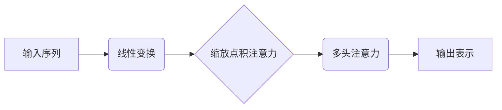
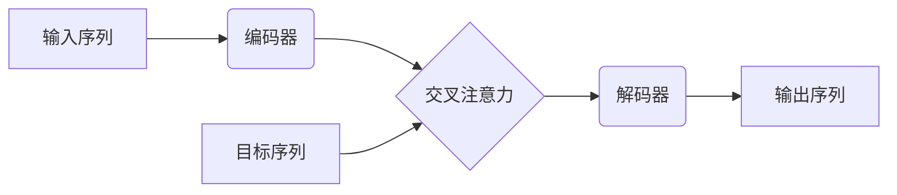
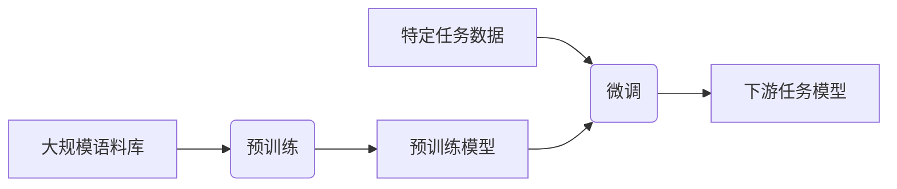

# 大规模语言模型从理论到实践 实践思考

## 1.背景介绍

### 1.1 语言模型的发展历程

语言模型是自然语言处理领域的核心技术之一,它旨在学习和捕捉人类语言的统计规律。传统的语言模型主要基于 N-gram 模型,通过统计语料库中单词序列的共现概率来预测下一个单词。然而,N-gram 模型受限于数据稀疏和上下文窗口大小的问题,难以捕捉长距离依赖关系。

近年来,benefiting from 大规模语料库和强大的计算能力,神经网络语言模型(Neural Network Language Model, NNLM)逐渐取代了传统的 N-gram 模型,成为主流方法。NNLM 能够自动学习分布式词向量表示,捕捉单词之间的语义和句法关系,显著提高了语言模型的性能。

### 1.2 大规模语言模型的兴起

随着模型规模和训练数据的不断扩大,大规模语言模型(Large Language Model, LLM)应运而生,代表模型包括 GPT、BERT、XLNet 等。这些模型通过预训练的方式学习海量无标注语料,获得了强大的语言理解和生成能力,可以广泛应用于自然语言处理的各种下游任务中。

大规模语言模型的出现,不仅推动了自然语言处理技术的飞速发展,也为人工智能系统赋予了更强的语言理解和交互能力。然而,训练和应用大规模语言模型也面临着诸多挑战,如模型效率、安全性、可解释性等,这些问题都值得我们深入探讨和思考。

## 2.核心概念与联系  

### 2.1 自注意力机制

自注意力机制(Self-Attention)是大规模语言模型的核心组件之一。与传统的循环神经网络(RNN)不同,自注意力机制能够直接捕捉输入序列中任意两个位置之间的关系,更好地建模长距离依赖。

在自注意力机制中,每个输入元素都会与其他元素进行注意力加权,生成一个注意力向量。该向量能够自适应地捕捉输入序列中最相关的信息,从而更好地表示当前元素。

自注意力机制可以通过多头注意力(Multi-Head Attention)的方式进一步增强表示能力,不同的注意力头捕捉不同的依赖关系。



### 2.2 transformer 架构

Transformer 是第一个完全基于自注意力机制的序列到序列模型,它彻底摒弃了 RNN 结构,使用多层编码器-解码器架构来建模输入和输出序列之间的关系。

在 Transformer 的编码器部分,输入序列经过多层自注意力和前馈网络的处理,生成高维的序列表示。解码器则在编码器的基础上,增加了对已生成序列的自注意力,以及对输入序列的交叉注意力,从而实现序列到序列的转换。

Transformer 架构的关键优势在于并行计算能力强、能够更好地捕捉长距离依赖,以及具有更好的泛化性能。它成为了后续大规模语言模型的基础架构。



### 2.3 预训练与微调

大规模语言模型通常采用预训练与微调(Pre-training and Fine-tuning)的范式进行训练。在预训练阶段,模型会在大规模无标注语料库上进行自监督学习,捕捉通用的语言知识。而在微调阶段,预训练模型会在特定的下游任务数据上进行进一步训练,使其适应具体的应用场景。

预训练的目标通常包括掩蔽语言模型(Masked Language Model)和下一句预测(Next Sentence Prediction)等,旨在让模型学习理解和生成自然语言。而微调阶段则根据不同的任务,设计相应的训练目标和损失函数。

预训练与微调范式的优势在于,可以利用大规模无标注数据学习通用的语言表示,降低了对大量标注数据的依赖,同时也提高了模型的泛化能力。



## 3.核心算法原理具体操作步骤

### 3.1 transformer 编码器

Transformer 编码器的核心是多头自注意力机制和前馈网络。具体操作步骤如下:

1. **输入嵌入**:将输入序列转换为嵌入向量表示。
2. **位置编码**:为每个位置添加位置信息,捕捉序列的位置依赖关系。
3. **多头自注意力**:
    - 线性投影:将输入分别投影到查询(Query)、键(Key)和值(Value)空间。
    - 缩放点积注意力:计算查询和所有键的点积,除以缩放因子,得到注意力分数。
    - 注意力加权:使用注意力分数对值向量进行加权求和,得到注意力输出。
    - 多头组合:将多个注意力头的输出进行拼接,捕捉不同的依赖关系。
4. **残差连接与归一化**:将注意力输出与输入相加,进行归一化。
5. **前馈网络**:包含两个全连接层,对序列进行非线性变换。
6. **残差连接与归一化**:将前馈网络输出与输入相加,进行归一化。
7. **堆叠编码器层**:重复上述步骤,构建多层编码器。

通过多层编码器的处理,输入序列被转换为高维的上下文表示,为后续的解码器提供信息。

### 3.2 transformer 解码器

Transformer 解码器在编码器的基础上,增加了对输出序列的自注意力和对输入序列的交叉注意力。具体操作步骤如下:

1. **输出嵌入与位置编码**:将输出序列转换为嵌入向量表示,并添加位置编码。
2. **掩蔽自注意力**:对输出序列进行自注意力,但遮蔽未来位置的信息,保证自回归属性。
3. **残差连接与归一化**:将自注意力输出与输入相加,进行归一化。
4. **多头交叉注意力**:
    - 线性投影:将输出序列和编码器输出分别投影到查询、键和值空间。
    - 缩放点积注意力:计算查询与编码器输出键的注意力分数。
    - 注意力加权:使用注意力分数对编码器输出值进行加权求和。
    - 多头组合:将多个注意力头的输出进行拼接。
5. **残差连接与归一化**:将交叉注意力输出与输入相加,进行归一化。
6. **前馈网络**:包含两个全连接层,对序列进行非线性变换。
7. **残差连接与归一化**:将前馈网络输出与输入相加,进行归一化。
8. **线性映射与softmax**:将解码器输出映射到词汇空间,得到下一个词的概率分布。
9. **堆叠解码器层**:重复上述步骤,构建多层解码器。

通过自注意力和交叉注意力,解码器能够综合输出序列和编码器输出的信息,生成下一个词的概率分布,实现序列到序列的转换。

## 4.数学模型和公式详细讲解举例说明

### 4.1 缩放点积注意力

缩放点积注意力是自注意力机制的核心计算单元,它能够捕捉查询(Query)与键(Key)之间的相关性,并根据相关性对值(Value)进行加权求和。具体计算公式如下:

$$\begin{aligned}
\text{Attention}(Q, K, V) &= \text{softmax}\left(\frac{QK^T}{\sqrt{d_k}}\right)V \\
\text{head}_i &= \text{Attention}\left(QW_i^Q, KW_i^K, VW_i^V\right)
\end{aligned}$$

其中,Q、K、V分别表示查询、键和值,通过线性变换 $W_i^Q$、$W_i^K$、$W_i^V$ 投影到不同的子空间。$d_k$ 是缩放因子,用于防止点积值过大导致梯度饱和。

softmax 函数用于计算注意力分数,确保分数之和为 1:

$$\text{softmax}(x_i) = \frac{\exp(x_i)}{\sum_j \exp(x_j)}$$

多头注意力通过拼接多个注意力头的输出,捕捉不同的依赖关系:

$$\text{MultiHead}(Q, K, V) = \text{Concat}(\text{head}_1, \ldots, \text{head}_h)W^O$$

其中,$W^O$ 是一个可训练的线性变换,用于将多头注意力输出映射回模型的隐状态空间。

缩放点积注意力的优点在于计算高效、能够直接捕捉任意距离的依赖关系,并且通过多头机制增强了表示能力。

### 4.2 transformer 损失函数

在预训练阶段,transformer 模型通常采用掩蔽语言模型(Masked Language Model, MLM)和下一句预测(Next Sentence Prediction, NSP)两个任务进行训练,损失函数为:

$$\mathcal{L} = \mathcal{L}_\text{MLM} + \lambda \mathcal{L}_\text{NSP}$$

其中,$ \lambda $ 是平衡两个任务的超参数。

**掩蔽语言模型**:在输入序列中随机掩蔽部分词元,模型需要预测掩蔽位置的词元。损失函数为:

$$\mathcal{L}_\text{MLM} = -\frac{1}{N}\sum_{i=1}^N \log P(w_i^\text{masked}|w_1, \ldots, w_{i-1}, w_{i+1}, \ldots, w_T)$$

其中,N 是掩蔽词元的数量,T 是序列长度。

**下一句预测**:给定两个句子 A 和 B,模型需要预测 B 是否为 A 的下一句。损失函数为:

$$\mathcal{L}_\text{NSP} = -\log P(y|A, B)$$

其中,y 是二分类标签(IsNext 或 NotNext)。

在微调阶段,根据不同的下游任务设计相应的损失函数,如序列生成任务的交叉熵损失、序列标注任务的 CRF 损失等。

## 5.项目实践:代码实例和详细解释说明

为了更好地理解 transformer 模型的原理和实现,我们提供了一个基于 PyTorch 的代码示例,实现了一个简化版的 transformer 编码器。

### 5.1 模型定义

```python
import torch
import torch.nn as nn

class TransformerEncoder(nn.Module):
    def __init__(self, input_dim, hidden_dim, num_heads, num_layers, dropout=0.1):
        super(TransformerEncoder, self).__init__()
        self.input_dim = input_dim
        self.hidden_dim = hidden_dim
        self.num_heads = num_heads
        self.num_layers = num_layers
        
        self.embedding = nn.Embedding(input_dim, hidden_dim)
        self.pos_encoder = PositionalEncoding(hidden_dim)
        
        encoder_layers = nn.TransformerEncoderLayer(hidden_dim, num_heads, hidden_dim * 4, dropout)
        self.encoder = nn.TransformerEncoder(encoder_layers, num_layers)
        
    def forward(self, input_seq):
        embedding = self.embedding(input_seq)
        pos_encoding = self.pos_encoder(embedding)
        output = self.encoder(pos_encoding)
        return output

class PositionalEncoding(nn.Module):
    def __init__(self, d_model, max_len=5000):
        super(PositionalEncoding, self).__init__()
        pe = torch.zeros(max_len, d_model)
        position = torch.arange(0, max_len, dtype=torch.float).unsqueeze(1)
        div_term = torch.exp(torch.arange(0, d_model, 2).float() * (-math.log(10000.0) / d_model))
        pe[:, 0::2] = torch.sin(position * div_term)
        pe[:, 1::2] = torch.cos(position * div_term)
        pe = pe.unsqueeze(0)
        