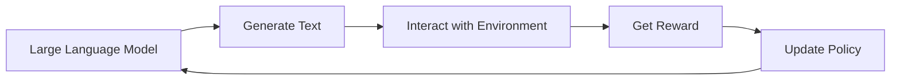
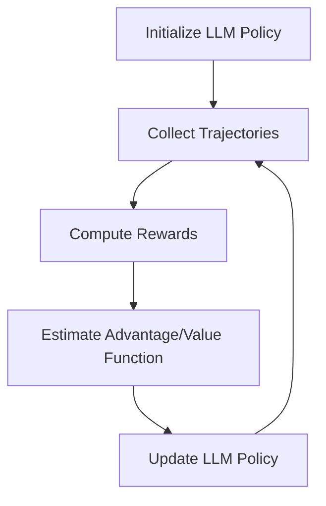

# 大规模语言模型从理论到实践 强化学习概述

## 1.背景介绍
### 1.1 大规模语言模型的兴起
近年来,随着深度学习技术的快速发展,大规模语言模型(Large Language Models, LLMs)在自然语言处理(Natural Language Processing, NLP)领域取得了突破性进展。从2018年的BERT到2020年的GPT-3,再到最近的PaLM、Chinchilla等模型,LLMs展现出了惊人的语言理解和生成能力,引发了学术界和工业界的广泛关注。

### 1.2 强化学习在LLMs中的应用
尽管LLMs在许多NLP任务上取得了优异的性能,但它们主要还是基于监督学习范式进行预训练和微调。为了进一步提升LLMs的性能,尤其是在面对开放域对话、问答等需要推理和决策能力的任务时,研究者们开始将强化学习(Reinforcement Learning, RL)引入到LLMs的训练中。通过RL,LLMs可以在与环境的交互中不断学习和优化策略,从而生成更加合理、连贯、符合人类偏好的文本。

### 1.3 本文的主要内容
本文将全面介绍将强化学习应用于大规模语言模型的理论基础和实践进展。我们将首先介绍LLMs和RL的核心概念,然后详细阐述将RL用于LLMs训练的算法原理、数学模型以及代码实现。此外,我们还将讨论RL在LLMs中的实际应用场景,推荐相关的工具和资源,并展望该领域的未来发展趋势和挑战。

## 2.核心概念与联系
### 2.1 大规模语言模型
大规模语言模型是指基于海量文本数据进行预训练,具有亿级以上参数规模的深度神经网络模型。典型的LLMs架构包括Transformer的编码器(如BERT)、解码器(如GPT)或编码器-解码器(如T5)。LLMs通过自监督学习(如掩码语言建模、因果语言建模等)来学习语言的统计规律和语义表示,可以在下游任务上进行微调或零样本学习,展现出强大的语言理解和生成能力。

### 2.2 强化学习
强化学习是机器学习的三大范式之一(另外两个是监督学习和无监督学习),旨在让智能体(Agent)通过与环境(Environment)的交互来学习最优策略(Policy),以最大化累积奖励(Reward)。RL的核心要素包括状态(State)、动作(Action)、奖励函数(Reward Function)和价值函数(Value Function)。常见的RL算法有Q-learning、策略梯度(Policy Gradient)、演员-评论家(Actor-Critic)等。

### 2.3 LLMs与RL的结合
将强化学习应用于大规模语言模型,可以让LLMs在生成文本的过程中动态地调整策略,以优化某个特定的目标(如相关性、连贯性、安全性等)。具体而言,我们可以将LLM看作RL中的策略网络,将文本生成过程看作一个序列决策问题。在每个时间步,LLM根据当前的状态(即已生成的文本)和策略选择下一个单词(动作),并根据生成的完整文本获得相应的奖励。通过不断地与"环境"(如人类反馈、预定义的奖励函数等)交互,LLM可以逐步优化其生成策略。

下图展示了将RL用于LLMs训练的总体架构:



## 3.核心算法原理具体操作步骤
将强化学习应用于大规模语言模型的训练,主要有以下几个关键步骤:

### 3.1 定义状态空间和动作空间
- 状态空间:通常为LLM在每个时间步已生成的文本序列。可以使用LLM的隐藏状态作为状态表示。
- 动作空间:即LLM在每个时间步可以选择的下一个单词。可以是整个词表,也可以通过一些策略(如Top-k采样、Nucleus采样等)进行限制。

### 3.2 设计奖励函数
奖励函数用于评估LLM生成的文本质量,引导模型朝着期望的方向优化。常见的奖励函数设计方法包括:
- 基于人类反馈的奖励:让人类对LLM生成的文本进行打分或排序,将其作为奖励信号。
- 基于预定义指标的奖励:如相关性、流畅性、安全性等,可以使用一些自动评估指标(如BLEU、Perplexity等)来计算奖励。
- 结合人类反馈和预定义指标的奖励:将两种奖励进行加权组合,兼顾主观评价和客观指标。

### 3.3 选择RL算法并训练
根据任务特点和需求,选择适当的RL算法对LLM进行训练。常用的算法包括:
- 策略梯度:直接对LLM的参数进行梯度上升,以最大化期望奖励。代表算法有REINFORCE、PPO等。
- 演员-评论家:引入价值网络(Critic)来估计状态-动作值函数,指导策略网络(Actor,即LLM)的更新。代表算法有A2C、SAC等。
- 逆强化学习:通过学习人类专家的行为来推断奖励函数,再用于指导策略学习。代表算法有GAIL、AIRL等。

在训练过程中,我们通过让LLM与环境交互,收集轨迹数据,并根据RL算法的更新规则对LLM的参数进行调整。通常需要多轮迭代才能达到满意的效果。

### 3.4 评估与部署
在训练完成后,我们需要对强化学习得到的LLM进行全面的评估,包括在目标任务上的性能表现,以及生成文本的质量、安全性等。评估通过后,就可以将优化后的LLM部署到实际应用中。

下面是将RL用于LLMs训练的一个典型算法流程图:



## 4.数学模型和公式详细讲解举例说明
在这一节,我们将详细介绍将强化学习应用于大规模语言模型训练的数学模型和公式。以策略梯度算法为例,我们的目标是最大化期望奖励:

$$J(\theta) = \mathbb{E}_{\tau \sim \pi_{\theta}}[R(\tau)]$$

其中,$\theta$表示LLM的参数,$\pi_{\theta}$表示LLM策略,$\tau$表示一条完整的文本生成轨迹,$R(\tau)$表示该轨迹的累积奖励。

根据策略梯度定理,我们可以通过以下公式来更新LLM的参数:

$$\nabla_{\theta}J(\theta) = \mathbb{E}_{\tau \sim \pi_{\theta}}[\sum_{t=0}^{T-1} \nabla_{\theta}\log \pi_{\theta}(a_t|s_t)A^{\pi_{\theta}}(s_t,a_t)]$$

其中,$s_t$表示第$t$步的状态(已生成的文本),$a_t$表示第$t$步的动作(生成的下一个单词),$A^{\pi_{\theta}}(s_t,a_t)$表示优势函数,用于评估在状态$s_t$下选择动作$a_t$的优劣程度。

举个例子,假设我们要训练一个基于GPT-2的LLM,使其能够生成相关性高、流畅性好的文本。我们可以设计如下的奖励函数:

$$R(\tau) = \alpha \cdot \text{Relevance}(\tau) + \beta \cdot \text{Fluency}(\tau)$$

其中,Relevance和Fluency分别表示生成文本的相关性和流畅性得分(可以使用一些自动评估指标来计算),α和β为权重系数。

在每个训练步骤中,我们首先让LLM生成一批文本轨迹$\{\tau_i\}_{i=1}^N$,然后计算每条轨迹的奖励$R(\tau_i)$。接着,我们估计优势函数$A^{\pi_{\theta}}(s_t,a_t)$(可以使用蒙特卡洛估计或价值网络估计),并根据上述策略梯度公式来更新LLM的参数$\theta$。重复这一过程,直到LLM的生成质量达到预期要求。

## 5.项目实践:代码实例和详细解释说明
下面,我们通过一个简单的PyTorch代码实例,来演示如何使用强化学习来训练一个基于GPT-2的语言模型。

```python
import torch
import torch.nn as nn
import torch.optim as optim
from transformers import GPT2LMHeadModel, GPT2Tokenizer

# 加载预训练的GPT-2模型和tokenizer
model = GPT2LMHeadModel.from_pretrained('gpt2')
tokenizer = GPT2Tokenizer.from_pretrained('gpt2')

# 定义奖励函数(这里只是一个示例,实际应用中需要根据任务设计合适的奖励函数)
def reward_function(generated_text):
    # 计算生成文本的相关性和流畅性得分
    relevance_score = ...
    fluency_score = ...
    
    # 组合得分作为奖励
    reward = 0.5 * relevance_score + 0.5 * fluency_score
    return reward

# 定义优化器
optimizer = optim.Adam(model.parameters(), lr=1e-5)

# 训练循环
for epoch in range(num_epochs):
    for batch in data_loader:
        # 生成文本
        input_ids = batch['input_ids'].to(device)
        attention_mask = batch['attention_mask'].to(device)
        generated_outputs = model.generate(input_ids, attention_mask=attention_mask, max_length=100, num_return_sequences=1)
        generated_text = tokenizer.decode(generated_outputs[0], skip_special_tokens=True)
        
        # 计算奖励
        reward = reward_function(generated_text)
        
        # 计算损失(这里使用了蒙特卡洛估计)
        log_probs = model(input_ids, attention_mask=attention_mask, labels=generated_outputs).logits
        loss = -log_probs * reward
        
        # 反向传播和优化
        optimizer.zero_grad()
        loss.backward()
        optimizer.step()
```

在这个例子中,我们首先加载了预训练的GPT-2模型和tokenizer。然后,我们定义了一个简单的奖励函数`reward_function`,用于计算生成文本的相关性和流畅性得分,并将它们组合成最终的奖励值。

在训练循环中,我们从数据集中取出一个批次的输入数据,并使用GPT-2模型生成相应的文本。接着,我们调用`reward_function`计算生成文本的奖励值。然后,我们计算模型的对数概率输出,并将其与奖励值相乘作为损失函数(这里使用了蒙特卡洛估计)。最后,我们进行反向传播和优化步骤,更新模型参数。

以上只是一个简化版的示例,实际应用中还需要考虑更多细节,如奖励函数的设计、优势函数的估计、探索与利用的平衡等。此外,我们还可以使用更高级的RL算法(如PPO、SAC等)来提升训练效果和稳定性。

## 6.实际应用场景
将强化学习应用于大规模语言模型,可以在多个实际场景中带来性能提升和价值创造,例如:

### 6.1 开放域对话系统
传统的开放域对话系统通常使用检索或生成式方法,难以生成高质量、连贯、符合人类偏好的回复。通过RL,我们可以让对话系统在与用户的交互中不断学习和优化策略,从而生成更加自然、吸引人的对话内容。

### 6.2 智能写作助手
智能写作助手旨在帮助用户自动生成文章、新闻、报告等各类文本内容。传统的生成模型往往难以把控文本的主题相关性、逻辑连贯性等特征。引入RL,可以让写作助手根据用户的反馈和预定义的质量指标来优化生成策略,提升写作效率和质量。

### 6.3 个性化推荐系统
个性化推荐系统需要根据用户的历史行为和偏好,生成符合其兴趣的商品、内容等推荐