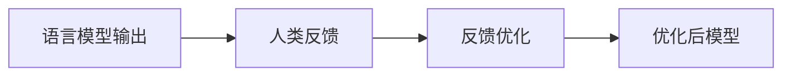

# 大规模语言模型从理论到实践 自动构建指令

## 1. 背景介绍

### 1.1 语言模型的重要性

语言模型是自然语言处理领域的基础技术之一,它可以学习语言的统计规律,并根据上下文预测下一个单词或句子的概率。随着深度学习技术的发展,大规模语言模型已经成为构建各种自然语言处理应用的关键基础。

### 1.2 大规模语言模型的兴起

近年来,benefitting from大量数据、强大的计算能力和创新的深度学习算法,大规模语言模型取得了突破性进展。代表性模型包括 GPT(Generative Pre-trained Transformer)、BERT(Bidirectional Encoder Representations from Transformers)、XLNet 等,展现出了优秀的语言理解和生成能力。

### 1.3 自动构建指令的重要性

虽然大规模语言模型表现出色,但它们仍然存在一些缺陷,如生成内容的不一致性、缺乏常识推理能力等。为了更好地利用语言模型的潜力,研究人员提出了自动构建指令(Automatic Instruction Building)的概念,旨在使语言模型能够根据指令生成更加准确、连贯和有意义的输出。

## 2. 核心概念与联系

### 2.1 指令跟踪(Instruction Following)

指令跟踪是自动构建指令的核心概念。它要求语言模型能够理解和执行给定的指令,生成与指令相符的输出。这种能力对于构建可靠的人工智能系统至关重要。


### 2.2 指令学习(Instruction Learning)

指令学习是实现自动构建指令的关键步骤。它涉及训练语言模型理解和遵循各种指令,从而生成所需的输出。这通常需要大量的指令-输出对进行监督学习。


### 2.3 反馈优化(Feedback Optimization)

反馈优化是指令学习的一种扩展,它利用人类反馈(如评分或纠正)来进一步优化语言模型的输出质量。通过不断的反馈和调整,模型可以更好地满足指令要求。



### 2.4 指令生成(Instruction Generation)

除了遵循给定的指令,一些研究还探索了自动生成指令的可能性。这种方法可以帮助语言模型更好地理解任务,并生成更加准确和相关的输出。


## 3. 核心算法原理具体操作步骤

### 3.1 指令跟踪算法

指令跟踪算法的目标是训练语言模型能够理解和执行给定的指令。一种常见的方法是使用序列到序列(Seq2Seq)模型,将指令作为输入,期望输出为所需的结果。

1. 准备指令-输出对数据集
2. 使用Transformer等Seq2Seq模型进行训练
3. 在训练过程中,模型学习将指令映射到相应输出
4. 在推理阶段,给定新的指令,模型生成相应的输出

### 3.2 指令学习算法

指令学习算法旨在提高语言模型遵循指令的能力。一种常见的方法是使用强化学习,将遵循指令的行为作为奖励信号。

1. 初始化一个基于语言模型的策略网络
2. 定义奖励函数,衡量输出是否符合指令要求
3. 使用策略梯度等强化学习算法进行训练
4. 在训练过程中,策略网络学习生成符合指令的输出
5. 在推理阶段,策略网络生成指令相关的输出

### 3.3 反馈优化算法

反馈优化算法利用人类反馈来进一步优化语言模型的输出质量。一种常见的方法是使用监督细化(Supervised Fine-tuning)。

1. 收集语言模型的初始输出和人类反馈(评分或纠正)
2. 将输出和反馈构建为新的训练数据
3. 在新数据上进行模型微调(Fine-tuning)
4. 在推理阶段,微调后的模型生成更符合要求的输出

### 3.4 指令生成算法

指令生成算法旨在自动生成指令,以帮助语言模型更好地理解和完成任务。一种常见的方法是使用序列到序列模型。

1. 准备任务描述和对应指令的数据集
2. 使用Transformer等Seq2Seq模型进行训练
3. 在训练过程中,模型学习将任务描述映射到指令
4. 在推理阶段,给定新的任务描述,模型生成相应的指令
5. 将生成的指令输入到语言模型,生成最终输出

## 4. 数学模型和公式详细讲解举例说明

### 4.1 语言模型的基本原理

语言模型的目标是估计一个句子 $S = (w_1, w_2, \dots, w_n)$ 的概率 $P(S)$。根据链式法则,我们可以将其分解为:

$$P(S) = P(w_1, w_2, \dots, w_n) = \prod_{i=1}^n P(w_i | w_1, \dots, w_{i-1})$$

其中 $P(w_i | w_1, \dots, w_{i-1})$ 表示在给定前 $i-1$ 个词的情况下,第 $i$ 个词出现的条件概率。

神经网络语言模型通常使用 RNN 或 Transformer 等架构来建模上下文信息,并预测下一个词的概率分布。

### 4.2 Transformer 模型

Transformer 是一种常用的序列到序列模型,广泛应用于自然语言处理任务。它的核心思想是使用自注意力(Self-Attention)机制来捕获序列中元素之间的依赖关系。

对于一个长度为 $n$ 的序列 $X = (x_1, x_2, \dots, x_n)$,自注意力机制计算每个元素 $x_i$ 与其他元素的相关性得分,并根据这些得分对元素进行加权求和,得到 $x_i$ 的新表示 $z_i$:

$$z_i = \sum_{j=1}^n \alpha_{ij}(x_j W^V)$$

其中 $W^V$ 是一个可学习的值矩阵, $\alpha_{ij}$ 是 $x_i$ 与 $x_j$ 的相关性得分,可以通过以下公式计算:

$$\alpha_{ij} = \frac{\exp(e_{ij})}{\sum_{k=1}^n \exp(e_{ik})}, \quad e_{ij} = (x_i W^Q)(x_j W^K)^T$$

$W^Q$ 和 $W^K$ 分别是可学习的查询矩阵和键矩阵。

通过多头自注意力(Multi-Head Attention)和层归一化(Layer Normalization)等技术,Transformer 模型可以有效地捕获长距离依赖关系,并展现出优秀的性能。

### 4.3 强化学习在指令学习中的应用

在指令学习中,我们可以将语言模型视为一个策略 $\pi_\theta$,其输出序列 $Y = (y_1, y_2, \dots, y_m)$ 是根据指令 $X$ 生成的。我们的目标是最大化期望奖励 $\mathbb{E}_{\pi_\theta}[R(Y, X)]$,其中 $R(Y, X)$ 是一个衡量输出 $Y$ 是否符合指令 $X$ 要求的奖励函数。

我们可以使用策略梯度算法来优化策略参数 $\theta$:

$$\nabla_\theta J(\theta) = \mathbb{E}_{\pi_\theta}[\nabla_\theta \log \pi_\theta(Y|X)R(Y, X)]$$

其中 $J(\theta)$ 是目标函数,等于期望奖励的估计值。

通过不断采样输出序列 $Y$,计算相应的奖励 $R(Y, X)$,并根据上述公式更新策略参数 $\theta$,语言模型就可以逐步学习生成符合指令要求的输出。

## 5. 项目实践:代码实例和详细解释说明

在这一部分,我们将展示如何使用 Hugging Face 的 Transformers 库来实现一个简单的指令跟踪模型。我们将使用 BART 模型作为基础,并在一个小型数据集上进行微调。

### 5.1 准备数据

我们将使用一个包含指令-输出对的小型数据集。每个样本由一个指令和一个对应的输出组成。

```python
data = [
    {"instruction": "将以下句子翻译成英文:我今天很高兴。", "output": "I am very happy today."},
    {"instruction": "用一个词概括以下句子的意思:今天是个阳光明媚的日子。", "output": "晴朗"},
    # 更多样本...
]
```

### 5.2 定义数据预处理函数

我们需要定义一个函数来将指令和输出拼接成模型可以接受的格式。

```python
def preprocess_data(examples):
    inputs = [f"Instruction: {ins['instruction']} Output:" for ins in examples]
    targets = [f"{ins['output']}" for ins in examples]
    model_inputs = tokenizer(inputs, max_length=1024, truncation=True)

    labels = tokenizer(text_target=targets, max_length=1024, truncation=True)
    labels = [[-100 if token == tokenizer.pad_token_id else token for token in label] for label in labels["input_ids"]]

    model_inputs["labels"] = labels
    return model_inputs
```

### 5.3 加载预训练模型并进行微调

我们将加载 BART 模型,并在我们的数据集上进行微调。

```python
from transformers import BartForConditionalGeneration, Trainer, TrainingArguments

model = BartForConditionalGeneration.from_pretrained("facebook/bart-base")
tokenizer = AutoTokenizer.from_pretrained("facebook/bart-base")

training_args = TrainingArguments(output_dir="./results", num_train_epochs=3, per_device_train_batch_size=8)

trainer = Trainer(
    model=model,
    args=training_args,
    train_dataset=preprocessed_dataset,
    tokenizer=tokenizer,
)

trainer.train()
```

### 5.4 模型推理

经过微调后,我们可以使用模型生成指令相关的输出。

```python
input_text = "Instruction: 将以下句子翻译成英文:今天天气很好。 Output:"
input_ids = tokenizer(input_text, return_tensors="pt").input_ids

output_ids = model.generate(input_ids, max_length=100)
output_text = tokenizer.batch_decode(output_ids, skip_special_tokens=True)[0]

print(output_text)  # 输出: The weather is nice today.
```

通过这个示例,您可以看到如何使用 Transformers 库实现一个简单的指令跟踪模型。在实际应用中,您可能需要使用更大的数据集、更复杂的模型架构和训练策略来获得更好的性能。

## 6. 实际应用场景

自动构建指令技术在多个领域都有广泛的应用前景:

### 6.1 对话系统

通过自动构建指令,我们可以训练语言模型更好地理解和响应用户的指令,从而构建更加智能和人性化的对话系统。

### 6.2 任务完成助手

自动构建指令技术可以帮助语言模型更准确地完成各种任务,如文本摘要、问答、代码生成等,为用户提供强大的智能助手。

### 6.3 教育和培训

在教育和培训领域,自动构建指令技术可以用于生成个性化的学习材料和练习,根据学生的需求和水平提供指导和反馈。

### 6.4 内容创作

作家、营销人员和内容创作者可以利用自动构建指令技术,根据特定主题和要求生成高质量的文本内容,提高工作效率。

### 6.5 语音交互系统

在语音交互系统中,自动构建指令技术可以帮助语言模型更好地理解和响应口语指令,提高语音交互的准确性和自然度。

## 7. 工具和资源推荐

在探索和实践自动构建指