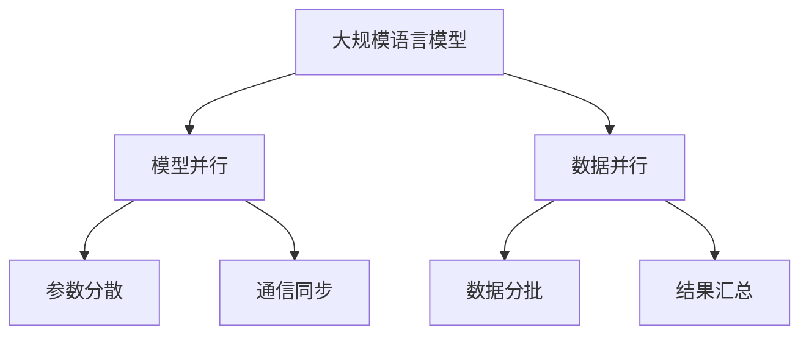
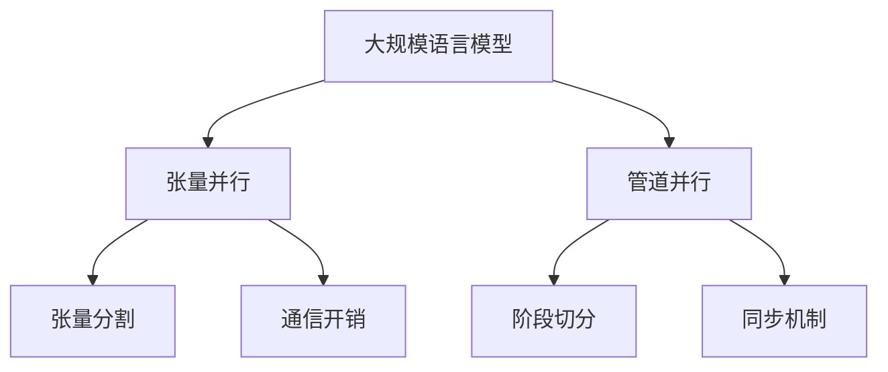

# 大规模语言模型从理论到实践 计算设备内存优化

## 1.背景介绍

### 1.1 大规模语言模型的兴起

近年来,随着计算能力的不断提升和大数据时代的到来,大规模语言模型在自然语言处理(NLP)领域取得了令人瞩目的成就。这些模型通过在海量文本数据上进行预训练,学习到了丰富的语言知识和上下文信息,从而能够生成高质量、连贯性强的文本输出。

代表性的大规模语言模型包括GPT(Generative Pre-trained Transformer)系列、BERT(Bidirectional Encoder Representations from Transformers)、XLNet、RoBERTa等。其中,GPT-3凭借高达1750亿个参数的庞大规模,展现出了惊人的文本生成能力,可以完成包括编程、写作、问答等多种复杂任务。

### 1.2 内存瓶颈问题

然而,大规模语言模型的训练和推理过程对计算资源的需求极为巨大,尤其是对内存的需求。以GPT-3为例,在训练阶段需要消耗数百GB的内存,而在推理阶段也需要数十GB的内存来加载模型参数。这种内存需求已经远远超出了普通计算设备的能力范围。

内存瓶颈不仅限制了大规模语言模型的应用场景,也极大地增加了部署和维护的成本。因此,如何优化内存使用,从而在有限的硬件资源上高效地运行这些模型,成为了一个亟待解决的关键问题。

## 2.核心概念与联系

### 2.1 模型并行与数据并行

为了解决内存瓶颈问题,研究人员提出了模型并行和数据并行两种主要的并行策略。

**模型并行**是指将模型参数分散到多个计算设备(如GPU)上,每个设备只需要存储和计算模型的一部分。在前向传播和反向传播过程中,不同设备之间需要进行参数和梯度的通信和同步。

**数据并行**则是指将输入数据分批次送入多个计算设备,每个设备独立地计算一部分数据的前向和反向传播,最后将结果汇总。数据并行通常与模型并行相结合,以充分利用多个计算设备的计算能力。



### 2.2 张量并行与管道并行

除了模型并行和数据并行之外,张量并行和管道并行也是常见的内存优化技术。

**张量并行**是在模型并行的基础上,进一步将模型的张量(如权重矩阵)分割到多个计算设备上。这种方式可以有效减少每个设备所需的内存,但同时也增加了设备间的通信开销。

**管道并行**则是将模型分成多个阶段,并将每个阶段分配到不同的计算设备上。在前向传播时,输入数据按顺序通过各个阶段;在反向传播时,梯度则按相反的顺序传递回去。这种方式可以充分利用并行计算的优势,但需要仔细设计各个阶段之间的切分和同步机制。



通过合理地组合和应用这些并行策略,我们可以在有限的硬件资源上高效地训练和推理大规模语言模型。

## 3.核心算法原理具体操作步骤  

### 3.1 张量并行算法

张量并行是在模型并行的基础上进一步优化的技术。它的核心思想是将模型中的张量(如权重矩阵)按行或列分割,分配到多个计算设备上。每个设备只需要存储和计算张量的一部分,从而减少单个设备所需的内存。

以下是张量并行算法的具体操作步骤:

1. **张量分割**: 将模型中的大型张量(如embedding矩阵、transformer层的权重矩阵等)按行或列进行分割,分配给不同的计算设备。

2. **前向传播**: 在前向传播过程中,每个设备计算其负责的张量部分,并将计算结果发送给需要使用该结果的其他设备。

3. **反向传播**: 在反向传播过程中,梯度的计算和传递也需要在设备之间进行通信和同步。每个设备计算其负责的张量部分的梯度,并将梯度发送给需要使用该梯度的其他设备。

4. **参数更新**: 在完成一个批次的前向和反向传播后,每个设备根据收集到的梯度,更新其负责的张量部分的参数。

通过张量并行,我们可以将大型模型的内存需求分散到多个计算设备上,从而有效地缓解内存瓶颈问题。然而,这种方法也带来了额外的通信开销,因为设备之间需要频繁地交换中间结果和梯度。因此,在实现张量并行时,需要仔细平衡计算和通信的开销,以获得最佳的性能。

### 3.2 管道并行算法

管道并行是另一种常见的内存优化技术。它的核心思想是将大型模型分成多个阶段(如embedding层、transformer编码器层、transformer解码器层等),并将每个阶段分配到不同的计算设备上。在前向传播时,输入数据按顺序通过各个阶段;在反向传播时,梯度则按相反的顺序传递回去。

以下是管道并行算法的具体操作步骤:

1. **模型切分**: 将大型模型分成多个阶段,每个阶段由一个或多个层组成。将每个阶段分配给不同的计算设备。

2. **前向传播**: 输入数据从第一个设备开始,按顺序通过各个阶段进行前向传播计算。每个设备完成自己阶段的计算后,将结果发送给下一个阶段所在的设备。

3. **反向传播**: 在完成整个模型的前向传播后,最后一个设备开始计算损失函数,并将梯度传递回去。每个设备接收来自下一阶段的梯度,计算自己阶段的梯度,然后将梯度发送给上一阶段所在的设备。

4. **参数更新**: 在完成一个批次的前向和反向传播后,每个设备根据收集到的梯度,更新其负责阶段的参数。

通过管道并行,我们可以将大型模型的内存需求分散到多个计算设备上,并充分利用并行计算的优势。然而,这种方法也带来了一些挑战,如模型切分的granularity选择、设备间同步的开销等。因此,在实现管道并行时,需要仔细设计模型的切分方式和同步机制,以获得最佳的性能和内存利用率。

## 4.数学模型和公式详细讲解举例说明

在大规模语言模型中,常见的数学模型和公式包括:

### 4.1 Transformer架构

Transformer是一种广泛应用于序列到序列(Seq2Seq)任务的神经网络架构,它是大规模语言模型的核心组成部分。Transformer的主要特点是完全依赖于注意力机制(Attention Mechanism),而不使用传统的循环神经网络(RNN)或卷积神经网络(CNN)结构。

Transformer的数学模型可以表示为:

$$Y = \text{Transformer}(X)$$

其中,$$X$$是输入序列,$$Y$$是输出序列。Transformer的计算过程可以分为编码器(Encoder)和解码器(Decoder)两个部分。

**编码器(Encoder)**的数学表达式为:

$$Z = \text{Encoder}(X) = \text{LayerNorm}(\text{MHAtt}(X) + \text{FFN}(X))$$

其中,$$\text{MHAtt}$$表示多头注意力机制(Multi-Head Attention),$$\text{FFN}$$表示前馈神经网络(Feed-Forward Network),$$\text{LayerNorm}$$表示层归一化(Layer Normalization)操作。

**解码器(Decoder)**的数学表达式为:

$$Y = \text{Decoder}(Z, X) = \text{LayerNorm}(\text{MHAtt}_1(Z, Z) + \text{MHAtt}_2(Z, X) + \text{FFN}(Z))$$

其中,$$\text{MHAtt}_1$$是解码器内部的自注意力机制,$$\text{MHAtt}_2$$是解码器与编码器输出之间的交互注意力机制。

通过这种结构,Transformer能够有效地捕获输入序列中的长距离依赖关系,从而生成高质量的输出序列。

### 4.2 注意力机制(Attention Mechanism)

注意力机制是Transformer架构的核心组成部分,它允许模型在计算输出时,动态地关注输入序列中的不同部分。

**缩放点积注意力(Scaled Dot-Product Attention)**是最常见的注意力机制之一,其数学表达式为:

$$\text{Attention}(Q, K, V) = \text{softmax}(\frac{QK^T}{\sqrt{d_k}})V$$

其中,$$Q$$为查询(Query)矩阵,$$K$$为键(Key)矩阵,$$V$$为值(Value)矩阵,$$d_k$$是缩放因子,用于防止内积过大导致的梯度消失或爆炸问题。

**多头注意力机制(Multi-Head Attention)**则是将多个注意力头(Attention Head)的结果进行拼接,从而捕获不同的注意力模式:

$$\text{MultiHead}(Q, K, V) = \text{Concat}(\text{head}_1, \text{head}_2, \ldots, \text{head}_h)W^O$$
$$\text{where } \text{head}_i = \text{Attention}(QW_i^Q, KW_i^K, VW_i^V)$$

其中,$$W_i^Q$$、$$W_i^K$$、$$W_i^V$$和$$W^O$$是可学习的权重矩阵。

通过注意力机制,Transformer能够动态地关注输入序列中的重要部分,从而生成更准确、更富有语义的输出序列。

### 4.3 位置编码(Positional Encoding)

由于Transformer不使用循环或卷积结构,因此需要一种机制来捕获序列中元素的位置信息。位置编码就是用来解决这个问题的技术。

**正弦位置编码(Sinusoidal Positional Encoding)**是一种常见的位置编码方式,其数学表达式为:

$$\begin{aligned}
\text{PE}_{(pos, 2i)} &= \sin(pos / 10000^{2i/d_\text{model}}) \\
\text{PE}_{(pos, 2i+1)} &= \cos(pos / 10000^{2i/d_\text{model}})
\end{aligned}$$

其中,$$pos$$是元素的位置索引,$$i$$是维度索引,$$d_\text{model}$$是模型的隐藏层大小。

位置编码会被添加到输入embeddings中,从而为模型提供位置信息。通过这种方式,Transformer可以有效地捕获序列中元素的位置关系,从而生成更准确的输出。

这些数学模型和公式揭示了大规模语言模型的核心原理,为我们优化内存使用提供了理论基础。在实际应用中,我们需要结合具体的任务和硬件条件,合理选择和调整这些模型和参数,以获得最佳的性能和内存利用率。

## 5.项目实践:代码实例和详细解释说明

为了更好地理解内存优化技术在实践中的应用,我们将通过一个基于PyTorch的示例项目来演示张量并行和管道并行的实现。

### 5.1 张量并行实现

在这个示例中,我们将使用一个简化版的Transformer模型,并将其embedding层和transformer编码器层的权重矩阵进行张量并行。

```python
import torch
import torch.nn as nn
from torch.nn.parallel import DistributedDataParallel as DDP

# 定义模型
class TinyTransformer(nn.Module):
    def __init__(self, vocab_size, max_len, num_heads, embed_dim, num_layers):
        super().__init__()
        self.token_embedding = nn.Embedding(vocab_size, embed_dim)
        self.pos_embedding = nn.Embedding(max_len, embed_dim)
        self.layers = nn.ModuleList([
            Transfor