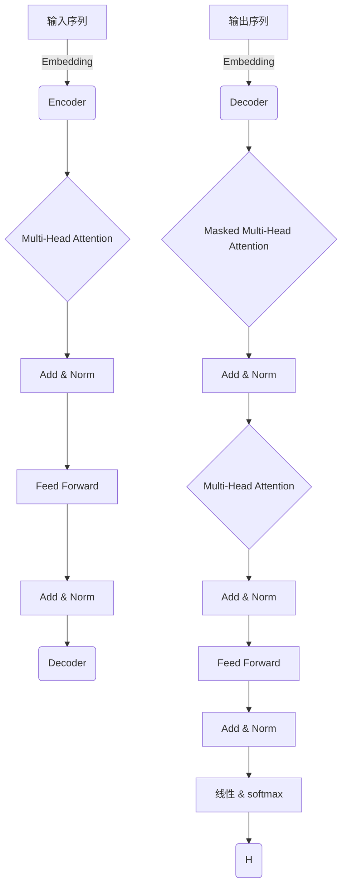

# 大语言模型原理与代码实例讲解

## 1. 背景介绍

### 1.1 什么是大语言模型?

大语言模型(Large Language Model, LLM)是一种基于深度学习的自然语言处理(NLP)技术,旨在从大量文本数据中学习语言模式和语义关系。这些模型通过训练巨大的神经网络,能够生成看似人类写作的连贯、流畅的文本输出。

大语言模型的出现源于对更强大的语言理解和生成能力的需求。传统的NLP方法通常依赖于手工设计的特征和规则,难以捕捉语言的复杂性和多样性。而大语言模型则通过从海量数据中学习,自动发现语言模式,从而获得更强的泛化能力。

### 1.2 大语言模型的重要性

大语言模型在自然语言处理领域引起了广泛关注,主要由于以下几个原因:

1. **强大的语言理解和生成能力**:大语言模型能够生成高质量、连贯的文本,在机器翻译、文本摘要、问答系统等任务中表现出色。
2. **泛化能力强**:通过从大量数据中学习,大语言模型获得了强大的泛化能力,可以应用于不同领域和场景。
3. **降低了人工标注成本**:相比需要大量人工标注数据的传统NLP方法,大语言模型只需要训练数据,降低了数据准备成本。
4. **多任务能力**:同一个大语言模型可以通过微调(fine-tuning)应用于多种不同的NLP任务,提高了模型的可重用性和效率。

### 1.3 大语言模型的发展历程

大语言模型的发展经历了从统计语言模型到神经网络语言模型,再到基于Transformer的大型预训练语言模型的演进过程。

- **统计语言模型**:基于N-gram统计语言模型,通过计算词序列的概率来生成文本,但存在数据稀疏和上下文有限的问题。
- **神经网络语言模型**:利用神经网络捕捉更长距离的上下文信息,但模型规模和训练数据量有限,性能提升有限。
- **预训练语言模型**:通过自监督方式(如掩码语言模型)在大规模无标注数据上预训练,获得强大的语言理解能力,然后在下游任务上微调,取得了突破性进展。
- **大型预训练语言模型**:随着计算能力的提高,模型规模和训练数据量不断扩大,出现了GPT、BERT、T5等里程碑式的大型预训练语言模型。

## 2. 核心概念与联系

### 2.1 自注意力机制(Self-Attention)

自注意力机制是大语言模型中的核心概念之一,它允许模型捕捉输入序列中任意两个位置之间的关系,从而更好地建模长距离依赖关系。

在自注意力机制中,每个输入位置都会关注其他所有位置,并根据它们之间的关联程度分配不同的权重。这种机制使模型能够同时考虑整个输入序列,而不是像RNN那样逐步处理。

自注意力机制可以用以下公式表示:

$$\mathrm{Attention}(Q, K, V) = \mathrm{softmax}(\frac{QK^T}{\sqrt{d_k}})V$$

其中 $Q$ 表示查询(Query)、$K$ 表示键(Key)、$V$ 表示值(Value),$d_k$ 是缩放因子。

### 2.2 Transformer 架构

Transformer 是第一个完全基于自注意力机制的序列到序列(Seq2Seq)模型,它不依赖于循环神经网络(RNN)或卷积神经网络(CNN),而是完全利用自注意力机制来捕捉输入和输出序列之间的依赖关系。

Transformer 架构主要由编码器(Encoder)和解码器(Decoder)两部分组成,两者都使用了多头自注意力机制和前馈神经网络。编码器将输入序列映射为连续的表示,解码器则根据编码器的输出和前一步的预测生成输出序列。

### 2.3 预训练与微调(Transfer Learning)

预训练与微调是大语言模型中广泛采用的迁移学习范式。这种方法包括两个阶段:

1. **预训练(Pre-training)**: 在大量未标注的文本数据上训练模型,使其学习通用的语言表示。常见的预训练目标包括掩码语言模型(Masked Language Modeling)和下一句预测(Next Sentence Prediction)等。
2. **微调(Fine-tuning)**: 在特定的下游任务上,使用有标注的数据对预训练模型进行微调,使模型适应该任务。这一步通常只需要训练模型的部分参数,训练成本较低。

通过预训练和微调的组合,大语言模型可以在下游任务上获得良好的性能,同时避免了从头训练的高昂计算成本。

## 3. 核心算法原理具体操作步骤

### 3.1 Transformer 编码器(Encoder)

Transformer 编码器的主要操作步骤如下:

1. **输入嵌入(Input Embeddings)**: 将输入序列的每个词元(token)映射为一个连续的向量表示。
2. **位置编码(Positional Encoding)**: 由于自注意力机制没有捕捉序列顺序的能力,因此需要添加位置编码来注入位置信息。
3. **多头自注意力(Multi-Head Attention)**: 对输入序列进行多头自注意力计算,捕捉不同位置之间的依赖关系。
4. **残差连接与层归一化(Residual Connection & Layer Normalization)**: 将自注意力的输出与输入相加,然后进行层归一化,以缓解梯度消失和梯度爆炸问题。
5. **前馈神经网络(Feed Forward Neural Network)**: 对每个位置的表示进行全连接前馈神经网络变换,提供非线性映射能力。
6. **残差连接与层归一化(Residual Connection & Layer Normalization)**: 与自注意力部分类似,进行残差连接和层归一化。
7. **重复步骤3-6**: 编码器由多个相同的子层(层数为超参数)组成,重复执行上述步骤。

编码器的输出是输入序列的连续表示,将被传递给解码器进行下一步处理。

### 3.2 Transformer 解码器(Decoder)

Transformer 解码器的主要操作步骤如下:

1. **输出嵌入(Output Embeddings)**: 将输出序列的每个词元映射为连续向量表示。
2. **掩码多头自注意力(Masked Multi-Head Attention)**: 对输出序列进行掩码多头自注意力计算,防止每个位置关注到未来的位置,保证自回归(auto-regressive)属性。
3. **残差连接与层归一化(Residual Connection & Layer Normalization)**: 与编码器类似,进行残差连接和层归一化。
4. **编码器-解码器注意力(Encoder-Decoder Attention)**: 将解码器的输出与编码器的输出进行多头注意力计算,捕捉输入和输出序列之间的依赖关系。
5. **残差连接与层归一化(Residual Connection & Layer Normalization)**: 与前面类似,进行残差连接和层归一化。
6. **前馈神经网络(Feed Forward Neural Network)**: 对每个位置的表示进行全连接前馈神经网络变换,提供非线性映射能力。
7. **残差连接与层归一化(Residual Connection & Layer Normalization)**: 与前面类似,进行残差连接和层归一化。
8. **线性层与softmax(Linear & Softmax)**: 将解码器的输出通过线性层映射到词汇表的维度,然后使用softmax计算每个词元的概率分布。
9. **重复步骤2-8**: 解码器由多个相同的子层组成,重复执行上述步骤。

解码器的输出是生成序列的概率分布,可用于各种生成任务,如机器翻译、文本摘要等。

## 4. 数学模型和公式详细讲解举例说明

### 4.1 自注意力机制(Self-Attention)

自注意力机制是大语言模型中最核心的部分之一,它允许模型捕捉输入序列中任意两个位置之间的关系,从而更好地建模长距离依赖关系。下面我们详细解释自注意力机制的数学原理。

给定一个输入序列 $X = (x_1, x_2, \dots, x_n)$,我们首先将其映射为三个向量序列:查询(Query) $Q$、键(Key) $K$ 和值(Value) $V$,它们的维度分别为 $d_q$、$d_k$ 和 $d_v$。这一步通常通过线性变换实现:

$$Q = XW^Q, \quad K = XW^K, \quad V = XW^V$$

其中 $W^Q \in \mathbb{R}^{d_\text{model} \times d_q}$、$W^K \in \mathbb{R}^{d_\text{model} \times d_k}$ 和 $W^V \in \mathbb{R}^{d_\text{model} \times d_v}$ 是可学习的权重矩阵。

接下来,我们计算查询 $Q$ 与所有键 $K$ 之间的点积,得到一个注意力分数矩阵 $S$:

$$S = QK^T$$

为了防止较大的值导致梯度过大,我们对分数矩阵进行缩放:

$$\tilde{S} = \frac{S}{\sqrt{d_k}}$$

然后,我们对缩放后的分数矩阵 $\tilde{S}$ 的每一行应用 softmax 函数,得到注意力权重矩阵 $A$:

$$A = \text{softmax}(\tilde{S}) = \begin{pmatrix}
    \alpha_{11} & \alpha_{12} & \cdots & \alpha_{1n} \\
    \alpha_{21} & \alpha_{22} & \cdots & \alpha_{2n} \\
    \vdots & \vdots & \ddots & \vdots \\
    \alpha_{n1} & \alpha_{n2} & \cdots & \alpha_{nn}
\end{pmatrix}$$

其中 $\alpha_{ij}$ 表示第 $i$ 个位置对第 $j$ 个位置的注意力权重。

最后,我们将注意力权重矩阵 $A$ 与值矩阵 $V$ 相乘,得到自注意力的输出:

$$\text{Attention}(Q, K, V) = AV$$

自注意力机制的核心思想是允许每个位置关注其他所有位置,并根据它们之间的相关性分配不同的权重。这种机制使模型能够同时考虑整个输入序列,而不是像 RNN 那样逐步处理。

### 4.2 多头自注意力(Multi-Head Attention)

多头自注意力是在单头自注意力的基础上进行扩展,它可以从不同的子空间捕捉不同的关系,从而提高模型的表示能力。

具体来说,多头自注意力首先将查询 $Q$、键 $K$ 和值 $V$ 进行线性变换,得到 $h$ 个头(head)的投影:

$$\begin{aligned}
Q^{(i)} &= QW_Q^{(i)}, \quad &K^{(i)} = KW_K^{(i)}, \quad &V^{(i)} = VW_V^{(i)} \\
&\text{for } i = 1, \dots, h
\end{aligned}$$

其中 $W_Q^{(i)} \in \mathbb{R}^{d_q \times d_q'}$、$W_K^{(i)} \in \mathbb{R}^{d_k \times d_k'}$ 和 $W_V^{(i)} \in \mathbb{R}^{d_v \times d_v'}$ 是可学习的权重矩阵,用于将查询、键和值映射到不同的子空间。

然后,对于每个头 $i$,我们计算单头自注意力:

$$\text{head}^{(i)} = \text{Attention}(Q^{(i)}, K^{(i)}, V^{(i)})$$