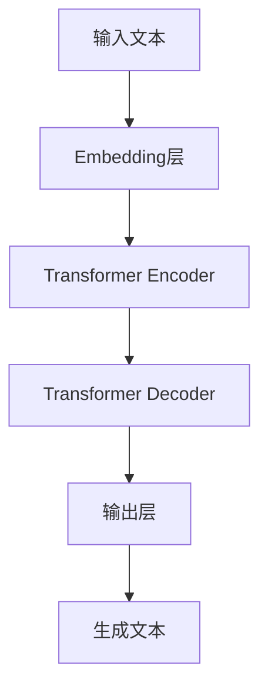

# 大语言模型原理与工程实践：C4

## 1. 背景介绍

### 1.1 大语言模型的兴起

近年来,大型语言模型(Large Language Models, LLMs)在自然语言处理领域掀起了一场革命。这些模型通过在海量文本数据上进行预训练,学习了丰富的语言知识和上下文信息,从而具备了出色的语言理解和生成能力。

大语言模型的兴起可以追溯到2018年,当时谷歌发布了Transformer模型,展示了其在机器翻译等任务上的卓越表现。随后,OpenAI发布了GPT(Generative Pre-trained Transformer)模型,将Transformer应用于通用语言理解和生成任务,取得了令人瞩目的成绩。

### 1.2 C4:一个里程碑式的大语言模型

在这一背景下,2022年6月,人工智能公司Anthropic推出了C4(Constitutional AI Control)大语言模型,引起了业界的广泛关注。C4模型不仅在规模和性能上达到了新的高度,更重要的是,它采用了一种新颖的训练方法,旨在使模型更加可控、更加符合人类价值观。

C4模型的训练过程融入了"宪政AI"(Constitutional AI)的理念,通过明确的规则和奖惩机制,引导模型在生成过程中遵循特定的行为准则,如诚实、有益、和谐等。这种方法有望解决大语言模型存在的一些潜在风险,如产生有害或不当内容、缺乏一致性等。

## 2. 核心概念与联系

### 2.1 大语言模型的工作原理

大语言模型本质上是一种基于自注意力机制的Transformer架构,通过自回归(Autoregressive)的方式生成文本。具体来说,模型会根据给定的上文(Context),预测下一个最可能出现的词元(Token),并逐步构建出完整的文本序列。



上图展示了大语言模型的基本工作流程:

1. 输入文本经过Embedding层转换为向量表示
2. Embedding向量输入Transformer Encoder,捕获输入的上下文信息
3. Transformer Decoder基于Encoder的输出和前一步生成的Token,预测下一个Token
4. 输出层将预测的Token转换为词元
5. 重复3-4步骤,直至生成完整文本

### 2.2 C4模型的创新之处

C4模型在传统大语言模型的基础上,引入了一些创新理念和技术:

1. **宪政AI**:通过设置明确的行为准则,并在训练过程中对违规行为进行惩罚,引导模型生成符合人类价值观的输出。

2. **对抗性训练**:在训练过程中,模型不仅需要生成与人类一致的输出,还需要识别和纠正人为注入的错误信息,提高其鲁棒性。

3. **多模态融合**:C4模型不仅可以处理文本数据,还能够融合图像、视频等多模态信息,实现更丰富的理解和生成能力。

4. **可解释性**:C4模型的输出具有较好的可解释性,能够解释其推理过程和决策依据,增强了模型的透明度和可信度。

## 3. 核心算法原理具体操作步骤

### 3.1 预训练阶段

C4模型的训练过程分为两个阶段:预训练和微调。在预训练阶段,模型在海量的文本语料库上进行自监督学习,目标是最大化下一个Token的预测概率。具体步骤如下:

1. **数据预处理**:将原始文本数据进行标记化(Tokenization)、清洗和格式化处理,构建训练集。

2. **掩码语言模型(Masked Language Modeling)**:随机将输入序列中的部分Token用特殊的[MASK]标记替换,模型需要预测被掩码的Token。

$$\mathcal{L}_{MLM} = -\sum_{i=1}^{n}\log P(x_i|x_{\backslash i})$$

上式是掩码语言模型的损失函数,目标是最大化被掩码Token的条件概率。

3. **下一句预测(Next Sentence Prediction)**:判断两个句子是否为连续的句子对,以捕获更长范围的上下文信息。

4. **宪政AI约束**:在预训练过程中,引入惩罚机制,当模型生成违反行为准则的输出时,会受到一定程度的惩罚。

5. **对抗性训练**:在训练集中注入一些人为构造的错误信息,要求模型能够识别和纠正这些错误,提高其鲁棒性。

### 3.2 微调阶段

预训练完成后,C4模型需要在特定的下游任务上进行微调(Fine-tuning),以适应具体的应用场景。微调过程如下:

1. **数据准备**:收集并预处理特定任务所需的训练数据,如机器翻译的平行语料、问答对等。

2. **模型初始化**:使用预训练好的C4模型权重作为初始化参数。

3. **任务特定头(Task-specific Head)**:根据下游任务的性质,设计相应的输出头(Output Head),如分类头、生成头等。

4. **微调训练**:在特定任务的训练数据上,对模型进行端到端的微调,优化任务相关的损失函数。

5. **宪政AI约束**:在微调过程中,仍然保留预训练阶段的宪政AI约束,确保模型输出符合预期的行为准则。

6. **模型评估**:在验证集上评估微调后的模型性能,根据需要进行多轮迭代训练。

通过上述两个阶段的训练,C4模型不仅具备了强大的语言理解和生成能力,而且能够生成符合人类价值观的、可解释和可控的输出。

## 4. 数学模型和公式详细讲解举例说明

### 4.1 Transformer模型

C4模型的核心架构源自Transformer模型,它是一种基于自注意力机制的序列到序列(Seq2Seq)模型。Transformer模型的自注意力机制可以有效捕获输入序列中任意两个位置之间的依赖关系,从而更好地建模长距离依赖。

Transformer模型的核心计算过程可以表示为:

$$\text{Attention}(Q, K, V) = \text{softmax}(\frac{QK^T}{\sqrt{d_k}})V$$

其中:
- $Q$、$K$、$V$分别代表Query、Key和Value
- $d_k$是缩放因子,用于防止点积过大导致梯度消失
- softmax函数用于计算注意力权重

通过这种自注意力机制,Transformer能够自适应地为每个位置分配注意力权重,从而更好地捕获全局信息。

### 4.2 自回归语言模型

C4属于自回归语言模型(Autoregressive Language Model),其生成过程可以形式化为:

$$P(x) = \prod_{t=1}^{T}P(x_t|x_{<t})$$

即生成序列$x$的概率,等于从左到右逐个预测每个Token $x_t$的条件概率的乘积。具体来说,在生成第$t$个Token时,模型会基于前$t-1$个Token的上下文信息,预测第$t$个Token的概率分布,并从中采样得到实际的Token。

为了提高生成质量,C4模型采用了一些策略,如Top-K采样、Top-P采样等,这些策略通过对概率分布进行适当的修剪,可以避免生成低概率或不合理的Token。

### 4.3 宪政AI约束

C4模型的一大创新之处在于引入了宪政AI的理念,通过设置明确的行为准则,并在训练过程中对违规行为进行惩罚,从而引导模型生成符合人类价值观的输出。

具体来说,C4模型定义了一系列规则,如诚实、有益、和谐等,并将这些规则编码为损失函数的一部分。当模型生成违反这些规则的输出时,就会受到一定程度的惩罚,从而在训练过程中逐步学习到符合预期的行为模式。

这种方法可以用下式表示:

$$\mathcal{L} = \mathcal{L}_{task} + \lambda \mathcal{L}_{constraint}$$

其中:
- $\mathcal{L}_{task}$是任务相关的损失函数,如语言模型的交叉熵损失
- $\mathcal{L}_{constraint}$是约束损失函数,用于惩罚违反行为准则的输出
- $\lambda$是一个权重系数,用于平衡两个损失项的贡献

通过优化这个综合损失函数,C4模型不仅能够学习到语言的内在规律,还能够遵循人类设定的行为准则,从而生成更加可控和可信的输出。

## 5. 项目实践:代码实例和详细解释说明

为了更好地理解C4模型的原理和实现,我们提供了一个基于PyTorch的简化版本代码示例。虽然这个示例无法完全复现C4模型的全部功能,但它能够展示C4模型的核心思想和关键组件。

### 5.1 数据预处理

```python
import torch
from transformers import GPT2Tokenizer

# 加载分词器
tokenizer = GPT2Tokenizer.from_pretrained('gpt2')

# 对输入文本进行标记化
text = "This is a sample text for demonstration."
input_ids = tokenizer.encode(text, return_tensors='pt')
```

在这个示例中,我们使用了Hugging Face的Transformers库,加载了GPT-2模型的分词器。然后,我们将一段示例文本转换为对应的Token ID序列,作为模型的输入。

### 5.2 模型定义

```python
import torch.nn as nn
from transformers import GPT2LMHeadModel

# 加载预训练模型
model = GPT2LMHeadModel.from_pretrained('gpt2')

# 定义宪政AI约束损失函数
def constraint_loss(output, labels):
    # 计算约束损失,惩罚不符合规则的输出
    # ...

# 定义综合损失函数
def combined_loss(output, labels):
    task_loss = nn.CrossEntropyLoss()(output.logits.view(-1, output.logits.size(-1)), labels.view(-1))
    constraint_loss_value = constraint_loss(output, labels)
    return task_loss + constraint_loss_value
```

在这个示例中,我们加载了预训练的GPT-2模型作为基础。然后,我们定义了一个简化版本的宪政AI约束损失函数,用于惩罚不符合规则的输出。最后,我们定义了一个综合损失函数,将任务相关的损失和约束损失相结合。

### 5.3 模型训练

```python
from transformers import TrainingArguments, Trainer

# 定义训练参数
training_args = TrainingArguments(
    output_dir='./output',
    num_train_epochs=3,
    per_device_train_batch_size=8,
    ...
)

# 定义训练器
trainer = Trainer(
    model=model,
    args=training_args,
    train_dataset=train_dataset,
    eval_dataset=eval_dataset,
    compute_metrics=compute_metrics,
)

# 开始训练
trainer.train()
```

在这个示例中,我们使用了Transformers库提供的Trainer类,用于管理模型的训练过程。我们定义了一些训练参数,如epochs数、批大小等,并指定了训练数据集和评估数据集。在训练过程中,我们将使用之前定义的综合损失函数进行优化。

### 5.4 模型推理

```python
from transformers import pipeline

# 加载训练好的模型
model.load_state_dict(torch.load('path/to/model.pth'))

# 创建文本生成管道
text_generator = pipeline('text-generation', model=model, tokenizer=tokenizer)

# 生成文本
input_text = "Write a short story about"
output = text_generator(input_text, max_length=200, do_sample=True, top_k=50, top_p=0.95, num_return_sequences=1)
print(output[0]['generated_text'])
```

在这个示例中,我们加载了训练好的模型,并使用Transformers库提供的文本生成管道进行推理。我们指定了一些生成参数,如最大长度、采样策略等,然后输入一个种子文本,模型就会基于这个种子文本生成一段连贯的文本输出。

通过这个简化版本的代码示例,我们可以更好地理解C4模型的核心思想和实现方式。当然,真实的C4模型还包含了更多的高级