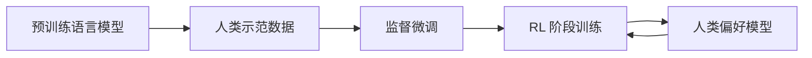

# 大语言模型原理与工程实践：RLHF 的难点和问题

## 1. 背景介绍

### 1.1 大语言模型概述 
大语言模型(Large Language Models, LLMs)是近年来自然语言处理(NLP)领域的重大突破。它们是在海量文本数据上训练的深度神经网络模型,具有强大的语言理解和生成能力。代表模型有 GPT-3、PaLM、BLOOM 等。

### 1.2 RLHF 方法的提出
尽管 LLMs 展现了惊人的性能,但它们仍然存在一些问题,如生成的文本可能出现错误、有害、偏见等内容。为了改善这一点,研究者提出了基于人类反馈的强化学习(Reinforcement Learning with Human Feedback, RLHF)方法。

### 1.3 RLHF 的应用前景
RLHF 有望帮助 LLMs 生成更加安全、可控、符合人类偏好的文本。这对于打造更加智能、友好的 AI 助手具有重要意义。但 RLHF 在实践中仍面临诸多挑战。

## 2. 核心概念与联系

### 2.1 强化学习
- 2.1.1 马尔可夫决策过程
- 2.1.2 策略、价值函数与 Q 函数  
- 2.1.3 策略梯度定理

### 2.2 人类反馈
- 2.2.1 人类偏好数据的收集
- 2.2.2 奖励模型的构建
- 2.2.3 安全性与对抗性考量

### 2.3 RLHF 算法框架


## 3. 核心算法原理具体操作步骤

### 3.1 监督微调(SFT)
- 3.1.1 构建高质量的人类示范数据集
- 3.1.2 在语言模型上进行微调
- 3.1.3 使用 Pairwise 或 Likert 评分

### 3.2 奖励模型训练
- 3.2.1 收集人类偏好比较数据
- 3.2.2 训练奖励模型预测人类偏好
- 3.2.3 引入噪声对比估计(NCE)Loss

### 3.3 基于人类反馈的 RL 微调
- 3.3.1 使用 PPO 算法优化策略
- 3.3.2 奖励模型提供即时奖励
- 3.3.3 设计适当的训练框架与 RL 损失

## 4. 数学模型和公式详细讲解举例说明

### 4.1 语言模型的概率公式
给定上下文 $c$,语言模型的目标是预测下一个 token $x$:
$$P(x|c) = \frac{\exp(h_\theta(c,x))}{\sum_{x'\in V} \exp(h_\theta(c,x'))}$$
其中 $h_\theta$ 是参数为 $\theta$ 的神经网络,$V$ 是词表。

### 4.2 RL 目标函数
RL 的目标是最大化期望奖励:
$$J(\theta) = \mathbb{E}_{\pi_\theta}[\sum_{t=0}^T \gamma^t r_t] $$
其中 $\pi_\theta$ 是参数为 $\theta$ 的策略,$\gamma$ 是折扣因子,$r_t$ 是第 $t$ 步的奖励。

### 4.3 PPO 的损失函数
PPO 的损失函数包括策略损失和值函数损失两部分:
$$L^{CLIP}(\theta)=\hat{\mathbb{E}}_t\left[\min\left(r_t(\theta)\hat{A}_t,\text{clip}\left(r_t(\theta),1-\epsilon,1+\epsilon\right)\hat{A}_t\right)\right] \\
L^{VF}(\theta)=\hat{\mathbb{E}}_t\left[(V_\theta(s_t)-V_t^{\text{targ}})^2\right]$$
其中 $r_t(\theta)=\frac{\pi_\theta(a_t|s_t)}{\pi_{\theta_{\text{old}}}(a_t|s_t)}$ 是重要性采样比率,$\hat{A}_t$ 是优势函数的估计, $V_t^{\text{targ}}$ 是值函数目标。

## 5. 项目实践：代码实例和详细解释说明

### 5.1 使用 transformers 库微调 GPT 模型
```python
from transformers import GPT2LMHeadModel, GPT2Tokenizer

model = GPT2LMHeadModel.from_pretrained('gpt2')
tokenizer = GPT2Tokenizer.from_pretrained('gpt2')

train_data = [
  {"prompt": "Once upon a time", "completion": "there was a princess who lived in a castle."},
  {"prompt": "In the middle of the night", "completion": "a loud noise woke everyone up."},
  ...
]

from transformers import DefaultDataCollator
data_collator = DefaultDataCollator(tokenizer=tokenizer)

trainer = Trainer(
    model=model,
    args=TrainingArguments(...),  
    train_dataset=train_data,
    data_collator=data_collator,
)
trainer.train()
```

### 5.2 使用 RLlib 和 TensorFlow 实现 PPO
```python
import ray
from ray import tune
from ray.rllib.agents import ppo

config = {
    "env": YourCustomEnv,
    "num_gpus": 1,
    "model": {
        "custom_model": "your_model_class",
    },
}

stop = {
    "training_iteration": 100,
}

results = tune.run(ppo.PPOTrainer, config=config, stop=stop)
```

## 6. 实际应用场景

### 6.1 打造更安全的对话 AI 助手
- 6.1.1 减少有害、错误、偏见的回复
- 6.1.2 遵循伦理道德规范

### 6.2 医疗领域的智能问答系统
- 6.2.1 提供更专业、准确的医疗咨询
- 6.2.2 个性化的就医指导

### 6.3 教育领域的智能辅导工具
- 6.3.1 针对学生特点的个性化教学
- 6.3.2 高效的作业批改与反馈

## 7. 工具和资源推荐

### 7.1 开源 LLMs 模型
- GPT-Neo
- BLOOM
- GLM

### 7.2 RL 训练框架
- RLlib
- Stable Baselines3
- CleanRL

### 7.3 相关论文与教程
- InstructGPT 论文
- Anthropic 的 Constitutional AI
- Hugging Face 的 PEFT

## 8. 总结：未来发展趋势与挑战

### 8.1 更大规模的模型与数据
- 千亿、万亿参数级别的模型
- 更广泛领域的高质量数据

### 8.2 更高效的 RLHF 训练流程
- 主动学习减少人工反馈
- 模仿学习引导探索

### 8.3 引入因果推理等更强大的归纳偏置
- 赋予模型常识与逻辑推理能力
- 更可解释、可控的模型行为

### 8.4 多模态反馈与训练
- 结合视觉、语音等其他模态信号
- 实现更自然的人机交互

## 9. 附录：常见问题与解答

### 9.1 RLHF 需要多少人工反馈数据？
这取决于任务复杂度,一般需要数千到数万条高质量的人类偏好反馈数据。可以通过主动学习等方式减少数据需求。

### 9.2 RLHF 对计算资源有什么要求? 
训练大语言模型本身对算力要求就很高,再加上 RL 的反复探索,对 GPU、TPU 等硬件要求很高。需要权衡模型规模和训练时长。

### 9.3 如何评估 RLHF 的效果?
可以从安全性、对齐人类偏好、完成任务质量等角度设计评估指标。常见的有人工评估、A/B 测试等。还需考虑 reward hacking 等潜在风险。

### 9.4 RLHF 能否适用于其他 NLP 任务?
理论上 RLHF 可用于对话、摘要、翻译、问答等多种任务。但需要针对任务特点设计合适的人类反馈形式,目前在开放领域对话上的研究最多。

作者：禅与计算机程序设计艺术 / Zen and the Art of Computer Programming