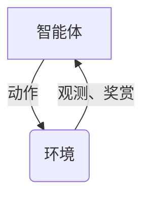
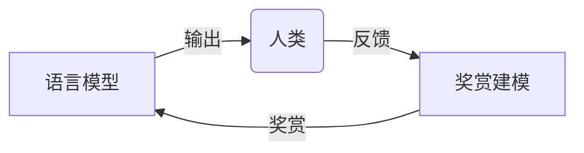

# 大语言模型原理与工程实践：RLHF算法

## 1. 背景介绍

### 1.1 人工智能的发展历程

人工智能(Artificial Intelligence, AI)作为一门崭新的科学技术,自20世纪50年代问世以来,经历了起起伏伏的发展历程。从早期的专家系统、机器学习算法,到近年来的深度学习技术的兴起,AI已经渗透到我们生活的方方面面,为人类社会带来了翻天覆地的变化。

其中,大型语言模型(Large Language Model, LLM)的出现,被视为AI发展史上的一个重要里程碑。LLM通过在海量文本数据上进行自监督学习,掌握了丰富的自然语言知识,展现出惊人的语言理解和生成能力,在自然语言处理(Natural Language Processing, NLP)领域取得了突破性进展。

### 1.2 大语言模型的挑战

然而,尽管大语言模型取得了令人瞩目的成就,但它们也面临着一些挑战和局限性。首先,训练出色的大语言模型需要消耗大量的计算资源,对硬件设备和算力要求极高。其次,这些模型在训练过程中,可能会学习到一些不当的偏见和有害的知识,从而产生不负责任的输出。此外,大语言模型缺乏对语境和任务的理解能力,难以根据具体场景做出合理的决策和行为。

为了解决这些问题,研究人员提出了一种新的训练范式——奖赏建模人类反馈(Reinforcement Learning from Human Feedback, RLHF)。RLHF算法通过对人类反馈进行奖赏建模,使语言模型能够更好地理解人类的意图,生成更加符合人类价值观和期望的输出。

## 2. 核心概念与联系

### 2.1 强化学习(Reinforcement Learning)

RLHF算法的核心思想源于强化学习(Reinforcement Learning, RL)领域。强化学习是机器学习的一个重要分支,它关注于如何通过与环境的交互,学习一种最优策略,以最大化预期的累积奖赏。

在强化学习中,有四个基本元素:

- 智能体(Agent):执行动作的决策主体。
- 环境(Environment):智能体所处的外部世界。
- 状态(State):描述环境的当前状况。
- 动作(Action):智能体对环境采取的操作。

智能体与环境之间通过观测(Observation)和动作(Action)进行交互。智能体根据当前状态选择一个动作,环境接收这个动作并转移到下一个状态,同时给出相应的奖赏(Reward)。智能体的目标是学习一个最优策略,使得在环境中获得的累积奖赏最大化。



### 2.2 人类反馈(Human Feedback)

在RLHF算法中,人类反馈扮演着至关重要的角色。人类反馈可以是对模型输出的评分、排序或者直接修正,它反映了人类对模型行为的期望和偏好。通过将人类反馈作为奖赏信号,RLHF算法能够引导语言模型朝着更加符合人类意图的方向优化。



### 2.3 奖赏建模(Reward Modeling)

奖赏建模是RLHF算法的核心环节。它的目标是基于人类反馈,构建一个能够准确评估模型输出质量的奖赏函数(Reward Function)。通过将人类反馈数据作为监督信号,训练一个奖赏模型(Reward Model),从而学习到一个近似的奖赏函数。

奖赏函数的作用是为每个可能的模型输出分配一个奖赏值,反映了该输出符合人类期望的程度。通过最大化预期的累积奖赏,语言模型可以学习到一种更加人性化、更加负责任的行为策略。

## 3. 核心算法原理具体操作步骤

RLHF算法的核心思想是将人类反馈建模为奖赏函数,并通过强化学习的方式优化语言模型,使其生成更加符合人类意图的输出。算法的具体操作步骤如下:

1. **收集人类反馈数据**

   首先,需要收集大量的人类反馈数据。这些数据可以是对语言模型输出的评分、排序或者直接修正。通常会设计一些特定的任务或场景,让人类对模型的输出进行评价。

2. **训练奖赏模型**

   基于收集到的人类反馈数据,训练一个奖赏模型(Reward Model)。奖赏模型的目标是学习一个近似的奖赏函数,能够准确评估模型输出的质量。

   常见的奖赏模型包括:

   - **分类器奖赏模型**:将奖赏建模为一个二元或多元分类问题,根据人类反馈对模型输出进行分类。
   - **回归奖赏模型**:将奖赏建模为一个回归问题,直接预测模型输出的奖赏值。
   - **基于语义相似度的奖赏模型**:通过计算模型输出与人类修正之间的语义相似度,作为奖赏值。

3. **初始化策略模型**

   初始化一个策略模型(Policy Model),通常使用预训练的大型语言模型作为初始策略。

4. **强化学习优化**

   利用训练好的奖赏模型,通过强化学习算法(如PPO、A2C等)优化策略模型的参数,使其能够生成获得更高奖赏的输出。

   在优化过程中,策略模型会与环境(即特定的任务或场景)进行交互。策略模型根据当前状态生成一个输出,奖赏模型会对该输出进行评估,给出相应的奖赏值。策略模型的目标是最大化预期的累积奖赏。

5. **迭代优化**

   重复执行第4步,不断优化策略模型的参数,直到满足预期的性能或达到迭代次数上限。

通过上述步骤,RLHF算法能够将人类反馈融入到语言模型的训练过程中,使模型学习到更加符合人类意图和价值观的行为策略。

## 4. 数学模型和公式详细讲解举例说明

### 4.1 马尔可夫决策过程(Markov Decision Process, MDP)

在强化学习领域,我们通常将智能体与环境的交互过程建模为一个马尔可夫决策过程(Markov Decision Process, MDP)。MDP由一个五元组 $\langle \mathcal{S}, \mathcal{A}, \mathcal{P}, \mathcal{R}, \gamma \rangle$ 定义,其中:

- $\mathcal{S}$ 是状态空间(State Space),表示环境可能的状态集合。
- $\mathcal{A}$ 是动作空间(Action Space),表示智能体可以采取的动作集合。
- $\mathcal{P}$ 是状态转移概率(State Transition Probability),定义了在当前状态 $s$ 下采取动作 $a$ 后,转移到下一状态 $s'$ 的概率 $\mathcal{P}(s'|s,a)$。
- $\mathcal{R}$ 是奖赏函数(Reward Function),定义了在状态 $s$ 下采取动作 $a$ 后,获得的即时奖赏 $\mathcal{R}(s,a)$。
- $\gamma \in [0, 1)$ 是折现因子(Discount Factor),用于平衡即时奖赏和长期累积奖赏的权重。

智能体的目标是学习一个策略 $\pi: \mathcal{S} \rightarrow \mathcal{A}$,使得在 MDP 中获得的预期累积奖赏最大化:

$$
J(\pi) = \mathbb{E}_{\pi}\left[\sum_{t=0}^{\infty} \gamma^t r_t\right]
$$

其中 $r_t = \mathcal{R}(s_t, a_t)$ 是在时间步 $t$ 获得的即时奖赏。

### 4.2 策略梯度算法(Policy Gradient)

策略梯度算法是强化学习中一种常用的优化方法,它通过计算策略的梯度,并沿着梯度方向更新策略参数,以最大化预期累积奖赏。

对于一个参数化的策略 $\pi_{\theta}(a|s)$,其梯度可以表示为:

$$
\nabla_{\theta} J(\pi_{\theta}) = \mathbb{E}_{\pi_{\theta}}\left[\sum_{t=0}^{\infty} \nabla_{\theta} \log \pi_{\theta}(a_t|s_t) Q^{\pi_{\theta}}(s_t, a_t)\right]
$$

其中 $Q^{\pi_{\theta}}(s_t, a_t)$ 是在状态 $s_t$ 下采取动作 $a_t$ 后,按照策略 $\pi_{\theta}$ 行动所能获得的预期累积奖赏,也称为状态-动作值函数(State-Action Value Function)。

由于直接计算 $Q^{\pi_{\theta}}(s_t, a_t)$ 比较困难,我们通常采用一些估计方法,如蒙特卡罗估计或时临近估计(Temporal Difference)等。

### 4.3 奖赏建模

在 RLHF 算法中,奖赏建模是一个关键环节。我们需要基于人类反馈数据,训练一个奖赏模型 $R_{\phi}$,使其能够近似真实的奖赏函数 $\mathcal{R}$。

假设我们有一个人类反馈数据集 $\mathcal{D} = \{(x_i, y_i)\}_{i=1}^N$,其中 $x_i$ 是模型输出,而 $y_i$ 是对应的人类反馈(如评分、排序或修正)。我们可以将奖赏建模视为一个监督学习问题,通过最小化损失函数 $\mathcal{L}$ 来训练奖赏模型的参数 $\phi$:

$$
\phi^* = \arg\min_{\phi} \mathcal{L}(R_{\phi}(x_i), y_i)
$$

损失函数的具体形式取决于人类反馈的类型。例如,对于评分反馈,可以使用均方误差损失函数;对于排序反馈,可以使用排序损失函数;对于修正反馈,可以使用语义相似度损失函数。

训练好的奖赏模型 $R_{\phi^*}$ 可以近似地替代真实的奖赏函数 $\mathcal{R}$,用于强化学习优化过程中的奖赏计算。

## 5. 项目实践:代码实例和详细解释说明

为了更好地理解 RLHF 算法的实现细节,我们将通过一个简单的示例项目来演示其核心流程。在这个项目中,我们将训练一个对话模型,使其能够根据人类反馈生成更加符合人类意图的回复。

### 5.1 数据准备

首先,我们需要准备一个包含人类反馈的数据集。在这个示例中,我们使用一个开源的对话数据集 `dialogue_dataset.json`。该数据集包含多个对话场景,每个场景由多轮对话组成,并包含人类对机器人回复的评分反馈。

```python
import json

# 加载数据集
with open('dialogue_dataset.json', 'r') as f:
    dataset = json.load(f)

# 遍历数据集,提取对话和人类反馈
dialogues = []
for dialogue in dataset:
    turns = []
    for turn in dialogue['turns']:
        utterance = turn['utterance']
        response = turn['response']
        score = turn['score']
        turns.append((utterance, response, score))
    dialogues.append(turns)
```

### 5.2 训练奖赏模型

接下来,我们将基于人类评分反馈,训练一个奖赏模型。在这个示例中,我们将使用一个简单的分类器奖赏模型。

```python
import torch
import torch.nn as nn

# 定义奖赏模型
class RewardModel(nn.Module):
    def __init__(self, input_dim, hidden_dim, output_dim):
        super(RewardModel, self).__init__()
        self.fc1 = nn.Linear(input_dim, hidden_dim)
        self.fc2 = nn.Linear(hidden_dim, output_dim)

    def forward(self, x):
        x = torch.relu(self.fc1(x