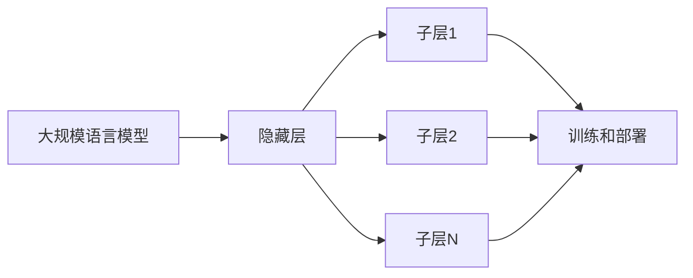

## 1.背景介绍

在过去的几年中，大规模预训练模型（Pretrained Language Models，PLMs）在自然语言处理（NLP）领域取得了显著的突破。这些模型，如GPT-3，BERT等，已经在各种NLP任务中取得了最先进的性能。然而，这些模型的训练和部署需要大量的计算资源，这对于许多组织来说可能是不可行的。因此，如何有效地训练和部署这些大规模模型是一个重要的问题。本文将介绍一种名为RLHF（Reduced Large-scale Hidden Factorization）的新方法，用于有效地训练和部署大规模语言模型。

## 2.核心概念与联系

RLHF是一种新的大规模语言模型训练和部署方法。它的主要思想是通过减少隐藏层的规模来减少模型的计算需求。这是通过将隐藏层分解为几个较小的子层来实现的，每个子层都可以独立地进行训练和部署。这种方法可以大大减少模型的计算需求，同时保持模型的性能。



## 3.核心算法原理具体操作步骤

RLHF的核心算法原理是隐藏层的分解。具体操作步骤如下：

1. **初始化**：首先，我们初始化一个大规模语言模型，如GPT-3或BERT。

2. **隐藏层分解**：然后，我们将模型的隐藏层分解为多个较小的子层。每个子层都有自己的参数，可以独立地进行训练和部署。

3. **训练**：我们使用标准的反向传播算法训练每个子层。由于每个子层的规模都较小，因此训练过程可以在较小的计算资源上进行。

4. **部署**：最后，我们将训练好的子层部署到目标环境中。由于每个子层都可以独立部署，因此我们可以根据目标环境的资源情况灵活地部署模型。

## 4.数学模型和公式详细讲解举例说明

假设我们的大规模语言模型的隐藏层为$h$，参数为$\theta$，输入为$x$，输出为$y$。我们的目标是最小化以下损失函数：

$$
L(\theta) = \sum_{i=1}^{N} (y_i - f(x_i; \theta))^2
$$

其中，$f(x_i; \theta)$是模型的预测输出，$N$是训练样本的数量。

在RLHF中，我们将隐藏层$h$分解为$n$个子层$h_1, h_2, ..., h_n$，每个子层都有自己的参数$\theta_1, \theta_2, ..., \theta_n$。因此，模型的预测输出变为：

$$
f(x_i; \theta) = f(x_i; \theta_1, \theta_2, ..., \theta_n)
$$

我们的目标是最小化以下损失函数：

$$
L(\theta_1, \theta_2, ..., \theta_n) = \sum_{i=1}^{N} (y_i - f(x_i; \theta_1, \theta_2, ..., \theta_n))^2
$$

我们可以使用标准的反向传播算法独立地训练每个子层。

## 5.项目实践：代码实例和详细解释说明

以下是一个简单的RLHF的PyTorch实现示例：

```python
import torch
import torch.nn as nn

# 初始化模型
model = nn.Sequential(
    nn.Linear(1024, 512),
    nn.ReLU(),
    nn.Linear(512, 256),
    nn.ReLU(),
    nn.Linear(256, 128),
    nn.ReLU(),
    nn.Linear(128, 1)
)

# 分解隐藏层
hidden_layers = [nn.Linear(1024, 512), nn.Linear(512, 256), nn.Linear(256, 128), nn.Linear(128, 1)]
model = nn.ModuleList(hidden_layers)

# 训练
for layer in model:
    optimizer = torch.optim.Adam(layer.parameters())
    for epoch in range(100):
        optimizer.zero_grad()
        output = layer(input)
        loss = criterion(output, target)
        loss.backward()
        optimizer.step()

# 部署
torch.save(model.state_dict(), 'model.pth')
```

在这个示例中，我们首先初始化一个简单的全连接网络模型。然后，我们将模型的隐藏层分解为多个子层，并将它们存储在一个模块列表中。接着，我们使用Adam优化器和MSE损失函数独立地训练每个子层。最后，我们将训练好的模型保存到磁盘。

## 6.实际应用场景

RLHF可以广泛应用于各种需要大规模语言模型的场景，例如：

- **机器翻译**：在机器翻译中，我们需要处理大量的文本数据。使用RLHF，我们可以有效地训练和部署大规模的翻译模型。

- **情感分析**：在情感分析中，我们需要理解用户的情感和情绪。使用RLHF，我们可以有效地训练和部署大规模的情感分析模型。

- **文本生成**：在文本生成中，我们需要生成符合特定风格和主题的文本。使用RLHF，我们可以有效地训练和部署大规模的文本生成模型。

## 7.工具和资源推荐

以下是一些有用的工具和资源，可以帮助你更好地理解和使用RLHF：

- **PyTorch**：PyTorch是一个开源的深度学习框架，它提供了一系列的工具和库，可以帮助你更方便地实现RLHF。

- **TensorFlow**：TensorFlow也是一个开源的深度学习框架，它同样提供了一系列的工具和库，可以帮助你更方便地实现RLHF。

- **Hugging Face Transformers**：Hugging Face Transformers是一个开源的库，它提供了一系列预训练的语言模型，包括GPT-3，BERT等。你可以使用这个库来进行RLHF的实验。

## 8.总结：未来发展趋势与挑战

随着深度学习和自然语言处理技术的发展，大规模语言模型的训练和部署将越来越重要。然而，由于计算资源的限制，如何有效地训练和部署这些模型仍然是一个挑战。RLHF提供了一种有效的解决方案，但仍有许多需要解决的问题，例如如何优化子层的数量和规模，如何处理模型的过拟合和欠拟合问题等。我们期待未来有更多的研究来解决这些问题，并进一步提高大规模语言模型的性能和效率。

## 9.附录：常见问题与解答

- **Q: RLHF适用于所有类型的大规模语言模型吗？**

  A: RLHF的核心思想是将隐藏层分解为多个子层，这个思想在理论上可以应用于任何类型的神经网络模型。然而，不同的模型可能需要不同的分解策略和训练方法。因此，RLHF可能需要根据具体的模型和任务进行调整。

- **Q: RLHF会影响模型的性能吗？**

  A: RLHF的目标是在保持模型性能的同时，减少模型的计算需求。然而，由于模型的复杂性和数据的多样性，RLHF可能会在某些情况下影响模型的性能。这需要通过实验来进行验证和优化。

- **Q: RLHF需要特殊的硬件或软件支持吗？**

  A: RLHF不需要特殊的硬件或软件支持。它可以在任何支持深度学习框架（如PyTorch或TensorFlow）的环境中运行。然而，对于大规模的数据和模型，使用高性能的计算资源（如GPU）可以加速训练和部署过程。

作者：禅与计算机程序设计艺术 / Zen and the Art of Computer Programming
