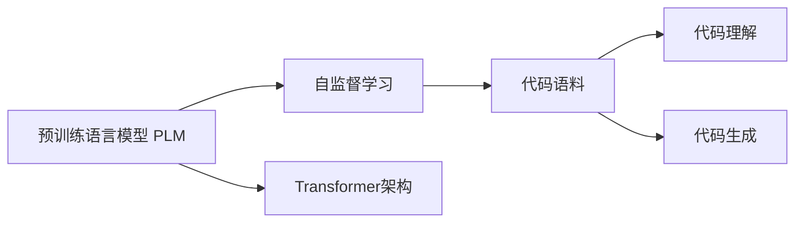

# 大语言模型原理与工程实践：代码数据

## 1. 背景介绍

近年来,自然语言处理(NLP)领域取得了巨大的进展,尤其是大规模预训练语言模型(PLM)的出现,极大地推动了NLP技术的发展。PLM通过在大规模无监督文本语料上进行预训练,学习到了丰富的语言知识和通用语言表示,可以灵活地应用于各种下游NLP任务,取得了显著的性能提升。

在众多PLM中,基于Transformer架构的模型如BERT、GPT、T5等,以其强大的建模能力和卓越的性能,成为了当前NLP研究的主流范式。这些模型通过自监督学习从海量文本数据中习得语言规律和知识,构建出高质量的文本表示,为下游任务提供了优质的特征。

然而,随着模型规模和训练数据的不断增长,PLM的训练和应用也面临着诸多挑战,如计算资源消耗大、训练时间长、推理效率低等问题。为了进一步提升PLM的性能和效率,学界和业界提出了一系列改进方法,如知识蒸馏、模型压缩、参数高效微调等技术。

本文将重点探讨大语言模型中的一个关键话题:代码和数据。作为PLM的重要训练数据来源,高质量的代码语料对于模型性能至关重要。我们将详细介绍代码数据的特点、获取方式、预处理流程等,并分析其对模型训练的影响。此外,我们还将讨论如何利用代码知识增强PLM,使其更好地理解和生成程序代码。

## 2. 核心概念与联系

在讨论代码数据在大语言模型中的作用之前,我们先来了解一些核心概念:

- **预训练语言模型(PLM)**: 通过在大规模无监督文本数据上进行自监督学习,习得通用语言知识和表示的模型。代表模型有BERT、GPT、T5等。

- **自监督学习**: 一种无需人工标注数据的学习范式。通过设计巧妙的预训练任务,让模型从原始文本中自主学习语言规律和知识。常见任务有语言模型、掩码语言模型等。

- **Transformer**: 一种基于自注意力机制的神经网络架构,广泛应用于NLP领域。Transformer擅长捕捉长距离依赖,是当前大多数PLM的基础架构。 

- **代码语料**: 包含大量程序代码的文本数据集。常见的代码语料有GitHub、Stack Overflow等。相比自然语言文本,代码语料具有独特的语法结构和语义信息。

- **代码理解**: 让模型理解程序代码的语义和功能,如变量类型推断、代码补全、代码搜索等任务。PLM可以通过预训练从代码语料中学习代码知识。

- **代码生成**: 让模型根据需求自动生成程序代码。通过在代码语料上预训练,PLM可以掌握代码的语法规则和编写模式,从而生成高质量的代码。

下图展示了这些核心概念之间的联系:



可以看出,代码语料是连接PLM和代码理解、生成任务的桥梁。高质量的代码语料为PLM提供了丰富的训练数据,使其学习到代码相关的知识。而预训练后的PLM则可以更好地完成代码理解和生成任务。

## 3. 核心算法原理与具体操作步骤

大语言模型在代码数据上的预训练通常采用自监督学习范式,即无需人工标注数据,而是通过设计预训练任务让模型从原始代码文本中自主学习。下面我们以掩码语言模型(Masked Language Model, MLM)为例,介绍其核心算法原理和具体操作步骤。

MLM的基本思想是随机掩盖(mask)输入文本中的部分token,然后让模型根据上下文预测被掩盖的token。这个过程可以促使模型学习到token之间的依赖关系和语义信息。对于代码数据,MLM可以帮助模型掌握代码的语法结构和编写模式。

MLM的具体操作步骤如下:

1. 对输入的代码文本进行tokenization,将其转换为token序列。
2. 随机选择一部分token进行掩码。通常有以下几种掩码策略:
   - 以一定概率(如15%)将token替换为特殊的[MASK]符号。
   - 以一定概率(如10%)将token替换为随机的其他token。
   - 以一定概率(如10%)保持token不变。
3. 将掩码后的token序列输入到Transformer编码器中,获得每个token的隐向量表示。
4. 对于被掩盖的token,使用其隐向量预测原始的token。这可以通过在隐向量上添加一个全连接层和softmax层来实现。
5. 计算预测结果与真实token的交叉熵损失,并使用反向传播算法更新模型参数。

通过反复执行上述步骤,模型可以逐渐学习到代码的语法规则和编写模式,从而获得高质量的代码表示。预训练后的模型可以进一步应用于各种代码相关任务,如代码补全、代码搜索、代码翻译等。

除了MLM外,还有其他一些预训练任务也适用于代码数据,如:

- **Next Code Block Prediction**: 随机掩盖代码文本中的一个代码块,让模型根据上下文预测被掩盖的代码块。这可以帮助模型学习代码的逻辑结构和流程。
- **Code Contrastive Learning**: 通过最大化同一份代码的不同视角(如原始代码和注释)之间的相似度,同时最小化不同代码之间的相似度,让模型学习到代码的语义信息。
- **Code Repair**: 随机在代码中引入一些错误(如语法错误、变量名错误),然后让模型修复这些错误。这可以提高模型的纠错和调试能力。

## 4. 数学模型和公式详细讲解举例说明

在本节中,我们将详细讲解MLM中涉及的数学模型和公式,并给出具体的例子说明。

首先,我们定义一些符号:

- $\mathbf{x} = (x_1, x_2, \dots, x_n)$表示输入的代码token序列,其中$n$为序列长度。
- $\mathbf{m} = (m_1, m_2, \dots, m_n)$表示掩码向量,其中$m_i \in \{0, 1\}$。$m_i=1$表示第$i$个token被掩盖,否则$m_i=0$。
- $\mathbf{h} = (h_1, h_2, \dots, h_n)$表示Transformer编码器输出的隐向量序列。
- $\mathbf{y} = (y_1, y_2, \dots, y_n)$表示真实的目标token序列。

MLM的目标是最大化被掩盖token的预测概率。假设被掩盖的token集合为$\mathcal{M} = \{i | m_i = 1\}$,则MLM的损失函数可以定义为:

$$\mathcal{L}_{\text{MLM}} = -\sum_{i \in \mathcal{M}} \log P(y_i | \mathbf{x}, \mathbf{m})$$

其中,$P(y_i | \mathbf{x}, \mathbf{m})$表示在给定输入序列$\mathbf{x}$和掩码向量$\mathbf{m}$的条件下,第$i$个token为$y_i$的概率。这个概率可以通过在隐向量$h_i$上应用全连接层和softmax函数来计算:

$$P(y_i | \mathbf{x}, \mathbf{m}) = \text{softmax}(\mathbf{W}h_i + \mathbf{b})_{y_i}$$

其中,$\mathbf{W}$和$\mathbf{b}$分别为全连接层的权重矩阵和偏置向量。

下面我们给出一个具体的例子。假设输入的代码序列为:

```python
def fib(n):
    if n <= 1:
        return n
    return fib(n-1) + fib(n-2)
```

经过tokenization后,得到的token序列为:

```
['def', 'fib', '(', 'n', ')', ':', 'if', 'n', '<=', '1', ':', 'return', 'n', 'return', 'fib', '(', 'n', '-', '1', ')', '+', 'fib', '(', 'n', '-', '2', ')', 'EOF']
```

假设我们随机选择掩码位置为$\mathcal{M} = \{3, 8, 12, 20\}$,则掩码后的序列为:

```
['def', 'fib', '(', '[MASK]', ')', ':', 'if', 'n', '[MASK]', '1', ':', 'return', '[MASK]', 'return', 'fib', '(', 'n', '-', '1', ')', '[MASK]', 'fib', '(', 'n', '-', '2', ')', 'EOF']
```

模型的任务是根据上下文预测出被掩盖的token。例如,对于位置3,模型需要在给定上下文`['def', 'fib', '(']`的情况下预测出`'n'`。

假设模型预测的概率分布为:

$$P(y_3 | \mathbf{x}, \mathbf{m}) = [0.1, 0.2, 0.4, 0.2, 0.1]$$

其中,第3个位置(索引为2)的概率最高,对应着真实的目标token`'n'`。

则位置3的损失项为:

$$-\log P(y_3 | \mathbf{x}, \mathbf{m}) = -\log 0.4 \approx 0.92$$

类似地,我们可以计算出其他被掩盖位置的损失项,然后将它们相加得到最终的MLM损失。模型通过最小化这个损失函数来学习代码的语法规则和编写模式。

## 5. 项目实践：代码实例和详细解释说明

在这一节,我们将通过一个具体的项目实践,演示如何使用PyTorch实现MLM预训练。我们将详细解释代码的各个部分,帮助读者深入理解MLM的实现细节。

首先,我们导入需要的库:

```python
import torch
import torch.nn as nn
import torch.optim as optim
from transformers import BertTokenizer, BertModel
```

其中,`transformers`库提供了预训练的BERT模型和tokenizer,可以方便地用于MLM任务。

接下来,我们定义MLM模型类:

```python
class MLMModel(nn.Module):
    def __init__(self, bert_model):
        super().__init__()
        self.bert = bert_model
        self.vocab_size = bert_model.config.vocab_size
        self.cls = nn.Linear(bert_model.config.hidden_size, self.vocab_size)
        
    def forward(self, input_ids, attention_mask, labels=None):
        outputs = self.bert(input_ids, attention_mask=attention_mask)
        hidden_states = outputs.last_hidden_state
        logits = self.cls(hidden_states)
        
        if labels is not None:
            loss_fct = nn.CrossEntropyLoss()
            masked_lm_loss = loss_fct(logits.view(-1, self.vocab_size), labels.view(-1))
            return masked_lm_loss
        else:
            return logits
```

这个模型类包含两个主要部分:

1. `__init__`方法:初始化模型参数。它接受一个预训练的BERT模型`bert_model`,并在其基础上添加了一个全连接层`cls`,用于将隐向量映射到词表大小的输出空间。

2. `forward`方法:定义模型的前向传播过程。它接受三个输入:
   - `input_ids`:经过掩码处理的token ID序列。
   - `attention_mask`:注意力掩码,用于区分真实token和填充token。
   - `labels`:真实的目标token ID序列,用于计算MLM损失。如果为None,则只返回预测的logits。

在前向传播过程中,我们首先将`input_ids`和`attention_mask`输入到BERT模型中,得到最后一层的隐向量`hidden_states`。然后,我们使用全连接层`cls`将隐向量映射到词表大小的输出空间,得到预测的logits。

如果提供了`labels`,我们使用交叉熵损失函数计算MLM损失,并返回损失值。否则,我们直接返回预测的logits。

有了MLM模型类,我们就可以进行MLM预训练了。下面是一个简单的训练代码示