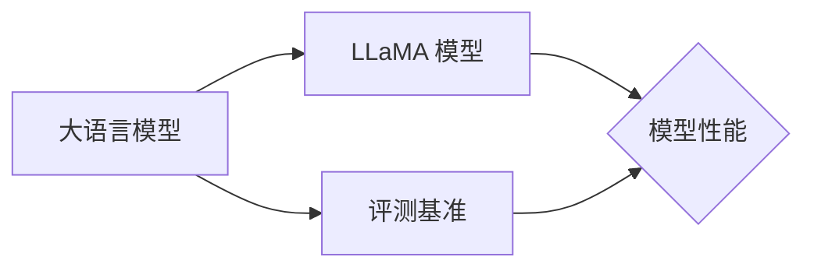

# 大语言模型原理与工程实践：具体案例：LLaMA 2 选取的评测基准

## 1.背景介绍
### 1.1 大语言模型的发展历程
#### 1.1.1 早期的语言模型
#### 1.1.2 Transformer 的出现
#### 1.1.3 预训练语言模型的兴起

### 1.2 LLaMA 模型的诞生
#### 1.2.1 Meta AI 的研究进展  
#### 1.2.2 LLaMA 1.0 版本的发布
#### 1.2.3 LLaMA 2.0 的升级与改进

### 1.3 评测基准的重要性
#### 1.3.1 评估模型性能的必要性
#### 1.3.2 常见的评测基准
#### 1.3.3 评测基准的选择标准

## 2.核心概念与联系
### 2.1 大语言模型
#### 2.1.1 定义与特点
#### 2.1.2 训练方法
#### 2.1.3 应用场景

### 2.2 LLaMA 模型
#### 2.2.1 模型结构
#### 2.2.2 训练数据
#### 2.2.3 优化策略

### 2.3 评测基准
#### 2.3.1 分类与类型
#### 2.3.2 评估指标
#### 2.3.3 基准数据集



## 3.核心算法原理具体操作步骤
### 3.1 预训练阶段
#### 3.1.1 数据预处理
#### 3.1.2 模型初始化
#### 3.1.3 预训练损失函数

### 3.2 微调阶段 
#### 3.2.1 下游任务适配
#### 3.2.2 微调策略
#### 3.2.3 超参数选择

### 3.3 推理阶段
#### 3.3.1 解码策略
#### 3.3.2 生成结果后处理
#### 3.3.3 加速优化技术

## 4.数学模型和公式详细讲解举例说明
### 4.1 Transformer 结构
#### 4.1.1 自注意力机制
$Attention(Q,K,V) = softmax(\frac{QK^T}{\sqrt{d_k}})V$
#### 4.1.2 前馈神经网络
$FFN(x) = max(0, xW_1 + b_1)W_2 + b_2$
#### 4.1.3 残差连接与层归一化
$x = LayerNorm(x + Sublayer(x))$

### 4.2 预训练目标函数
#### 4.2.1 掩码语言模型(MLM)
$$\mathcal{L}_{MLM}(\theta) = -\sum_{i=1}^{n}m_i\log P(w_i|w_{\backslash i};\theta)$$
#### 4.2.2 置换语言模型(PLM) 
$$\mathcal{L}_{PLM}(\theta) = -\sum_{i=1}^{n}\log P(w_i|w_{<i};\theta)$$
#### 4.2.3 次词掩码语言模型(SLM)
$$\mathcal{L}_{SLM}(\theta) = -\sum_{i=1}^{n}m_i\log P(s_i|w_{\backslash i},s_{\backslash i};\theta)$$

### 4.3 评估指标计算
#### 4.3.1 困惑度(Perplexity)
$$PPL = \exp(-\frac{1}{n}\sum_{i=1}^{n}\log P(w_i|w_{<i}))$$  
#### 4.3.2 BLEU 得分
$$BLEU = BP \cdot \exp(\sum_{n=1}^{N}w_n\log p_n)$$
#### 4.3.3 F1 值
$$F_1=\frac{2\cdot Precision \cdot Recall}{Precision + Recall}$$

## 5.项目实践：代码实例和详细解释说明
### 5.1 数据预处理示例
```python
def tokenize_function(examples):
    return tokenizer(examples["text"], padding="max_length", truncation=True)
```
这段代码使用分词器对文本进行分词，并进行填充和截断操作，将文本转换为模型可以接受的输入格式。

### 5.2 模型训练示例
```python
from transformers import TrainingArguments, Trainer

training_args = TrainingArguments(
    output_dir="./results",
    evaluation_strategy="epoch",
    learning_rate=2e-5,
    num_train_epochs=3,
)

trainer = Trainer(
    model=model,
    args=training_args,
    train_dataset=train_dataset,
    eval_dataset=eval_dataset,
)

trainer.train()
```
这段代码使用 Hugging Face 的 Trainer 接口对模型进行训练。首先定义训练参数，如输出目录、评估策略、学习率和训练轮数等。然后创建 Trainer 对象，传入模型、训练参数、训练集和评估集。最后调用 `train()` 方法开始训练。

### 5.3 模型推理示例
```python
from transformers import pipeline

generator = pipeline("text-generation", model=model, tokenizer=tokenizer)
text = generator("Once upon a time", max_length=50, num_return_sequences=1)

print(text[0]["generated_text"])
```
这段代码使用训练好的模型进行文本生成。首先创建一个文本生成的管道(pipeline)，传入模型和分词器。然后输入一个开头文本，设置最大生成长度和生成序列数。最后打印生成的文本结果。

## 6.实际应用场景
### 6.1 智能写作助手
#### 6.1.1 自动生成文章
#### 6.1.2 改进文本风格
#### 6.1.3 提供写作建议

### 6.2 智能客服系统
#### 6.2.1 自动回复客户咨询
#### 6.2.2 情感分析与识别
#### 6.2.3 个性化服务推荐

### 6.3 知识问答系统
#### 6.3.1 海量知识库构建
#### 6.3.2 问题理解与匹配
#### 6.3.3 答案生成与排序

## 7.工具和资源推荐
### 7.1 开源框架
#### 7.1.1 Hugging Face Transformers
#### 7.1.2 Fairseq
#### 7.1.3 OpenAI GPT-3 API

### 7.2 预训练模型
#### 7.2.1 BERT
#### 7.2.2 GPT 系列
#### 7.2.3 T5

### 7.3 评测基准数据集
#### 7.3.1 GLUE
#### 7.3.2 SuperGLUE
#### 7.3.3 SQuAD

## 8.总结：未来发展趋势与挑战
### 8.1 模型规模的持续增长
#### 8.1.1 参数量的增加
#### 8.1.2 计算资源的需求
#### 8.1.3 训练效率的提升

### 8.2 多模态融合
#### 8.2.1 文本-图像联合建模
#### 8.2.2 语音-文本转换
#### 8.2.3 视频理解与生成

### 8.3 隐私与安全
#### 8.3.1 数据隐私保护
#### 8.3.2 模型鲁棒性
#### 8.3.3 防止恶意使用

## 9.附录：常见问题与解答
### 9.1 如何选择合适的预训练模型？
根据具体任务的特点和要求，选择相应规模和类型的预训练模型。对于一般的自然语言处理任务，可以考虑使用 BERT、RoBERTa 等模型。对于生成任务，可以使用 GPT 系列模型。如果任务涉及多语言，可以选择多语言版本的预训练模型，如 XLM、mBART 等。

### 9.2 微调过程中出现过拟合怎么办？
过拟合是微调过程中常见的问题。可以采取以下措施来缓解过拟合：
1. 增大训练集的规模和多样性。
2. 使用正则化技术，如权重衰减、dropout 等。
3. 对数据进行增强，如随机替换、插入、删除等操作。
4. 降低模型复杂度，如减小隐藏层维度、层数等。
5. 提前停止训练，根据验证集性能选择最优模型。

### 9.3 评测基准的选择有哪些注意事项？
选择评测基准时需要考虑以下几点：
1. 与目标任务的相关性。选择与实际应用场景接近的评测任务和数据集。
2. 数据集的质量。关注数据集的规模、覆盖面、标注质量等因素。
3. 评估指标的合理性。根据任务类型选择合适的评估指标，全面衡量模型性能。
4. 基准的公平性。尽量选择公开、透明、被广泛接受的评测基准。
5. 多个基准的互补性。通过多个评测基准综合评估模型的全面性能。

作者：禅与计算机程序设计艺术 / Zen and the Art of Computer Programming