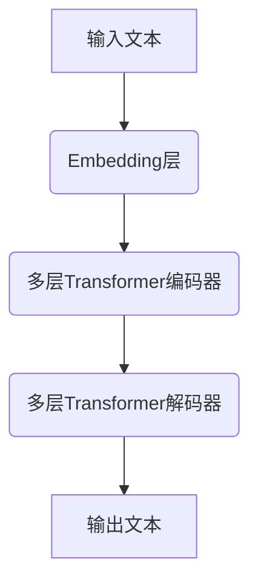
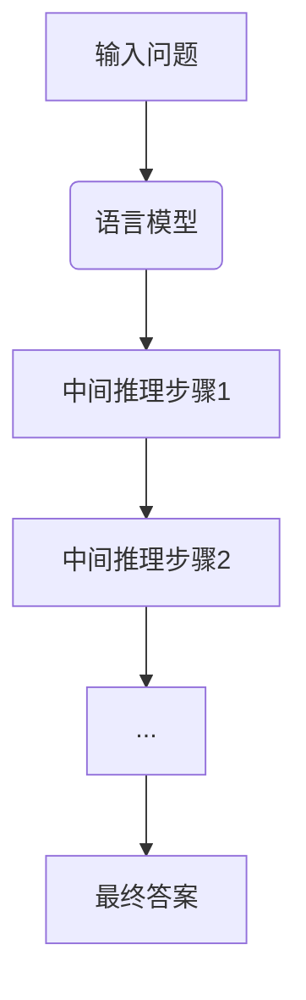

# 大语言模型原理与工程实践：基于思维链的推理策略

## 1. 背景介绍

### 1.1 大语言模型的兴起

近年来,大型语言模型(Large Language Models, LLMs)在自然语言处理领域取得了令人瞩目的成就。这些模型通过在海量文本数据上进行预训练,学习到了丰富的语言知识和上下文理解能力,并可以通过微调等技术应用于下游任务。著名的大语言模型包括 GPT-3、BERT、XLNet、T5 等,它们在机器翻译、问答系统、文本生成、情感分析等任务中表现出色。

大语言模型的核心思想是利用自注意力(Self-Attention)机制和 Transformer 结构,捕捉文本中的长程依赖关系,从而更好地理解和生成自然语言。与传统的序列模型(如 RNN、LSTM)相比,大语言模型具有并行计算的优势,可以更高效地利用硬件资源,同时避免了梯度消失和梯度爆炸问题。

### 1.2 思维链推理策略

尽管大语言模型展现出了强大的语言理解和生成能力,但它们在复杂推理和决策任务中仍然存在局限性。为了解决这一问题,思维链(Chain of Thought)推理策略应运而生。思维链推理策略旨在引导语言模型按照人类的思维方式,分解复杂问题,逐步推导出解决方案。

思维链推理策略的核心思想是让语言模型在输出最终答案之前,先生成一系列中间步骤,描述其推理过程。这些中间步骤就构成了"思维链",反映了模型分析问题、建立联系、推导结果的逻辑思路。通过显式地建模推理过程,思维链推理策略有望提高语言模型在复杂推理任务中的性能和可解释性。

## 2. 核心概念与联系

### 2.1 大语言模型的架构

大语言模型通常采用 Transformer 编码器-解码器架构,如图所示:



1. **Embedding 层**将输入文本转换为向量表示。
2. **Transformer 编码器**捕捉输入序列中的上下文信息和长程依赖关系。
3. **Transformer 解码器**根据编码器的输出和前一时刻的输出,生成下一个词或标记。

### 2.2 自注意力机制

自注意力机制是 Transformer 模型的核心,它允许模型在计算目标词的表示时,直接关注整个输入序列中的所有词。这种全局依赖建模能力是 Transformer 优于 RNN 的关键所在。

自注意力机制的计算过程如下:

$$\begin{aligned}
Q &= XW_Q\\
K &= XW_K\\
V &= XW_V\\
\text{Attention}(Q, K, V) &= \text{softmax}(\frac{QK^T}{\sqrt{d_k}})V
\end{aligned}$$

其中 $Q$、$K$、$V$ 分别表示查询(Query)、键(Key)和值(Value)向量,它们是通过线性变换得到的。注意力分数由查询向量和键向量的点积决定,然后通过 softmax 函数归一化。最终的注意力表示是注意力分数与值向量的加权和。

### 2.3 思维链推理策略

思维链推理策略的核心思想是让语言模型在输出最终答案之前,先生成一系列中间步骤,描述其推理过程。这些中间步骤就构成了"思维链",反映了模型分析问题、建立联系、推导结果的逻辑思路。

思维链推理策略的实现过程如下:



1. 语言模型接收输入问题。
2. 语言模型生成第一个中间推理步骤。
3. 基于前一步的输出,语言模型继续生成下一个推理步骤。
4. 重复第 3 步,直到生成最终答案。

通过这种方式,语言模型不仅输出最终答案,还展示了其推理过程,从而提高了模型的可解释性和可信度。

## 3. 核心算法原理具体操作步骤

### 3.1 思维链推理策略的训练

为了让语言模型学习思维链推理策略,需要在训练数据中提供带有推理过程的示例。一种常见的方法是通过人工标注或自动生成,为每个问题构建一个包含中间推理步骤的"思维链"序列。

训练过程如下:

1. **数据预处理**: 将原始问题和答案数据转换为"思维链"序列格式,即在答案之前添加一系列中间推理步骤。
2. **模型输入**: 将问题和"思维链"序列作为模型的输入,目标是让模型生成与训练数据中相同的"思维链"序列。
3. **损失函数**: 使用常见的序列生成损失函数,如交叉熵损失,最小化模型输出与目标"思维链"序列之间的差异。
4. **模型优化**: 通过梯度下降等优化算法,更新模型参数,使其能够更好地生成"思维链"序列。

### 3.2 思维链推理策略的推理

在推理阶段,语言模型需要根据输入问题,自主生成"思维链"序列和最终答案。具体步骤如下:

1. **问题输入**: 将待解决的问题输入到语言模型中。
2. **生成第一步**: 模型生成第一个中间推理步骤。
3. **迭代生成**: 将前一步的输出作为新的输入,模型继续生成下一个推理步骤,重复该过程直到生成最终答案。
4. **答案输出**: 从生成的序列中提取最终答案。

为了提高推理质量,可以采用以下策略:

- **提示工程(Prompt Engineering)**: 通过设计合理的提示,引导语言模型更好地理解问题并生成有效的推理步骤。
- **结果重评分(Reranking)**: 对于同一个问题,语言模型可能会生成多个不同的"思维链"序列。通过重评分机制,选择最合理的序列作为最终输出。
- **人机交互(Human-in-the-Loop)**: 在推理过程中引入人工反馈,纠正语言模型的错误推理,从而不断改进模型的性能。

## 4. 数学模型和公式详细讲解举例说明

### 4.1 注意力机制

注意力机制是 Transformer 模型的核心,它允许模型在计算目标词的表示时,直接关注整个输入序列中的所有词。注意力分数由查询向量和键向量的点积决定,然后通过 softmax 函数归一化。最终的注意力表示是注意力分数与值向量的加权和。

具体计算过程如下:

$$\begin{aligned}
Q &= XW_Q\\
K &= XW_K\\
V &= XW_V\\
\text{Attention}(Q, K, V) &= \text{softmax}(\frac{QK^T}{\sqrt{d_k}})V
\end{aligned}$$

其中 $Q$、$K$、$V$ 分别表示查询(Query)、键(Key)和值(Value)向量,它们是通过线性变换得到的。$d_k$ 是缩放因子,用于防止点积过大导致梯度消失或爆炸。

以一个简单的例子说明注意力机制的计算过程:

假设输入序列为 "The cat sat on the mat",我们希望计算 "sat" 这个词的注意力表示。首先,我们需要计算查询向量 $q$、键向量 $k$ 和值向量 $v$:

$$\begin{aligned}
q &= \text{Embedding}(\text{"sat"})W_Q\\
k_i &= \text{Embedding}(\text{"The"})W_K\\
k_j &= \text{Embedding}(\text{"cat"})W_K\\
&\cdots\\
v_i &= \text{Embedding}(\text{"The"})W_V\\
v_j &= \text{Embedding}(\text{"cat"})W_V\\
&\cdots
\end{aligned}$$

接下来,我们计算查询向量 $q$ 与每个键向量 $k_i$ 的点积,并对点积结果进行缩放和 softmax 归一化,得到注意力分数 $\alpha_i$:

$$\alpha_i = \text{softmax}(\frac{q \cdot k_i}{\sqrt{d_k}})$$

最终,注意力表示 $a$ 是注意力分数 $\alpha_i$ 与值向量 $v_i$ 的加权和:

$$a = \sum_i \alpha_i v_i$$

通过这种方式,模型可以自适应地为每个词分配不同的注意力权重,从而更好地捕捉长程依赖关系和上下文信息。

### 4.2 Transformer 架构

Transformer 是一种全新的序列到序列模型架构,它完全基于注意力机制,不使用循环神经网络或卷积神经网络。Transformer 架构包括编码器和解码器两个主要部分。

**编码器**的计算过程如下:

1. 输入序列首先通过 Embedding 层和位置编码层,得到初始的向量表示。
2. 向量表示输入到 $N$ 层编码器层中,每一层包含一个多头自注意力子层和一个前馈神经网络子层。
3. 自注意力子层捕捉输入序列中的长程依赖关系,前馈神经网络子层对每个位置的表示进行非线性变换。
4. 编码器的最终输出是输入序列在每个位置的上下文表示。

**解码器**的计算过程与编码器类似,但有以下不同:

1. 解码器还包含一个额外的掩码多头自注意力子层,用于防止每个位置关注到未来位置的信息。
2. 解码器中还包含一个编码器-解码器注意力子层,它允许每个输出位置关注输入序列的所有位置。

通过这种方式,Transformer 模型可以高效地建模输入和输出序列之间的依赖关系,并且由于全部基于注意力机制,具有更好的并行计算能力。

## 5. 项目实践:代码实例和详细解释说明

在这一部分,我们将提供一个基于 Hugging Face 的 Transformers 库实现思维链推理策略的代码示例。该示例使用 GPT-2 模型,并在 COQA 数据集上进行训练和评估。

### 5.1 数据预处理

首先,我们需要将原始数据转换为"思维链"序列格式。以下是一个示例函数,它将问题和答案转换为包含中间推理步骤的序列:

```python
import re

def convert_to_chain_of_thought(question, answer):
    # 使用特殊标记将问题和答案分隔开
    chain = f"Question: {question} \n Answer: {answer}"
    
    # 使用正则表达式在答案中插入中间推理步骤
    chain = re.sub(r'(\w+\.\s)', r'\1\n<step>\g<1>', chain)
    chain = chain.replace('<step>', '').replace('\n\n', '\n')
    
    # 将序列分割成多个步骤
    steps = chain.split('\n')
    
    return steps
```

该函数将问题和答案作为输入,并使用正则表达式在答案中插入中间推理步骤。最终,它将整个序列分割成多个步骤,每个步骤代表一个推理步骤或最终答案。

### 5.2 模型训练

接下来,我们将训练一个 GPT-2 模型,使其能够生成"思维链"序列。以下是训练代码的简化版本:

```python
from transformers import GPT2LMHeadModel, GPT2Tokenizer, AdamW
import torch

# 加载预训练模型和分词器
model = GPT2LMHeadModel.from_pretrained('gpt2')
tokenizer = GPT2Tokenizer.from_pretrained('gpt2')

# 定义优化器和损失函数
optimizer = AdamW(model.parameters(), lr=1e-5)
loss_fn = torch.nn.CrossEntropyLoss()

# 训练循环
for epoch in range(num_epochs):
    for batch in train_loader:
        # 将输入序列编码为张量
        input_ids = tokenizer.batch_encode_plus(batch, padding=True, return_tensors='pt')['input_ids']
        
        # 前向传播
        outputs = model