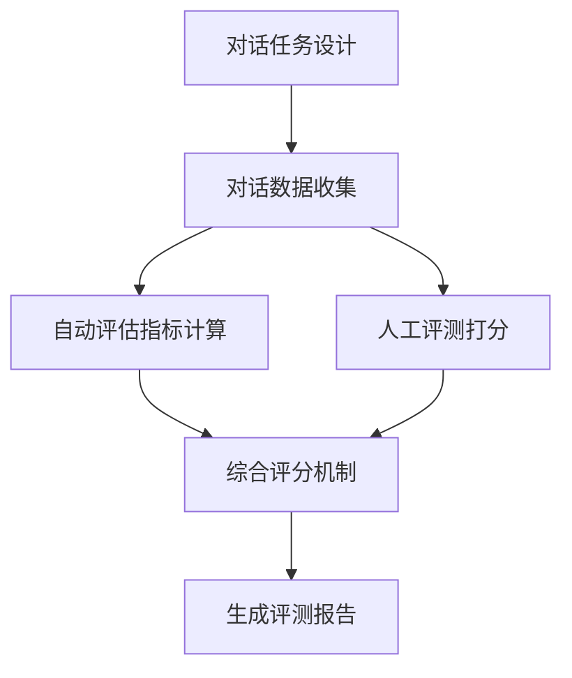

# 大语言模型原理与工程实践：大语言模型的对话能力评测

## 1. 背景介绍

### 1.1 大语言模型的发展历程

近年来，自然语言处理(NLP)领域取得了巨大的进步，尤其是大语言模型(Large Language Model, LLM)的出现，极大地推动了NLP技术的发展。从2018年GPT-1的发布，到GPT-2、GPT-3、PaLM、Chinchilla等大语言模型的相继问世，LLM展现出了惊人的自然语言理解和生成能力，在机器翻译、文本摘要、问答系统、对话生成等诸多NLP任务上取得了突破性的进展。

### 1.2 大语言模型的对话能力评测的重要性

大语言模型强大的语言能力使其在对话系统中有着广阔的应用前景。然而，要真正实现智能化、人性化的对话交互，仅仅依靠语言模型的生成能力是远远不够的，还需要对其对话能力进行全面、系统的评估。只有建立科学合理的对话能力评测体系，才能客观衡量不同语言模型的对话水平，推动对话系统的进一步发展完善。本文将重点探讨大语言模型对话能力评测的原理和实践。

## 2. 核心概念与联系

### 2.1 大语言模型的定义与特点

大语言模型是指基于海量文本数据，利用深度学习技术训练得到的语言模型。其显著特点包括：

- 模型参数量巨大，动辄上百亿甚至上千亿参数
- 训练数据规模空前，涵盖了网络上的海量文本语料
- 模型架构先进，主要采用Transformer等注意力机制模型
- 训练任务多样，包括语言建模、掩码语言建模等，有助于学习语言的内在规律

### 2.2 对话系统的分类与评价维度

对话系统大致可分为以下几类：

- 任务型对话系统：完成特定的任务，如订餐、订票等
- 闲聊型对话系统：进行开放域的自由对话
- 问答型对话系统：根据问题给出答案，如智能客服

对话系统的评价维度主要包括：

- 自然性：对话是否流畅自然，符合人类交流习惯
- 连贯性：对话上下文是否连贯，能否保持话题一致性
- 信息性：对话内容是否包含丰富的信息，能否满足用户需求
- 逻辑性：对话逻辑是否合理，是否前后矛盾
- 同理心：对话是否理解用户情绪，给出恰当的情感反馈

### 2.3 大语言模型对话能力评测的关键问题

要评测大语言模型的对话能力，需要重点关注以下问题：

- 如何构建全面、细粒度的对话能力评测指标体系？ 
- 如何设计对话任务来考察模型的不同对话技能？
- 如何收集高质量的人机对话数据用于评测？
- 如何综合多方面指标给出模型总体对话水平的评分？

只有系统性地解决这些关键问题，才能真正建立起科学的大语言模型对话能力评测标准。

## 3. 核心算法原理与具体操作步骤

### 3.1 对话能力评测指标体系构建

构建对话能力评测指标是评测的基础。一个全面、细粒度的指标体系应该涵盖对话的方方面面。我们设计了如下几大类指标：

- 对话流畅性指标：衡量对话在词汇、语法、语义连贯等方面的流畅程度，如词汇丰富度、句法正确率等。

- 对话连贯性指标：衡量对话在话题延续、上下文关联等方面的连贯性，如话题转移自然度、上下文相关度等。

- 对话信息性指标：衡量对话在信息量、信息质量、信息新颖度等方面的表现，如信息熵、文本摘要质量等。

- 对话逻辑性指标：衡量对话在因果逻辑、时间逻辑、常识逻辑等方面的合理性，如因果关系准确度等。

- 对话同理心指标：衡量对话在情绪识别、情感反馈、人格一致性等方面的表现，如情感分类准确率等。

每一大类指标下还设置了多个细分指标，构成了一套完善的对话能力评测指标体系。

### 3.2 对话任务设计与数据收集

针对不同评测指标，我们精心设计了一系列对话任务，用于考察模型的各项对话技能，主要包括：

- 多轮对话任务：考察模型在多轮交互中的表现，如话题延续、信息累积等能力。

- 角色扮演任务：考察模型扮演特定角色进行对话的能力，如扮演医生、律师等。

- 知识问答任务：考察模型利用背景知识进行问答的能力，如回答历史、科学问题等。

- 情感对话任务：考察模型理解和表达情感的能力，如安慰、鼓励等情感对话。

我们在每个任务上都收集或人工标注了高质量的人机对话数据，作为评测的黄金标准数据集。

### 3.3 对话质量自动评估算法

为了高效评测大语言模型的对话质量，我们开发了一系列自动评估算法，包括：

- 基于词重叠的 BLEU、ROUGE 等指标，用于评估对话流畅性。

- 基于词向量的 Embedding Average、Vector Extrema 等指标，用于评估对话连贯性。

- 基于信息论的 Entropy、Perplexity 等指标，用于评估对话信息性。  

- 基于知识图谱的 Entity Accuracy、Relation Accuracy 等指标，用于评估对话逻辑性。

- 基于情感词典的 Sentiment Accuracy、Emotion F1 等指标，用于评估对话同理心。

通过这些自动评估指标，可以快速量化不同模型在各项对话技能上的得分情况。

### 3.4 人工评测与综合评分机制

为了弥补自动评估的局限性，我们还引入了人工评测环节。专业评测人员根据对话质量评分标准，对模型生成的对话进行主观评分。

最后，我们设计了综合评分机制，结合自动评估和人工评测的结果，给出模型的总体对话能力得分，并生成详细的评测报告。

## 4. 数学模型和公式详细讲解举例说明

### 4.1 对话流畅性指标 - BLEU

BLEU (Bilingual Evaluation Understudy) 是一种基于 n-gram 词重叠的自动评估指标，常用于机器翻译和对话生成任务。其基本思想是，与参考答案重叠的 n-gram 越多，生成的对话质量越高。

给定生成对话 $c$ 和参考对话 $r$，BLEU 得分定义为：

$$
\mathrm{BLEU} = \mathrm{BP} \cdot \exp \left(\sum_{n=1}^N w_n \log p_n \right)
$$

其中，$N$ 为 n-gram 的最大长度（通常取 4），$w_n$ 为 $n$ 元语法的权重（通常均匀分布），$p_n$ 为 $n$ 元语法的精度，$\mathrm{BP}$ 为句子长度惩罚因子。

$n$ 元语法精度 $p_n$ 的计算公式为：

$$
p_n = \frac{\sum_{ngram \in c} \min \left( \mathrm{Count}_{clip}(ngram), \mathrm{Count}_{r}(ngram) \right)}{\sum_{ngram \in c} \mathrm{Count}_{c}(ngram)}
$$

其中，$\mathrm{Count}_{clip}(ngram)$ 表示生成对话中某个 $n$ 元语法的截断计数，$\mathrm{Count}_{r}(ngram)$ 和 $\mathrm{Count}_{c}(ngram)$ 分别表示参考对话和生成对话中该 $n$ 元语法的计数。

句子长度惩罚因子 $\mathrm{BP}$ 的计算公式为：

$$
\mathrm{BP} = 
\begin{cases}
1 & \text{if } c > r \\
e^{(1 - r/c)} & \text{if } c \leq r
\end{cases}
$$

其中，$c$ 为生成对话的长度，$r$ 为参考对话的长度。

### 4.2 对话连贯性指标 - Embedding Average

Embedding Average 是一种基于词向量平均的连贯性评估指标。其基本思想是，连贯的对话在词向量空间中应该更加紧凑。

给定对话 $D = \{s_1, s_2, \dots, s_n\}$，其中 $s_i$ 为第 $i$ 个句子。设句子 $s_i$ 包含的词语为 $\{w_1, w_2, \dots, w_m\}$，对应的词向量为 $\{\mathbf{v}_1, \mathbf{v}_2, \dots, \mathbf{v}_m\}$。句子 $s_i$ 的词向量平均 $\mathbf{e}_i$ 为：

$$
\mathbf{e}_i = \frac{1}{m} \sum_{j=1}^m \mathbf{v}_j
$$

对话 $D$ 的词向量平均 $\mathbf{e}_D$ 为：

$$
\mathbf{e}_D = \frac{1}{n} \sum_{i=1}^n \mathbf{e}_i
$$

Embedding Average 得分 $\mathrm{EA}(D)$ 定义为各句子词向量平均与对话词向量平均之间余弦相似度的平均值：

$$
\mathrm{EA}(D) = \frac{1}{n} \sum_{i=1}^n \cos(\mathbf{e}_i, \mathbf{e}_D)
$$

其中，$\cos(\cdot, \cdot)$ 表示两个向量的余弦相似度：

$$
\cos(\mathbf{u}, \mathbf{v}) = \frac{\mathbf{u} \cdot \mathbf{v}}{\|\mathbf{u}\| \|\mathbf{v}\|}
$$

Embedding Average 得分越高，说明对话在词向量空间中越紧凑，连贯性越好。

### 4.3 对话信息性指标 - Entropy

Entropy 是一种基于信息论的对话信息量评估指标。其基本思想是，信息量越大的对话，词语的不确定性越高，熵值越大。

给定对话 $D$，设其中包含的独立词语为 $\{w_1, w_2, \dots, w_n\}$，对应的频率为 $\{p_1, p_2, \dots, p_n\}$，则对话 $D$ 的 Entropy 定义为：

$$
\mathrm{Entropy}(D) = -\sum_{i=1}^n p_i \log_2 p_i
$$

其中，词频 $p_i$ 的计算公式为：

$$
p_i = \frac{\mathrm{Count}(w_i)}{\sum_{j=1}^n \mathrm{Count}(w_j)}
$$

$\mathrm{Count}(w_i)$ 表示词语 $w_i$ 在对话 $D$ 中的出现次数。

Entropy 越大，说明对话的信息量越丰富，词语的多样性越高。

### 4.4 对话逻辑性指标 - Entity Accuracy

Entity Accuracy 是一种基于知识图谱的逻辑一致性评估指标。其基本思想是，对话中涉及的实体及其关系应该与背景知识库保持一致。

给定对话 $D$ 和背景知识库 $K$，设从对话中抽取出的实体集合为 $E_D$，知识库中实体集合为 $E_K$。Entity Accuracy 定义为：

$$
\mathrm{EA}(D, K) = \frac{|E_D \cap E_K|}{|E_D|}
$$

即对话中出现的实体与知识库中实体的交集占对话实体总数的比例。

类似地，还可以定义 Relation Accuracy，考察对话中实体之间关系与知识库中关系的一致性：

$$
\mathrm{RA}(D, K) = \frac{|R_D \cap R_K|}{|R_D|}
$$

其中，$R_D$ 和 $R_K$ 分别表示对话和知识库