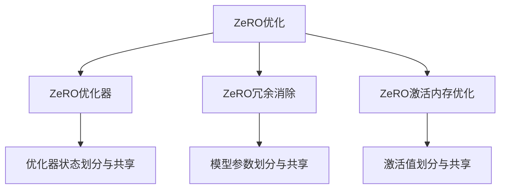
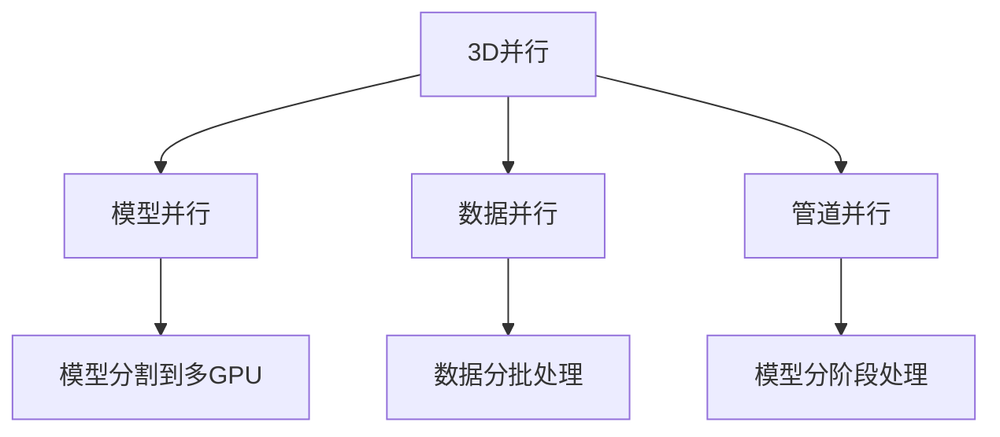
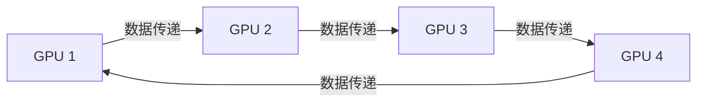
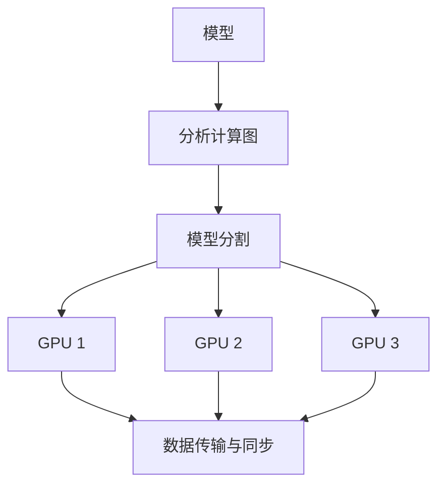

# 大语言模型原理与工程实践：大语言模型训练工程实践DeepSpeed架构

## 1. 背景介绍

随着人工智能技术的快速发展,大型语言模型已成为自然语言处理领域的关键驱动力。这些模型通过在海量文本数据上进行预训练,学习了丰富的语言知识和上下文信息,从而能够在各种自然语言处理任务上表现出卓越的性能。然而,训练这些庞大的模型需要耗费大量的计算资源,给硬件设施和算力带来了巨大的压力。

为了解决这一挑战,微软推出了DeepSpeed,这是一个用于大规模模型训练和推理的系统。DeepSpeed通过多种优化策略,显著降低了训练大型模型所需的计算资源,使得训练过程更加高效、可扩展。本文将深入探讨DeepSpeed的核心原理和工程实践,帮助读者全面了解这一革命性的训练系统。

## 2. 核心概念与联系

### 2.1 大型语言模型

大型语言模型是一种基于自注意力机制(Self-Attention)和Transformer架构的神经网络模型。这些模型通过在海量文本数据上进行预训练,学习了丰富的语言知识和上下文信息,从而能够在各种自然语言处理任务上表现出卓越的性能。

典型的大型语言模型包括GPT(Generative Pre-trained Transformer)、BERT(Bidirectional Encoder Representations from Transformers)和T5(Text-to-Text Transfer Transformer)等。这些模型的参数量通常在数十亿到数百亿之间,规模庞大。

### 2.2 模型并行和数据并行

为了训练这些庞大的模型,需要采用模型并行和数据并行等策略,将模型和数据分布在多个GPU或TPU上进行训练。

- **模型并行**:将模型的不同部分分布在不同的设备上,每个设备只需要处理模型的一部分,从而减少单个设备的内存和计算压力。
- **数据并行**:将训练数据分割成多个批次,每个设备处理一部分数据,最后将结果汇总。

这两种并行策略可以相互结合,实现更高效的大型模型训练。

### 2.3 DeepSpeed概述

DeepSpeed是微软推出的一个用于大规模模型训练和推理的系统,它集成了多种优化策略,包括:

- **ZeRO优化**:通过优化状态和激活的存储方式,减少内存占用。
- **3D并行**:将模型、数据和管道并行相结合,实现更高效的并行训练。
- **循环数据并行**:通过在多个GPU之间循环传递数据,减少通信开销。
- **自动并行**:自动将模型分割到多个GPU上进行训练。

DeepSpeed的核心目标是降低训练大型模型所需的计算资源,提高训练效率和可扩展性。

## 3. 核心算法原理具体操作步骤

### 3.1 ZeRO优化

ZeRO(Zero Redundancy Optimizer)是DeepSpeed的核心优化策略之一,旨在减少模型训练过程中的内存占用。它包括以下三个主要组件:

1. **ZeRO优化器**:通过在多个GPU之间划分和共享优化器状态(如梯度和权重),减少每个GPU上的内存占用。

2. **ZeRO冗余消除**:通过在多个GPU之间划分和共享模型参数,减少每个GPU上的内存占用。

3. **ZeRO激活内存优化**:通过在GPU之间划分和共享激活值(中间计算结果),减少每个GPU上的内存占用。

这些优化策略可以单独或组合使用,根据模型大小和可用资源进行选择。



### 3.2 3D并行

3D并行是DeepSpeed提出的一种新型并行策略,它将模型并行、数据并行和管道并行相结合,实现更高效的大型模型训练。

1. **模型并行**:将模型的不同部分分布在不同的GPU上,每个GPU只需要处理模型的一部分。

2. **数据并行**:将训练数据分割成多个批次,每个GPU处理一部分数据,最后将结果汇总。

3. **管道并行**:将模型分割成多个阶段,每个GPU处理一个阶段,实现流水线式的并行计算。

通过这种三维并行策略,DeepSpeed可以更好地利用多GPU资源,提高训练效率和可扩展性。



### 3.3 循环数据并行

循环数据并行是DeepSpeed提出的另一种优化策略,旨在减少数据并行训练过程中的通信开销。

在传统的数据并行中,每个GPU需要与其他GPU进行大量的梯度通信,这会导致通信开销增加。循环数据并行通过在多个GPU之间循环传递数据,减少了这种通信开销。

具体来说,在循环数据并行中,每个GPU只需要与相邻的两个GPU进行通信,形成一个环形通信结构。这种方式可以显著减少通信开销,提高训练效率。



### 3.4 自动并行

自动并行是DeepSpeed提供的一种便捷功能,它可以自动将模型分割到多个GPU上进行训练,无需手动编写并行代码。

自动并行的工作原理是:

1. 分析模型的计算图,识别出可以并行执行的部分。
2. 将模型的不同部分分配到不同的GPU上执行。
3. 自动管理GPU之间的数据传输和同步。

通过自动并行,DeepSpeed降低了大型模型训练的编程复杂度,使得开发者可以更加专注于模型本身的设计和优化。



## 4. 数学模型和公式详细讲解举例说明

在深入探讨DeepSpeed的核心算法之前,我们需要先了解一些基础概念和数学模型。

### 4.1 自注意力机制

自注意力机制(Self-Attention)是Transformer架构的核心组件,它允许模型捕捉输入序列中任意两个位置之间的依赖关系。

给定一个输入序列$X = (x_1, x_2, \dots, x_n)$,自注意力机制首先计算每个位置$i$与其他所有位置$j$之间的注意力权重$\alpha_{ij}$:

$$\alpha_{ij} = \frac{e^{f(x_i, x_j)}}{\sum_{k=1}^{n}e^{f(x_i, x_k)}}$$

其中$f$是一个评分函数,用于衡量$x_i$和$x_j$之间的相关性。

然后,对每个位置$i$的输出$y_i$进行加权求和,得到自注意力的输出:

$$y_i = \sum_{j=1}^{n}\alpha_{ij}(Wx_j)$$

其中$W$是一个可学习的权重矩阵。

自注意力机制允许模型捕捉长距离依赖关系,是大型语言模型取得卓越性能的关键因素之一。

### 4.2 模型并行

在模型并行中,我们将一个大型模型$M$分割成$K$个子模型$M_1, M_2, \dots, M_K$,每个子模型分配到一个GPU上执行。

对于输入$x$,我们首先将其分割成$K$个部分$(x_1, x_2, \dots, x_K)$,然后在每个GPU上执行相应的子模型:

$$y_i = M_i(x_i)$$

最后,我们将所有GPU的输出合并,得到最终的模型输出$y$:

$$y = \text{Concat}(y_1, y_2, \dots, y_K)$$

模型并行可以有效减少单个GPU的内存和计算压力,但同时也会增加GPU之间的通信开销。

### 4.3 数据并行

在数据并行中,我们将训练数据$D$分割成$K$个子集$(D_1, D_2, \dots, D_K)$,每个子集分配到一个GPU上进行训练。

对于每个GPU $i$,我们在其上训练模型$M$,使用相应的数据子集$D_i$:

$$\theta_i = \text{Train}(M, D_i)$$

其中$\theta_i$是模型在GPU $i$上的参数。

最后,我们将所有GPU上的参数进行平均,得到最终的模型参数$\theta$:

$$\theta = \frac{1}{K}\sum_{i=1}^{K}\theta_i$$

数据并行可以有效利用多GPU资源进行并行训练,但同时也会增加GPU之间的通信开销。

### 4.4 ZeRO优化

在ZeRO优化中,我们将模型参数、优化器状态和激活值分别划分到多个GPU上,以减少单个GPU的内存占用。

假设我们有$N$个GPU,模型参数$\theta$可以划分为$N$个部分$(\theta_1, \theta_2, \dots, \theta_N)$,每个GPU存储一部分参数。

对于优化器状态(如梯度和动量),我们也可以将其划分为$N$个部分$(g_1, g_2, \dots, g_N)$,每个GPU存储一部分状态。

最后,对于激活值$A$,我们也可以将其划分为$N$个部分$(A_1, A_2, \dots, A_N)$,每个GPU存储一部分激活值。

通过这种划分策略,每个GPU只需要存储模型参数、优化器状态和激活值的一部分,从而大大减少了内存占用。

在训练过程中,我们需要在GPU之间进行通信和同步,以确保模型参数、优化器状态和激活值的一致性。DeepSpeed提供了高效的通信和同步机制,以最小化通信开销。

## 5. 项目实践:代码实例和详细解释说明

在本节中,我们将通过一个实际的代码示例,演示如何使用DeepSpeed进行大型语言模型的训练。

### 5.1 环境配置

首先,我们需要安装DeepSpeed和相关依赖项。可以使用以下命令进行安装:

```bash
pip install deepspeed
```

### 5.2 准备数据

我们将使用WikiText-103数据集进行模型训练。该数据集是一个大型语料库,包含来自Wikipedia的大量文本数据。

```python
import os
import urllib.request

# 下载数据集
data_url = "https://s3.amazonaws.com/research.metamind.io/wikitext/wikitext-103-v1.zip"
data_file = "wikitext-103-v1.zip"
if not os.path.exists(data_file):
    urllib.request.urlretrieve(data_url, data_file)

# 解压数据集
import zipfile
with zipfile.ZipFile(data_file, 'r') as zip_ref:
    zip_ref.extractall()
```

### 5.3 定义模型

我们将使用一个基于Transformer架构的语言模型。为了简化示例,我们只展示了模型的核心部分。

```python
import torch
import torch.nn as nn

class TransformerModel(nn.Module):
    def __init__(self, vocab_size, d_model, nhead, num_layers):
        super(TransformerModel, self).__init__()
        self.embedding = nn.Embedding(vocab_size, d_model)
        self.pos_encoder = PositionalEncoding(d_model)
        encoder_layers = nn.TransformerEncoderLayer(d_model, nhead)
        self.transformer_encoder = nn.TransformerEncoder(encoder_layers, num_layers)
        self.decoder = nn.Linear(d_model, vocab_size)

    def forward(self, src):
        src = self.embedding(src)
        src = self.pos_encoder(src)
        output = self.transformer_encoder(src)
        output = self.decoder(output)
        return output