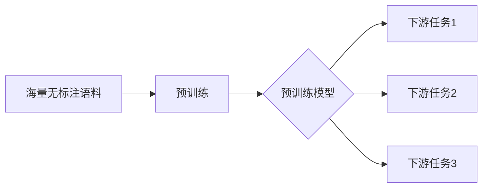

# 大语言模型原理与工程实践：大语言模型预训练

## 1. 背景介绍
### 1.1 大语言模型的兴起
近年来,随着深度学习技术的快速发展,大语言模型(Large Language Model,LLM)成为自然语言处理(NLP)领域的研究热点。大语言模型通过在海量文本数据上进行预训练,学习到丰富的语言知识和通用语言表示,可以应用于各种下游NLP任务,取得了显著的性能提升。
### 1.2 预训练的重要性
预训练是大语言模型取得成功的关键。通过在大规模无标注语料上进行自监督学习,模型可以自动学习到语言的基本规律和语义信息,构建通用的语言理解能力。预训练好的模型再经过少量的微调,即可适应特定的NLP任务,大大减少了对标注数据的依赖。
### 1.3 本文的主要内容
本文将深入探讨大语言模型预训练的原理与实践。我们首先介绍大语言模型的核心概念,然后详细阐述主流的预训练算法和优化技术。接着通过数学模型和代码实例,讲解如何从零开始构建一个大语言模型。最后总结大语言模型的应用场景、发展趋势与挑战,并提供相关工具和资源推荐。

## 2. 核心概念与联系
### 2.1 语言模型
语言模型是对语言概率分布的建模,旨在计算一个句子或词序列出现的概率。给定前面的词,语言模型可以预测下一个最可能出现的词。传统的语言模型如n-gram模型,基于马尔科夫假设,利用前n-1个词来预测当前词。
### 2.2 神经网络语言模型 
神经网络语言模型(Neural Network Language Model,NNLM)使用神经网络来建模语言概率分布。与传统语言模型相比,NNLM可以学习词语的分布式表示(Embedding),捕捉词与词之间的语义关系。代表性的NNLM包括CBOW、Skip-Gram等。
### 2.3 Transformer架构
Transformer是一种基于自注意力机制(Self-Attention)的神经网络架构,广泛应用于大语言模型。不同于循环神经网络(RNN),Transformer可以并行计算,大大提高了训练效率。Transformer主要由编码器(Encoder)和解码器(Decoder)组成,通过自注意力和前馈神经网络来处理输入序列。
### 2.4 预训练与微调
预训练指在大规模无标注语料上进行自监督学习,让模型自动学习语言知识。常见的预训练任务包括语言模型、去噪自编码等。微调是在预训练的基础上,针对特定任务进行监督学习,通过少量标注数据来优化模型。预训练使模型具备通用语言理解能力,微调使模型适应具体任务。它们的结合是大语言模型的典型训练范式。



## 3. 核心算法原理与操作步骤
### 3.1 BERT预训练
BERT(Bidirectional Encoder Representations from Transformers)是目前最广泛使用的预训练模型之一。BERT采用双向Transformer编码器结构,通过Masked Language Model(MLM)和Next Sentence Prediction(NSP)两个任务进行预训练。
#### 3.1.1 MLM任务
- 随机遮挡(Mask)部分输入词,预测被遮挡的词。
- 遮挡策略:80%替换为[MASK]、10%替换为随机词、10%保持不变。
- 目标是最小化被Mask词的预测误差。
#### 3.1.2 NSP任务  
- 随机选取句子对A和B,50%概率B是A的下一句,50%概率B是语料库中的随机句子。
- 目标是最大化句子对关系的分类准确率。
#### 3.1.3 预训练步骤
1. 构建输入:将句子对(或单个句子)转换为词向量序列,加入位置编码、段编码、[CLS]和[SEP]标记。
2. Transformer编码:将输入序列传入BERT的多层Transformer编码器,通过自注意力机制建模词与词之间的关系。
3. MLM预测:基于Transformer最后一层的输出,预测被遮挡词的概率分布。
4. NSP预测:基于[CLS]标记对应的输出向量,预测句子对的关系(二分类)。
5. 联合优化:将MLM和NSP的损失函数相加,使用Adam优化器进行梯度下降训练。

经过大规模预训练,BERT学习到通用的语言表示,可以应用于各种NLP任务。在使用时,我们将任务的输入文本输入到BERT中,提取Transformer最后一层的输出作为词的语义表示,再接入任务特定的输出层进行微调即可。

### 3.2 GPT预训练
GPT(Generative Pre-Training)是另一种主流的语言模型预训练方法。不同于BERT的双向建模,GPT采用单向的Transformer解码器结构,从左到右生成文本序列。
#### 3.2.1 语言模型任务
- 给定前面的词,预测下一个词的概率分布。
- 目标是最大化整个序列的生成概率。
#### 3.2.2 预训练步骤  
1. 构建输入:将文本序列转换为词向量序列,加入位置编码。
2. Transformer解码:将输入序列传入GPT的多层Transformer解码器,通过自注意力和前馈网络生成每个位置的输出向量。
3. 语言模型预测:基于每个位置的输出向量,预测下一个词的概率分布。
4. 损失计算:使用交叉熵损失函数,计算预测分布与真实词的差异。
5. 优化训练:使用Adam优化器最小化损失函数,更新模型参数。

预训练后的GPT可以通过自回归的方式生成连贯的文本,也可以用于其他NLP任务。在应用时,我们将任务的输入文本传入GPT,提取最后一层的输出向量,再连接任务特定的输出层进行微调。

## 4. 数学模型与公式详解
### 4.1 Transformer的数学表示
Transformer的核心是自注意力机制和前馈神经网络。对于输入序列$\mathbf{X}=(\mathbf{x}_1, \mathbf{x}_2, ..., \mathbf{x}_n)$,Transformer的计算过程如下:

#### 4.1.1 自注意力机制
1. 计算查询矩阵$\mathbf{Q}$、键矩阵$\mathbf{K}$、值矩阵$\mathbf{V}$:
$$\mathbf{Q} = \mathbf{X} \mathbf{W}^Q, \mathbf{K} = \mathbf{X} \mathbf{W}^K, \mathbf{V} = \mathbf{X} \mathbf{W}^V$$
其中$\mathbf{W}^Q, \mathbf{W}^K, \mathbf{W}^V$是可学习的权重矩阵。

2. 计算注意力权重:
$$\mathbf{A} = \text{softmax}(\frac{\mathbf{Q}\mathbf{K}^T}{\sqrt{d_k}})$$
其中$d_k$是查询和键的维度,用于缩放点积结果。

3. 计算注意力输出:
$$\text{Attention}(\mathbf{Q}, \mathbf{K}, \mathbf{V}) = \mathbf{A} \mathbf{V}$$

#### 4.1.2 多头自注意力
将自注意力计算过程重复$h$次,得到$h$个注意力头的输出,再将它们拼接起来并经过线性变换:
$$\text{MultiHead}(\mathbf{Q}, \mathbf{K}, \mathbf{V}) = \text{Concat}(\text{head}_1, ..., \text{head}_h) \mathbf{W}^O$$
$$\text{head}_i = \text{Attention}(\mathbf{Q}\mathbf{W}_i^Q, \mathbf{K}\mathbf{W}_i^K, \mathbf{V}\mathbf{W}_i^V)$$

#### 4.1.3 前馈神经网络
对多头自注意力的输出应用两层前馈神经网络,增强非线性表达能力:
$$\text{FFN}(\mathbf{x}) = \text{ReLU}(\mathbf{x} \mathbf{W}_1 + \mathbf{b}_1) \mathbf{W}_2 + \mathbf{b}_2$$

#### 4.1.4 残差连接与层标准化
在自注意力和前馈网络之后分别应用残差连接和层标准化,有助于梯度传播和模型收敛:
$$\mathbf{x} = \text{LayerNorm}(\mathbf{x} + \text{SubLayer}(\mathbf{x}))$$

### 4.2 BERT的数学表示
#### 4.2.1 MLM任务
假设被Mask的词的索引集合为$\mathcal{M}$,词表大小为$V$,BERT的MLM任务目标是最小化以下损失函数:
$$\mathcal{L}_{MLM} = -\sum_{i \in \mathcal{M}} \log P(w_i | \mathbf{x}_{\backslash i})$$
其中$w_i$是真实的被Mask词,$\mathbf{x}_{\backslash i}$表示去掉第$i$个位置的输入序列。

#### 4.2.2 NSP任务
设句子对的标签为$y \in \{0, 1\}$,NSP任务的目标是最小化以下损失函数:
$$\mathcal{L}_{NSP} = -[y \log P(y=1|\mathbf{x}_A, \mathbf{x}_B) + (1-y) \log P(y=0|\mathbf{x}_A, \mathbf{x}_B)]$$
其中$\mathbf{x}_A, \mathbf{x}_B$分别是句子对的两个句子。

#### 4.2.3 联合损失函数
BERT的最终损失函数是MLM和NSP损失的加权和:
$$\mathcal{L} = \mathcal{L}_{MLM} + \lambda \mathcal{L}_{NSP}$$
其中$\lambda$是平衡两个任务的超参数。

### 4.3 GPT的数学表示
设输入序列为$\mathbf{x} = (x_1, x_2, ..., x_n)$,GPT的语言模型任务目标是最大化以下似然函数:
$$\mathcal{L}(\mathbf{x}) = \sum_{i=1}^n \log P(x_i | x_1, ..., x_{i-1})$$

根据链式法则,序列的生成概率可以分解为每个位置的条件概率乘积:
$$P(\mathbf{x}) = \prod_{i=1}^n P(x_i | x_1, ..., x_{i-1})$$

GPT通过Transformer解码器建模每个位置的条件概率分布,从左到右生成序列。在训练时,目标是最小化负对数似然损失:
$$\mathcal{L} = -\frac{1}{n} \sum_{i=1}^n \log P(x_i | x_1, ..., x_{i-1})$$

## 5. 项目实践:代码实例与详解
下面我们通过PyTorch实现一个简单的BERT模型,并在示例数据上进行预训练和微调。

### 5.1 数据准备
```python
import torch
from transformers import BertTokenizer, BertForMaskedLM, BertForSequenceClassification

# 加载预训练的BERT分词器和模型
tokenizer = BertTokenizer.from_pretrained('bert-base-uncased')
model = BertForMaskedLM.from_pretrained('bert-base-uncased')

# 示例文本数据
texts = [
    "Hello, how are you?",
    "I am doing great, thanks for asking!",
    "The weather is nice today.",
    "I enjoy playing soccer in my free time."
]

# 分词并转换为输入格式
inputs = tokenizer(texts, return_tensors='pt', max_length=128, truncation=True, padding='max_length')
```

### 5.2 MLM任务预训练
```python
# 设置训练参数
num_epochs = 10
batch_size = 2
learning_rate = 1e-5

# 定义优化器
optimizer = torch.optim.Adam(model.parameters(), lr=learning_rate)

# 训练循环
for epoch in range(num_epochs):
    for i in range(0, len(texts), batch_size):
        batch_inputs = {k: v[i:i+batch_size] for k, v in inputs.items()}
        
        # 前向传播
        outputs = model(**batch_inputs, labels=batch_inputs['input_ids'])
        loss = outputs.loss
        
        # 反向传播和优