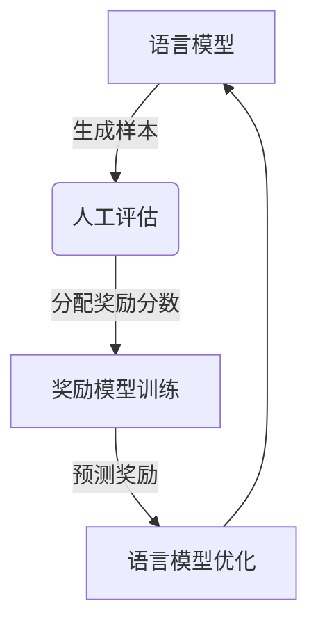

# 大语言模型原理与工程实践：奖励模型的训练

## 1. 背景介绍

### 1.1 大语言模型的兴起

近年来,大型语言模型(Large Language Models, LLMs)在自然语言处理领域取得了令人瞩目的成就。这些模型通过在海量文本数据上进行预训练,学习语言的统计规律和语义关联,从而获得出色的语言生成和理解能力。著名的大语言模型包括GPT-3、PaLM、ChatGPT等,它们展现出惊人的多功能性,能够执行文本生成、问答、文本摘要、代码生成等多种任务。

### 1.2 奖励模型的重要性

尽管大语言模型取得了巨大成功,但它们存在一些固有缺陷,如偏差、不一致性、缺乏可控性等。为了解决这些问题,奖励模型(Reward Model)应运而生。奖励模型旨在为语言模型的输出分配奖励分数,引导模型生成更加准确、一致、符合人类偏好的输出。通过奖励模型的训练和优化,我们可以调整大语言模型的行为,使其更加可控、更加符合我们的期望。

## 2. 核心概念与联系

### 2.1 监督学习与强化学习

传统的语言模型通常采用监督学习的方式进行训练。监督学习依赖于大量的人工标注数据,模型的目标是最小化与标注数据的差异。然而,人工标注数据的获取成本高昂,且难以涵盖所有可能的情况。

相比之下,奖励模型借鉴了强化学习的思想。强化学习的目标是最大化预期的累积奖励,通过与环境的交互来学习最优策略。在奖励模型的场景下,语言模型的输出被视为与环境的交互,奖励模型则为这些输出分配奖励分数,引导语言模型朝着更好的方向优化。

### 2.2 奖励模型的训练流程

奖励模型的训练流程可以概括为以下几个步骤:

1. 生成语言模型输出样本
2. 人工评估样本质量,为每个样本分配奖励分数
3. 使用监督学习,训练奖励模型预测人工评分
4. 使用强化学习,基于奖励模型的预测值优化语言模型

这个过程是一个循环的过程,通过不断迭代,语言模型和奖励模型都会得到改进和优化。

### 2.3 人类反馈与人工评估

人类反馈是奖励模型训练的关键环节。高质量的人工评估数据对于训练出有效的奖励模型至关重要。评估者需要根据一系列标准(如准确性、一致性、相关性等)对语言模型的输出进行打分。这个过程需要大量的人力和时间投入,但它为奖励模型提供了宝贵的监督信号。

### 2.4 奖励模型与语言模型的交互

奖励模型和语言模型是相辅相成的关系。奖励模型为语言模型提供了优化目标和引导,而语言模型则为奖励模型提供了训练数据。通过不断迭代,两者相互促进,最终达到一个相对平衡的状态。

## 3. 核心算法原理具体操作步骤 

### 3.1 生成语言模型输出样本

第一步是使用现有的语言模型生成一批输出样本。这些样本可以是对特定问题或场景的回答,也可以是自由文本生成。样本的质量和多样性对后续的训练过程至关重要。

### 3.2 人工评估样本质量

接下来,我们需要组织一批训练有素的人工评估员对这些样本进行评分。评分标准可以包括:

- 准确性:输出是否符合事实,没有明显的错误。
- 相关性:输出是否与问题或场景相关。
- 一致性:输出在语义和逻辑上是否自洽。
- 流畅性:输出的语言是否通顺、易读。
- 多样性:输出是否具有一定的创新性和多样性。

评分通常采用离散的分数或连续的分数范围,如1-5分或0-1之间的实数。评估过程需要制定明确的评分标准,并对评估员进行充分的培训,以确保评分的一致性。

### 3.3 训练奖励模型

有了人工评估的数据,我们就可以训练奖励模型了。奖励模型本质上是一个监督学习模型,它接受语言模型的输出作为输入,预测该输出的奖励分数。

奖励模型的训练可以采用以下步骤:

1. 将语言模型输出和对应的人工评分数据作为训练集
2. 选择合适的模型架构,如transformer模型或其他神经网络模型
3. 定义损失函数,如均方误差损失或其他回归损失
4. 使用优化算法(如Adam或SGD)训练模型,最小化损失函数

训练过程中,我们可以使用一些技巧来提高模型的性能,如数据增强、迁移学习、正则化等。训练完成后,我们得到了一个可以为任意语言模型输出预测奖励分数的奖励模型。

### 3.4 使用奖励模型优化语言模型

有了奖励模型,我们就可以将其应用于语言模型的优化过程中。这个过程借鉴了强化学习的思想,将语言模型的生成过程视为一个马尔可夫决策过程(MDP),目标是最大化预期的累积奖励。

具体地,我们可以采用以下步骤:

1. 定义奖励函数:使用训练好的奖励模型对语言模型的输出进行打分
2. 使用强化学习算法(如策略梯度或Q-learning)优化语言模型的参数
3. 在优化过程中,语言模型会尝试生成更高奖励分数的输出
4. 反复迭代,直到语言模型的性能达到期望水平

常用的强化学习算法包括REINFORCE、PPO(Proximal Policy Optimization)和A2C(Advantage Actor-Critic)等。这些算法通过采样语言模型的输出,计算奖励,并基于奖励对模型参数进行更新,从而逐步优化语言模型的行为。

需要注意的是,强化学习过程通常需要大量的计算资源和时间,因为它需要对语言模型进行多次采样和更新。另外,奖励模型的质量也直接影响了语言模型的优化效果,因此训练一个高质量的奖励模型是非常重要的。

## 4. 数学模型和公式详细讲解举例说明

### 4.1 监督学习中的损失函数

在训练奖励模型时,我们需要定义一个损失函数来衡量模型预测和真实奖励分数之间的差异。常用的损失函数包括均方误差损失(Mean Squared Error, MSE)和平滑L1损失(Smooth L1 Loss)。

均方误差损失定义如下:

$$\mathcal{L}_{MSE}(y, \hat{y}) = \frac{1}{n}\sum_{i=1}^{n}(y_i - \hat{y}_i)^2$$

其中,$$y$$是真实的奖励分数,$$\hat{y}$$是模型预测的奖励分数,$$n$$是样本数量。均方误差损失对于大的误差给予更大的惩罚,因此可以促使模型尽可能精确地预测奖励分数。

平滑L1损失的定义如下:

$$\mathcal{L}_{Smooth L1}(y, \hat{y}) = \frac{1}{n}\sum_{i=1}^{n}\begin{cases}
    0.5(y_i - \hat{y}_i)^2, & \text{if }|y_i - \hat{y}_i| < 1\\
    |y_i - \hat{y}_i| - 0.5, & \text{otherwise}
\end{cases}$$

平滑L1损失在小误差范围内等同于均方误差损失,但对于大误差,它给予的惩罚较小。这种特性使得平滑L1损失对异常值的鲁棒性更好。

在实际应用中,我们可以根据具体情况选择合适的损失函数。如果我们希望奖励模型对于所有误差都给予严格的惩罚,可以选择均方误差损失;如果我们希望模型对异常值的影响较小,可以选择平滑L1损失。

### 4.2 强化学习中的策略梯度

在使用强化学习优化语言模型时,我们通常采用策略梯度(Policy Gradient)算法。策略梯度算法的目标是直接优化语言模型的参数,使得生成的输出序列能够获得最大的预期奖励。

设$$\theta$$为语言模型的参数,$$\pi_\theta$$为由参数$$\theta$$确定的策略(即生成输出序列的概率分布)。我们的目标是最大化预期奖励$$J(\theta)$$:

$$J(\theta) = \mathbb{E}_{\tau \sim \pi_\theta}[R(\tau)]$$

其中,$$\tau$$表示一个输出序列,$$R(\tau)$$表示该序列的奖励分数(由奖励模型给出)。

为了优化$$J(\theta)$$,我们可以计算其关于$$\theta$$的梯度:

$$\nabla_\theta J(\theta) = \mathbb{E}_{\tau \sim \pi_\theta}\left[\sum_{t=0}^{T} \nabla_\theta \log \pi_\theta(a_t|s_t)R(\tau)\right]$$

其中,$$a_t$$表示时刻$$t$$生成的词,$$s_t$$表示当前的状态(已生成的部分序列)。

实际操作中,我们无法精确计算上述期望,因此通常采用蒙特卡罗采样的方式进行近似:

$$\nabla_\theta J(\theta) \approx \frac{1}{N}\sum_{n=1}^{N}\left[\sum_{t=0}^{T} \nabla_\theta \log \pi_\theta(a_t^{(n)}|s_t^{(n)})R(\tau^{(n)})\right]$$

其中,$$N$$是采样的批次数,$$\tau^{(n)}$$是第$$n$$次采样得到的输出序列。

有了策略梯度的估计值,我们就可以使用优化算法(如Adam或SGD)对语言模型的参数$$\theta$$进行更新,从而最大化预期奖励。

需要注意的是,策略梯度算法存在高方差的问题,因此在实际应用中,我们通常会采用一些变体算法,如使用基线(baseline)减小方差、使用优势函数(Advantage Function)代替奖励等。另外,我们还可以结合其他技术,如重要性采样(Importance Sampling)、异步更新(Asynchronous Update)等,来提高算法的效率和稳定性。

### 4.3 序列生成中的掩码自注意力机制

在语言模型中,序列生成是一个关键的任务。传统的序列生成模型(如RNN)存在一些缺陷,如梯度消失、无法充分利用并行计算等。近年来,基于transformer的自注意力机制(Self-Attention)在序列生成任务中取得了卓越的成绩。

自注意力机制的核心思想是允许输入序列的每个位置都与其他位置进行交互,捕捉长距离依赖关系。具体来说,给定一个长度为$$n$$的输入序列$$\mathbf{x} = (x_1, x_2, \ldots, x_n)$$,自注意力机制首先计算查询(Query)、键(Key)和值(Value)向量:

$$\begin{aligned}
\mathbf{Q} &= \mathbf{X}\mathbf{W}^Q \\
\mathbf{K} &= \mathbf{X}\mathbf{W}^K \\
\mathbf{V} &= \mathbf{X}\mathbf{W}^V
\end{aligned}$$

其中,$$\mathbf{W}^Q$$、$$\mathbf{W}^K$$和$$\mathbf{W}^V$$是可学习的权重矩阵。

然后,计算注意力权重矩阵$$\mathbf{A}$$:

$$\mathbf{A} = \mathrm{softmax}\left(\frac{\mathbf{Q}\mathbf{K}^\top}{\sqrt{d_k}}\right)$$

其中,$$d_k$$是缩放因子,用于防止软最大值的梯度过小或过大。

最后,将注意力权重矩