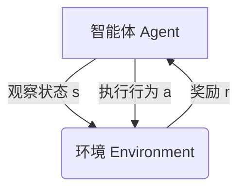

# 大语言模型原理与工程实践：强化学习基础

## 1. 背景介绍

### 1.1 人工智能的发展历程

人工智能(Artificial Intelligence, AI)是当代科技发展的重要领域,旨在创造出能够模仿人类智能行为的智能系统。自20世纪50年代问世以来,AI经历了几个重要的发展阶段。

最初的AI系统主要采用符号主义方法,通过构建知识库和推理规则来模拟人类的思维过程。但这种方法在处理复杂问题时面临瓶颈。

21世纪初,机器学习(Machine Learning, ML)技术的兴起为AI发展注入新的活力。机器学习系统能从数据中自动学习模式,不需要人工设计复杂的规则。

### 1.2 深度学习的兴起

深度学习(Deep Learning)是机器学习的一个新的研究热点,主要受到人工神经网络(Artificial Neural Networks, ANNs)的启发。深度神经网络能够自动从原始数据中学习出多级表示特征,极大提高了处理复杂问题的能力。

2012年,基于深度卷积神经网络的模型在ImageNet大赛中取得了突破性进展,深度学习由此在计算机视觉、自然语言处理等领域得到广泛应用。

### 1.3 大语言模型的崛起

大型预训练语言模型(Large Pre-trained Language Models)是深度学习在自然语言处理领域的最新突破。这些模型通过在大规模语料库上预训练,学习到丰富的语义和上下文知识,能更好地理解和生成自然语言。

代表性的大语言模型包括GPT(Generative Pre-trained Transformer)、BERT(Bidirectional Encoder Representations from Transformers)等,展现出了强大的语言理解和生成能力,在机器翻译、问答系统、文本摘要等任务中取得了卓越的成绩。

## 2. 核心概念与联系

### 2.1 强化学习概述

强化学习(Reinforcement Learning, RL)是机器学习的一个重要分支,旨在让智能体(Agent)通过与环境(Environment)的交互来学习如何采取最优策略,以最大化预期的累积奖励。

强化学习的核心思想是"试错与奖惩",智能体根据当前状态选择行为,并从环境中获得反馈奖励信号,进而不断调整策略,最终达到最优。这种学习方式与人类和动物的学习过程有些类似。



强化学习在无人驾驶、机器人控制、游戏AI等领域有着广泛的应用前景。

### 2.2 马尔可夫决策过程

马尔可夫决策过程(Markov Decision Process, MDP)是强化学习问题的数学表述,描述了智能体与环境的交互过程。

MDP包含以下几个核心要素:

- 状态集合 $\mathcal{S}$: 环境的所有可能状态
- 行为集合 $\mathcal{A}$: 智能体可执行的所有行为
- 转移概率 $\mathcal{P}_{ss'}^a$: 在状态 $s$ 执行行为 $a$ 后,转移到状态 $s'$ 的概率
- 奖励函数 $\mathcal{R}_s^a$: 在状态 $s$ 执行行为 $a$ 后获得的奖励

智能体的目标是找到一个最优策略 $\pi^*$,使得按照该策略执行时,能获得最大的预期累积奖励。

### 2.3 价值函数与贝尔曼方程

价值函数(Value Function)用于评估一个状态或状态-行为对在遵循某策略时的长期价值。通过估计价值函数,智能体可以做出更好的决策。

状态价值函数 $V^\pi(s)$ 表示在状态 $s$ 开始,按照策略 $\pi$ 执行所能获得的预期累积奖励。

状态-行为价值函数 $Q^\pi(s, a)$ 表示在状态 $s$ 执行行为 $a$,之后按照策略 $\pi$ 执行所能获得的预期累积奖励。

贝尔曼方程(Bellman Equations)给出了价值函数的递推关系式,是求解最优策略的关键。

$$
\begin{aligned}
V^\pi(s) &= \mathbb{E}_\pi\left[R_t + \gamma R_{t+1} + \gamma^2 R_{t+2} + \cdots | S_t = s\right] \\
&= \sum_{a}\pi(a|s)\sum_{s'}\mathcal{P}_{ss'}^a\left[R_s^a + \gamma V^\pi(s')\right]
\end{aligned}
$$

$$
Q^\pi(s, a) = \mathbb{E}_\pi\left[R_t + \gamma R_{t+1} + \gamma^2 R_{t+2} + \cdots | S_t = s, A_t = a\right] = \sum_{s'}\mathcal{P}_{ss'}^a\left[R_s^a + \gamma \sum_{a'}\pi(a'|s')Q^\pi(s', a')\right]
$$

通过估计并优化价值函数,可以得到最优策略 $\pi^*$。

## 3. 核心算法原理具体操作步骤

强化学习算法可分为三大类:基于价值函数(Value-based)、基于策略(Policy-based)和基于Actor-Critic的算法。下面将分别介绍它们的核心原理和具体操作步骤。

### 3.1 基于价值函数的算法

#### 3.1.1 时序差分学习(Temporal Difference Learning)

时序差分(Temporal Difference, TD)学习是一种无模型(Model-free)的价值函数学习算法,通过估计贝尔曼方程中的价值函数来进行策略改进。

TD算法的核心思想是利用时序差分(TD)误差来更新价值函数估计,TD误差是指当前状态的价值估计与下一状态的价值估计加上即时奖励之间的差异。

$$
\delta_t = R_{t+1} + \gamma V(S_{t+1}) - V(S_t)
$$

TD算法通过不断缩小TD误差来更新价值函数估计,从而逼近真实的价值函数。常用的TD算法包括Sarsa、Q-Learning等。

**Q-Learning算法步骤**:

1. 初始化Q表格 $Q(s, a)$,对所有状态-行为对赋予任意初值
2. 对每个Episode:
    1. 初始化起始状态 $s$
    2. 对于当前状态 $s$:
        1. 选择行为 $a$ (如探索则随机选择,否则选择 $\max_a Q(s, a)$ 对应的行为)
        2. 执行行为 $a$,获得奖励 $r$ 和下一状态 $s'$
        3. 更新Q表格: $Q(s, a) \leftarrow Q(s, a) + \alpha\left[r + \gamma\max_{a'}Q(s', a') - Q(s, a)\right]$
        4. 转移到下一状态 $s \leftarrow s'$
    3. 直到Episode终止

#### 3.1.2 深度Q网络(Deep Q-Network)

传统的Q-Learning算法需要维护一个巨大的Q表格来存储所有状态-行为对的价值估计,在状态空间和行为空间很大时就变得不现实。

深度Q网络(Deep Q-Network, DQN)算法通过使用深度神经网络来拟合Q函数,避免了存储Q表格的问题,极大扩展了强化学习在高维状态空间中的应用。

DQN算法的核心思路是:

1. 使用深度卷积神经网络(CNN)从原始状态(如视觉观测)中提取特征
2. 将特征输入到全连接层,输出所有行为对应的Q值
3. 选择Q值最大的行为执行
4. 使用经验回放(Experience Replay)和目标网络(Target Network)增强训练稳定性

DQN算法的伪代码如下:

```python
初始化评估网络 Q 和目标网络 Q_target
初始化经验回放池 D
对每个Episode:
    初始化起始状态 s
    while not终止:
        使用 epsilon-greedy 策略从 Q(s, a) 选择行为 a
        执行行为 a, 获得奖励 r 和下一状态 s'
        将 (s, a, r, s') 存入经验回放池 D
        从 D 中采样一个批次的转移 (s_j, a_j, r_j, s'_j)
        计算目标 Q 值: y_j = r_j + gamma * max_a' Q_target(s'_j, a')
        优化评估网络: min_theta (sum((y_j - Q(s_j, a_j))^2))
        每 C 步同步一次 Q_target = Q
        s = s'
```

### 3.2 基于策略的算法

#### 3.2.1 策略梯度算法(Policy Gradient)

策略梯度(Policy Gradient)算法直接对策略函数 $\pi_\theta(a|s)$ 进行参数化,通过梯度上升的方式优化策略参数 $\theta$,使得在遵循该策略时获得的预期累积奖励最大化。

策略梯度的目标函数为:

$$
J(\theta) = \mathbb{E}_{\tau \sim \pi_\theta}\left[\sum_{t=0}^{T}R(s_t, a_t)\right]
$$

其中 $\tau = (s_0, a_0, s_1, a_1, \cdots, s_T)$ 是一个由策略 $\pi_\theta$ 生成的状态-行为序列。

通过应用策略梯度定理,可以得到策略梯度的估计:

$$
\nabla_\theta J(\theta) \approx \mathbb{E}_{\tau \sim \pi_\theta}\left[\sum_{t=0}^{T}\nabla_\theta\log\pi_\theta(a_t|s_t)R_t\right]
$$

其中 $R_t = \sum_{k=t}^{T}\gamma^{k-t}r_k$ 是从时刻 $t$ 开始的累积奖励。

**REINFORCE 算法步骤**:

1. 初始化策略参数 $\theta$
2. 对每个Episode:
    1. 生成一个状态-行为-奖励序列 $\tau = (s_0, a_0, r_0, s_1, a_1, r_1, \cdots, s_T)$ 遵循当前策略 $\pi_\theta$
    2. 计算每个时刻的累积奖励 $R_t = \sum_{k=t}^{T}\gamma^{k-t}r_k$
    3. 更新策略参数: $\theta \leftarrow \theta + \alpha\sum_{t=0}^{T}\nabla_\theta\log\pi_\theta(a_t|s_t)R_t$

#### 3.2.2 深度确定性策略梯度(Deep Deterministic Policy Gradient)

确定性策略梯度(Deterministic Policy Gradient, DPG)算法是一种用于连续行为空间的策略梯度算法,其策略 $\mu_\theta(s)$ 是一个确定性的函数,直接输出连续的行为值。

深度确定性策略梯度(Deep Deterministic Policy Gradient, DDPG)算法将行为策略 $\mu_\theta(s)$ 和状态-行为价值函数 $Q_\phi(s, a)$ 都使用深度神经网络来拟合,通过交替地优化策略网络和Q网络来提高策略性能。

DDPG算法伪代码:

```python
初始化评估Q网络 Q, 目标Q网络 Q_target
初始化策略网络 mu, 目标策略网络 mu_target
初始化经验回放池 D
对每个Episode:
    初始化起始状态 s
    while not终止:
        选择行为 a = mu(s) + N  # N为探索噪声
        执行行为 a, 获得奖励 r 和下一状态 s'
        将 (s, a, r, s') 存入经验回放池 D
        从 D 中采样一个批次的转移 (s_j, a_j, r_j, s'_j)
        计算目标Q值: y_j = r_j + gamma * Q_target(s'_j, mu_target(s'_j))
        优化评估Q网络: min_phi (sum((y_j - Q(s_j, a_j))^2))
        优化策略网络: max_theta (sum(Q(s_j, mu(s_j))))
        软更新目标网络参数
        s = s'
```

### 3.3 基于Actor-Critic的算法

Actor-Critic算法将价值函数估计(Critic)和策略优化(Actor)结合在一起,同时利用两者的优点。Critic通过估计价值函数来评估当前策略,而Actor则根据Critic的评估