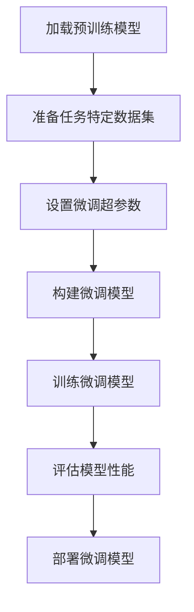

# 大语言模型原理与工程实践：挖掘大语言模型潜能：有监督微调

## 1. 背景介绍

### 1.1 大语言模型的兴起

在过去几年中,大型语言模型(Large Language Models, LLMs)在自然语言处理(NLP)领域掀起了一场革命。这些模型通过在大规模语料库上进行预训练,展现出令人印象深刻的语言理解和生成能力。

大语言模型的出现可以追溯到2018年,当时OpenAI发布了GPT(Generative Pre-trained Transformer)模型。紧随其后,谷歌推出了BERT(Bidirectional Encoder Representations from Transformers),这是第一个广泛应用于下游NLP任务的大语言模型。自那以后,我们见证了越来越大型的语言模型层出不穷,如GPT-3、PaLM、Chinchilla等。

### 1.2 大语言模型的潜力与挑战

大语言模型展现出了惊人的语言理解和生成能力,在机器翻译、问答系统、文本摘要等众多NLP任务中取得了卓越的表现。然而,这些模型也面临着一些挑战,例如:

- **数据质量**:预训练数据的质量和多样性直接影响模型的性能。
- **计算资源**:训练大型语言模型需要大量的计算资源,这对于许多组织来说是一个障碍。
- **可解释性**:大语言模型通常被视为"黑箱",很难解释其内部工作原理。
- **偏差和安全性**:模型可能会从训练数据中学习到有偏见或不当的内容,导致不安全或不道德的输出。

为了充分发挥大语言模型的潜力并克服这些挑战,有监督微调(Supervised Fine-tuning)成为了一种关键技术。

## 2. 核心概念与联系

### 2.1 有监督微调的定义

有监督微调是指在大语言模型的基础上,使用标注的数据集对模型进行进一步的训练,以适应特定的下游任务。这个过程可以调整模型的参数,使其更好地捕捉任务相关的模式和知识。

### 2.2 有监督微调的优势

与从头开始训练模型相比,有监督微调具有以下优势:

1. **计算效率**:由于模型已经在大规模语料库上进行了预训练,微调只需要对较小的任务特定数据集进行训练,从而节省了大量的计算资源。
2. **数据效率**:预训练模型已经学习了广泛的语言知识,因此只需要较少的任务特定数据就可以获得良好的性能。
3. **泛化能力**:预训练模型已经学习了丰富的语言表示,有助于提高模型在新任务上的泛化能力。

### 2.3 有监督微调的挑战

尽管有监督微调带来了诸多好处,但它也面临着一些挑战:

1. **数据质量**:任务特定数据集的质量和多样性直接影响微调后模型的性能。
2. **微调策略**:选择合适的微调策略(如学习率、批量大小等)对模型性能有着重要影响。
3. **计算资源**:虽然相对于从头训练节省了资源,但微调过程仍然需要一定的计算能力。
4. **稳定性**:微调过程可能会导致模型的不稳定性,例如catastrophic forgetting(灾难性遗忘)。

## 3. 核心算法原理具体操作步骤

有监督微调的核心算法原理可以概括为以下几个步骤:



### 3.1 加载预训练模型

首先,我们需要加载一个预先训练好的大语言模型,如BERT、GPT-2等。这些模型通常是在大规模语料库上进行预训练的,已经学习了丰富的语言表示。

### 3.2 准备任务特定数据集

接下来,我们需要准备一个与下游任务相关的标注数据集。这个数据集应该包含输入样本和对应的标签或目标输出。数据集的质量和多样性对微调后模型的性能有着重要影响。

### 3.3 设置微调超参数

在开始微调之前,我们需要设置一些超参数,如学习率、批量大小、训练轮数等。选择合适的超参数对模型性能有着重要影响,通常需要进行一些实验来确定最佳值。

### 3.4 构建微调模型

根据下游任务的性质,我们需要在预训练模型的基础上构建一个适当的微调模型。这可能涉及添加新的输出层、修改模型架构等操作。

### 3.5 训练微调模型

使用准备好的任务特定数据集和设置的超参数,我们可以开始训练微调模型。训练过程中,模型会逐步调整其参数,以更好地适应下游任务。

### 3.6 评估模型性能

训练完成后,我们需要在保留的测试集上评估微调模型的性能。根据任务的不同,可以使用不同的评估指标,如准确率、F1分数、BLEU分数等。

### 3.7 部署微调模型

如果微调模型的性能满足要求,我们就可以将其部署到实际的生产环境中,用于处理下游任务。

## 4. 数学模型和公式详细讲解举例说明

在有监督微调过程中,我们通常会使用监督学习的方法来优化模型参数。以下是一些常见的数学模型和公式:

### 4.1 交叉熵损失函数

交叉熵损失函数是一种常用的监督学习目标函数,用于衡量模型预测和真实标签之间的差异。对于一个样本 $x$ 和其对应的真实标签 $y$,交叉熵损失函数可以表示为:

$$
\mathcal{L}(x, y) = -\sum_{i=1}^{C} y_i \log(p_i)
$$

其中 $C$ 是类别数, $y_i$ 是真实标签的one-hot编码, $p_i$ 是模型预测的概率分布。

### 4.2 梯度下降优化

在训练过程中,我们使用梯度下降法来优化模型参数,目标是最小化损失函数。对于参数 $\theta$,梯度下降法的更新规则为:

$$
\theta_{t+1} = \theta_t - \eta \nabla_\theta \mathcal{L}(x, y; \theta_t)
$$

其中 $\eta$ 是学习率, $\nabla_\theta \mathcal{L}(x, y; \theta_t)$ 是损失函数关于参数 $\theta_t$ 的梯度。

### 4.3 正则化技术

为了防止过拟合,我们通常会在损失函数中添加正则化项,例如 L2 正则化:

$$
\mathcal{L}_{reg}(x, y) = \mathcal{L}(x, y) + \lambda \|\theta\|_2^2
$$

其中 $\lambda$ 是正则化系数, $\|\theta\|_2^2$ 是参数的 L2 范数。正则化项可以约束模型的复杂度,提高其泛化能力。

### 4.4 示例:文本分类任务

假设我们有一个文本分类任务,需要将一段文本 $x$ 分类为正类或负类。我们可以使用一个预训练的 BERT 模型,在其顶层添加一个分类头,然后进行有监督微调。

对于一个样本 $(x, y)$,其中 $y \in \{0, 1\}$ 是真实标签,我们可以定义如下交叉熵损失函数:

$$
\mathcal{L}(x, y) = -[y \log(p) + (1 - y) \log(1 - p)]
$$

其中 $p$ 是模型预测的正类概率。在训练过程中,我们使用梯度下降法优化模型参数,目标是最小化损失函数。同时,我们可以添加 L2 正则化项来防止过拟合。

通过有监督微调,我们可以调整 BERT 模型的参数,使其更好地捕捉文本分类任务的特征,从而提高模型的性能。

## 5. 项目实践:代码实例和详细解释说明

为了更好地理解有监督微调的过程,我们将使用 Hugging Face 的 Transformers 库,对一个情感分析任务进行实践。我们将使用一个预训练的 BERT 模型,并在一个情感数据集上进行微调。

### 5.1 导入必要的库

```python
import torch
from transformers import BertTokenizer, BertForSequenceClassification
from transformers import Trainer, TrainingArguments
from datasets import load_dataset
```

### 5.2 加载数据集

我们将使用 Hugging Face 的 `datasets` 库加载一个情感分析数据集。

```python
dataset = load_dataset("emotion")
```

### 5.3 数据预处理

我们需要对数据进行一些预处理,包括tokenization和数据格式转换。

```python
tokenizer = BertTokenizer.from_pretrained("bert-base-uncased")

def preprocess_function(examples):
    return tokenizer(examples["text"], truncation=True, padding="max_length", max_length=512)

tokenized_datasets = dataset.map(preprocess_function, batched=True)
```

### 5.4 设置模型和训练参数

我们将使用一个预训练的 BERT 模型,并在其顶层添加一个分类头。同时,我们需要设置一些训练参数,如学习率、批量大小等。

```python
model = BertForSequenceClassification.from_pretrained("bert-base-uncased", num_labels=6)

training_args = TrainingArguments(
    output_dir="./results",
    evaluation_strategy="epoch",
    learning_rate=2e-5,
    per_device_train_batch_size=16,
    per_device_eval_batch_size=16,
    num_train_epochs=3,
    weight_decay=0.01,
)
```

### 5.5 训练微调模型

我们使用 Hugging Face 的 `Trainer` 类来训练微调模型。

```python
trainer = Trainer(
    model=model,
    args=training_args,
    train_dataset=tokenized_datasets["train"],
    eval_dataset=tokenized_datasets["validation"],
    tokenizer=tokenizer,
)

trainer.train()
```

### 5.6 评估模型性能

训练完成后,我们可以在测试集上评估模型的性能。

```python
eval_results = trainer.evaluate(tokenized_datasets["test"])
print(f"Accuracy: {eval_results['eval_accuracy']}")
```

通过这个实践,我们可以更好地理解有监督微调的过程,包括数据准备、模型设置、训练和评估等步骤。

## 6. 实际应用场景

有监督微调技术在许多实际应用场景中发挥着重要作用,包括但不限于:

### 6.1 文本分类

文本分类是一项常见的NLP任务,包括情感分析、新闻分类、垃圾邮件检测等。通过在大型语料库上预训练,然后在特定任务数据集上进行微调,大语言模型可以显著提高文本分类的性能。

### 6.2 机器翻译

在机器翻译领域,有监督微调可以用于调整预训练模型,使其更好地适应特定的语言对和领域。这种方法已经被广泛应用于生产环境中,提高了翻译质量。

### 6.3 问答系统

问答系统是一个复杂的NLP任务,需要模型理解问题,从给定的上下文中检索相关信息,并生成合适的答案。通过在大型问答数据集上进行微调,预训练模型可以显著提高问答性能。

### 6.4 文本摘要

自动文本摘要是一项具有挑战性的任务,需要模型理解原始文本的主要内容,并生成简洁的摘要。有监督微调可以帮助预训练模型更好地捕捉文本摘要任务的特征,从而生成高质量的摘要。

### 6.5 自然语言理解

自然语言理解是NLP的一个核心任务,包括词义消歧、关系抽取、事件抽取等。通过在特定任务数据集上进行微调,预训练模型可以更好地理解语言的语义和结构,从而提高自然语言理解的性能。

## 7. 工具和资源推荐

在进行有监督微调时,有许多优秀的工具和资源可以帮助我们更高效