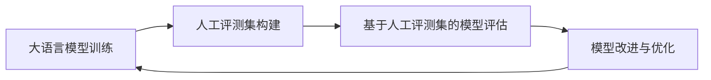

# 大语言模型原理与工程实践：金融行业大语言模型的人工评测集

## 1. 背景介绍
### 1.1 大语言模型的发展历程
#### 1.1.1 早期语言模型
#### 1.1.2 Transformer架构的提出
#### 1.1.3 预训练语言模型的兴起
### 1.2 大语言模型在金融领域的应用现状
#### 1.2.1 金融文本分类与情感分析
#### 1.2.2 金融问答系统
#### 1.2.3 金融风险预警与异常检测
### 1.3 金融行业对大语言模型评测的需求
#### 1.3.1 模型性能评估的重要性
#### 1.3.2 现有评测集的局限性
#### 1.3.3 构建金融领域专用评测集的必要性

## 2. 核心概念与联系
### 2.1 大语言模型的定义与特点
#### 2.1.1 大语言模型的定义
#### 2.1.2 大语言模型的特点
#### 2.1.3 大语言模型与传统语言模型的区别
### 2.2 人工评测集的概念与作用
#### 2.2.1 人工评测集的定义
#### 2.2.2 人工评测集在模型评估中的作用
#### 2.2.3 人工评测集与自动评测指标的比较
### 2.3 大语言模型与人工评测集的关系
#### 2.3.1 人工评测集对大语言模型性能评估的重要性
#### 2.3.2 大语言模型在人工评测集构建中的应用
#### 2.3.3 人工评测集反馈对大语言模型改进的指导作用

## 3. 核心算法原理具体操作步骤
### 3.1 大语言模型的训练流程
#### 3.1.1 预训练阶段
#### 3.1.2 微调阶段
#### 3.1.3 推理阶段
### 3.2 人工评测集的构建流程
#### 3.2.1 确定评测目标与范围
#### 3.2.2 收集与筛选金融领域语料
#### 3.2.3 设计评测任务与标注规范
#### 3.2.4 人工标注与质量控制
#### 3.2.5 评测集的分割与发布
### 3.3 基于人工评测集的模型评估流程
#### 3.3.1 选择评估指标
#### 3.3.2 在评测集上进行模型推理
#### 3.3.3 计算评估指标得分
#### 3.3.4 分析模型性能与错误样本



## 4. 数学模型和公式详细讲解举例说明
### 4.1 Transformer架构的数学原理
#### 4.1.1 自注意力机制
$Attention(Q,K,V) = softmax(\frac{QK^T}{\sqrt{d_k}})V$
其中，$Q$、$K$、$V$分别表示查询、键、值矩阵，$d_k$为键向量的维度。
#### 4.1.2 多头注意力机制
$MultiHead(Q,K,V) = Concat(head_1,...,head_h)W^O$
$head_i = Attention(QW_i^Q, KW_i^K, VW_i^V)$
其中，$W_i^Q$、$W_i^K$、$W_i^V$为第$i$个注意力头的权重矩阵，$W^O$为输出层的权重矩阵。
#### 4.1.3 前馈神经网络
$FFN(x) = max(0, xW_1 + b_1)W_2 + b_2$
其中，$W_1$、$W_2$为前馈神经网络的权重矩阵，$b_1$、$b_2$为偏置项。
### 4.2 评估指标的数学定义
#### 4.2.1 准确率(Accuracy)
$Accuracy = \frac{TP+TN}{TP+TN+FP+FN}$
其中，$TP$、$TN$、$FP$、$FN$分别表示真正例、真负例、假正例、假负例的数量。
#### 4.2.2 精确率(Precision)
$Precision = \frac{TP}{TP+FP}$
#### 4.2.3 召回率(Recall)
$Recall = \frac{TP}{TP+FN}$
#### 4.2.4 F1分数(F1-score)
$F1 = 2 \cdot \frac{Precision \cdot Recall}{Precision+Recall}$

## 5. 项目实践：代码实例和详细解释说明
### 5.1 使用PyTorch构建Transformer模型
```python
import torch
import torch.nn as nn

class Transformer(nn.Module):
    def __init__(self, d_model, nhead, num_layers):
        super(Transformer, self).__init__()
        self.encoder = nn.TransformerEncoder(
            nn.TransformerEncoderLayer(d_model, nhead),
            num_layers
        )
        self.decoder = nn.TransformerDecoder(
            nn.TransformerDecoderLayer(d_model, nhead),
            num_layers
        )
        
    def forward(self, src, tgt):
        memory = self.encoder(src)
        output = self.decoder(tgt, memory)
        return output
```
上述代码定义了一个基于PyTorch的Transformer模型，包含编码器和解码器两部分。编码器和解码器都由多个Transformer层组成，每个层包含自注意力机制和前馈神经网络。
### 5.2 使用HuggingFace加载预训练模型
```python
from transformers import AutoTokenizer, AutoModel

tokenizer = AutoTokenizer.from_pretrained("bert-base-chinese")
model = AutoModel.from_pretrained("bert-base-chinese")

inputs = tokenizer("你好，世界！", return_tensors="pt")
outputs = model(**inputs)
```
上述代码展示了如何使用HuggingFace的Transformers库加载预训练的BERT模型。首先实例化分词器和模型，然后将输入文本转换为模型所需的张量格式，最后将张量输入模型进行前向传播，得到输出结果。
### 5.3 基于人工评测集计算评估指标
```python
from sklearn.metrics import accuracy_score, precision_score, recall_score, f1_score

y_true = [...]  # 人工标注的真实标签
y_pred = [...]  # 模型预测的标签

accuracy = accuracy_score(y_true, y_pred)
precision = precision_score(y_true, y_pred)
recall = recall_score(y_true, y_pred)
f1 = f1_score(y_true, y_pred)

print(f"Accuracy: {accuracy:.4f}")
print(f"Precision: {precision:.4f}")
print(f"Recall: {recall:.4f}") 
print(f"F1-score: {f1:.4f}")
```
上述代码展示了如何使用scikit-learn库计算常见的评估指标，包括准确率、精确率、召回率和F1分数。首先准备人工标注的真实标签和模型预测的标签，然后调用相应的函数计算指标得分，最后打印输出结果。

## 6. 实际应用场景
### 6.1 金融文本分类
#### 6.1.1 新闻情感分析
利用大语言模型对金融新闻进行情感分析，判断新闻对市场的积极或消极影响，为投资决策提供参考。
#### 6.1.2 公司公告分类
使用大语言模型对上市公司发布的公告进行分类，如业绩预告、重大事项等，帮助投资者快速了解公司动态。
#### 6.1.3 客户评论分析
应用大语言模型分析客户对金融产品或服务的评论，挖掘客户意见，改进产品设计与服务质量。
### 6.2 金融问答系统
#### 6.2.1 智能客服
基于大语言模型构建智能客服系统，自动解答客户关于金融产品、服务、流程等方面的常见问题，提高客服效率。
#### 6.2.2 投资顾问助手
利用大语言模型开发投资顾问助手，根据客户的投资偏好、风险承受能力等，提供个性化的投资建议。
#### 6.2.3 金融知识库问答
使用大语言模型构建金融知识库问答系统，帮助用户快速查询金融术语、概念、政策等信息。
### 6.3 金融风险预警与异常检测
#### 6.3.1 舆情监测
应用大语言模型对金融领域的新闻、社交媒体等进行监测，及时发现潜在的市场风险与负面舆情。
#### 6.3.2 反欺诈
利用大语言模型分析交易记录、用户行为等数据，识别可疑的欺诈行为，防范金融诈骗。
#### 6.3.3 信用风险评估
基于大语言模型处理企业财务报告、新闻等文本数据，评估企业的信用风险，支持信贷决策。

## 7. 工具和资源推荐
### 7.1 开源大语言模型
- BERT: https://github.com/google-research/bert
- RoBERTa: https://github.com/pytorch/fairseq/tree/master/examples/roberta
- XLNet: https://github.com/zihangdai/xlnet
### 7.2 自然语言处理工具包
- HuggingFace Transformers: https://github.com/huggingface/transformers
- spaCy: https://spacy.io/
- NLTK: https://www.nltk.org/
### 7.3 金融领域语料库
- 金融新闻语料库: https://github.com/PhantomINF/FinancialDatasets
- 金融文本挖掘语料库: https://github.com/smoothnlp/FinancialDatasets
- 金融领域词典: https://github.com/fighting41love/funNLP
### 7.4 模型评估工具
- TensorBoard: https://www.tensorflow.org/tensorboard
- Weights & Biases: https://wandb.ai/
- MLflow: https://mlflow.org/

## 8. 总结：未来发展趋势与挑战
### 8.1 大语言模型的发展趋势
#### 8.1.1 模型规模的持续增长
#### 8.1.2 多模态语言模型的兴起
#### 8.1.3 领域自适应与知识增强
### 8.2 人工评测集构建的挑战
#### 8.2.1 标注成本与效率问题
#### 8.2.2 隐私保护与数据安全
#### 8.2.3 标注质量与一致性控制
### 8.3 金融行业应用的机遇与挑战
#### 8.3.1 提升金融服务效率与质量
#### 8.3.2 助力金融风险管理与合规
#### 8.3.3 数据孤岛与跨领域协作

## 9. 附录：常见问题与解答
### 9.1 大语言模型与传统语言模型有何区别？
大语言模型通常基于Transformer架构，在海量语料上进行预训练，具有更强的语义理解和生成能力。而传统语言模型如N-gram、LSTM等，主要基于局部上下文进行建模，性能相对有限。
### 9.2 人工评测集的标注过程中需要注意哪些问题？
标注过程中需要注意以下几点：
- 制定明确的标注规范，确保标注的一致性；
- 选择有经验的标注人员，提供必要的培训；
- 对标注结果进行多人校验，控制标注质量；
- 采取适当的激励机制，提高标注效率。
### 9.3 如何选择适合的预训练语言模型？
选择预训练语言模型需要考虑以下因素：
- 模型的性能表现，如在公开基准测试中的排名；
- 模型的训练语料与目标任务的相关性；
- 模型的计算资源需求，如模型规模、推理速度等；
- 模型是否提供了方便的微调接口和工具。
### 9.4 金融领域应用大语言模型需要注意哪些合规问题？
金融领域应用大语言模型需要重点关注以下合规问题：
- 数据隐私保护，确保客户信息的安全；
- 模型公平性，避免模型产生歧视性结果；
- 可解释性，对模型的决策过程进行必要的说明；
- 风险控制，对模型的输出结果进行合规性审查。

作者：禅与计算机程序设计艺术 / Zen and the Art of Computer Programming