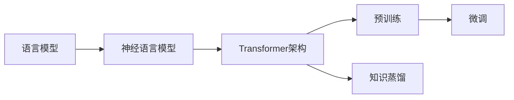

# 大语言模型原理与工程实践：难点和挑战

## 1. 背景介绍
### 1.1 大语言模型的兴起
近年来,随着深度学习技术的快速发展,自然语言处理(NLP)领域取得了巨大的进步。其中,大语言模型(Large Language Model,LLM)作为NLP的重要分支,受到了学术界和工业界的广泛关注。LLM通过在海量文本数据上进行预训练,学习语言的基本规律和知识,可以在各种NLP任务上取得优异的表现,如机器翻译、文本摘要、问答系统等。
### 1.2 大语言模型的应用前景
大语言模型具有广阔的应用前景。首先,LLM可以显著提升各类NLP应用的性能,如智能客服、语音助手、搜索引擎等,为用户提供更加智能、高效的服务。其次,LLM蕴含着丰富的语言知识,可以辅助人类更好地理解和分析语言,在教育、心理学等领域具有重要价值。此外,LLM作为通用的语言理解模型,为构建人工通用智能(AGI)奠定了基础。
### 1.3 大语言模型面临的挑战
尽管大语言模型取得了瞩目的成就,但在理论和实践中仍然存在诸多难点和挑战。从理论角度,我们尚未完全理解LLM的工作机制,缺乏对其内部知识表示和推理过程的解释。在工程实践中,LLM需要庞大的计算和存储资源,模型训练和推理的效率有待提高。此外,LLM还面临着安全性、公平性等伦理问题。因此,深入探讨大语言模型的原理和实践,对于推动NLP乃至AI的发展具有重要意义。

## 2. 核心概念与联系
### 2.1 语言模型
语言模型是NLP的核心概念之一,它以概率的方式描述了语言中词语或字符序列的分布规律。形式化地,给定一个长度为T的文本序列 $X=(x_1,\cdots,x_T)$,语言模型的目标是估计其概率 $P(X)$:

$$P(X)=\prod_{t=1}^T P(x_t|x_1,\cdots,x_{t-1})$$

其中, $x_t$ 表示第 $t$ 个词, $P(x_t|x_1,\cdots,x_{t-1})$ 表示在给定前 $t-1$ 个词的条件下, $x_t$ 出现的条件概率。传统的语言模型如n-gram模型,通过统计词语的共现频率来估计概率。而基于深度学习的神经语言模型(Neural Language Model)则使用神经网络来建模条件概率。

### 2.2 预训练和微调
预训练(Pre-training)和微调(Fine-tuning)是构建大语言模型的两个关键步骤。预训练阶段,模型在大规模无标注语料上进行自监督学习,通过掩码语言建模(Masked Language Modeling)、 Next Sentence Prediction等任务,学习通用的语言表示。微调阶段,将预训练模型应用到下游任务,通过少量标注数据对模型进行微调,使其适应特定任务。这种"预训练+微调"的范式可以显著提升模型性能,减少对标注数据的需求。

### 2.3 Transformer 架构
Transformer 是大语言模型的主流架构。与传统的循环神经网络(RNN)不同,Transformer 完全基于注意力机制(Attention Mechanism)来建模文本序列。它由若干个编码器(Encoder)和解码器(Decoder)层组成,每一层包括自注意力(Self-Attention)和前馈(Feed Forward)两个子层。自注意力通过计算序列中不同位置之间的关联度,捕捉长距离依赖关系;前馈网络则对特征进行非线性变换。Transformer 在并行计算、长程建模等方面优于 RNN,成为语言模型的首选架构。

### 2.4 知识蒸馏
随着语言模型的规模不断增大,模型的训练和推理成本也变得难以承担。知识蒸馏(Knowledge Distillation)提供了一种将大模型的知识"压缩"到小模型的方法。具体而言,先训练一个大的教师模型(Teacher Model),然后使用其输出的软标签(Soft Label)来指导学生模型(Student Model)的训练。相比于硬标签,软标签包含了更多的概率信息,有助于学生模型学习教师模型的知识。通过蒸馏,我们可以得到参数更少、推理更快的小模型,且性能接近大模型。

下图展示了大语言模型涉及的核心概念及其联系:



## 3. 核心算法原理与操作步骤
### 3.1 掩码语言建模(MLM)
掩码语言建模是预训练大语言模型的核心任务之一。其基本思想是随机掩盖(mask)输入文本中的一些词,然后让模型根据上下文预测被掩盖的词。具体步骤如下:

1. 随机选择输入序列中15%的词进行掩码。为了避免模型过拟合掩码标记,将选中的词以80%的概率替换为特殊的 [MASK] 标记,以10%的概率替换为随机词,以10%的概率保持不变。
2. 将处理后的序列输入 Transformer 编码器,计算每个位置的隐藏状态。
3. 将 [MASK] 位置的隐藏状态输入分类器,预测原始词的概率分布。分类器通常是一个简单的全连接层,后接 Softmax 激活函数。
4. 计算预测分布与真实标签的交叉熵损失,并使用梯度下降法更新模型参数。

通过 MLM,模型学会根据上下文预测词语,掌握了语言的基本规律。同时,由于 [MASK] 标记的引入,模型能够建模双向上下文信息。

### 3.2 Next Sentence Prediction(NSP)
NSP 是 BERT 引入的另一个预训练任务,旨在让模型学习句子级别的连贯性。具体步骤如下:

1. 从语料库中随机采样两个句子 A 和 B,其中50%的概率 B 是 A 的下一句,50%的概率 B 是语料库中的随机句子。
2. 将两个句子拼接成一个序列 "[CLS] A [SEP] B [SEP]",其中 [CLS] 和 [SEP] 是特殊的分隔符。
3. 将序列输入 Transformer 编码器,计算 [CLS] 位置的隐藏状态。
4. 将 [CLS] 表示输入分类器,预测两个句子是否相邻。分类器输出相邻的概率。
5. 计算预测概率与真实标签的交叉熵损失,并更新模型参数。

通过 NSP,模型学会判断句子之间的逻辑关系,提升了语言理解和推理能力。然而,后续研究发现 NSP 对模型性能的提升有限,因此一些模型如 RoBERTa 舍弃了该任务。

### 3.3 Transformer 编码器
Transformer 编码器是大语言模型的核心组件,用于将输入序列映射为上下文相关的隐藏表示。其主要步骤如下:

1. 输入表示:将输入序列的每个词映射为词嵌入向量,并加上位置编码向量,以引入位置信息。
2. 自注意力:对于每个位置,计算其与其他位置的注意力权重,然后将所有位置的表示进行加权求和,得到该位置的上下文表示。
3. 前馈网络:对上下文表示进行非线性变换,增强模型的表达能力。
4. 残差连接和层归一化:在自注意力和前馈网络之后,分别添加残差连接和层归一化,以缓解梯度消失问题,加速训练收敛。
5. 多头注意力:将自注意力的计算拆分为多个独立的"头",每个头关注不同的语义子空间,增强了模型的表示能力。

Transformer 编码器可以堆叠多层,逐层提取更高级别的语义表示。通过自注意力机制,模型能够高效地建模长距离依赖,捕捉全局上下文信息。

## 4. 数学模型与公式详解
### 4.1 自注意力机制
自注意力是 Transformer 的核心组件,它允许模型在计算某个位置的表示时,参考序列中的所有位置。形式化地,给定一个长度为 $n$ 的输入序列 $X\in \mathbb{R}^{n\times d}$,自注意力的计算过程如下:

1. 计算查询矩阵 $Q$、键矩阵 $K$ 和值矩阵 $V$:

$$Q=XW_Q, K=XW_K, V=XW_V$$

其中, $W_Q, W_K, W_V \in \mathbb{R}^{d\times d_k}$ 是可学习的权重矩阵。

2. 计算注意力权重:

$$A=\text{softmax}(\frac{QK^T}{\sqrt{d_k}})$$

其中, $A\in \mathbb{R}^{n\times n}$ 是注意力权重矩阵,表示每个位置对其他位置的关注度。 $\sqrt{d_k}$ 是缩放因子,用于控制点积的方差。

3. 计算加权求和:

$$\text{Attention}(Q,K,V)=AV$$

将值矩阵 $V$ 与注意力权重 $A$ 相乘,得到每个位置的上下文表示。

在实践中,自注意力通常采用多头机制,即将 $Q,K,V$ 划分为多个子空间,独立地计算注意力,然后拼接结果:

$$\text{MultiHead}(Q,K,V)=\text{Concat}(\text{head}_1,\cdots,\text{head}_h)W_O$$

$$\text{head}_i=\text{Attention}(QW_i^Q,KW_i^K,VW_i^V)$$

其中, $W_i^Q, W_i^K, W_i^V\in \mathbb{R}^{d\times d_k}, W_O\in \mathbb{R}^{hd_k\times d}$ 是可学习的权重矩阵。多头注意力增强了模型的表示能力,使其能够关注不同的语义子空间。

### 4.2 前馈网络
前馈网络用于对自注意力的输出进行非线性变换,增强模型的表达能力。其计算公式为:

$$\text{FFN}(x)=\max(0, xW_1 + b_1)W_2 + b_2$$

其中, $W_1\in \mathbb{R}^{d\times d_f}, b_1\in \mathbb{R}^{d_f}, W_2\in \mathbb{R}^{d_f\times d}, b_2\in \mathbb{R}^d$ 是可学习的参数。通常, $d_f$ 大于 $d$,使前馈网络具有更高的维度,提升模型容量。

### 4.3 残差连接与层归一化
为了缓解深层网络中的梯度消失问题,Transformer 在每个子层之后添加残差连接和层归一化。残差连接将子层的输入与输出相加,使信息能够直接传递到后面的层。层归一化则对每一层的激活值进行归一化,使其均值为0,方差为1,加速训练收敛。二者的计算公式分别为:

$$x+\text{Sublayer}(x)$$
$$\text{LayerNorm}(x)=\frac{x-\mu}{\sqrt{\sigma^2+\epsilon}}\odot \gamma + \beta$$

其中, $\text{Sublayer}$ 表示自注意力或前馈网络, $\mu,\sigma^2$ 分别是 $x$ 的均值和方差, $\gamma,\beta$ 是可学习的缩放和偏移参数, $\epsilon$ 是一个小常数,用于数值稳定性。

## 5. 代码实例与详解
下面以 PyTorch 为例,展示如何实现 Transformer 编码器的核心组件。

### 5.1 自注意力层
```python
import torch
import torch.nn as nn

class SelfAttention(nn.Module):
    def __init__(self, hidden_size, num_heads):
        super().__init__()
        self.hidden_size = hidden_size
        self.num_heads = num_heads
        self.head_size = hidden_size // num_heads
        
        self.