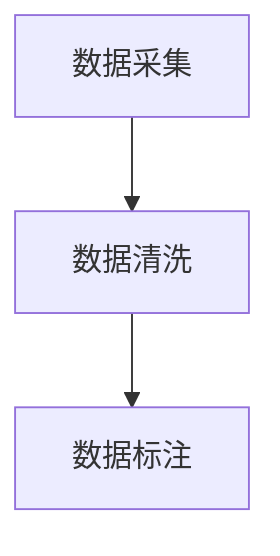

## 1.背景介绍

在过去的几年里，大规模预训练语言模型（Large Pretrained Language Models, LPLMs）如BERT、GPT-3等在各种自然语言处理（Natural Language Processing, NLP）任务中取得了显著的成果，这些模型的成功在很大程度上归功于其大规模的预训练数据。然而，构建这样的预训练数据集并不是一件易事，需要深入理解数据源、数据清洗、数据标注等多个环节。在这篇文章中，我们将深入探讨预训练数据构建的各个环节，并提供一些实用的建议和技巧。

## 2.核心概念与联系

预训练数据构建主要包括数据采集、数据清洗和数据标注三个环节。数据采集是从各种数据源获取原始数据的过程，数据源可以是网络上的文本数据、企业的业务数据等。数据清洗是对原始数据进行预处理的过程，包括去除无关信息、纠正错误等。数据标注是为数据添加标签的过程，为后续的模型训练提供监督信息。



## 3.核心算法原理具体操作步骤

### 3.1 数据采集

数据采集是预训练数据构建的第一步，数据的质量和数量直接影响到模型的性能。在采集数据时，我们需要考虑数据的多样性和代表性。多样性指的是数据应该包含各种类型的文本，如新闻、论文、社交媒体等，以便模型能够学习到语言的各种用法。代表性指的是数据应该反映真实世界的分布，避免出现偏差。

### 3.2 数据清洗

数据清洗是对原始数据进行预处理的过程，主要包括去除无关信息、纠正错误等。去除无关信息是指去除对模型训练无益的信息，如广告、垃圾信息等。纠正错误是指修复数据中的错误，如拼写错误、语法错误等。此外，数据清洗还包括数据的标准化，如统一字符编码、统一日期格式等。

### 3.3 数据标注

数据标注是为数据添加标签的过程，为后续的模型训练提供监督信息。在自然语言处理任务中，数据标注通常包括词性标注、命名实体识别、情感分析等。数据标注是一个耗时且需要专业知识的过程，因此在实际操作中，我们通常会使用一些半自动化的标注工具来提高标注效率。

## 4.数学模型和公式详细讲解举例说明

在预训练数据构建过程中，我们需要量化数据的质量和数量。数据的质量可以通过一些统计指标来衡量，如数据的覆盖率、一致性等。数据的数量可以通过数据的大小来衡量，如数据的条数、字数等。

假设我们有一个数据集$D$，包含$n$条数据，每条数据的质量为$q_i$，则数据集的总体质量$Q$可以表示为：

$$
Q = \frac{1}{n} \sum_{i=1}^{n} q_i
$$

其中，$q_i$可以通过一些质量评价指标来计算，如数据的完整性、准确性等。

## 5.项目实践：代码实例和详细解释说明

在实际项目中，我们通常会使用一些开源工具来协助进行预训练数据的构建。以下是一个使用Python进行数据清洗的简单示例：

```python
import pandas as pd

# 加载数据
df = pd.read_csv('data.csv')

# 去除无关信息
df = df.drop(['ad', 'spam'], axis=1)

# 纠正错误
df['text'] = df['text'].apply(lambda x: correct_errors(x))

# 保存清洗后的数据
df.to_csv('cleaned_data.csv', index=False)
```

在这个示例中，我们首先加载了原始数据，然后去除了无关的信息，接着对文本数据进行了错误纠正，最后保存了清洗后的数据。

## 6.实际应用场景

预训练数据构建在各种自然语言处理任务中都有应用，如机器翻译、文本分类、情感分析等。通过构建高质量的预训练数据，我们可以训练出更强大的模型，从而提高任务的性能。

## 7.工具和资源推荐

以下是一些在预训练数据构建过程中可能会用到的工具和资源：

- 数据采集：Scrapy、BeautifulSoup等
- 数据清洗：Pandas、NumPy等
- 数据标注：Brat、Doccano等

## 8.总结：未来发展趋势与挑战

随着大规模预训练语言模型的发展，预训练数据构建的重要性也日益凸显。然而，预训练数据构建仍然面临一些挑战，如数据的多样性和代表性、数据的质量和数量、数据的隐私和安全等。未来，我们需要在这些方面进行更深入的研究，以构建更好的预训练数据。

## 9.附录：常见问题与解答

Q: 如何评价数据的质量？
A: 数据的质量可以通过一些统计指标来衡量，如数据的覆盖率、一致性等。

Q: 如何提高数据标注的效率？
A: 在实际操作中，我们通常会使用一些半自动化的标注工具来提高标注效率。

Q: 如何处理数据的隐私和安全问题？
A: 在处理敏感数据时，我们需要遵守相关的法律法规，如GDPR等，同时可以采用一些技术手段，如数据脱敏、差分隐私等，来保护数据的隐私和安全。

作者：禅与计算机程序设计艺术 / Zen and the Art of Computer Programming