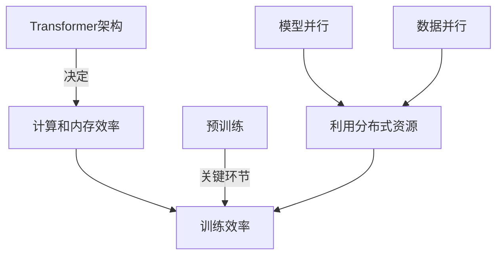

# 大语言模型原理基础与前沿 加快训练速度

## 1. 背景介绍

### 1.1 大语言模型的兴起

近年来,大型语言模型(Large Language Models,LLMs)在自然语言处理(NLP)领域取得了令人瞩目的成就。这些模型通过在海量文本数据上进行预训练,学习到了丰富的语言知识和上下文理解能力,可以生成流畅、连贯的文本输出。

代表性的大语言模型包括GPT(Generative Pre-trained Transformer)系列、BERT(Bidirectional Encoder Representations from Transformers)、XLNet、RoBERTa等。它们在机器翻译、文本摘要、问答系统、内容生成等多个领域展现出卓越的性能。

### 1.2 大语言模型的挑战

尽管取得了巨大的进步,训练大语言模型仍然面临着一些挑战:

1. **计算资源需求巨大**: 训练大型模型需要消耗大量的计算资源,包括GPU/TPU等加速硬件、内存和存储空间。这不仅增加了训练成本,也限制了模型规模的扩展。

2. **训练时间漫长**: 由于参数量巨大,训练一个大语言模型可能需要数周甚至数月的时间。这延长了模型迭代和优化的周期。

3. **数据需求量大**: 为了获得良好的泛化能力,大语言模型需要在海量文本数据上进行预训练。数据的采集、清洗和准备工作都是一个巨大的挑战。

4. **内存消耗高**: 当前主流的Transformer架构需要存储大量的注意力矩阵,导致内存消耗迅速增长,限制了模型规模的进一步扩大。

因此,如何加快大语言模型的训练速度,提高训练效率,成为了一个亟待解决的问题。

## 2. 核心概念与联系

### 2.1 Transformer架构

Transformer是当前大语言模型的主流架构,其核心是基于自注意力(Self-Attention)机制的编码器-解码器结构。自注意力机制允许模型捕捉输入序列中任意两个位置之间的依赖关系,从而更好地建模长距离依赖。

Transformer架构的主要优点包括:

1. **并行计算能力强**: 自注意力机制可以高效地并行计算,适合利用GPU/TPU等加速硬件进行训练。

2. **长距离依赖建模能力强**: 与RNN相比,Transformer架构可以更好地捕捉长距离依赖关系。

3. **位置无关性**: Transformer不依赖于序列的顺序,可以高效地处理变长输入和输出。

然而,Transformer架构也存在一些缺陷,如注意力矩阵的计算和存储开销较大,导致内存消耗快速增长。因此,提高Transformer架构的计算和内存效率是加快大语言模型训练的关键。

### 2.2 大语言模型预训练

大语言模型通常采用两阶段训练策略:预训练(Pre-training)和微调(Fine-tuning)。在预训练阶段,模型在大规模无标注文本数据上进行自监督学习,学习通用的语言表示。在微调阶段,模型在特定的下游任务数据上进行进一步训练,将通用语言表示转化为特定任务的表示。

预训练是大语言模型训练的关键环节,决定了模型的泛化能力和性能上限。常见的预训练目标包括:

1. **掩码语言模型(Masked Language Modeling,MLM)**: 随机掩码部分输入词元,模型需要预测被掩码的词元。

2. **下一句预测(Next Sentence Prediction,NSP)**: 判断两个句子是否连续出现。

3. **因果语言模型(Causal Language Modeling,CLM)**: 基于前文预测下一个词元。

4. **序列到序列(Sequence-to-Sequence)**: 学习将源序列映射到目标序列的能力。

预训练过程通常需要消耗大量的计算资源和时间,因此优化预训练效率是加快大语言模型训练的重要手段。

### 2.3 模型并行和数据并行

为了充分利用现有的计算资源,大语言模型训练通常采用模型并行和数据并行的策略。

**模型并行**是指将模型的参数分布在多个加速器(如GPU)上,每个加速器只需要存储和计算模型的一部分。这可以有效地减少单个加速器的内存压力,支持更大规模的模型训练。

**数据并行**是指将训练数据分布在多个加速器上,每个加速器只需要处理数据的一部分。通过在多个加速器上并行计算,可以加快训练速度。

模型并行和数据并行可以组合使用,充分利用分布式训练的优势。但同时也需要解决通信开销、负载均衡等问题,以确保高效的并行训练。

### 2.4 核心概念关系总结

以上概念相互关联,共同影响着大语言模型的训练效率:

1. Transformer架构决定了模型的计算和内存效率,是优化的重点。

2. 预训练是训练的关键环节,优化预训练效率可以显著加快训练速度。

3. 模型并行和数据并行是利用分布式训练资源的重要手段,但需要解决相关的技术挑战。

4. 上述概念相互影响,需要综合考虑和优化,才能最大限度地提高大语言模型的训练效率。

## 3. 核心算法原理具体操作步骤

### 3.1 高效注意力机制

注意力机制是Transformer架构的核心,但也是计算和内存开销的主要来源。传统的全连接注意力机制需要计算和存储输入序列的全部注意力矩阵,计算复杂度为O(n^2),内存开销也随着序列长度的增加而迅速增长。

为了解决这个问题,研究人员提出了多种高效注意力机制,旨在降低计算和内存开销,提高注意力计算的效率。

#### 3.1.1 稀疏注意力

稀疏注意力机制通过只计算和存储注意力矩阵中的一部分元素,来降低计算和内存开销。常见的稀疏注意力机制包括:

1. **局部注意力(Local Attention)**: 只计算每个词元与其局部窗口内的词元之间的注意力,忽略远距离的依赖关系。

2. **分块稀疏注意力(Blocked Sparse Attention)**: 将输入序列划分为多个块,只计算块内和块间的注意力,忽略块内元素之间的注意力。

3. **随机稀疏注意力(Random Sparse Attention)**: 随机选择一部分注意力元素进行计算,忽略其余元素。

4. **区域注意力(Regional Attention)**: 将输入序列划分为多个区域,只计算区域内和区域间的注意力,忽略区域内元素之间的注意力。

稀疏注意力机制可以显著降低计算和内存开销,但可能会牺牲一定的性能表现。因此,需要在计算效率和模型性能之间进行权衡。

#### 3.1.2 高效注意力核函数

除了稀疏化注意力矩阵之外,另一种优化策略是使用高效的注意力核函数,来降低注意力计算的复杂度。常见的高效注意力核函数包括:

1. **线性注意力(Linear Attention)**: 使用线性投影将注意力计算转化为线性复杂度的运算,降低了计算开销。

2. **核注意力(Kernel Attention)**: 利用高斯核或其他核函数来近似注意力计算,避免了昂贵的软最大运算。

3. **局部注意力(Local Attention)**: 将注意力计算限制在局部窗口内,降低了计算复杂度。

4. **快速注意力(Fast Attention)**: 使用低秩分解和卷积核等技术来近似注意力计算,提高了计算效率。

这些高效注意力核函数可以显著降低注意力计算的时间复杂度,从而加快模型的训练速度。但同时也需要权衡近似计算带来的性能损失。

### 3.2 高效预训练算法

预训练是大语言模型训练的关键环节,优化预训练算法可以显著提高训练效率。常见的高效预训练算法包括:

#### 3.2.1 自回归预训练

自回归预训练(Auto-regressive Pre-training)是一种常见的预训练方式,模型需要基于前文预测下一个词元。这种方式可以充分利用语言的顺序性质,但计算效率较低,因为每个位置的预测都需要依赖于前面所有位置的计算结果。

为了提高自回归预训练的效率,研究人员提出了多种优化算法,如:

1. **缓存注意力键值(Cached Key-Value Attention)**: 在计算注意力时,缓存并重用前面位置的注意力键值,避免重复计算。

2. **预测并行(Prediction Parallelism)**: 并行预测多个位置的词元,充分利用硬件并行能力。

3. **序列并行(Sequence Parallelism)**: 在多个加速器上并行处理不同的输入序列,提高吞吐量。

4. **流水线并行(Pipeline Parallelism)**: 将模型划分为多个阶段,在不同的加速器上并行执行不同的阶段,提高硬件利用率。

这些优化算法可以有效提高自回归预训练的计算效率,加快训练速度。

#### 3.2.2 掩码语言模型预训练

掩码语言模型预训练(Masked Language Modeling,MLM)是另一种常见的预训练方式,模型需要预测被掩码的词元。与自回归预训练相比,MLM预训练可以并行预测所有掩码位置,计算效率更高。

为了进一步提高MLM预训练的效率,研究人员提出了多种优化算法,如:

1. **稀疏掩码(Sparse Masking)**: 只掩码一小部分词元,减少需要预测的位置数量。

2. **分层掩码(Hierarchical Masking)**: 在不同的粒度级别(如字符、子词、词等)上应用掩码,捕捉不同级别的语言信息。

3. **智能掩码(Smart Masking)**: 根据词元的重要性或其他启发式规则,选择性地掩码更有价值的词元。

4. **掩码注意力(Masked Attention)**: 在注意力计算时,忽略掩码位置的注意力,降低计算开销。

这些优化算法可以进一步提高MLM预训练的计算效率,加快训练速度。

### 3.3 高效微调算法

微调(Fine-tuning)是将预训练模型转移到下游任务的关键步骤。由于下游任务的数据规模通常较小,微调过程的计算开销相对较低。但仍然可以通过一些优化算法来进一步提高微调效率。

常见的高效微调算法包括:

1. **梯度累积(Gradient Accumulation)**: 在多个小批次上累积梯度,然后进行一次模型更新,减少了通信开销。

2. **层次梯度解耦(Hierarchical Gradient Decoupling)**: 将模型划分为多个层次,在不同的层次上使用不同的学习率和优化器,提高了优化效率。

3. **动态量化(Dynamic Quantization)**: 在推理和微调过程中,使用低精度数据类型(如INT8)来表示模型权重和激活值,降低了内存和计算开销。

4. **模型剪枝(Model Pruning)**: 通过移除冗余的模型参数,压缩模型大小,提高推理和微调效率。

5. **知识蒸馏(Knowledge Distillation)**: 使用一个大型教师模型指导一个小型学生模型的训练,提高小模型的性能表现。

这些优化算法可以降低微调过程的计算和内存开销,加快训练速度,同时在一定程度上保持模型性能。

### 3.4 高效并行训练算法

为了充分利用现有的计算资源,大语言模型训练通常采用模型并行和数据并行的策略。但是,并行训练也面临着一些挑战,如通信开销、负载不