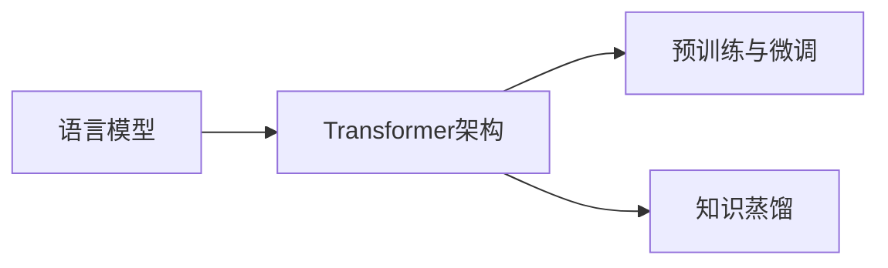

# 大语言模型原理基础与前沿 挑战与机遇

## 1.背景介绍
### 1.1 大语言模型的兴起 
近年来,随着深度学习技术的飞速发展,自然语言处理(NLP)领域取得了突破性的进展。其中,大语言模型(Large Language Model,LLM)的出现,更是掀起了NLP领域的一场革命。从2018年OpenAI推出的GPT模型,到2020年Google发布的Switch Transformer,再到2022年Anthropic公司的宪章模型(Constitutional AI),大语言模型不断刷新着NLP领域的记录。

### 1.2 大语言模型的应用前景
大语言模型强大的语言理解和生成能力,使其在机器翻译、智能问答、文本摘要、知识图谱等诸多领域展现出广阔的应用前景。特别是随着ChatGPT等对话式AI助手的火爆,大语言模型开始走进大众视野,有望在教育、医疗、金融、法律等行业掀起一场变革。

### 1.3 探索大语言模型的必要性
尽管大语言模型取得了瞩目的成就,但其内在的工作原理仍然是一个谜。探索大语言模型的原理基础,洞察其面临的挑战与机遇,对于推动NLP技术的进一步发展至关重要。本文将从核心概念出发,深入剖析大语言模型的数学原理、算法架构与实践应用,力求为读者呈现一幅大语言模型的全景图。

## 2.核心概念与联系
### 2.1 语言模型
语言模型是大语言模型的理论基础。其本质是对语言符号序列的概率分布进行建模,即计算一个句子或词序列出现的概率。传统的n-gram语言模型受限于平滑问题和维度灾难,难以建模长距离依赖。神经网络语言模型的出现,为语言模型注入了新的活力。

### 2.2 Transformer架构
Transformer是大语言模型的核心架构。它摒弃了RNN等序列模型中的循环结构,完全依赖注意力机制(Attention)来建模输入输出之间的关系。Multi-head Attention和Feed Forward Network构成了Transformer的基本单元,通过堆叠多个这样的单元,就形成了Transformer的整体架构。

### 2.3 预训练与微调
预训练(Pre-training)和微调(Fine-tuning)是大语言模型的两大关键技术。预训练阶段,模型在大规模无标注语料上进行自监督学习,掌握语言的通用表征能力。微调阶段,模型在特定任务的标注数据上进行监督学习,快速适应下游任务。这种"预训练+微调"的范式极大地提升了模型的泛化能力和样本效率。

### 2.4 知识蒸馏
知识蒸馏(Knowledge Distillation)是将大模型的知识"浓缩"到小模型中的一种技术手段。通过让小模型去模仿大模型的输出分布,可以在保持较高性能的同时,大幅压缩模型的参数量和推理开销。BERT-PKD、TinyBERT、DistilBERT等都是知识蒸馏在大语言模型领域的成功应用。

### 2.5 核心概念之间的联系

语言模型为Transformer架构提供了理论基础,而Transformer则是预训练、微调、知识蒸馏等技术的核心载体。预训练和微调解决了模型的通用性和适应性问题,知识蒸馏则着眼于模型的效率问题。这些概念环环相扣,共同推动了大语言模型的发展。

## 3.核心算法原理具体操作步骤
### 3.1 Transformer的核心原理
#### 3.1.1 Self-Attention
Self-Attention用于计算序列中元素之间的关联度。具体步骤如下:

1. 将输入序列X通过三个线性变换,得到Query矩阵Q、Key矩阵K和Value矩阵V。
2. 计算Q与K的点积,并除以 $\sqrt{d_k}$ 进行缩放,得到注意力分数矩阵 $A=softmax(\frac{QK^T}{\sqrt{d_k}})$。
3. 将注意力分数矩阵A与V相乘,得到Self-Attention的输出 $Z=AV$。

#### 3.1.2 Multi-Head Attention
Multi-Head Attention通过引入多个独立的Self-Attention,增强模型的表达能力。具体步骤如下:

1. 将Q、K、V通过线性变换,映射到h个不同的子空间,得到 $Q_i,K_i,V_i,i\in[1,h]$。
2. 对每个子空间并行执行Self-Attention,得到h个输出 $Z_i=Attention(Q_i,K_i,V_i)$。
3. 将h个输出拼接起来,再经过一个线性变换,得到最终的Multi-Head Attention输出 $Z=Concat(Z_1,...,Z_h)W^O$。

#### 3.1.3 Feed Forward Network 
Feed Forward Network用于对Self-Attention的输出进行非线性变换,增加模型的容量和非线性。具体为:

$$FFN(Z)=max(0,ZW_1+b_1)W_2+b_2$$

其中 $W_1,W_2,b_1,b_2$ 为可学习的参数矩阵和偏置项。

### 3.2 预训练的核心原理
#### 3.2.1 BERT的Masked Language Modeling
BERT采用Masked Language Modeling(MLM)进行预训练。具体步骤如下:

1. 随机Mask掉输入序列中15%的Token,用特殊符号[MASK]替换。
2. 将Mask后的序列输入BERT,得到每个位置的输出向量。
3. 取出[MASK]位置的输出向量,通过一个分类层预测被Mask掉的Token。
4. 计算预测结果与真实Label之间的交叉熵损失,并用其更新模型参数。

#### 3.2.2 GPT的Language Modeling
GPT采用传统的Language Modeling(LM)进行预训练。具体步骤如下:

1. 将输入序列X按照时间步切分,得到 $X=[x_1,x_2,...,x_T]$。
2. 对于每个时间步t,将 $[x_1,...,x_{t-1}]$ 输入GPT,预测下一个Token $x_t$。
3. 计算预测结果与真实Label之间的交叉熵损失,并用其更新模型参数。

### 3.3 微调的核心原理
微调的核心思想是在预训练模型的基础上,针对特定任务进行增量训练。以文本分类任务为例,具体步骤如下:

1. 在预训练模型的顶部添加一个与任务相关的输出层(如分类层)。
2. 将任务的标注数据输入模型,计算输出层的预测结果。
3. 计算预测结果与真实Label之间的损失函数(如交叉熵),并用其更新模型参数。
4. 重复步骤2-3,直到模型在验证集上的性能达到最优。

### 3.4 知识蒸馏的核心原理
知识蒸馏的核心思想是用教师模型(大模型)的知识来指导学生模型(小模型)的训练。以软化标签蒸馏为例,具体步骤如下:

1. 用教师模型对训练样本进行推理,得到软化标签 $y_t=softmax(\frac{z_t}{T})$,其中 $z_t$ 为教师模型的Logits输出,$T$ 为温度超参数。
2. 用学生模型对同样的训练样本进行推理,得到软化标签 $y_s=softmax(\frac{z_s}{T})$。 
3. 计算学生模型和教师模型软化标签之间的KL散度损失 $L_{KD}=T^2\cdot KL(y_s||y_t)$,并用其更新学生模型参数。
4. 重复步骤2-3,直到学生模型充分学习到教师模型的知识。

## 4.数学模型和公式详细讲解举例说明
### 4.1 Transformer的数学模型
#### 4.1.1 Self-Attention的数学模型
假设输入序列的长度为 $n$,嵌入维度为 $d_e$,Self-Attention的数学模型可表示为:

$$
\begin{aligned}
Q &= XW^Q \\
K &= XW^K \\
V &= XW^V \\
A &= softmax(\frac{QK^T}{\sqrt{d_k}}) \\
Z &= AV
\end{aligned}
$$

其中, $X\in\mathbb{R}^{n\times d_e}$ 为输入序列的嵌入表示, $W^Q,W^K,W^V\in\mathbb{R}^{d_e\times d_k}$ 为可学习的参数矩阵, $A\in\mathbb{R}^{n\times n}$ 为注意力分数矩阵, $Z\in\mathbb{R}^{n\times d_k}$ 为Self-Attention的输出。

举例说明:假设输入序列为"我爱NLP",嵌入维度 $d_e=4$,Self-Attention的输出维度 $d_k=3$,则:

$$
X=\begin{bmatrix}
0.1 & 0.2 & 0.3 & 0.4\\
0.5 & 0.6 & 0.7 & 0.8\\
0.9 & 1.0 & 1.1 & 1.2
\end{bmatrix}
$$

假设参数矩阵为:

$$
W^Q=W^K=W^V=\begin{bmatrix}
1 & 0 & 0\\
0 & 1 & 0\\
0 & 0 & 1\\
0 & 0 & 0
\end{bmatrix}
$$

则Self-Attention的输出为:

$$
Z=\begin{bmatrix}
0.21 & 0.24 & 0.27\\
0.21 & 0.24 & 0.27\\
0.21 & 0.24 & 0.27
\end{bmatrix}
$$

#### 4.1.2 Multi-Head Attention的数学模型
假设Head的数量为 $h$,则Multi-Head Attention的数学模型可表示为:

$$
\begin{aligned}
Q_i &= XW_i^Q \\
K_i &= XW_i^K \\
V_i &= XW_i^V \\
Z_i &= Attention(Q_i,K_i,V_i) \\
Z &= Concat(Z_1,...,Z_h)W^O
\end{aligned}
$$

其中, $W_i^Q,W_i^K,W_i^V\in\mathbb{R}^{d_e\times d_k},W^O\in\mathbb{R}^{hd_k\times d_e}$ 为可学习的参数矩阵。

举例说明:假设 $h=2,d_e=4,d_k=2$,则Multi-Head Attention的输出维度为 $2\times2=4$。假设两个Head的输出分别为:

$$
Z_1=\begin{bmatrix}
0.1 & 0.2\\
0.1 & 0.2\\
0.1 & 0.2
\end{bmatrix},
Z_2=\begin{bmatrix}
0.3 & 0.4\\
0.3 & 0.4\\
0.3 & 0.4
\end{bmatrix}
$$

拼接后的矩阵为:

$$
Concat(Z_1,Z_2)=\begin{bmatrix}
0.1 & 0.2 & 0.3 & 0.4\\
0.1 & 0.2 & 0.3 & 0.4\\
0.1 & 0.2 & 0.3 & 0.4
\end{bmatrix}
$$

假设 $W^O$ 为单位矩阵,则Multi-Head Attention的最终输出与拼接后的矩阵相同。

### 4.2 预训练的数学模型
#### 4.2.1 BERT的MLM数学模型
假设被Mask的Token数量为 $m$,词表大小为 $|V|$,则BERT的MLM数学模型可表示为:

$$
\begin{aligned}
\hat{x}_i &= f_{BERT}(x_{\setminus M}) \\
p(x_i|x_{\setminus M}) &= softmax(W\hat{x}_i+b) \\
\mathcal{L}_{MLM} &= -\sum_{i=1}^m\log p(x_i|x_{\setminus M})
\end{aligned}
$$

其中, $x_{\setminus M}$ 表示被Mask后的输入序列, $\hat{x}_i\in\mathbb{R}^{d_h}$ 为BERT在第i个[MASK]位置的输出, $W\in\mathbb{R}