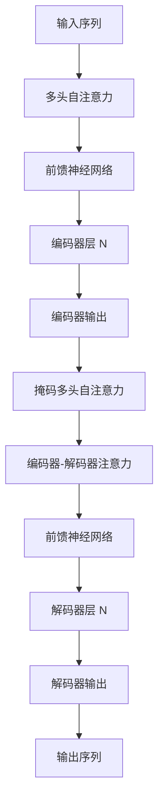

# 大语言模型原理基础与前沿 流水线并行

## 1. 背景介绍

### 1.1 大语言模型的兴起

近年来,大型语言模型(Large Language Models, LLMs)在自然语言处理(NLP)领域取得了令人瞩目的成就。这些模型通过在海量文本数据上进行预训练,学习到了丰富的语言知识和上下文信息,展现出了惊人的泛化能力。

代表性的大语言模型包括GPT-3、PaLM、ChatGPT等,它们能够在广泛的NLP任务上表现出色,如文本生成、问答系统、文本摘要等。这些模型的出现,推动了NLP技术的快速发展,为各种语言智能应用提供了强大的支撑。

### 1.2 大模型挑战与流水线并行

然而,训练大语言模型面临着巨大的计算和存储开销。以GPT-3为例,它拥有1750亿个参数,训练过程耗费了数十亿美元的计算资源。这种庞大的计算需求,对于大多数机构来说是难以承受的。

为了解决这一挑战,研究人员提出了流水线并行(Pipeline Parallelism)的思路,将大模型分割为多个阶段,并在不同的加速器(如GPU)上并行执行这些阶段。这种方法能够有效利用多个加速器的计算能力,从而加速训练过程并降低总体成本。

本文将重点探讨大语言模型的核心原理,以及流水线并行在训练这些模型时的应用和优化策略,为读者提供深入的技术洞见。

## 2. 核心概念与联系

### 2.1 自注意力机制(Self-Attention)

自注意力机制是大语言模型的核心组件之一。它允许模型捕捉输入序列中任意两个位置之间的依赖关系,从而更好地建模长期依赖。

在自注意力机制中,每个输入位置都会关注其他所有位置,并根据它们之间的相关性赋予不同的权重。这种灵活的注意力分配方式,使得模型能够更好地捕捉语义和上下文信息。

自注意力机制可以形式化表示为:

$$\text{Attention}(Q, K, V) = \text{softmax}(\frac{QK^T}{\sqrt{d_k}})V$$

其中$Q$、$K$、$V$分别表示查询(Query)、键(Key)和值(Value)。通过计算查询和键之间的点积,并除以一个缩放因子$\sqrt{d_k}$,我们可以获得注意力权重。然后,将注意力权重与值相乘,即可得到加权求和的注意力输出。

### 2.2 transformer 架构

Transformer是一种基于自注意力机制的序列到序列(Seq2Seq)模型,被广泛应用于机器翻译、语言模型等任务。它的核心架构包括编码器(Encoder)和解码器(Decoder)两个模块。

编码器将输入序列映射为上下文表示,而解码器则根据上下文表示和先前的输出生成目标序列。两个模块都由多个编码器/解码器层组成,每一层都包含多头自注意力(Multi-Head Attention)和前馈神经网络(Feed-Forward Neural Network)等子层。

Transformer架构通过自注意力机制和残差连接,有效地捕捉了长期依赖关系,从而在各种序列建模任务上取得了卓越的表现。

### 2.3 大语言模型预训练

为了充分利用大规模的文本数据,大语言模型通常采用预训练(Pre-training)和微调(Fine-tuning)的范式。在预训练阶段,模型会在海量的未标注文本数据上进行自监督学习,捕捉通用的语言知识和上下文信息。

常见的预训练目标包括:

- **掩码语言模型(Masked Language Modeling, MLM)**: 模型需要根据上下文预测被掩码的词。
- **下一句预测(Next Sentence Prediction, NSP)**: 模型需要判断两个句子是否相邻。
- **因果语言模型(Causal Language Modeling, CLM)**: 模型需要基于之前的文本预测下一个词。

经过预训练后,模型可以在特定的下游任务上进行微调,以获得更好的性能表现。

## 3. 核心算法原理具体操作步骤

### 3.1 transformer 模型训练

Transformer 模型的训练过程可以概括为以下几个步骤:

1. **输入embedding**: 将输入序列(如文本)转换为embedding向量表示。
2. **位置编码(Positional Encoding)**: 为embedding添加位置信息,以捕捉序列的顺序。
3. **编码器(Encoder)**: 输入embedding经过多个编码器层的处理,生成上下文表示。
4. **解码器(Decoder)**: 上下文表示被传递到解码器,解码器根据先前的输出生成目标序列。
5. **损失计算**: 计算模型输出与ground truth之间的损失函数(如交叉熵损失)。
6. **反向传播**: 根据损失函数,利用优化算法(如Adam)更新模型参数。

在训练过程中,通常采用教师强制(Teacher Forcing)策略,即在每个时间步,解码器会使用ground truth作为输入,而不是自身的预测输出。这种策略可以加速训练收敛,但也可能导致模型在推理时表现不佳(曝光偏差问题)。

### 3.2 大语言模型微调

对于特定的下游任务,我们需要在预训练的大语言模型基础上进行微调(Fine-tuning),以获得更好的性能表现。微调的步骤如下:

1. **任务数据准备**: 准备特定任务的训练数据,如文本分类、机器翻译等。
2. **输入处理**: 将任务数据转换为模型可接受的输入格式,如添加特殊标记、截断等。
3. **微调训练**: 在任务数据上对预训练模型进行端到端的微调,更新模型参数。
4. **模型评估**: 在验证集或测试集上评估微调后模型的性能表现。
5. **模型部署**: 将微调后的模型部署到实际的应用系统中。

在微调过程中,通常只需要更新模型的部分参数,而保留大部分预训练参数不变。这种策略可以有效利用预训练模型学习到的通用知识,同时适应特定任务的需求。

## 4. 数学模型和公式详细讲解举例说明

### 4.1 自注意力机制数学模型

自注意力机制是大语言模型的核心组件之一,它允许模型捕捉输入序列中任意两个位置之间的依赖关系。下面我们详细解释自注意力机制的数学模型。

给定一个输入序列$X = (x_1, x_2, \dots, x_n)$,其中$x_i \in \mathbb{R}^{d_x}$是第$i$个位置的embedding向量。自注意力机制的计算过程可以分为以下几个步骤:

1. **线性投影**:
   
   首先,我们将输入序列$X$分别投影到查询(Query)、键(Key)和值(Value)空间,得到$Q$、$K$和$V$:
   
   $$Q = XW^Q, \quad K = XW^K, \quad V = XW^V$$
   
   其中$W^Q \in \mathbb{R}^{d_x \times d_q}$、$W^K \in \mathbb{R}^{d_x \times d_k}$和$W^V \in \mathbb{R}^{d_x \times d_v}$是可学习的投影矩阵。

2. **注意力计算**:
   
   接下来,我们计算查询$Q$和所有键$K$之间的点积,并除以一个缩放因子$\sqrt{d_k}$,以获得注意力权重:
   
   $$\text{Attention}(Q, K, V) = \text{softmax}(\frac{QK^T}{\sqrt{d_k}})V$$
   
   其中$\text{softmax}$函数用于将注意力权重归一化为概率分布。

3. **多头注意力**:
   
   为了捕捉不同的子空间信息,我们可以使用多头注意力机制。具体来说,我们将查询/键/值分别投影到$h$个不同的子空间,并在每个子空间上计算注意力,最后将所有注意力头的输出拼接起来:
   
   $$\text{MultiHead}(Q, K, V) = \text{Concat}(\text{head}_1, \dots, \text{head}_h)W^O$$
   
   $$\text{where, }\text{head}_i = \text{Attention}(QW_i^Q, KW_i^K, VW_i^V)$$
   
   其中$W_i^Q \in \mathbb{R}^{d_q \times d_q'}$、$W_i^K \in \mathbb{R}^{d_k \times d_k'}$、$W_i^V \in \mathbb{R}^{d_v \times d_v'}$和$W^O \in \mathbb{R}^{hd_v' \times d_x}$是可学习的投影矩阵。

通过自注意力机制,模型能够捕捉输入序列中任意两个位置之间的依赖关系,从而更好地建模长期依赖。这是大语言模型取得卓越表现的关键因素之一。

### 4.2 transformer 架构数学模型

Transformer 是一种基于自注意力机制的序列到序列(Seq2Seq)模型,被广泛应用于机器翻译、语言模型等任务。下面我们详细解释 Transformer 架构的数学模型。

Transformer 架构包括编码器(Encoder)和解码器(Decoder)两个模块。编码器将输入序列映射为上下文表示,而解码器则根据上下文表示和先前的输出生成目标序列。

#### 4.2.1 编码器(Encoder)

给定一个输入序列$X = (x_1, x_2, \dots, x_n)$,编码器的计算过程如下:

1. **输入embedding和位置编码**:
   
   首先,我们将输入序列$X$映射为embedding向量序列$E = (e_1, e_2, \dots, e_n)$,并添加位置编码$P = (p_1, p_2, \dots, p_n)$,得到:
   
   $$Z^0 = E + P$$

2. **编码器层**:
   
   接下来,输入$Z^0$经过$N$个相同的编码器层,每一层包含两个子层:多头自注意力(Multi-Head Attention)和前馈神经网络(Feed-Forward Neural Network):
   
   $$Z^l = \text{FFN}(\text{MultiHead}(Z^{l-1}, Z^{l-1}, Z^{l-1})) + Z^{l-1}$$
   
   其中$\text{MultiHead}$是多头自注意力子层,用于捕捉输入序列中的依赖关系;$\text{FFN}$是前馈神经网络子层,用于对每个位置的表示进行非线性变换。残差连接和层归一化被应用于每个子层的输出,以帮助训练过程。

3. **编码器输出**:
   
   经过$N$个编码器层后,我们得到编码器的最终输出$Z^N$,它包含了输入序列的上下文表示。

#### 4.2.2 解码器(Decoder)

解码器的输入是目标序列$Y = (y_1, y_2, \dots, y_m)$,其计算过程与编码器类似,但有以下不同之处:

1. **掩码多头自注意力**:
   
   在解码器的自注意力子层中,我们需要防止每个位置关注到未来位置的信息(因为在生成任务中,未来的输出是未知的)。这可以通过在计算注意力权重时,将未来位置的键和值设置为负无穷,从而屏蔽掉它们的影响。

2. **编码器-解码器注意力**:
   
   除了自注意力子层外,解码器还包含一个额外的注意力子层,用于关注编码器输出$Z^N$,以获取输入序列的上下文信息。

通过编码器和解码器的协同工作,Transformer 模型能够有效地捕捉输入和输出序列之间的