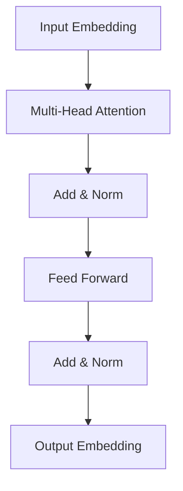

# 大语言模型原理基础与前沿 统计语言建模

## 1.背景介绍
近年来,随着深度学习和人工智能技术的快速发展,自然语言处理(NLP)领域取得了长足的进步。作为NLP的核心技术之一,语言模型在机器翻译、对话系统、文本摘要、情感分析等诸多任务中发挥着关键作用。其中,大规模预训练语言模型(Pretrained Language Models, PLMs)以其强大的语言理解和生成能力,成为了当前NLP研究的热点和前沿。

传统的语言模型主要基于n-gram等统计方法,通过计算词语在大规模语料库中共同出现的频率,来预测下一个最可能出现的词。然而,这类方法难以捕捉语言中的长距离依赖关系,且面临数据稀疏问题。近年来,基于深度神经网络的语言模型得到了广泛关注和应用。尤其是Transformer[1]的提出,使得语言模型的性能大幅提升。

本文将重点探讨大语言模型的原理基础与前沿进展,深入剖析其内在机制,并结合实际应用场景,分享最佳实践经验。通过对大语言模型的系统梳理,帮助读者全面把握这一前沿技术,为相关研究和应用提供参考。

## 2.核心概念与联系

### 2.1 语言模型的定义与分类

语言模型是一种对语言进行建模的方法,旨在学习语言的内在规律和特征,从而对语言进行理解、生成和预测。形式化地,语言模型可定义为一个概率分布 $P(w_1, w_2, ..., w_n)$,表示一个由n个词组成的句子出现的概率。根据建模粒度的不同,语言模型可分为以下几类:

- 词级别语言模型(Word-level Language Model):以词为基本单元进行建模,学习词与词之间的关联规律。如n-gram模型、RNN语言模型等。

- 字符级别语言模型(Character-level Language Model):以字符为基本单元,捕捉词内部的构词规律。适用于词形变化较为丰富的语言。

- 子词级别语言模型(Subword-level Language Model):介于词级别和字符级别之间,通过将词拆分为更小的有意义的单元(如BPE[2])来建模,在一定程度上缓解了词汇爆炸问题。

- 句子级别语言模型(Sentence-level Language Model):直接对整个句子进行建模,学习句子级别的特征表示。如BERT[3]、GPT[4]等预训练语言模型。

### 2.2 语言模型的评估指标

为了衡量语言模型的性能,通常采用以下评估指标:

- 困惑度(Perplexity):用于评估语言模型的预测能力。困惑度越低,说明模型对语言的建模能力越强。计算公式为:

$$PPL(W)=P(w_1,w_2,...,w_N)^{-\frac{1}{N}}$$

其中,$W$为测试集语料,$N$为语料总词数。

- BLEU(Bilingual Evaluation Understudy):机器翻译任务中常用的自动评估指标,通过计算候选译文与参考译文之间的n-gram匹配度来评估翻译质量。

- Rouge(Recall-Oriented Understudy for Gisting Evaluation):文本摘要任务中的评估指标,通过计算候选摘要与参考摘要之间的词重叠率来评估摘要质量。

### 2.3 大语言模型的特点

相比传统的语言模型,大语言模型具有以下特点:

- 模型规模大:动辄数亿、数十亿甚至上千亿参数,对海量语料进行预训练,具有强大的语言理解和生成能力。

- 预训练范式:采用无监督或自监督的方式在大规模语料上进行预训练,学习通用的语言表示,再针对下游任务进行微调。

- 注意力机制:基于Transformer等注意力机制的模型结构,能够有效捕捉长距离依赖,挖掘全局语义信息。

- 泛化能力强:在多种NLP任务上取得了显著的性能提升,表现出良好的泛化能力和迁移学习能力。

## 3.核心算法原理具体操作步骤

本节将重点介绍大语言模型的核心算法原理,并给出具体的操作步骤。我们以当前最为广泛使用的BERT模型为例进行讲解。

### 3.1 BERT模型架构

BERT(Bidirectional Encoder Representations from Transformers)是一种基于Transformer的双向语言表示模型。其核心思想是在大规模无标注语料上进行预训练,学习词语的上下文表示,再针对特定任务进行微调。BERT的模型架构如下图所示:

具体而言,BERT的主要组成部分包括:

- Input Embedding:将输入序列中的每个token映射为一个低维稠密向量,包括Token Embedding、Segment Embedding和Position Embedding三部分。

- Transformer Encoder:由多层Transformer Encoder组成,每一层包括Multi-Head Self-Attention和Feed Forward两个子层。通过自注意力机制捕捉序列内部的依赖关系,并进行特征提取和信息融合。

- Output Embedding:将Transformer Encoder的输出进行池化或取最后一层的隐状态,作为下游任务的输入表示。

### 3.2 预训练任务

BERT采用了两种预训练任务,分别是:

- Masked Language Model(MLM):随机遮挡输入序列中的部分token,并让模型根据上下文预测被遮挡的token。这有助于学习词语的上下文表示。

- Next Sentence Prediction(NSP):给定两个句子,让模型判断它们是否为连续的句子。这有助于学习句子级别的语义关系。

预训练的具体步骤如下:

1. 构建大规模无标注语料库,进行数据清洗和预处理。

2. 对语料进行tokenize,并根据需要进行WordPiece或BPE分词。

3. 对每个输入序列,以一定概率(如15%)随机遮挡部分token,并以[MASK]标记替换。

4. 将输入序列以一定概率(如50%)随机拼接两个句子,并添加[CLS]和[SEP]标记。

5. 将输入序列喂入BERT模型,通过MLM任务预测被遮挡的token,通过NSP任务预测两个句子是否连续。

6. 使用交叉熵损失函数计算MLM和NSP任务的损失,并进行梯度反向传播和参数更新。

7. 重复步骤3-6,直到模型收敛或达到预设的训练轮数。

### 3.3 微调与应用

在完成预训练后,BERT模型可以针对特定的下游任务进行微调。微调的具体步骤如下:

1. 根据任务的输入格式,对数据进行预处理和token化。

2. 在BERT模型的基础上,根据任务的类型添加相应的输出层,如分类、序列标注、问答等。

3. 使用下游任务的标注数据对模型进行微调,通过梯度反向传播和参数更新来适应特定任务。

4. 在验证集上评估模型性能,并根据需要调整超参数和训练策略。

5. 使用微调后的模型对测试集进行预测,并评估最终的任务性能。

BERT模型可以应用于各种NLP任务,如文本分类、命名实体识别、问答系统、语义相似度计算等。通过预训练和微调,BERT能够在这些任务上取得优异的性能,大大提升了NLP系统的效果。

## 4.数学模型和公式详细讲解举例说明

本节将详细讲解BERT模型中涉及的关键数学模型和公式,并给出具体的举例说明。

### 4.1 Transformer Encoder

Transformer Encoder是BERT的核心组件,其内部结构如下图所示:

#### Multi-Head Attention

Multi-Head Attention是Transformer的核心操作,可以捕捉序列内部的依赖关系。其计算过程如下:

1. 将输入序列的每个token的embedding表示为 $X \in \mathbb{R}^{n \times d}$,其中 $n$ 为序列长度, $d$ 为embedding维度。

2. 通过线性变换得到Query矩阵 $Q$、Key矩阵 $K$ 和Value矩阵 $V$:

$$Q=XW^Q, K=XW^K, V=XW^V$$

其中, $W^Q, W^K, W^V \in \mathbb{R}^{d \times d_k}$ 为可学习的参数矩阵。

3. 计算Attention权重矩阵 $A$:

$$A=\text{softmax}(\frac{QK^T}{\sqrt{d_k}})$$

其中, $A \in \mathbb{R}^{n \times n}$, 表示每个token对其他token的注意力权重。

4. 计算Attention输出 $Z$:

$$Z=AV$$

其中, $Z \in \mathbb{R}^{n \times d_v}$, 表示每个token融合其他token信息后的表示。

5. 将 $Z$ 通过线性变换得到输出 $O$:

$$O=ZW^O$$

其中, $W^O \in \mathbb{R}^{d_v \times d}$ 为可学习的参数矩阵。

Multi-Head Attention通过并行计算多个Attention Head,再将结果拼接起来,以捕捉不同子空间的信息。设Attention Head的数量为 $h$,则Multi-Head Attention的输出为:

$$\text{MultiHead}(Q,K,V)=\text{Concat}(\text{head}_1,...,\text{head}_h)W^O$$

其中, $\text{head}_i=\text{Attention}(QW_i^Q,KW_i^K,VW_i^V)$。

#### Feed Forward

Feed Forward层由两个全连接层组成,用于对Multi-Head Attention的输出进行非线性变换和特征提取。其计算过程为:

$$\text{FFN}(x)=\max(0, xW_1 + b_1)W_2 + b_2$$

其中, $W_1 \in \mathbb{R}^{d \times d_{ff}}, b_1 \in \mathbb{R}^{d_{ff}}, W_2 \in \mathbb{R}^{d_{ff} \times d}, b_2 \in \mathbb{R}^d$ 为可学习的参数。

#### Add & Norm

Add & Norm层将前一层的输出与残差连接相加,并进行Layer Normalization,以稳定训练过程。其计算过程为:

$$\text{AddNorm}(x,y)=\text{LayerNorm}(x+y)$$

其中, $x$ 为前一层的输出, $y$ 为残差连接的输入。

### 4.2 预训练任务

#### Masked Language Model(MLM)

MLM任务的目标是根据上下文预测被遮挡的token。设输入序列为 $\mathbf{x}=(x_1,...,x_n)$,被遮挡的token位置为 $\mathbf{m}=(m_1,...,m_k)$,则MLM任务的损失函数为:

$$\mathcal{L}_{\text{MLM}}=-\sum_{i=1}^k \log P(x_{m_i}|\mathbf{x}_{\backslash \mathbf{m}})$$

其中, $\mathbf{x}_{\backslash \mathbf{m}}$ 表示去掉被遮挡token后的输入序列。

#### Next Sentence Prediction(NSP)

NSP任务的目标是判断两个句子是否为连续的句子。设两个句子分别为 $\mathbf{s}_1$ 和 $\mathbf{s}_2$,则NSP任务的损失函数为:

$$\mathcal{L}_{\text{NSP}}=-\log P(y|\mathbf{s}_1,\mathbf{s}_2)$$

其中, $y \in \{0,1\}$ 表示两个句子是否连续, $P(y|\mathbf{s}_1,\mathbf{s}_2)$ 通过BERT模型的[CLS]token的输出进行计算。

### 4.3 微调与应用

在下游任务中,BERT模型的微调通常只需要在预训练的基础上添加一个简单的输出层,并使用任务相关的损失函数进行训练。以文本分类任务为例,设输入序列为 $